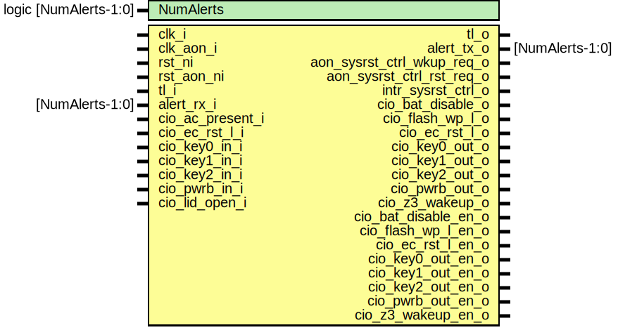

# Entity: sysrst_ctrl

## Diagram

## Description

Copyright lowRISC contributors.
 Licensed under the Apache License, Version 2.0, see LICENSE for details.
 SPDX-License-Identifier: Apache-2.0
 sysrst_ctrl module
 
## Generics

| Generic name | Type                  | Value     | Description |
| ------------ | --------------------- | --------- | ----------- |
| NumAlerts    | logic [NumAlerts-1:0] | undefined |             |
## Ports

| Port name             | Direction | Type            | Description |
| --------------------- | --------- | --------------- | ----------- |
| clk_i                 | input     |                 |             |
| clk_aon_i             | input     |                 |             |
| rst_ni                | input     |                 |             |
| rst_aon_ni            | input     |                 |             |
| gsc_wk_o              | output    |                 |             |
| gsc_rst_o             | output    |                 |             |
| intr_sysrst_ctrl_o    | output    |                 |             |
| tl_i                  | input     |                 |             |
| tl_o                  | output    |                 |             |
| alert_rx_i            | input     | [NumAlerts-1:0] | Alerts      |
| alert_tx_o            | output    | [NumAlerts-1:0] |             |
| cio_ac_present_i      | input     |                 |             |
| cio_ec_rst_in_l_i     | input     |                 |             |
| cio_key0_in_i         | input     |                 |             |
| cio_key1_in_i         | input     |                 |             |
| cio_key2_in_i         | input     |                 |             |
| cio_pwrb_in_i         | input     |                 |             |
| cio_lid_open_i        | input     |                 |             |
| cio_bat_disable_o     | output    |                 |             |
| cio_ec_rst_out_l_o    | output    |                 |             |
| cio_key0_out_o        | output    |                 |             |
| cio_key1_out_o        | output    |                 |             |
| cio_key2_out_o        | output    |                 |             |
| cio_pwrb_out_o        | output    |                 |             |
| cio_z3_wakeup_o       | output    |                 |             |
| cio_bat_disable_en_o  | output    |                 |             |
| cio_ec_rst_out_l_en_o | output    |                 |             |
| cio_key0_out_en_o     | output    |                 |             |
| cio_key1_out_en_o     | output    |                 |             |
| cio_key2_out_en_o     | output    |                 |             |
| cio_pwrb_out_en_o     | output    |                 |             |
| cio_z3_wakeup_en_o    | output    |                 |             |
## Signals

| Name                   | Type                  | Description |
| ---------------------- | --------------------- | ----------- |
| reg2hw                 | sysrst_ctrl_reg2hw_t  |             |
| hw2reg                 | sysrst_ctrl_hw2reg_t  |             |
| pwrb_int               | logic                 |             |
| key0_int               | logic                 |             |
| key1_int               | logic                 |             |
| key2_int               | logic                 |             |
| ac_present_int         | logic                 |             |
| lid_open_int           | logic                 |             |
| pwrb_out_hw            | logic                 |             |
| key0_out_hw            | logic                 |             |
| key1_out_hw            | logic                 |             |
| key2_out_hw            | logic                 |             |
| ec_rst_l_hw            | logic                 |             |
| bat_disable_hw         | logic                 |             |
| z3_wakeup_hw           | logic                 |             |
| pwrb_out_int           | logic                 |             |
| key0_out_int           | logic                 |             |
| key1_out_int           | logic                 |             |
| key2_out_int           | logic                 |             |
| bat_disable_int        | logic                 |             |
| z3_wakeup_int          | logic                 |             |
| sysrst_ctrl_combo_intr | logic                 |             |
| sysrst_ctrl_key_intr   | logic                 |             |
| ulp_wakeup_int         | logic                 |             |
| alert_test             | logic [NumAlerts-1:0] | Alerts      |
| alerts                 | logic [NumAlerts-1:0] | Alerts      |
## Instantiations

- u_reg: sysrst_ctrl_reg_top
**Description**
Register module

- u_autoblock: sysrst_ctrl_autoblock
- u_ulp: sysrst_ctrl_ulp
- u_inversion: sysrst_ctrl_inv
- u_pin_vis_ovd: sysrst_ctrl_pin
- u_keyintr: sysrst_ctrl_keyintr
- u_combo: sysrst_ctrl_combo
- u_intr: sysrst_ctrl_intr
