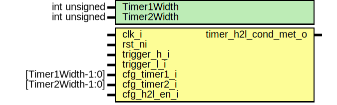

# Entity: sysrst_ctrl_combofsm

## Diagram

## Description

Copyright lowRISC contributors.
 Licensed under the Apache License, Version 2.0, see LICENSE for details.
 SPDX-License-Identifier: Apache-2.0
 Description sysrst_ctrl combo detection FSM module
 
## Generics

| Generic name | Type         | Value | Description |
| ------------ | ------------ | ----- | ----------- |
| TIMER1BIT    | int unsigned | 16    |             |
| TIMER2BIT    | int unsigned | 32    |             |
## Ports

| Port name          | Direction | Type            | Description |
| ------------------ | --------- | --------------- | ----------- |
| clk_aon_i          | input     |                 |             |
| rst_aon_ni         | input     |                 |             |
| trigger_h_i        | input     |                 |             |
| trigger_l_i        | input     |                 |             |
| cfg_timer1_i       | input     | [TIMER1BIT-1:0] |             |
| cfg_timer2_i       | input     | [TIMER2BIT-1:0] |             |
| cfg_h2l_en_i       | input     |                 |             |
| timer_h2l_cond_met | output    |                 |             |
## Signals

| Name           | Type                  | Description |
| -------------- | --------------------- | ----------- |
| trigger_h_q    | logic                 |             |
| trigger_l_q    | logic                 |             |
| trigger_h2l    | logic                 |             |
| trigger_l2h    | logic                 |             |
| trigger_l2l    | logic                 |             |
| timer1_cnt_d   | logic [TIMER1BIT-1:0] |             |
| timer1_cnt_q   | logic [TIMER1BIT-1:0] |             |
| timer1_cnt_clr | logic                 |             |
| timer1_cnt_en  | logic                 |             |
| timer2_cnt_d   | logic [TIMER2BIT-1:0] |             |
| timer2_cnt_q   | logic [TIMER2BIT-1:0] |             |
| timer2_cnt_clr | logic                 |             |
| timer2_cnt_en  | logic                 |             |
| timer_state_q  | timer_state_e         |             |
| timer_state_d  | timer_state_e         |             |
## Types

| Name          | Type                                                                                                                                                                                                                  | Description |
| ------------- | --------------------------------------------------------------------------------------------------------------------------------------------------------------------------------------------------------------------- | ----------- |
| timer_state_e | enum logic [1:0] {                             IDLE = 2'h0,                             WAIT1 = 2'h1,                             WAIT2 = 2'h2,                             DONE = 2'h3                             } |             |
## Processes
- i_trigger_h_reg: ( @(posedge clk_aon_i or negedge rst_aon_ni) )
- i_trigger_l_reg: ( @(posedge clk_aon_i or negedge rst_aon_ni) )
- i_timer_state_reg: ( @(posedge clk_aon_i or negedge rst_aon_ni) )
- i_timer1_cnt_reg: ( @(posedge clk_aon_i or negedge rst_aon_ni) )
- i_timer2_cnt_reg: ( @(posedge clk_aon_i or negedge rst_aon_ni) )
- timer_fsm: (  )
