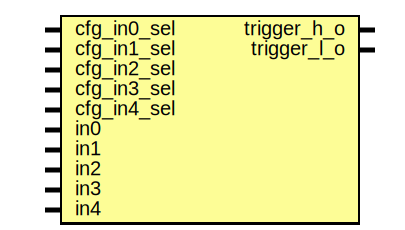

# Entity: sysrst_ctrl_combotrg
## Diagram

## Description
Copyright lowRISC contributors.
 Licensed under the Apache License, Version 2.0, see LICENSE for details.
 SPDX-License-Identifier: Apache-2.0
 Description sysrst_ctrl combo trigger  module
 
## Ports
| Port name   | Direction | Type | Description |
| ----------- | --------- | ---- | ----------- |
| cfg_in0_sel | input     |      |             |
| cfg_in1_sel | input     |      |             |
| cfg_in2_sel | input     |      |             |
| cfg_in3_sel | input     |      |             |
| cfg_in4_sel | input     |      |             |
| in0         | input     |      |             |
| in1         | input     |      |             |
| in2         | input     |      |             |
| in3         | input     |      |             |
| in4         | input     |      |             |
| trigger_h_o | output    |      |             |
| trigger_l_o | output    |      |             |
## Signals
| Name          | Type        | Description |
| ------------- | ----------- | ----------- |
| cfg_input_sel | logic [4:0] |             |
## Processes
- trigger_combo: _(  )_

