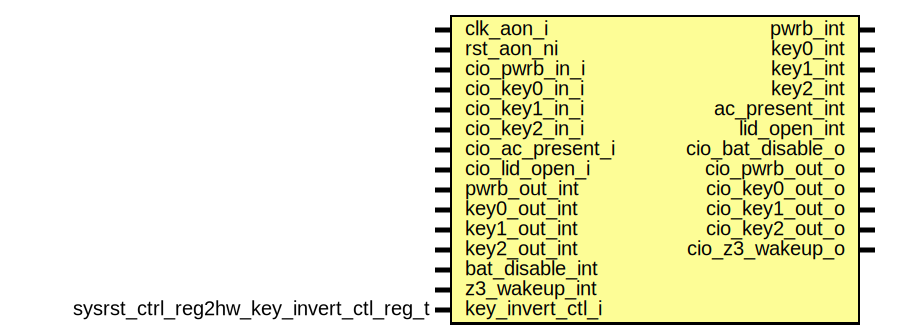

# Entity: sysrst_ctrl_inv
## Diagram

## Description
Copyright lowRISC contributors.
 Licensed under the Apache License, Version 2.0, see LICENSE for details.
 SPDX-License-Identifier: Apache-2.0
 Description: sysrst_ctrl pin inversion Module
 
## Ports
| Port name         | Direction | Type                                    | Description |
| ----------------- | --------- | --------------------------------------- | ----------- |
| clk_aon_i         | input     |                                         |             |
| rst_aon_ni        | input     |                                         |             |
| cio_pwrb_in_i     | input     |                                         |             |
| cio_key0_in_i     | input     |                                         |             |
| cio_key1_in_i     | input     |                                         |             |
| cio_key2_in_i     | input     |                                         |             |
| cio_ac_present_i  | input     |                                         |             |
| cio_lid_open_i    | input     |                                         |             |
| pwrb_out_int      | input     |                                         |             |
| key0_out_int      | input     |                                         |             |
| key1_out_int      | input     |                                         |             |
| key2_out_int      | input     |                                         |             |
| bat_disable_int   | input     |                                         |             |
| z3_wakeup_int     | input     |                                         |             |
| key_invert_ctl_i  | input     | sysrst_ctrl_reg2hw_key_invert_ctl_reg_t |             |
| pwrb_int          | output    |                                         |             |
| key0_int          | output    |                                         |             |
| key1_int          | output    |                                         |             |
| key2_int          | output    |                                         |             |
| ac_present_int    | output    |                                         |             |
| lid_open_int      | output    |                                         |             |
| cio_bat_disable_o | output    |                                         |             |
| cio_pwrb_out_o    | output    |                                         |             |
| cio_key0_out_o    | output    |                                         |             |
| cio_key1_out_o    | output    |                                         |             |
| cio_key2_out_o    | output    |                                         |             |
| cio_z3_wakeup_o   | output    |                                         |             |
## Signals
| Name                  | Type  | Description |
| --------------------- | ----- | ----------- |
| cfg_pwrb_i_inv        | logic |             |
| cfg_key0_i_inv        | logic |             |
| cfg_key1_i_inv        | logic |             |
| cfg_key2_i_inv        | logic |             |
| cfg_ac_present_i_inv  | logic |             |
| cfg_lid_open_i_inv    | logic |             |
| cfg_pwrb_o_inv        | logic |             |
| cfg_key0_o_inv        | logic |             |
| cfg_key1_o_inv        | logic |             |
| cfg_key2_o_inv        | logic |             |
| cfg_bat_disable_o_inv | logic |             |
| cfg_z3_wakeup_o_inv   | logic |             |
## Instantiations
- i_cfg_pwrb_i_inv: prim_flop_2sync
- i_cfg_key0_i_inv: prim_flop_2sync
- i_cfg_key1_i_inv: prim_flop_2sync
- i_cfg_key2_i_inv: prim_flop_2sync
- i_cfg_ac_present_i_inv: prim_flop_2sync
- i_cfg_lid_open_i_inv: prim_flop_2sync
- i_cfg_pwrb_o_inv: prim_flop_2sync
- i_cfg_key0_o_inv: prim_flop_2sync
- i_cfg_key1_o_inv: prim_flop_2sync
- i_cfg_key2_o_inv: prim_flop_2sync
- i_cfg_bat_disable_o_inv: prim_flop_2sync
- i_cfg_z3_wakeup_o_inv: prim_flop_2sync
