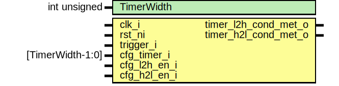

# Entity: sysrst_ctrl_keyfsm

- **File**: sysrst_ctrl_keyfsm.sv
## Diagram

## Description

 Copyright lowRISC contributors.
 Licensed under the Apache License, Version 2.0, see LICENSE for details.
 SPDX-License-Identifier: Apache-2.0

 Description sysrst_ctrl key press and release FSM module

## Generics

| Generic name | Type         | Value | Description |
| ------------ | ------------ | ----- | ----------- |
| TimerWidth   | int unsigned | 16    |             |
## Ports

| Port name            | Direction | Type             | Description |
| -------------------- | --------- | ---------------- | ----------- |
| clk_i                | input     |                  |             |
| rst_ni               | input     |                  |             |
| trigger_i            | input     |                  |             |
| cfg_timer_i          | input     | [TimerWidth-1:0] |             |
| cfg_l2h_en_i         | input     |                  |             |
| cfg_h2l_en_i         | input     |                  |             |
| timer_l2h_cond_met_o | output    |                  |             |
| timer_h2l_cond_met_o | output    |                  |             |
## Signals

| Name          | Type                   | Description                      |
| ------------- | ---------------------- | -------------------------------- |
| trigger_q     | logic                  |                                  |
| trigger_h2l   | logic                  |                                  |
| trigger_l2h   | logic                  |                                  |
| trigger_l2l   | logic                  |                                  |
| trigger_h2h   | logic                  |                                  |
| timer_cnt_d   | logic [TimerWidth-1:0] | logic trigger_tgl, trigger_sty;  |
| timer_cnt_q   | logic [TimerWidth-1:0] | logic trigger_tgl, trigger_sty;  |
| timer_cnt_clr | logic                  |                                  |
| timer_cnt_en  | logic                  |                                  |
| timer_state_q | timer_state_e          |                                  |
| timer_state_d | timer_state_e          |                                  |
## Types

| Name          | Type                                                                                                                                                                                                                                                                                                          | Description                                                                                                                                                                                                                                                                                                                                                                                                                                                                                                                   |
| ------------- | ------------------------------------------------------------------------------------------------------------------------------------------------------------------------------------------------------------------------------------------------------------------------------------------------------------- | ----------------------------------------------------------------------------------------------------------------------------------------------------------------------------------------------------------------------------------------------------------------------------------------------------------------------------------------------------------------------------------------------------------------------------------------------------------------------------------------------------------------------------- |
| timer_state_e | enum logic [2:0] {      IDLE    = 3'h0,      WAITL2H = 3'h1,      WAITH2L = 3'h2,      DONEL2H = 3'h3,      DONEH2L = 3'h4   } | assign trigger_tgl = trigger_q != trigger_i; assign trigger_sty = trigger_q == trigger_i; five-state FSM IDLE->WAITH2L->DONEH2L->WAITL2H->DONEL2H or IDLE->WAITL2H->DONEL2H->WAITH2L->DONEH2L The inputs can be inverted, hence two possible paths When a key or button is pressed, the non-inverted input signal goes from high to low. When a key or button is released, the non-inverted input signal goes from low to high. FSM will be able to detect a key or button being pressed then releaseed in one complete path  |
## Processes
- p_trigger_reg: ( @(posedge clk_i or negedge rst_ni) )
  - **Type:** always_ff
- p_timer_state_reg: ( @(posedge clk_i or negedge rst_ni) )
  - **Type:** always_ff
- p_timer_cnt_reg: ( @(posedge clk_i or negedge rst_ni) )
  - **Type:** always_ff
- timer_fsm: (  )
  - **Type:** always_comb
