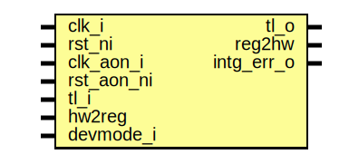

# Entity: sysrst_ctrl_reg_top

- **File**: sysrst_ctrl_reg_top.sv
## Diagram

## Description

 Copyright lowRISC contributors.
 Licensed under the Apache License, Version 2.0, see LICENSE for details.
 SPDX-License-Identifier: Apache-2.0

 Register Top module auto-generated by `reggen`

## Ports

| Port name  | Direction | Type | Description                                              |
| ---------- | --------- | ---- | -------------------------------------------------------- |
| clk_i      | input     |      |                                                          |
| rst_ni     | input     |      |                                                          |
| clk_aon_i  | input     |      |                                                          |
| rst_aon_ni | input     |      |                                                          |
| tl_i       | input     |      |                                                          |
| tl_o       | output    |      |                                                          |
| reg2hw     | output    |      | Write                                                    |
| hw2reg     | input     |      | Read                                                     |
| intg_err_o | output    |      |  Integrity check errors                                  |
| devmode_i  | input     |      | If 1, explicit error return for unmapped register access |
## Signals

| Name                                                 | Type               | Description                                                                                                                  |
| ---------------------------------------------------- | ------------------ | ---------------------------------------------------------------------------------------------------------------------------- |
| reg_we                                               | logic              |  register signals                                                                                                            |
| reg_re                                               | logic              |                                                                                                                              |
| reg_addr                                             | logic [AW-1:0]     |                                                                                                                              |
| reg_wdata                                            | logic [DW-1:0]     |                                                                                                                              |
| reg_be                                               | logic [DBW-1:0]    |                                                                                                                              |
| reg_rdata                                            | logic [DW-1:0]     |                                                                                                                              |
| reg_error                                            | logic              |                                                                                                                              |
| addrmiss                                             | logic              |                                                                                                                              |
| wr_err                                               | logic              |                                                                                                                              |
| reg_rdata_next                                       | logic [DW-1:0]     |                                                                                                                              |
| reg_busy                                             | logic              |                                                                                                                              |
| tl_reg_h2d                                           | tlul_pkg::tl_h2d_t |                                                                                                                              |
| tl_reg_d2h                                           | tlul_pkg::tl_d2h_t |                                                                                                                              |
| intg_err                                             | logic              |  incoming payload check                                                                                                      |
| intg_err_q                                           | logic              |                                                                                                                              |
| tl_o_pre                                             | tlul_pkg::tl_d2h_t |  outgoing integrity generation                                                                                               |
| sync_aon_update                                      | logic              |  cdc oversampling signals                                                                                                    |
| intr_state_we                                        | logic              |  Define SW related signals  Format: <reg>_<field>_{wd|we|qs}         or <reg>_{wd|we|qs} if field == 1 or 0                  |
| intr_state_qs                                        | logic              |                                                                                                                              |
| intr_state_wd                                        | logic              |                                                                                                                              |
| intr_enable_we                                       | logic              |                                                                                                                              |
| intr_enable_qs                                       | logic              |                                                                                                                              |
| intr_enable_wd                                       | logic              |                                                                                                                              |
| intr_test_we                                         | logic              |                                                                                                                              |
| intr_test_wd                                         | logic              |                                                                                                                              |
| alert_test_we                                        | logic              |                                                                                                                              |
| alert_test_wd                                        | logic              |                                                                                                                              |
| regwen_we                                            | logic              |                                                                                                                              |
| regwen_qs                                            | logic              |                                                                                                                              |
| regwen_wd                                            | logic              |                                                                                                                              |
| ec_rst_ctl_we                                        | logic              |                                                                                                                              |
| ec_rst_ctl_qs                                        | logic [15:0]       |                                                                                                                              |
| ec_rst_ctl_busy                                      | logic              |                                                                                                                              |
| ulp_ac_debounce_ctl_we                               | logic              |                                                                                                                              |
| ulp_ac_debounce_ctl_qs                               | logic [15:0]       |                                                                                                                              |
| ulp_ac_debounce_ctl_busy                             | logic              |                                                                                                                              |
| ulp_lid_debounce_ctl_we                              | logic              |                                                                                                                              |
| ulp_lid_debounce_ctl_qs                              | logic [15:0]       |                                                                                                                              |
| ulp_lid_debounce_ctl_busy                            | logic              |                                                                                                                              |
| ulp_pwrb_debounce_ctl_we                             | logic              |                                                                                                                              |
| ulp_pwrb_debounce_ctl_qs                             | logic [15:0]       |                                                                                                                              |
| ulp_pwrb_debounce_ctl_busy                           | logic              |                                                                                                                              |
| ulp_ctl_we                                           | logic              |                                                                                                                              |
| ulp_ctl_qs                                           | logic [0:0]        |                                                                                                                              |
| ulp_ctl_busy                                         | logic              |                                                                                                                              |
| ulp_status_we                                        | logic              |                                                                                                                              |
| ulp_status_qs                                        | logic [0:0]        |                                                                                                                              |
| ulp_status_busy                                      | logic              |                                                                                                                              |
| wkup_status_we                                       | logic              |                                                                                                                              |
| wkup_status_qs                                       | logic [0:0]        |                                                                                                                              |
| wkup_status_busy                                     | logic              |                                                                                                                              |
| key_invert_ctl_we                                    | logic              |                                                                                                                              |
| key_invert_ctl_qs                                    | logic [11:0]       |                                                                                                                              |
| key_invert_ctl_busy                                  | logic              |                                                                                                                              |
| pin_allowed_ctl_we                                   | logic              |                                                                                                                              |
| pin_allowed_ctl_qs                                   | logic [15:0]       |                                                                                                                              |
| pin_allowed_ctl_busy                                 | logic              |                                                                                                                              |
| pin_out_ctl_we                                       | logic              |                                                                                                                              |
| pin_out_ctl_qs                                       | logic [7:0]        |                                                                                                                              |
| pin_out_ctl_busy                                     | logic              |                                                                                                                              |
| pin_out_value_we                                     | logic              |                                                                                                                              |
| pin_out_value_qs                                     | logic [7:0]        |                                                                                                                              |
| pin_out_value_busy                                   | logic              |                                                                                                                              |
| pin_in_value_ac_present_qs                           | logic              |                                                                                                                              |
| pin_in_value_ec_rst_l_qs                             | logic              |                                                                                                                              |
| pin_in_value_pwrb_in_qs                              | logic              |                                                                                                                              |
| pin_in_value_key0_in_qs                              | logic              |                                                                                                                              |
| pin_in_value_key1_in_qs                              | logic              |                                                                                                                              |
| pin_in_value_key2_in_qs                              | logic              |                                                                                                                              |
| pin_in_value_lid_open_qs                             | logic              |                                                                                                                              |
| key_intr_ctl_we                                      | logic              |                                                                                                                              |
| key_intr_ctl_qs                                      | logic [13:0]       |                                                                                                                              |
| key_intr_ctl_busy                                    | logic              |                                                                                                                              |
| key_intr_debounce_ctl_we                             | logic              |                                                                                                                              |
| key_intr_debounce_ctl_qs                             | logic [15:0]       |                                                                                                                              |
| key_intr_debounce_ctl_busy                           | logic              |                                                                                                                              |
| auto_block_debounce_ctl_we                           | logic              |                                                                                                                              |
| auto_block_debounce_ctl_qs                           | logic [16:0]       |                                                                                                                              |
| auto_block_debounce_ctl_busy                         | logic              |                                                                                                                              |
| auto_block_out_ctl_we                                | logic              |                                                                                                                              |
| auto_block_out_ctl_qs                                | logic [6:0]        |                                                                                                                              |
| auto_block_out_ctl_busy                              | logic              |                                                                                                                              |
| com_sel_ctl_0_we                                     | logic              |                                                                                                                              |
| com_sel_ctl_0_qs                                     | logic [4:0]        |                                                                                                                              |
| com_sel_ctl_0_busy                                   | logic              |                                                                                                                              |
| com_sel_ctl_1_we                                     | logic              |                                                                                                                              |
| com_sel_ctl_1_qs                                     | logic [4:0]        |                                                                                                                              |
| com_sel_ctl_1_busy                                   | logic              |                                                                                                                              |
| com_sel_ctl_2_we                                     | logic              |                                                                                                                              |
| com_sel_ctl_2_qs                                     | logic [4:0]        |                                                                                                                              |
| com_sel_ctl_2_busy                                   | logic              |                                                                                                                              |
| com_sel_ctl_3_we                                     | logic              |                                                                                                                              |
| com_sel_ctl_3_qs                                     | logic [4:0]        |                                                                                                                              |
| com_sel_ctl_3_busy                                   | logic              |                                                                                                                              |
| com_det_ctl_0_we                                     | logic              |                                                                                                                              |
| com_det_ctl_0_qs                                     | logic [31:0]       |                                                                                                                              |
| com_det_ctl_0_busy                                   | logic              |                                                                                                                              |
| com_det_ctl_1_we                                     | logic              |                                                                                                                              |
| com_det_ctl_1_qs                                     | logic [31:0]       |                                                                                                                              |
| com_det_ctl_1_busy                                   | logic              |                                                                                                                              |
| com_det_ctl_2_we                                     | logic              |                                                                                                                              |
| com_det_ctl_2_qs                                     | logic [31:0]       |                                                                                                                              |
| com_det_ctl_2_busy                                   | logic              |                                                                                                                              |
| com_det_ctl_3_we                                     | logic              |                                                                                                                              |
| com_det_ctl_3_qs                                     | logic [31:0]       |                                                                                                                              |
| com_det_ctl_3_busy                                   | logic              |                                                                                                                              |
| com_out_ctl_0_we                                     | logic              |                                                                                                                              |
| com_out_ctl_0_qs                                     | logic [3:0]        |                                                                                                                              |
| com_out_ctl_0_busy                                   | logic              |                                                                                                                              |
| com_out_ctl_1_we                                     | logic              |                                                                                                                              |
| com_out_ctl_1_qs                                     | logic [3:0]        |                                                                                                                              |
| com_out_ctl_1_busy                                   | logic              |                                                                                                                              |
| com_out_ctl_2_we                                     | logic              |                                                                                                                              |
| com_out_ctl_2_qs                                     | logic [3:0]        |                                                                                                                              |
| com_out_ctl_2_busy                                   | logic              |                                                                                                                              |
| com_out_ctl_3_we                                     | logic              |                                                                                                                              |
| com_out_ctl_3_qs                                     | logic [3:0]        |                                                                                                                              |
| com_out_ctl_3_busy                                   | logic              |                                                                                                                              |
| combo_intr_status_we                                 | logic              |                                                                                                                              |
| combo_intr_status_qs                                 | logic [3:0]        |                                                                                                                              |
| combo_intr_status_busy                               | logic              |                                                                                                                              |
| key_intr_status_we                                   | logic              |                                                                                                                              |
| key_intr_status_qs                                   | logic [11:0]       |                                                                                                                              |
| key_intr_status_busy                                 | logic              |                                                                                                                              |
| aon_ec_rst_ctl_qs_int                                | logic [15:0]       |  Define register CDC handling.  CDC handling is done on a per-reg instead of per-field boundary.                             |
| aon_ec_rst_ctl_d                                     | logic [15:0]       |                                                                                                                              |
| aon_ec_rst_ctl_wdata                                 | logic [15:0]       |                                                                                                                              |
| aon_ec_rst_ctl_we                                    | logic              |                                                                                                                              |
| unused_aon_ec_rst_ctl_wdata                          | logic              |                                                                                                                              |
| aon_ec_rst_ctl_regwen                                | logic              |                                                                                                                              |
| aon_ulp_ac_debounce_ctl_qs_int                       | logic [15:0]       |                                                                                                                              |
| aon_ulp_ac_debounce_ctl_d                            | logic [15:0]       |                                                                                                                              |
| aon_ulp_ac_debounce_ctl_wdata                        | logic [15:0]       |                                                                                                                              |
| aon_ulp_ac_debounce_ctl_we                           | logic              |                                                                                                                              |
| unused_aon_ulp_ac_debounce_ctl_wdata                 | logic              |                                                                                                                              |
| aon_ulp_ac_debounce_ctl_regwen                       | logic              |                                                                                                                              |
| aon_ulp_lid_debounce_ctl_qs_int                      | logic [15:0]       |                                                                                                                              |
| aon_ulp_lid_debounce_ctl_d                           | logic [15:0]       |                                                                                                                              |
| aon_ulp_lid_debounce_ctl_wdata                       | logic [15:0]       |                                                                                                                              |
| aon_ulp_lid_debounce_ctl_we                          | logic              |                                                                                                                              |
| unused_aon_ulp_lid_debounce_ctl_wdata                | logic              |                                                                                                                              |
| aon_ulp_lid_debounce_ctl_regwen                      | logic              |                                                                                                                              |
| aon_ulp_pwrb_debounce_ctl_qs_int                     | logic [15:0]       |                                                                                                                              |
| aon_ulp_pwrb_debounce_ctl_d                          | logic [15:0]       |                                                                                                                              |
| aon_ulp_pwrb_debounce_ctl_wdata                      | logic [15:0]       |                                                                                                                              |
| aon_ulp_pwrb_debounce_ctl_we                         | logic              |                                                                                                                              |
| unused_aon_ulp_pwrb_debounce_ctl_wdata               | logic              |                                                                                                                              |
| aon_ulp_pwrb_debounce_ctl_regwen                     | logic              |                                                                                                                              |
| aon_ulp_ctl_qs_int                                   | logic              |                                                                                                                              |
| aon_ulp_ctl_d                                        | logic [0:0]        |                                                                                                                              |
| aon_ulp_ctl_wdata                                    | logic [0:0]        |                                                                                                                              |
| aon_ulp_ctl_we                                       | logic              |                                                                                                                              |
| unused_aon_ulp_ctl_wdata                             | logic              |                                                                                                                              |
| aon_ulp_status_qs_int                                | logic              |                                                                                                                              |
| aon_ulp_status_d                                     | logic [0:0]        |                                                                                                                              |
| aon_ulp_status_wdata                                 | logic [0:0]        |                                                                                                                              |
| aon_ulp_status_we                                    | logic              |                                                                                                                              |
| unused_aon_ulp_status_wdata                          | logic              |                                                                                                                              |
| aon_wkup_status_qs_int                               | logic              |                                                                                                                              |
| aon_wkup_status_d                                    | logic [0:0]        |                                                                                                                              |
| aon_wkup_status_wdata                                | logic [0:0]        |                                                                                                                              |
| aon_wkup_status_we                                   | logic              |                                                                                                                              |
| unused_aon_wkup_status_wdata                         | logic              |                                                                                                                              |
| aon_key_invert_ctl_key0_in_qs_int                    | logic              |                                                                                                                              |
| aon_key_invert_ctl_key0_out_qs_int                   | logic              |                                                                                                                              |
| aon_key_invert_ctl_key1_in_qs_int                    | logic              |                                                                                                                              |
| aon_key_invert_ctl_key1_out_qs_int                   | logic              |                                                                                                                              |
| aon_key_invert_ctl_key2_in_qs_int                    | logic              |                                                                                                                              |
| aon_key_invert_ctl_key2_out_qs_int                   | logic              |                                                                                                                              |
| aon_key_invert_ctl_pwrb_in_qs_int                    | logic              |                                                                                                                              |
| aon_key_invert_ctl_pwrb_out_qs_int                   | logic              |                                                                                                                              |
| aon_key_invert_ctl_ac_present_qs_int                 | logic              |                                                                                                                              |
| aon_key_invert_ctl_bat_disable_qs_int                | logic              |                                                                                                                              |
| aon_key_invert_ctl_lid_open_qs_int                   | logic              |                                                                                                                              |
| aon_key_invert_ctl_z3_wakeup_qs_int                  | logic              |                                                                                                                              |
| aon_key_invert_ctl_d                                 | logic [11:0]       |                                                                                                                              |
| aon_key_invert_ctl_wdata                             | logic [11:0]       |                                                                                                                              |
| aon_key_invert_ctl_we                                | logic              |                                                                                                                              |
| unused_aon_key_invert_ctl_wdata                      | logic              |                                                                                                                              |
| aon_key_invert_ctl_regwen                            | logic              |                                                                                                                              |
| aon_pin_allowed_ctl_bat_disable_0_qs_int             | logic              |                                                                                                                              |
| aon_pin_allowed_ctl_ec_rst_l_0_qs_int                | logic              |                                                                                                                              |
| aon_pin_allowed_ctl_pwrb_out_0_qs_int                | logic              |                                                                                                                              |
| aon_pin_allowed_ctl_key0_out_0_qs_int                | logic              |                                                                                                                              |
| aon_pin_allowed_ctl_key1_out_0_qs_int                | logic              |                                                                                                                              |
| aon_pin_allowed_ctl_key2_out_0_qs_int                | logic              |                                                                                                                              |
| aon_pin_allowed_ctl_z3_wakeup_0_qs_int               | logic              |                                                                                                                              |
| aon_pin_allowed_ctl_flash_wp_l_0_qs_int              | logic              |                                                                                                                              |
| aon_pin_allowed_ctl_bat_disable_1_qs_int             | logic              |                                                                                                                              |
| aon_pin_allowed_ctl_ec_rst_l_1_qs_int                | logic              |                                                                                                                              |
| aon_pin_allowed_ctl_pwrb_out_1_qs_int                | logic              |                                                                                                                              |
| aon_pin_allowed_ctl_key0_out_1_qs_int                | logic              |                                                                                                                              |
| aon_pin_allowed_ctl_key1_out_1_qs_int                | logic              |                                                                                                                              |
| aon_pin_allowed_ctl_key2_out_1_qs_int                | logic              |                                                                                                                              |
| aon_pin_allowed_ctl_z3_wakeup_1_qs_int               | logic              |                                                                                                                              |
| aon_pin_allowed_ctl_flash_wp_l_1_qs_int              | logic              |                                                                                                                              |
| aon_pin_allowed_ctl_d                                | logic [15:0]       |                                                                                                                              |
| aon_pin_allowed_ctl_wdata                            | logic [15:0]       |                                                                                                                              |
| aon_pin_allowed_ctl_we                               | logic              |                                                                                                                              |
| unused_aon_pin_allowed_ctl_wdata                     | logic              |                                                                                                                              |
| aon_pin_allowed_ctl_regwen                           | logic              |                                                                                                                              |
| aon_pin_out_ctl_bat_disable_qs_int                   | logic              |                                                                                                                              |
| aon_pin_out_ctl_ec_rst_l_qs_int                      | logic              |                                                                                                                              |
| aon_pin_out_ctl_pwrb_out_qs_int                      | logic              |                                                                                                                              |
| aon_pin_out_ctl_key0_out_qs_int                      | logic              |                                                                                                                              |
| aon_pin_out_ctl_key1_out_qs_int                      | logic              |                                                                                                                              |
| aon_pin_out_ctl_key2_out_qs_int                      | logic              |                                                                                                                              |
| aon_pin_out_ctl_z3_wakeup_qs_int                     | logic              |                                                                                                                              |
| aon_pin_out_ctl_flash_wp_l_qs_int                    | logic              |                                                                                                                              |
| aon_pin_out_ctl_d                                    | logic [7:0]        |                                                                                                                              |
| aon_pin_out_ctl_wdata                                | logic [7:0]        |                                                                                                                              |
| aon_pin_out_ctl_we                                   | logic              |                                                                                                                              |
| unused_aon_pin_out_ctl_wdata                         | logic              |                                                                                                                              |
| aon_pin_out_value_bat_disable_qs_int                 | logic              |                                                                                                                              |
| aon_pin_out_value_ec_rst_l_qs_int                    | logic              |                                                                                                                              |
| aon_pin_out_value_pwrb_out_qs_int                    | logic              |                                                                                                                              |
| aon_pin_out_value_key0_out_qs_int                    | logic              |                                                                                                                              |
| aon_pin_out_value_key1_out_qs_int                    | logic              |                                                                                                                              |
| aon_pin_out_value_key2_out_qs_int                    | logic              |                                                                                                                              |
| aon_pin_out_value_z3_wakeup_qs_int                   | logic              |                                                                                                                              |
| aon_pin_out_value_flash_wp_l_qs_int                  | logic              |                                                                                                                              |
| aon_pin_out_value_d                                  | logic [7:0]        |                                                                                                                              |
| aon_pin_out_value_wdata                              | logic [7:0]        |                                                                                                                              |
| aon_pin_out_value_we                                 | logic              |                                                                                                                              |
| unused_aon_pin_out_value_wdata                       | logic              |                                                                                                                              |
| aon_key_intr_ctl_pwrb_in_h2l_qs_int                  | logic              |                                                                                                                              |
| aon_key_intr_ctl_key0_in_h2l_qs_int                  | logic              |                                                                                                                              |
| aon_key_intr_ctl_key1_in_h2l_qs_int                  | logic              |                                                                                                                              |
| aon_key_intr_ctl_key2_in_h2l_qs_int                  | logic              |                                                                                                                              |
| aon_key_intr_ctl_ac_present_h2l_qs_int               | logic              |                                                                                                                              |
| aon_key_intr_ctl_ec_rst_l_h2l_qs_int                 | logic              |                                                                                                                              |
| aon_key_intr_ctl_pwrb_in_l2h_qs_int                  | logic              |                                                                                                                              |
| aon_key_intr_ctl_key0_in_l2h_qs_int                  | logic              |                                                                                                                              |
| aon_key_intr_ctl_key1_in_l2h_qs_int                  | logic              |                                                                                                                              |
| aon_key_intr_ctl_key2_in_l2h_qs_int                  | logic              |                                                                                                                              |
| aon_key_intr_ctl_ac_present_l2h_qs_int               | logic              |                                                                                                                              |
| aon_key_intr_ctl_ec_rst_l_l2h_qs_int                 | logic              |                                                                                                                              |
| aon_key_intr_ctl_d                                   | logic [13:0]       |                                                                                                                              |
| aon_key_intr_ctl_wdata                               | logic [13:0]       |                                                                                                                              |
| aon_key_intr_ctl_we                                  | logic              |                                                                                                                              |
| unused_aon_key_intr_ctl_wdata                        | logic              |                                                                                                                              |
| aon_key_intr_ctl_regwen                              | logic              |                                                                                                                              |
| aon_key_intr_debounce_ctl_qs_int                     | logic [15:0]       |                                                                                                                              |
| aon_key_intr_debounce_ctl_d                          | logic [15:0]       |                                                                                                                              |
| aon_key_intr_debounce_ctl_wdata                      | logic [15:0]       |                                                                                                                              |
| aon_key_intr_debounce_ctl_we                         | logic              |                                                                                                                              |
| unused_aon_key_intr_debounce_ctl_wdata               | logic              |                                                                                                                              |
| aon_key_intr_debounce_ctl_regwen                     | logic              |                                                                                                                              |
| aon_auto_block_debounce_ctl_debounce_timer_qs_int    | logic [15:0]       |                                                                                                                              |
| aon_auto_block_debounce_ctl_auto_block_enable_qs_int | logic              |                                                                                                                              |
| aon_auto_block_debounce_ctl_d                        | logic [16:0]       |                                                                                                                              |
| aon_auto_block_debounce_ctl_wdata                    | logic [16:0]       |                                                                                                                              |
| aon_auto_block_debounce_ctl_we                       | logic              |                                                                                                                              |
| unused_aon_auto_block_debounce_ctl_wdata             | logic              |                                                                                                                              |
| aon_auto_block_debounce_ctl_regwen                   | logic              |                                                                                                                              |
| aon_auto_block_out_ctl_key0_out_sel_qs_int           | logic              |                                                                                                                              |
| aon_auto_block_out_ctl_key1_out_sel_qs_int           | logic              |                                                                                                                              |
| aon_auto_block_out_ctl_key2_out_sel_qs_int           | logic              |                                                                                                                              |
| aon_auto_block_out_ctl_key0_out_value_qs_int         | logic              |                                                                                                                              |
| aon_auto_block_out_ctl_key1_out_value_qs_int         | logic              |                                                                                                                              |
| aon_auto_block_out_ctl_key2_out_value_qs_int         | logic              |                                                                                                                              |
| aon_auto_block_out_ctl_d                             | logic [6:0]        |                                                                                                                              |
| aon_auto_block_out_ctl_wdata                         | logic [6:0]        |                                                                                                                              |
| aon_auto_block_out_ctl_we                            | logic              |                                                                                                                              |
| unused_aon_auto_block_out_ctl_wdata                  | logic              |                                                                                                                              |
| aon_auto_block_out_ctl_regwen                        | logic              |                                                                                                                              |
| aon_com_sel_ctl_0_key0_in_sel_0_qs_int               | logic              |                                                                                                                              |
| aon_com_sel_ctl_0_key1_in_sel_0_qs_int               | logic              |                                                                                                                              |
| aon_com_sel_ctl_0_key2_in_sel_0_qs_int               | logic              |                                                                                                                              |
| aon_com_sel_ctl_0_pwrb_in_sel_0_qs_int               | logic              |                                                                                                                              |
| aon_com_sel_ctl_0_ac_present_sel_0_qs_int            | logic              |                                                                                                                              |
| aon_com_sel_ctl_0_d                                  | logic [4:0]        |                                                                                                                              |
| aon_com_sel_ctl_0_wdata                              | logic [4:0]        |                                                                                                                              |
| aon_com_sel_ctl_0_we                                 | logic              |                                                                                                                              |
| unused_aon_com_sel_ctl_0_wdata                       | logic              |                                                                                                                              |
| aon_com_sel_ctl_0_regwen                             | logic              |                                                                                                                              |
| aon_com_sel_ctl_1_key0_in_sel_1_qs_int               | logic              |                                                                                                                              |
| aon_com_sel_ctl_1_key1_in_sel_1_qs_int               | logic              |                                                                                                                              |
| aon_com_sel_ctl_1_key2_in_sel_1_qs_int               | logic              |                                                                                                                              |
| aon_com_sel_ctl_1_pwrb_in_sel_1_qs_int               | logic              |                                                                                                                              |
| aon_com_sel_ctl_1_ac_present_sel_1_qs_int            | logic              |                                                                                                                              |
| aon_com_sel_ctl_1_d                                  | logic [4:0]        |                                                                                                                              |
| aon_com_sel_ctl_1_wdata                              | logic [4:0]        |                                                                                                                              |
| aon_com_sel_ctl_1_we                                 | logic              |                                                                                                                              |
| unused_aon_com_sel_ctl_1_wdata                       | logic              |                                                                                                                              |
| aon_com_sel_ctl_1_regwen                             | logic              |                                                                                                                              |
| aon_com_sel_ctl_2_key0_in_sel_2_qs_int               | logic              |                                                                                                                              |
| aon_com_sel_ctl_2_key1_in_sel_2_qs_int               | logic              |                                                                                                                              |
| aon_com_sel_ctl_2_key2_in_sel_2_qs_int               | logic              |                                                                                                                              |
| aon_com_sel_ctl_2_pwrb_in_sel_2_qs_int               | logic              |                                                                                                                              |
| aon_com_sel_ctl_2_ac_present_sel_2_qs_int            | logic              |                                                                                                                              |
| aon_com_sel_ctl_2_d                                  | logic [4:0]        |                                                                                                                              |
| aon_com_sel_ctl_2_wdata                              | logic [4:0]        |                                                                                                                              |
| aon_com_sel_ctl_2_we                                 | logic              |                                                                                                                              |
| unused_aon_com_sel_ctl_2_wdata                       | logic              |                                                                                                                              |
| aon_com_sel_ctl_2_regwen                             | logic              |                                                                                                                              |
| aon_com_sel_ctl_3_key0_in_sel_3_qs_int               | logic              |                                                                                                                              |
| aon_com_sel_ctl_3_key1_in_sel_3_qs_int               | logic              |                                                                                                                              |
| aon_com_sel_ctl_3_key2_in_sel_3_qs_int               | logic              |                                                                                                                              |
| aon_com_sel_ctl_3_pwrb_in_sel_3_qs_int               | logic              |                                                                                                                              |
| aon_com_sel_ctl_3_ac_present_sel_3_qs_int            | logic              |                                                                                                                              |
| aon_com_sel_ctl_3_d                                  | logic [4:0]        |                                                                                                                              |
| aon_com_sel_ctl_3_wdata                              | logic [4:0]        |                                                                                                                              |
| aon_com_sel_ctl_3_we                                 | logic              |                                                                                                                              |
| unused_aon_com_sel_ctl_3_wdata                       | logic              |                                                                                                                              |
| aon_com_sel_ctl_3_regwen                             | logic              |                                                                                                                              |
| aon_com_det_ctl_0_qs_int                             | logic [31:0]       |                                                                                                                              |
| aon_com_det_ctl_0_d                                  | logic [31:0]       |                                                                                                                              |
| aon_com_det_ctl_0_wdata                              | logic [31:0]       |                                                                                                                              |
| aon_com_det_ctl_0_we                                 | logic              |                                                                                                                              |
| unused_aon_com_det_ctl_0_wdata                       | logic              |                                                                                                                              |
| aon_com_det_ctl_0_regwen                             | logic              |                                                                                                                              |
| aon_com_det_ctl_1_qs_int                             | logic [31:0]       |                                                                                                                              |
| aon_com_det_ctl_1_d                                  | logic [31:0]       |                                                                                                                              |
| aon_com_det_ctl_1_wdata                              | logic [31:0]       |                                                                                                                              |
| aon_com_det_ctl_1_we                                 | logic              |                                                                                                                              |
| unused_aon_com_det_ctl_1_wdata                       | logic              |                                                                                                                              |
| aon_com_det_ctl_1_regwen                             | logic              |                                                                                                                              |
| aon_com_det_ctl_2_qs_int                             | logic [31:0]       |                                                                                                                              |
| aon_com_det_ctl_2_d                                  | logic [31:0]       |                                                                                                                              |
| aon_com_det_ctl_2_wdata                              | logic [31:0]       |                                                                                                                              |
| aon_com_det_ctl_2_we                                 | logic              |                                                                                                                              |
| unused_aon_com_det_ctl_2_wdata                       | logic              |                                                                                                                              |
| aon_com_det_ctl_2_regwen                             | logic              |                                                                                                                              |
| aon_com_det_ctl_3_qs_int                             | logic [31:0]       |                                                                                                                              |
| aon_com_det_ctl_3_d                                  | logic [31:0]       |                                                                                                                              |
| aon_com_det_ctl_3_wdata                              | logic [31:0]       |                                                                                                                              |
| aon_com_det_ctl_3_we                                 | logic              |                                                                                                                              |
| unused_aon_com_det_ctl_3_wdata                       | logic              |                                                                                                                              |
| aon_com_det_ctl_3_regwen                             | logic              |                                                                                                                              |
| aon_com_out_ctl_0_bat_disable_0_qs_int               | logic              |                                                                                                                              |
| aon_com_out_ctl_0_interrupt_0_qs_int                 | logic              |                                                                                                                              |
| aon_com_out_ctl_0_ec_rst_0_qs_int                    | logic              |                                                                                                                              |
| aon_com_out_ctl_0_rst_req_0_qs_int                   | logic              |                                                                                                                              |
| aon_com_out_ctl_0_d                                  | logic [3:0]        |                                                                                                                              |
| aon_com_out_ctl_0_wdata                              | logic [3:0]        |                                                                                                                              |
| aon_com_out_ctl_0_we                                 | logic              |                                                                                                                              |
| unused_aon_com_out_ctl_0_wdata                       | logic              |                                                                                                                              |
| aon_com_out_ctl_0_regwen                             | logic              |                                                                                                                              |
| aon_com_out_ctl_1_bat_disable_1_qs_int               | logic              |                                                                                                                              |
| aon_com_out_ctl_1_interrupt_1_qs_int                 | logic              |                                                                                                                              |
| aon_com_out_ctl_1_ec_rst_1_qs_int                    | logic              |                                                                                                                              |
| aon_com_out_ctl_1_rst_req_1_qs_int                   | logic              |                                                                                                                              |
| aon_com_out_ctl_1_d                                  | logic [3:0]        |                                                                                                                              |
| aon_com_out_ctl_1_wdata                              | logic [3:0]        |                                                                                                                              |
| aon_com_out_ctl_1_we                                 | logic              |                                                                                                                              |
| unused_aon_com_out_ctl_1_wdata                       | logic              |                                                                                                                              |
| aon_com_out_ctl_1_regwen                             | logic              |                                                                                                                              |
| aon_com_out_ctl_2_bat_disable_2_qs_int               | logic              |                                                                                                                              |
| aon_com_out_ctl_2_interrupt_2_qs_int                 | logic              |                                                                                                                              |
| aon_com_out_ctl_2_ec_rst_2_qs_int                    | logic              |                                                                                                                              |
| aon_com_out_ctl_2_rst_req_2_qs_int                   | logic              |                                                                                                                              |
| aon_com_out_ctl_2_d                                  | logic [3:0]        |                                                                                                                              |
| aon_com_out_ctl_2_wdata                              | logic [3:0]        |                                                                                                                              |
| aon_com_out_ctl_2_we                                 | logic              |                                                                                                                              |
| unused_aon_com_out_ctl_2_wdata                       | logic              |                                                                                                                              |
| aon_com_out_ctl_2_regwen                             | logic              |                                                                                                                              |
| aon_com_out_ctl_3_bat_disable_3_qs_int               | logic              |                                                                                                                              |
| aon_com_out_ctl_3_interrupt_3_qs_int                 | logic              |                                                                                                                              |
| aon_com_out_ctl_3_ec_rst_3_qs_int                    | logic              |                                                                                                                              |
| aon_com_out_ctl_3_rst_req_3_qs_int                   | logic              |                                                                                                                              |
| aon_com_out_ctl_3_d                                  | logic [3:0]        |                                                                                                                              |
| aon_com_out_ctl_3_wdata                              | logic [3:0]        |                                                                                                                              |
| aon_com_out_ctl_3_we                                 | logic              |                                                                                                                              |
| unused_aon_com_out_ctl_3_wdata                       | logic              |                                                                                                                              |
| aon_com_out_ctl_3_regwen                             | logic              |                                                                                                                              |
| aon_combo_intr_status_combo0_h2l_qs_int              | logic              |                                                                                                                              |
| aon_combo_intr_status_combo1_h2l_qs_int              | logic              |                                                                                                                              |
| aon_combo_intr_status_combo2_h2l_qs_int              | logic              |                                                                                                                              |
| aon_combo_intr_status_combo3_h2l_qs_int              | logic              |                                                                                                                              |
| aon_combo_intr_status_d                              | logic [3:0]        |                                                                                                                              |
| aon_combo_intr_status_wdata                          | logic [3:0]        |                                                                                                                              |
| aon_combo_intr_status_we                             | logic              |                                                                                                                              |
| unused_aon_combo_intr_status_wdata                   | logic              |                                                                                                                              |
| aon_key_intr_status_pwrb_h2l_qs_int                  | logic              |                                                                                                                              |
| aon_key_intr_status_key0_in_h2l_qs_int               | logic              |                                                                                                                              |
| aon_key_intr_status_key1_in_h2l_qs_int               | logic              |                                                                                                                              |
| aon_key_intr_status_key2_in_h2l_qs_int               | logic              |                                                                                                                              |
| aon_key_intr_status_ac_present_h2l_qs_int            | logic              |                                                                                                                              |
| aon_key_intr_status_ec_rst_l_h2l_qs_int              | logic              |                                                                                                                              |
| aon_key_intr_status_pwrb_l2h_qs_int                  | logic              |                                                                                                                              |
| aon_key_intr_status_key0_in_l2h_qs_int               | logic              |                                                                                                                              |
| aon_key_intr_status_key1_in_l2h_qs_int               | logic              |                                                                                                                              |
| aon_key_intr_status_key2_in_l2h_qs_int               | logic              |                                                                                                                              |
| aon_key_intr_status_ac_present_l2h_qs_int            | logic              |                                                                                                                              |
| aon_key_intr_status_ec_rst_l_l2h_qs_int              | logic              |                                                                                                                              |
| aon_key_intr_status_d                                | logic [11:0]       |                                                                                                                              |
| aon_key_intr_status_wdata                            | logic [11:0]       |                                                                                                                              |
| aon_key_intr_status_we                               | logic              |                                                                                                                              |
| unused_aon_key_intr_status_wdata                     | logic              |                                                                                                                              |
| addr_hit                                             | logic [34:0]       |                                                                                                                              |
| shadow_busy                                          | logic              |  shadow busy                                                                                                                 |
| reg_busy_sel                                         | logic              |  register busy                                                                                                               |
| unused_wdata                                         | logic              |  Unused signal tieoff  wdata / byte enable are not always fully used  add a blanket unused statement to handle lint waivers  |
| unused_be                                            | logic              |                                                                                                                              |
## Constants

| Name | Type | Value | Description |
| ---- | ---- | ----- | ----------- |
| AW   | int  | 8     |             |
| DW   | int  | 32    |             |
| DBW  | int  | DW/8  | Byte Width  |
## Processes
- unnamed: ( @(posedge clk_i or negedge rst_ni) )
  - **Type:** always_ff
- unnamed: (  )
  - **Type:** always_comb
- unnamed: (  )
  - **Type:** always_comb
- unnamed: (  )
  - **Type:** always_comb
- unnamed: (  )
  - **Type:** always_comb
- unnamed: (  )
  - **Type:** always_comb
- unnamed: (  )
  - **Type:** always_comb
- unnamed: (  )
  - **Type:** always_comb
- unnamed: (  )
  - **Type:** always_comb
- unnamed: (  )
  - **Type:** always_comb
- unnamed: (  )
  - **Type:** always_comb
- unnamed: (  )
  - **Type:** always_comb
- unnamed: (  )
  - **Type:** always_comb
- unnamed: (  )
  - **Type:** always_comb
- unnamed: (  )
  - **Type:** always_comb
- unnamed: (  )
  - **Type:** always_comb
- unnamed: (  )
  - **Type:** always_comb
- unnamed: (  )
  - **Type:** always_comb
- unnamed: (  )
  - **Type:** always_comb
- unnamed: (  )
  - **Type:** always_comb
- unnamed: (  )
  - **Type:** always_comb
- unnamed: (  )
  - **Type:** always_comb
- unnamed: (  )
  - **Type:** always_comb
- unnamed: (  )
  - **Type:** always_comb
- unnamed: (  )
  - **Type:** always_comb
- unnamed: (  )
  - **Type:** always_comb
- unnamed: (  )
  - **Type:** always_comb
- unnamed: (  )
  - **Type:** always_comb
- unnamed: (  )
  - **Type:** always_comb
- unnamed: (  )
  - **Type:** always_comb
- unnamed: (  )
  - **Type:** always_comb
- unnamed: (  )
  - **Type:** always_comb
**Description**
 Check sub-word write is permitted 
- unnamed: (  )
  - **Type:** always_comb
**Description**
 Read data return 
- unnamed: (  )
  - **Type:** always_comb
## Instantiations

- u_chk: tlul_cmd_intg_chk
- u_rsp_intg_gen: tlul_rsp_intg_gen
- u_reg_if: tlul_adapter_reg
- u_aon_tgl: prim_pulse_sync
- u_ec_rst_ctl_cdc: prim_reg_cdc
- u_ulp_ac_debounce_ctl_cdc: prim_reg_cdc
- u_ulp_lid_debounce_ctl_cdc: prim_reg_cdc
- u_ulp_pwrb_debounce_ctl_cdc: prim_reg_cdc
- u_ulp_ctl_cdc: prim_reg_cdc
- u_ulp_status_cdc: prim_reg_cdc
- u_wkup_status_cdc: prim_reg_cdc
- u_key_invert_ctl_cdc: prim_reg_cdc
- u_pin_allowed_ctl_cdc: prim_reg_cdc
- u_pin_out_ctl_cdc: prim_reg_cdc
- u_pin_out_value_cdc: prim_reg_cdc
- u_key_intr_ctl_cdc: prim_reg_cdc
- u_key_intr_debounce_ctl_cdc: prim_reg_cdc
- u_auto_block_debounce_ctl_cdc: prim_reg_cdc
- u_auto_block_out_ctl_cdc: prim_reg_cdc
- u_com_sel_ctl_0_cdc: prim_reg_cdc
- u_com_sel_ctl_1_cdc: prim_reg_cdc
- u_com_sel_ctl_2_cdc: prim_reg_cdc
- u_com_sel_ctl_3_cdc: prim_reg_cdc
- u_com_det_ctl_0_cdc: prim_reg_cdc
- u_com_det_ctl_1_cdc: prim_reg_cdc
- u_com_det_ctl_2_cdc: prim_reg_cdc
- u_com_det_ctl_3_cdc: prim_reg_cdc
- u_com_out_ctl_0_cdc: prim_reg_cdc
- u_com_out_ctl_1_cdc: prim_reg_cdc
- u_com_out_ctl_2_cdc: prim_reg_cdc
- u_com_out_ctl_3_cdc: prim_reg_cdc
- u_combo_intr_status_cdc: prim_reg_cdc
- u_key_intr_status_cdc: prim_reg_cdc
- u_intr_state: prim_subreg
**Description**
 Register instances
 R[intr_state]: V(False)

- u_intr_enable: prim_subreg
**Description**
 R[intr_enable]: V(False)

- u_intr_test: prim_subreg_ext
**Description**
 R[intr_test]: V(True)

- u_alert_test: prim_subreg_ext
**Description**
 R[alert_test]: V(True)

- u_regwen: prim_subreg
**Description**
 R[regwen]: V(False)

- u_ec_rst_ctl: prim_subreg
**Description**
 R[ec_rst_ctl]: V(False)

- u_ulp_ac_debounce_ctl: prim_subreg
**Description**
 R[ulp_ac_debounce_ctl]: V(False)

- u_ulp_lid_debounce_ctl: prim_subreg
**Description**
 R[ulp_lid_debounce_ctl]: V(False)

- u_ulp_pwrb_debounce_ctl: prim_subreg
**Description**
 R[ulp_pwrb_debounce_ctl]: V(False)

- u_ulp_ctl: prim_subreg
**Description**
 R[ulp_ctl]: V(False)

- u_ulp_status: prim_subreg
**Description**
 R[ulp_status]: V(False)

- u_wkup_status: prim_subreg
**Description**
 R[wkup_status]: V(False)

- u_key_invert_ctl_key0_in: prim_subreg
**Description**
 R[key_invert_ctl]: V(False)
   F[key0_in]: 0:0

- u_key_invert_ctl_key0_out: prim_subreg
**Description**
   F[key0_out]: 1:1

- u_key_invert_ctl_key1_in: prim_subreg
**Description**
   F[key1_in]: 2:2

- u_key_invert_ctl_key1_out: prim_subreg
**Description**
   F[key1_out]: 3:3

- u_key_invert_ctl_key2_in: prim_subreg
**Description**
   F[key2_in]: 4:4

- u_key_invert_ctl_key2_out: prim_subreg
**Description**
   F[key2_out]: 5:5

- u_key_invert_ctl_pwrb_in: prim_subreg
**Description**
   F[pwrb_in]: 6:6

- u_key_invert_ctl_pwrb_out: prim_subreg
**Description**
   F[pwrb_out]: 7:7

- u_key_invert_ctl_ac_present: prim_subreg
**Description**
   F[ac_present]: 8:8

- u_key_invert_ctl_bat_disable: prim_subreg
**Description**
   F[bat_disable]: 9:9

- u_key_invert_ctl_lid_open: prim_subreg
**Description**
   F[lid_open]: 10:10

- u_key_invert_ctl_z3_wakeup: prim_subreg
**Description**
   F[z3_wakeup]: 11:11

- u_pin_allowed_ctl_bat_disable_0: prim_subreg
**Description**
 R[pin_allowed_ctl]: V(False)
   F[bat_disable_0]: 0:0

- u_pin_allowed_ctl_ec_rst_l_0: prim_subreg
**Description**
   F[ec_rst_l_0]: 1:1

- u_pin_allowed_ctl_pwrb_out_0: prim_subreg
**Description**
   F[pwrb_out_0]: 2:2

- u_pin_allowed_ctl_key0_out_0: prim_subreg
**Description**
   F[key0_out_0]: 3:3

- u_pin_allowed_ctl_key1_out_0: prim_subreg
**Description**
   F[key1_out_0]: 4:4

- u_pin_allowed_ctl_key2_out_0: prim_subreg
**Description**
   F[key2_out_0]: 5:5

- u_pin_allowed_ctl_z3_wakeup_0: prim_subreg
**Description**
   F[z3_wakeup_0]: 6:6

- u_pin_allowed_ctl_flash_wp_l_0: prim_subreg
**Description**
   F[flash_wp_l_0]: 7:7

- u_pin_allowed_ctl_bat_disable_1: prim_subreg
**Description**
   F[bat_disable_1]: 8:8

- u_pin_allowed_ctl_ec_rst_l_1: prim_subreg
**Description**
   F[ec_rst_l_1]: 9:9

- u_pin_allowed_ctl_pwrb_out_1: prim_subreg
**Description**
   F[pwrb_out_1]: 10:10

- u_pin_allowed_ctl_key0_out_1: prim_subreg
**Description**
   F[key0_out_1]: 11:11

- u_pin_allowed_ctl_key1_out_1: prim_subreg
**Description**
   F[key1_out_1]: 12:12

- u_pin_allowed_ctl_key2_out_1: prim_subreg
**Description**
   F[key2_out_1]: 13:13

- u_pin_allowed_ctl_z3_wakeup_1: prim_subreg
**Description**
   F[z3_wakeup_1]: 14:14

- u_pin_allowed_ctl_flash_wp_l_1: prim_subreg
**Description**
   F[flash_wp_l_1]: 15:15

- u_pin_out_ctl_bat_disable: prim_subreg
**Description**
 R[pin_out_ctl]: V(False)
   F[bat_disable]: 0:0

- u_pin_out_ctl_ec_rst_l: prim_subreg
**Description**
   F[ec_rst_l]: 1:1

- u_pin_out_ctl_pwrb_out: prim_subreg
**Description**
   F[pwrb_out]: 2:2

- u_pin_out_ctl_key0_out: prim_subreg
**Description**
   F[key0_out]: 3:3

- u_pin_out_ctl_key1_out: prim_subreg
**Description**
   F[key1_out]: 4:4

- u_pin_out_ctl_key2_out: prim_subreg
**Description**
   F[key2_out]: 5:5

- u_pin_out_ctl_z3_wakeup: prim_subreg
**Description**
   F[z3_wakeup]: 6:6

- u_pin_out_ctl_flash_wp_l: prim_subreg
**Description**
   F[flash_wp_l]: 7:7

- u_pin_out_value_bat_disable: prim_subreg
**Description**
 R[pin_out_value]: V(False)
   F[bat_disable]: 0:0

- u_pin_out_value_ec_rst_l: prim_subreg
**Description**
   F[ec_rst_l]: 1:1

- u_pin_out_value_pwrb_out: prim_subreg
**Description**
   F[pwrb_out]: 2:2

- u_pin_out_value_key0_out: prim_subreg
**Description**
   F[key0_out]: 3:3

- u_pin_out_value_key1_out: prim_subreg
**Description**
   F[key1_out]: 4:4

- u_pin_out_value_key2_out: prim_subreg
**Description**
   F[key2_out]: 5:5

- u_pin_out_value_z3_wakeup: prim_subreg
**Description**
   F[z3_wakeup]: 6:6

- u_pin_out_value_flash_wp_l: prim_subreg
**Description**
   F[flash_wp_l]: 7:7

- u_pin_in_value_ac_present: prim_subreg
**Description**
 R[pin_in_value]: V(False)
   F[ac_present]: 0:0

- u_pin_in_value_ec_rst_l: prim_subreg
**Description**
   F[ec_rst_l]: 1:1

- u_pin_in_value_pwrb_in: prim_subreg
**Description**
   F[pwrb_in]: 2:2

- u_pin_in_value_key0_in: prim_subreg
**Description**
   F[key0_in]: 3:3

- u_pin_in_value_key1_in: prim_subreg
**Description**
   F[key1_in]: 4:4

- u_pin_in_value_key2_in: prim_subreg
**Description**
   F[key2_in]: 5:5

- u_pin_in_value_lid_open: prim_subreg
**Description**
   F[lid_open]: 6:6

- u_key_intr_ctl_pwrb_in_h2l: prim_subreg
**Description**
 R[key_intr_ctl]: V(False)
   F[pwrb_in_h2l]: 0:0

- u_key_intr_ctl_key0_in_h2l: prim_subreg
**Description**
   F[key0_in_h2l]: 1:1

- u_key_intr_ctl_key1_in_h2l: prim_subreg
**Description**
   F[key1_in_h2l]: 2:2

- u_key_intr_ctl_key2_in_h2l: prim_subreg
**Description**
   F[key2_in_h2l]: 3:3

- u_key_intr_ctl_ac_present_h2l: prim_subreg
**Description**
   F[ac_present_h2l]: 4:4

- u_key_intr_ctl_ec_rst_l_h2l: prim_subreg
**Description**
   F[ec_rst_l_h2l]: 5:5

- u_key_intr_ctl_pwrb_in_l2h: prim_subreg
**Description**
   F[pwrb_in_l2h]: 8:8

- u_key_intr_ctl_key0_in_l2h: prim_subreg
**Description**
   F[key0_in_l2h]: 9:9

- u_key_intr_ctl_key1_in_l2h: prim_subreg
**Description**
   F[key1_in_l2h]: 10:10

- u_key_intr_ctl_key2_in_l2h: prim_subreg
**Description**
   F[key2_in_l2h]: 11:11

- u_key_intr_ctl_ac_present_l2h: prim_subreg
**Description**
   F[ac_present_l2h]: 12:12

- u_key_intr_ctl_ec_rst_l_l2h: prim_subreg
**Description**
   F[ec_rst_l_l2h]: 13:13

- u_key_intr_debounce_ctl: prim_subreg
**Description**
 R[key_intr_debounce_ctl]: V(False)

- u_auto_block_debounce_ctl_debounce_timer: prim_subreg
**Description**
 R[auto_block_debounce_ctl]: V(False)
   F[debounce_timer]: 15:0

- u_auto_block_debounce_ctl_auto_block_enable: prim_subreg
**Description**
   F[auto_block_enable]: 16:16

- u_auto_block_out_ctl_key0_out_sel: prim_subreg
**Description**
 R[auto_block_out_ctl]: V(False)
   F[key0_out_sel]: 0:0

- u_auto_block_out_ctl_key1_out_sel: prim_subreg
**Description**
   F[key1_out_sel]: 1:1

- u_auto_block_out_ctl_key2_out_sel: prim_subreg
**Description**
   F[key2_out_sel]: 2:2

- u_auto_block_out_ctl_key0_out_value: prim_subreg
**Description**
   F[key0_out_value]: 4:4

- u_auto_block_out_ctl_key1_out_value: prim_subreg
**Description**
   F[key1_out_value]: 5:5

- u_auto_block_out_ctl_key2_out_value: prim_subreg
**Description**
   F[key2_out_value]: 6:6

- u_combo_intr_status_combo0_h2l: prim_subreg
**Description**
 R[combo_intr_status]: V(False)
   F[combo0_h2l]: 0:0

- u_combo_intr_status_combo1_h2l: prim_subreg
**Description**
   F[combo1_h2l]: 1:1

- u_combo_intr_status_combo2_h2l: prim_subreg
**Description**
   F[combo2_h2l]: 2:2

- u_combo_intr_status_combo3_h2l: prim_subreg
**Description**
   F[combo3_h2l]: 3:3

- u_key_intr_status_pwrb_h2l: prim_subreg
**Description**
 R[key_intr_status]: V(False)
   F[pwrb_h2l]: 0:0

- u_key_intr_status_key0_in_h2l: prim_subreg
**Description**
   F[key0_in_h2l]: 1:1

- u_key_intr_status_key1_in_h2l: prim_subreg
**Description**
   F[key1_in_h2l]: 2:2

- u_key_intr_status_key2_in_h2l: prim_subreg
**Description**
   F[key2_in_h2l]: 3:3

- u_key_intr_status_ac_present_h2l: prim_subreg
**Description**
   F[ac_present_h2l]: 4:4

- u_key_intr_status_ec_rst_l_h2l: prim_subreg
**Description**
   F[ec_rst_l_h2l]: 5:5

- u_key_intr_status_pwrb_l2h: prim_subreg
**Description**
   F[pwrb_l2h]: 6:6

- u_key_intr_status_key0_in_l2h: prim_subreg
**Description**
   F[key0_in_l2h]: 7:7

- u_key_intr_status_key1_in_l2h: prim_subreg
**Description**
   F[key1_in_l2h]: 8:8

- u_key_intr_status_key2_in_l2h: prim_subreg
**Description**
   F[key2_in_l2h]: 9:9

- u_key_intr_status_ac_present_l2h: prim_subreg
**Description**
   F[ac_present_l2h]: 10:10

- u_key_intr_status_ec_rst_l_l2h: prim_subreg
**Description**
   F[ec_rst_l_l2h]: 11:11

