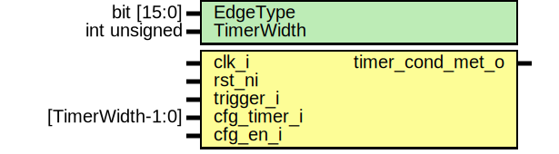

# Entity: sysrst_ctrl_ulpfsm

- **File**: sysrst_ctrl_ulpfsm.sv
## Diagram

## Description

 Copyright lowRISC contributors.
 Licensed under the Apache License, Version 2.0, see LICENSE for details.
 SPDX-License-Identifier: Apache-2.0

 Description sysrst_ctrl ULP FSM module

## Generics

| Generic name | Type         | Value | Description           |
| ------------ | ------------ | ----- | --------------------- |
| EdgeType     | bit [15:0]   | "H"   |  can be LH, HL and H  |
| TimerWidth   | int unsigned | 16    |                       |
## Ports

| Port name        | Direction | Type             | Description |
| ---------------- | --------- | ---------------- | ----------- |
| clk_i            | input     |                  |             |
| rst_ni           | input     |                  |             |
| trigger_i        | input     |                  |             |
| cfg_timer_i      | input     | [TimerWidth-1:0] |             |
| cfg_en_i         | input     |                  |             |
| timer_cond_met_o | output    |                  |             |
## Signals

| Name           | Type                   | Description |
| -------------- | ---------------------- | ----------- |
| trigger_q      | logic                  |             |
| trigger        | logic                  |             |
| trigger_stable | logic                  |             |
| timer_cnt_d    | logic [TimerWidth-1:0] |             |
| timer_cnt_q    | logic [TimerWidth-1:0] |             |
| timer_cnt_clr  | logic                  |             |
| timer_cnt_en   | logic                  |             |
| timer_state_q  | timer_state_e          |             |
| timer_state_d  | timer_state_e          |             |
## Types

| Name          | Type                                                                                                                                                                                          | Description                                                                                                                                                                                                                                                                                                                                                          |
| ------------- | --------------------------------------------------------------------------------------------------------------------------------------------------------------------------------------------- | -------------------------------------------------------------------------------------------------------------------------------------------------------------------------------------------------------------------------------------------------------------------------------------------------------------------------------------------------------------------- |
| timer_state_e | enum logic [1:0] {      IDLE_ST = 2'h0,      WAIT_ST = 2'h1,      DONE_ST = 2'h2   } | three-state FSM IDLE_ST->WAIT_ST->DONE_ST The input signals can be inverted. Hence, both paths FSM will detect a L2H or H2L transition or level H to enter the wait state debounce timer defines the time to wait for input to stablize FSM will check the input after the debounce period FSM will stay in the DONEXXX state until SW uses cfg_fsm_rst to clear it  |
## Processes
- p_trigger_reg: ( @(posedge clk_i or negedge rst_ni) )
  - **Type:** always_ff
- p_timer_state_reg: ( @(posedge clk_i or negedge rst_ni) )
  - **Type:** always_ff
- p_timer_cnt_reg: ( @(posedge clk_i or negedge rst_ni) )
  - **Type:** always_ff
- p_timer_fsm: (  )
  - **Type:** always_comb
