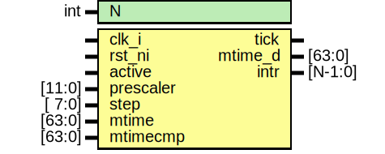

# Entity: timer_core
## Diagram

## Description
Copyright lowRISC contributors.
 Licensed under the Apache License, Version 2.0, see LICENSE for details.
 SPDX-License-Identifier: Apache-2.0
 
## Generics
| Generic name | Type | Value | Description |
| ------------ | ---- | ----- | ----------- |
| N            | int  | 1     |             |
## Ports
| Port name | Direction | Type    | Description |
| --------- | --------- | ------- | ----------- |
| clk_i     | input     |         |             |
| rst_ni    | input     |         |             |
| active    | input     |         |             |
| prescaler | input     | [11:0]  |             |
| step      | input     | [ 7:0]  |             |
| tick      | output    |         |             |
| mtime_d   | output    | [63:0]  |             |
| mtime     | input     | [63:0]  |             |
| mtimecmp  | input     | [63:0]  |             |
| intr      | output    | [N-1:0] |             |
## Signals
| Name       | Type         | Description |
| ---------- | ------------ | ----------- |
| tick_count | logic [11:0] |             |
## Processes
- generate_tick: _( @(posedge clk_i or negedge rst_ni) )_

