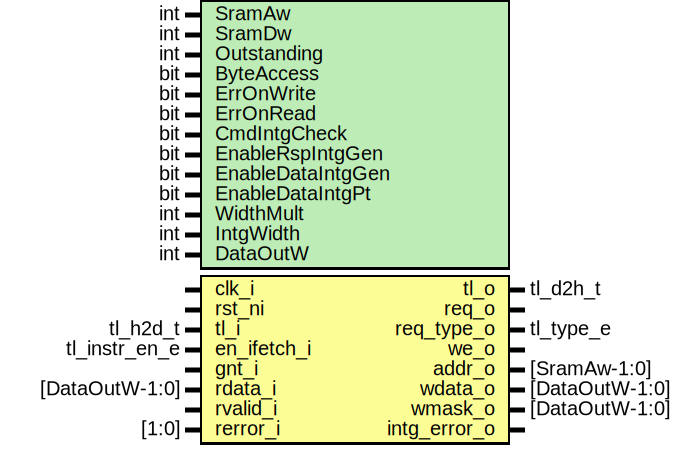

# Entity: tlul_adapter_sram

- **File**: tlul_adapter_sram.sv
## Diagram

## Description

 Copyright lowRISC contributors.
 Licensed under the Apache License, Version 2.0, see LICENSE for details.
 SPDX-License-Identifier: Apache-2.0
*

## Generics

| Generic name      | Type | Value                               | Description                                      |
| ----------------- | ---- | ----------------------------------- | ------------------------------------------------ |
| SramAw            | int  | 12                                  |                                                  |
| SramDw            | int  | 32                                  |  Must be multiple of the TL width                |
| Outstanding       | int  | 1                                   |  Only one request is accepted                    |
| ByteAccess        | bit  | 1                                   |  1: true, 0: false                               |
| ErrOnWrite        | bit  | 0                                   |  1: Writes not allowed, automatically error      |
| ErrOnRead         | bit  | 0                                   |  1: Reads not allowed, automatically error       |
| CmdIntgCheck      | bit  | 0                                   |  1: Enable command integrity check               |
| EnableRspIntgGen  | bit  | 0                                   |  1: Generate response integrity                  |
| EnableDataIntgGen | bit  | 0                                   |  1: Generate response data integrity             |
| EnableDataIntgPt  | bit  | 0                                   |  1: Passthrough command/response data integrity  |
| WidthMult         | int  | SramDw / top_pkg::TL_DW             |                                                  |
| IntgWidth         | int  | tlul_pkg::DataIntgWidth * WidthMult |                                                  |
| DataOutW          | int  | SramDw + IntgWidth                  |                                                  |
## Ports

| Port name    | Direction | Type           | Description                                      |
| ------------ | --------- | -------------- | ------------------------------------------------ |
| clk_i        | input     |                |                                                  |
| rst_ni       | input     |                |                                                  |
| tl_i         | input     | tl_h2d_t       |  TL-UL interface                                 |
| tl_o         | output    | tl_d2h_t       |                                                  |
| en_ifetch_i  | input     | tl_instr_en_e  |  control interface                               |
| req_o        | output    |                |  SRAM interface                                  |
| req_type_o   | output    | tl_type_e      |                                                  |
| gnt_i        | input     |                |                                                  |
| we_o         | output    |                |                                                  |
| addr_o       | output    | [SramAw-1:0]   |                                                  |
| wdata_o      | output    | [DataOutW-1:0] |                                                  |
| wmask_o      | output    | [DataOutW-1:0] |                                                  |
| intg_error_o | output    |                |                                                  |
| rdata_i      | input     | [DataOutW-1:0] |                                                  |
| rvalid_i     | input     |                |                                                  |
| rerror_i     | input     | [1:0]          | 2 bit error [1]: Uncorrectable, [0]: Correctable |
## Signals

| Name               | Type                                      | Description                                                                                                                                                                                                                                                   |
| ------------------ | ----------------------------------------- | ------------------------------------------------------------------------------------------------------------------------------------------------------------------------------------------------------------------------------------------------------------- |
| intg_error         | logic                                     |  integrity check                                                                                                                                                                                                                                              |
| intg_error_q       | logic                                     |  permanently latch integrity error until reset                                                                                                                                                                                                                |
| tl_i_int           | tl_h2d_t                                  |  byte handling for integrity                                                                                                                                                                                                                                  |
| tl_o_int           | tl_d2h_t                                  |                                                                                                                                                                                                                                                               |
| reqfifo_wvalid     | logic                                     |  FIFO signal in case OutStand is greater than 1  If request is latched, {write, source} is pushed to req fifo.  Req fifo is popped when D channel is acknowledged (v & r)  D channel valid is asserted if it is write request or rsp fifo not empty if read.  |
| reqfifo_wready     | logic                                     |  FIFO signal in case OutStand is greater than 1  If request is latched, {write, source} is pushed to req fifo.  Req fifo is popped when D channel is acknowledged (v & r)  D channel valid is asserted if it is write request or rsp fifo not empty if read.  |
| reqfifo_rvalid     | logic                                     |                                                                                                                                                                                                                                                               |
| reqfifo_rready     | logic                                     |                                                                                                                                                                                                                                                               |
| reqfifo_wdata      | req_t                                     |                                                                                                                                                                                                                                                               |
| reqfifo_rdata      | req_t                                     |                                                                                                                                                                                                                                                               |
| sramreqfifo_wvalid | logic                                     |                                                                                                                                                                                                                                                               |
| sramreqfifo_wready | logic                                     |                                                                                                                                                                                                                                                               |
| sramreqfifo_rready | logic                                     |                                                                                                                                                                                                                                                               |
| sramreqfifo_wdata  | sram_req_t                                |                                                                                                                                                                                                                                                               |
| sramreqfifo_rdata  | sram_req_t                                |                                                                                                                                                                                                                                                               |
| rspfifo_wvalid     | logic                                     |                                                                                                                                                                                                                                                               |
| rspfifo_wready     | logic                                     |                                                                                                                                                                                                                                                               |
| rspfifo_rvalid     | logic                                     |                                                                                                                                                                                                                                                               |
| rspfifo_rready     | logic                                     |                                                                                                                                                                                                                                                               |
| rspfifo_wdata      | rsp_t                                     |                                                                                                                                                                                                                                                               |
| rspfifo_rdata      | rsp_t                                     |                                                                                                                                                                                                                                                               |
| error_internal     | logic                                     | Internal protocol error checker                                                                                                                                                                                                                               |
| wr_attr_error      | logic                                     |                                                                                                                                                                                                                                                               |
| instr_error        | logic                                     |                                                                                                                                                                                                                                                               |
| wr_vld_error       | logic                                     |                                                                                                                                                                                                                                                               |
| rd_vld_error       | logic                                     |                                                                                                                                                                                                                                                               |
| tlul_error         | logic                                     | Error from `tlul_err` module                                                                                                                                                                                                                                  |
| a_ack              | logic                                     |                                                                                                                                                                                                                                                               |
| d_ack              | logic                                     |                                                                                                                                                                                                                                                               |
| sram_ack           | logic                                     |                                                                                                                                                                                                                                                               |
| d_valid            | logic                                     |  Valid handling                                                                                                                                                                                                                                               |
| d_error            | logic                                     |  Valid handling                                                                                                                                                                                                                                               |
| tl_out             | tl_d2h_t                                  |                                                                                                                                                                                                                                                               |
| woffset            | logic [WoffsetWidth-1:0]                  |  Support SRAMs wider than the TL-UL word width by mapping the parts of the  TL-UL address which are more fine-granular than the SRAM width to the  SRAM write mask.                                                                                           |
| wmask_combined     | logic [WidthMult-1:0][DataWidth-1:0]      |  Final combined wmask / wdata                                                                                                                                                                                                                                 |
| wdata_combined     | logic [WidthMult-1:0][DataWidth-1:0]      |                                                                                                                                                                                                                                                               |
| wmask_int          | logic [WidthMult-1:0][top_pkg::TL_DW-1:0] |  Original tlul portion                                                                                                                                                                                                                                        |
| wdata_int          | logic [WidthMult-1:0][top_pkg::TL_DW-1:0] |                                                                                                                                                                                                                                                               |
| wmask_intg         | logic [WidthMult-1:0][DataIntgWidth-1:0]  |  Integrity portion                                                                                                                                                                                                                                            |
| wdata_intg         | logic [WidthMult-1:0][DataIntgWidth-1:0]  |                                                                                                                                                                                                                                                               |
| rdata              | logic [WidthMult-1:0][DataWidth-1:0]      |  Make sure only requested bytes are forwarded                                                                                                                                                                                                                 |
| rmask              | logic [WidthMult-1:0][DataWidth-1:0]      |                                                                                                                                                                                                                                                               |
| rdata_tlword       | logic [DataWidth-1:0]                     |                                                                                                                                                                                                                                                               |
| unused_rerror      | logic                                     |  This module only cares about uncorrectable errors.                                                                                                                                                                                                           |
## Constants

| Name             | Type | Value                               | Description                                                                                                                                                                                                                         |
| ---------------- | ---- | ----------------------------------- | ----------------------------------------------------------------------------------------------------------------------------------------------------------------------------------------------------------------------------------- |
| WidthMult        | int  | SramDw / top_pkg::TL_DW             |                                                                                                                                                                                                                                     |
| IntgWidth        | int  | tlul_pkg::DataIntgWidth * WidthMult |                                                                                                                                                                                                                                     |
| DataOutW         | int  | SramDw + IntgWidth                  |                                                                                                                                                                                                                                     |
| SramByte         | int  | SramDw/8                            |                                                                                                                                                                                                                                     |
| DataBitWidth     | int  | prim_util_pkg::vbits(SramByte)      |                                                                                                                                                                                                                                     |
| WoffsetWidth     | int  | DataBitWidth                        |                                                                                                                                                                                                                                     |
| SramReqFifoWidth | int  | $bits(sram_req_t)                   |                                                                                                                                                                                                                                     |
| ReqFifoWidth     | int  | $bits(req_t)                        |                                                                                                                                                                                                                                     |
| RspFifoWidth     | int  | $bits(rsp_t)                        |                                                                                                                                                                                                                                     |
| DataWidth        | int  | top_pkg::TL_DW + DataIntgWidth      |  The size of the data/wmask depends on whether passthrough integrity is enabled.  If passthrough integrity is enabled, the data is concatenated with the integrity passed through  the user bits.  Otherwise, it is the data only.  |
## Types

| Name       | Type                                                                                                                                                                                                                                                                                                                                                                 | Description |
| ---------- | -------------------------------------------------------------------------------------------------------------------------------------------------------------------------------------------------------------------------------------------------------------------------------------------------------------------------------------------------------------------- | ----------- |
| sram_req_t | struct packed {      logic [top_pkg::TL_DBW-1:0] mask ;       logic [WoffsetWidth-1:0]    woffset ;     }                                                                                                                                                   |             |
| req_op_e   | enum logic [1:0] {      OpWrite,      OpRead,      OpUnknown   }                                                                                                                                                                                            |             |
| req_t      | struct packed {      req_op_e                    op ;      logic                       error ;      logic [top_pkg::TL_SZW-1:0] size ;      logic [top_pkg::TL_AIW-1:0] source ;    } |             |
| rsp_t      | struct packed {      logic [top_pkg::TL_DW-1:0] data ;      logic [DataIntgWidth-1:0]  data_intg ;      logic                      error ;    }                                                                          |             |
## Processes
- unnamed: ( @(posedge clk_i or negedge rst_ni) )
  - **Type:** always_ff
- unnamed: (  )
  - **Type:** always_comb
- unnamed: (  )
  - **Type:** always_comb
- unnamed: (  )
  - **Type:** always_comb
- unnamed: (  )
  - **Type:** always_comb
## Instantiations

- u_sram_byte: tlul_sram_byte
- u_rsp_gen: tlul_rsp_intg_gen
- u_err: tlul_err
- u_reqfifo: prim_fifo_sync
**Description**
 FIFO instance: REQ, RSP
 ReqFIFO is to store the Access type to match to the Response data.
    For instance, SRAM accepts the write request but doesn't return the
    acknowledge. In this case, it may be hard to determine when the D
    response for the write data should send out if reads/writes are
    interleaved. So, to make it in-order (even TL-UL allows out-of-order
    responses), storing the request is necessary. And if the read entry
    is write op, it is safe to return the response right away. If it is
    read reqeust, then D response is waiting until read data arrives.
 Notes:
 The oustanding+1 allows the reqfifo to absorb back to back transactions
 without any wait states.  Alternatively, the depth can be kept as
 oustanding as long as the outgoing ready is qualified with the acceptance
 of the response in the same cycle.  Doing so however creates a path from
 ready_i to ready_o, which may not be desireable.

- u_sramreqfifo: prim_fifo_sync
**Description**
 sramreqfifo:
    While the ReqFIFO holds the request until it is sent back via TL-UL, the
    sramreqfifo only needs to hold the mask and word offset until the read
    data returns from memory.

- u_rspfifo: prim_fifo_sync
**Description**
 Rationale having #Outstanding depth in response FIFO.
    In normal case, if the host or the crossbar accepts the response data,
    response FIFO isn't needed. But if in any case it has a chance to be
    back pressured, the response FIFO should store the returned data not to
    lose the data from the SRAM interface. Remember, SRAM interface doesn't
    have back-pressure signal such as read_ready.

