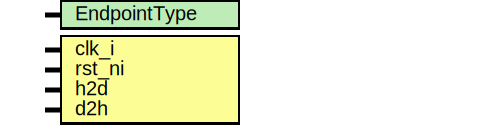

# Entity: tlul_assert
## Diagram

## Description
Copyright lowRISC contributors.
 Licensed under the Apache License, Version 2.0, see LICENSE for details.
 SPDX-License-Identifier: Apache-2.0
 Protocol checker for TL-UL ports using assertions. Supports interface-widths
 up to 64bit.
 
## Generics
| Generic name | Type | Value    | Description                      |
| ------------ | ---- | -------- | -------------------------------- |
| EndpointType |      | "Device" | can be either "Host" or "Device" |
## Ports
| Port name | Direction | Type | Description     |
| --------- | --------- | ---- | --------------- |
| clk_i     | input     |      |                 |
| rst_ni    | input     |      |                 |
| h2d       | input     |      | tile link ports |
| d2h       | input     |      |                 |
## Signals
| Name             | Type                       | Description |
| ---------------- | -------------------------- | ----------- |
| pend_req         | pend_req_t [2**TL_AIW-1:0] |             |
| disable_sva      | bit                        |             |
| a_mask           | logic [7:0]                |             |
| d_mask           | logic [7:0]                |             |
| a_data           | logic [63:0]               |             |
| d_data           | logic [63:0]               |             |
| initial          | end                        |             |
| gen_assert_final | ii                         |             |
| pre              | int                        |             |
| pre              | int                        |             |
## Types
| Name       | Type                                                                                                                                                                           | Description                                                                                                                                                                                                                                                                                                                                                                                                                      |
| ---------- | ------------------------------------------------------------------------------------------------------------------------------------------------------------------------------ | -------------------------------------------------------------------------------------------------------------------------------------------------------------------------------------------------------------------------------------------------------------------------------------------------------------------------------------------------------------------------------------------------------------------------------- |
| pend_req_t | struct packed {     bit                         pend;      tl_a_op_e                   opcode;     logic [top_pkg::TL_SZW-1:0] size;     logic [top_pkg::TL_DBW-1:0] mask;   } | There are up to 2**TL_AIW possible source-IDs. Below array "pend_req" has one entry for each source-ID. Each entry has the following fields: - pend   : is set to 1 to indicate up to 1 pending request for the source ID - opcode : "Get" requires "AccessAckData" response, "Put*" require "AccessAck" - size   : d_size of response must match a_size of request - mask   : is used to allow X for bytes whose mask bit is 0  |
## Processes
- unnamed: _( @(negedge clk_i or negedge rst_ni) )_
use negedge clk to avoid possible race conditions

**Description**
use negedge clk to avoid possible race conditions

