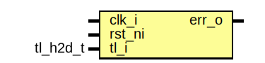

# Entity: tlul_err
## Diagram

## Description
Copyright lowRISC contributors.
 Licensed under the Apache License, Version 2.0, see LICENSE for details.
 SPDX-License-Identifier: Apache-2.0
 
## Ports
| Port name | Direction | Type     | Description |
| --------- | --------- | -------- | ----------- |
| clk_i     | input     |          |             |
| rst_ni    | input     |          |             |
| tl_i      | input     | tl_h2d_t |             |
| err_o     | output    |          |             |
## Signals
| Name             | Type           | Description                                      |
| ---------------- | -------------- | ------------------------------------------------ |
| opcode_allowed   | logic          |                                                  |
| a_config_allowed | logic          |                                                  |
| op_full          | logic          |                                                  |
| op_partial       | logic          |                                                  |
| op_get           | logic          |                                                  |
| instr_wr_err     | logic          | An instruction type transaction cannot be write  |
| addr_sz_chk      | logic          | address and size alignment check                 |
| mask_chk         | logic          | inactive lane a_mask check                       |
| fulldata_chk     | logic          | PutFullData should have size match to mask       |
| mask             | logic [MW-1:0] |                                                  |
| addr_sz_chk      | end            |                                                  |
| addr_sz_chk      | end            |                                                  |
| mask_chk         | [SubAW-1:0]    |                                                  |
| default          | end            |                                                  |
| endcase          | end            |                                                  |
| else             | end            |                                                  |
| addr_sz_chk      | begin          |                                                  |
| end              | end            |                                                  |
## Constants
| Name  | Type | Value                | Description |
| ----- | ---- | -------------------- | ----------- |
| IW    | int  | $bits(tl_i.a_source) |             |
| SZW   | int  | $bits(tl_i.a_size)   |             |
| DW    | int  | $bits(tl_i.a_data)   |             |
| MW    | int  | $bits(tl_i.a_mask)   |             |
| SubAW | int  | $clog2(DW/8)         |             |
