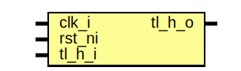

# Entity: tlul_err_resp

- **File**: tlul_err_resp.sv
## Diagram

## Description

Copyright lowRISC contributors.
 Licensed under the Apache License, Version 2.0, see LICENSE for details.
 SPDX-License-Identifier: Apache-2.0
 TL-UL error responder module, used by tlul_socket_1n to help response
 to requests to no correct address space. Responses are always one cycle
 after request with no stalling unless response is stuck on the way out.
 
## Ports

| Port name | Direction | Type | Description |
| --------- | --------- | ---- | ----------- |
| clk_i     | input     |      |             |
| rst_ni    | input     |      |             |
| tl_h_i    | input     |      |             |
| tl_h_o    | output    |      |             |
## Signals

| Name            | Type                               | Description                  |
| --------------- | ---------------------------------- | ---------------------------- |
| err_opcode      | tl_a_op_e                          |                              |
| err_source      | logic [$bits(tl_h_i.a_source)-1:0] |                              |
| err_size        | logic [$bits(tl_h_i.a_size)-1:0]   |                              |
| err_req_pending | logic                              |                              |
| err_rsp_pending | logic                              |                              |
| unused_tl_h     | logic                              | Waive unused bits of tl_h_i  |
## Processes
- unnamed: ( @(posedge clk_i or negedge rst_ni) )
- unnamed: ( @(posedge clk_i or negedge rst_ni) )
