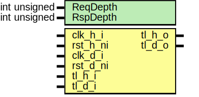

# Entity: tlul_fifo_async

## Diagram

## Description

Copyright lowRISC contributors.
 Licensed under the Apache License, Version 2.0, see LICENSE for details.
 SPDX-License-Identifier: Apache-2.0
 TL-UL fifo, used to add elasticity or an asynchronous clock crossing
 to an TL-UL bus.  This instantiates two FIFOs, one for the request side,
 and one for the response side.
 
## Generics

| Generic name | Type         | Value | Description |
| ------------ | ------------ | ----- | ----------- |
| ReqDepth     | int unsigned | 3     |             |
| RspDepth     | int unsigned | 3     |             |
## Ports

| Port name | Direction | Type | Description |
| --------- | --------- | ---- | ----------- |
| clk_h_i   | input     |      |             |
| rst_h_ni  | input     |      |             |
| clk_d_i   | input     |      |             |
| rst_d_ni  | input     |      |             |
| tl_h_i    | input     |      |             |
| tl_h_o    | output    |      |             |
| tl_d_o    | output    |      |             |
| tl_d_i    | input     |      |             |
## Constants

| Name          | Type         | Value                        | Description                                              |
| ------------- | ------------ | ---------------------------- | -------------------------------------------------------- |
| REQFIFO_WIDTH | int unsigned | $bits(tlul_pkg::tl_h2d_t)-2  | Put everything on the request side into one FIFO         |
| RSPFIFO_WIDTH | int unsigned | $bits(tlul_pkg::tl_d2h_t) -2 | Put everything on the response side into the other FIFO  |
## Instantiations

- reqfifo: prim_fifo_async
- rspfifo: prim_fifo_async
