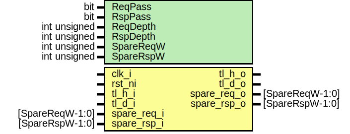

# Entity: tlul_fifo_sync
## Diagram

## Description
Copyright lowRISC contributors.
 Licensed under the Apache License, Version 2.0, see LICENSE for details.
 SPDX-License-Identifier: Apache-2.0
 TL-UL fifo, used to add elasticity or an asynchronous clock crossing
 to an TL-UL bus.  This instantiates two FIFOs, one for the request side,
 and one for the response side.
 
## Generics
| Generic name | Type         | Value | Description |
| ------------ | ------------ | ----- | ----------- |
| ReqPass      | bit          | 1'b1  |             |
| RspPass      | bit          | 1'b1  |             |
| ReqDepth     | int unsigned | 2     |             |
| RspDepth     | int unsigned | 2     |             |
| SpareReqW    | int unsigned | 1     |             |
| SpareRspW    | int unsigned | 1     |             |
## Ports
| Port name   | Direction | Type            | Description |
| ----------- | --------- | --------------- | ----------- |
| clk_i       | input     |                 |             |
| rst_ni      | input     |                 |             |
| tl_h_i      | input     |                 |             |
| tl_h_o      | output    |                 |             |
| tl_d_o      | output    |                 |             |
| tl_d_i      | input     |                 |             |
| spare_req_i | input     | [SpareReqW-1:0] |             |
| spare_req_o | output    | [SpareReqW-1:0] |             |
| spare_rsp_i | input     | [SpareRspW-1:0] |             |
| spare_rsp_o | output    | [SpareRspW-1:0] |             |
## Constants
| Name          | Type         | Value                                    | Description                                              |
| ------------- | ------------ | ---------------------------------------- | -------------------------------------------------------- |
| REQFIFO_WIDTH | int unsigned | $bits(tlul_pkg::tl_h2d_t) -2 + SpareReqW | Put everything on the request side into one FIFO         |
| RSPFIFO_WIDTH | int unsigned | $bits(tlul_pkg::tl_d2h_t) -2 + SpareRspW | Put everything on the response side into the other FIFO  |
## Instantiations
- reqfifo: prim_fifo_sync
- rspfifo: prim_fifo_sync
