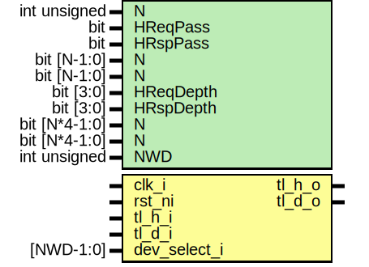

# Entity: tlul_socket_1n

- **File**: tlul_socket_1n.sv
## Diagram

## Description

 Copyright lowRISC contributors.
 Licensed under the Apache License, Version 2.0, see LICENSE for details.
 SPDX-License-Identifier: Apache-2.0

 TL-UL socket 1:N module

 configuration settings
   device_count: 4

 Verilog parameters
   HReqPass:      if 1 then host requests can pass through on empty fifo,
                  default 1
   HRspPass:      if 1 then host responses can pass through on empty fifo,
                  default 1
   DReqPass:      (one per device_count) if 1 then device i requests can
                  pass through on empty fifo, default 1
   DRspPass:      (one per device_count) if 1 then device i responses can
                  pass through on empty fifo, default 1
   HReqDepth:     Depth of host request FIFO, default 2
   HRspDepth:     Depth of host response FIFO, default 2
   DReqDepth:     (one per device_count) Depth of device i request FIFO,
                  default 2
   DRspDepth:     (one per device_count) Depth of device i response FIFO,
                  default 2

 Requests must stall to one device until all responses from other devices
 have returned.  Need to keep a counter of all outstanding requests and
 wait until that counter is zero before switching devices.

 This module will return a request error if the input value of 'dev_select_i'
 is not within the range 0..N-1. Thus the instantiator of the socket
 can indicate error by any illegal value of dev_select_i. 4'b1111 is
 recommended for visibility

 The maximum value of N is 15

## Generics

| Generic name | Type          | Value       | Description         |
| ------------ | ------------- | ----------- | ------------------- |
| N            | int unsigned  | 4           |                     |
| HReqPass     | bit           | 1'b1        |                     |
| HRspPass     | bit           | 1'b1        |                     |
| N            | bit [N-1:0]   | undefined   |                     |
| N            | bit [N-1:0]   | undefined   |                     |
| HReqDepth    | bit [3:0]     | 4'h2        |                     |
| HRspDepth    | bit [3:0]     | 4'h2        |                     |
| N            | bit [N*4-1:0] | undefined   |                     |
| N            | bit [N*4-1:0] | undefined   |                     |
| NWD          | int unsigned  | $clog2(N+1) |  derived parameter  |
## Ports

| Port name    | Direction | Type      | Description |
| ------------ | --------- | --------- | ----------- |
| clk_i        | input     |           |             |
| rst_ni       | input     |           |             |
| tl_h_i       | input     |           |             |
| tl_h_o       | output    |           |             |
| tl_d_o       | output    |           |             |
| tl_d_i       | input     |           |             |
| dev_select_i | input     | [NWD-1:0] |             |
## Signals

| Name                   | Type                     | Description                                                                                                                                                                                                        |
| ---------------------- | ------------------------ | ------------------------------------------------------------------------------------------------------------------------------------------------------------------------------------------------------------------ |
| dev_select_t           | logic [NWD-1:0]          |  Since our steering is done after potential FIFOing, we need to  shove our device select bits into spare bits of reqfifo  instantiate the host fifo, create intermediate bus 't'  FIFO'd version of device select  |
| tl_t_o                 | tlul_pkg::tl_h2d_t       |                                                                                                                                                                                                                    |
| tl_t_i                 | tlul_pkg::tl_d2h_t       |                                                                                                                                                                                                                    |
| num_req_outstanding    | logic [OutstandingW-1:0] |                                                                                                                                                                                                                    |
| dev_select_outstanding | logic [NWD-1:0]          |                                                                                                                                                                                                                    |
| hold_all_requests      | logic                    |                                                                                                                                                                                                                    |
| accept_t_req           | logic                    |                                                                                                                                                                                                                    |
| accept_t_rsp           | logic                    |                                                                                                                                                                                                                    |
| tl_u_o                 | tlul_pkg::tl_h2d_t       |  Make N copies of 't' request side with modified reqvalid, call  them 'u[0]' .. 'u[n-1]'.                                                                                                                          |
| tl_u_i                 | tlul_pkg::tl_d2h_t       |                                                                                                                                                                                                                    |
| tl_t_p                 | tlul_pkg::tl_d2h_t       |                                                                                                                                                                                                                    |
| hfifo_reqready         | logic                    |  for the returning reqready, only look at the device we're addressing                                                                                                                                              |
## Constants

| Name           | Type         | Value                    | Description            |
| -------------- | ------------ | ------------------------ | ---------------------- |
| NWD            | int unsigned | $clog2(N+1)              | derived parameter      |
| MaxOutstanding | int          | 2**top_pkg::TL_AIW       | Up to 256 ounstanding  |
| OutstandingW   | int          | $clog2(MaxOutstanding+1) |                        |
## Processes
- unnamed: ( @(posedge clk_i or negedge rst_ni) )
  - **Type:** always_ff
- unnamed: (  )
  - **Type:** always_comb
- unnamed: (  )
  - **Type:** always_comb
## Instantiations

- fifo_h: tlul_fifo_sync
- err_resp: tlul_err_resp
