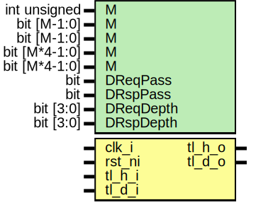

# Entity: tlul_socket_m1

- **File**: tlul_socket_m1.sv
## Diagram

## Description

 Copyright lowRISC contributors.
 Licensed under the Apache License, Version 2.0, see LICENSE for details.
 SPDX-License-Identifier: Apache-2.0

 TL-UL socket M:1 module

 Verilog parameters
   M:             Number of host ports.
   HReqPass:      M bit array to allow requests to pass through the host i
                  FIFO with no clock delay if the request FIFO is empty. If
                  1'b0, at least one clock cycle of latency is created.
                  Default is 1'b1.
   HRspPass:      Same as HReqPass but for host response FIFO.
   HReqDepth:     Mx4 bit array. bit[i*4+:4] is depth of host i request FIFO.
                  Depth of zero is allowed if ReqPass is true. A maximum value
                  of 16 is allowed, default is 2.
   HRspDepth:     Same as HReqDepth but for host response FIFO.
   DReqPass:      Same as HReqPass but for device request FIFO.
   DRspPass:      Same as HReqPass but for device response FIFO.
   DReqDepth:     Same as HReqDepth but for device request FIFO.
   DRspDepth:     Same as HReqDepth but for device response FIFO.

## Generics

| Generic name | Type          | Value     | Description |
| ------------ | ------------- | --------- | ----------- |
| M            | int unsigned  | 4         |             |
| M            | bit [M-1:0]   | undefined |             |
| M            | bit [M-1:0]   | undefined |             |
| M            | bit [M*4-1:0] | undefined |             |
| M            | bit [M*4-1:0] | undefined |             |
| DReqPass     | bit           | 1'b1      |             |
| DRspPass     | bit           | 1'b1      |             |
| DReqDepth    | bit [3:0]     | 4'h2      |             |
| DRspDepth    | bit [3:0]     | 4'h2      |             |
## Ports

| Port name | Direction | Type | Description |
| --------- | --------- | ---- | ----------- |
| clk_i     | input     |      |             |
| rst_ni    | input     |      |             |
| tl_h_i    | input     |      |             |
| tl_h_o    | output    |      |             |
| tl_d_o    | output    |      |             |
| tl_d_i    | input     |      |             |
## Signals

| Name                  | Type               | Description |
| --------------------- | ------------------ | ----------- |
| hreq_fifo_o           | tlul_pkg::tl_h2d_t |             |
| hrsp_fifo_i           | tlul_pkg::tl_d2h_t |             |
| hrequest              | logic [M-1:0]      |             |
| hgrant                | logic [M-1:0]      |             |
| dreq_fifo_i           | tlul_pkg::tl_h2d_t |             |
| drsp_fifo_o           | tlul_pkg::tl_d2h_t |             |
| arb_valid             | logic              |             |
| arb_ready             | logic              |             |
| arb_data              | tlul_pkg::tl_h2d_t |             |
| hfifo_rspvalid        | logic [  M-1:0]    |             |
| dfifo_rspready        | logic [  M-1:0]    |             |
| hfifo_rspid           | logic [IDW-1:0]    |             |
| dfifo_rspready_merged | logic              |             |
## Constants

| Name  | Type         | Value           | Description                                                                                                                                                                                                                                                                                                                                                                                                                                                                                                                                                                                                                                                                                                                                                                                                                                  |
| ----- | ------------ | --------------- | -------------------------------------------------------------------------------------------------------------------------------------------------------------------------------------------------------------------------------------------------------------------------------------------------------------------------------------------------------------------------------------------------------------------------------------------------------------------------------------------------------------------------------------------------------------------------------------------------------------------------------------------------------------------------------------------------------------------------------------------------------------------------------------------------------------------------------------------- |
| IDW   | int unsigned | top_pkg::TL_AIW |  Signals    tl_h_i/o[0] |  tl_h_i/o[1] | ... |  tl_h_i/o[M-1]       |              |                    |  u_hostfifo[0]  u_hostfifo[1]        u_hostfifo[M-1]       |              |                    |        hreq_fifo_o(i) / hrsp_fifo_i(i)      ---------------------------------------      |       request/grant/req_data        |      |                                     |      |           PRIM_ARBITER              |      |                                     |      |  arb_valid / arb_ready / arb_data   |      ---------------------------------------                      |                 dreq_fifo_i / drsp_fifo_o                      |                 u_devicefifo                      |                   tl_d_o/i   Required ID width to distinguish between host ports   Used in response steering  |
| STIDW | int unsigned | $clog2(M)       |                                                                                                                                                                                                                                                                                                                                                                                                                                                                                                                                                                                                                                                                                                                                                                                                                                              |
## Instantiations

- u_devicefifo: tlul_fifo_sync
 **Description**
 Device Req/Rsp FIFO

