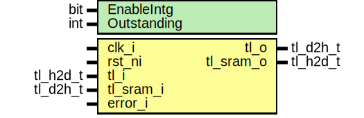

# Entity: tlul_sram_byte

- **File**: tlul_sram_byte.sv
## Diagram

## Description

 Copyright lowRISC contributors.
 Licensed under the Apache License, Version 2.0, see LICENSE for details.
 SPDX-License-Identifier: Apache-2.0
*

## Generics

| Generic name | Type | Value | Description                               |
| ------------ | ---- | ----- | ----------------------------------------- |
| EnableIntg   | bit  | 0     |  Enable integrity handling at byte level  |
| Outstanding  | int  | 1     |                                           |
## Ports

| Port name | Direction | Type     | Description                                                                                                                                                                          |
| --------- | --------- | -------- | ------------------------------------------------------------------------------------------------------------------------------------------------------------------------------------ |
| clk_i     | input     |          |                                                                                                                                                                                      |
| rst_ni    | input     |          |                                                                                                                                                                                      |
| tl_i      | input     | tl_h2d_t |                                                                                                                                                                                      |
| tl_o      | output    | tl_d2h_t |                                                                                                                                                                                      |
| tl_sram_o | output    | tl_h2d_t |                                                                                                                                                                                      |
| tl_sram_i | input     | tl_d2h_t |                                                                                                                                                                                      |
| error_i   | input     |          |  if incoming transaction already has an integrity error, do not attempt to handle the byte-write access.  Instead treat as  feedthrough and allow the system to directly error back  |
## Signals

| Name             | Type                       | Description                                                                                                                                                                                                                                                                                        |
| ---------------- | -------------------------- | -------------------------------------------------------------------------------------------------------------------------------------------------------------------------------------------------------------------------------------------------------------------------------------------------- |
| sel_int          | sel_sig_e                  |  state and selection                                                                                                                                                                                                                                                                               |
| stall_host       | logic                      |                                                                                                                                                                                                                                                                                                    |
| wr_phase         | logic                      |                                                                                                                                                                                                                                                                                                    |
| rd_wait          | logic                      |                                                                                                                                                                                                                                                                                                    |
| state_d          | state_e                    |                                                                                                                                                                                                                                                                                                    |
| state_q          | state_e                    |                                                                                                                                                                                                                                                                                                    |
| a_ack            | logic                      | upstream a channel acknowledgement                                                                                                                                                                                                                                                                 |
| sram_a_ack       | logic                      | downstream a channel acknowledgement                                                                                                                                                                                                                                                               |
| sram_d_ack       | logic                      | downstream d channel acknowledgement                                                                                                                                                                                                                                                               |
| wr_txn           | logic                      |                                                                                                                                                                                                                                                                                                    |
| byte_wr_txn      | logic                      |                                                                                                                                                                                                                                                                                                    |
| byte_req_ack     | logic                      |                                                                                                                                                                                                                                                                                                    |
| a_ack_q          | logic                      |                                                                                                                                                                                                                                                                                                    |
| txn_data         | tl_txn_data_t              |                                                                                                                                                                                                                                                                                                    |
| held_data        | tl_txn_data_t              |                                                                                                                                                                                                                                                                                                    |
| fifo_rdy         | logic                      |                                                                                                                                                                                                                                                                                                    |
| rsp_data         | logic [top_pkg::TL_DW-1:0] |  captured read data                                                                                                                                                                                                                                                                                |
| tl_h2d_int       | tl_h2d_t                   |                                                                                                                                                                                                                                                                                                    |
| tl_h2d_intg      | tl_h2d_t                   |                                                                                                                                                                                                                                                                                                    |
| combined_data    | logic [top_pkg::TL_DW-1:0] |  while we could simply not assert a_ready to ensure the host keeps  the request lines stable, there is no guarantee the hosts (if there are multiple)  do not re-arbitrate on every cycle if its transactions are not accepted.  As a result, it is better to capture the transaction attributes.  |
| unused_held_data | logic                      |                                                                                                                                                                                                                                                                                                    |
## Constants

| Name         | Type | Value                   | Description                                                                                 |
| ------------ | ---- | ----------------------- | ------------------------------------------------------------------------------------------- |
| TxnDataWidth | int  | $bits(tl_txn_data_t)    |                                                                                             |
| AccessSize   | int  | $clog2(top_pkg::TL_DBW) |  Since we are performing a read-modify-write operation,  we always access the entire word.  |
## Types

| Name          | Type                                                                                                                                                                                                                                                                                                                                                                                                                                                                                                                                                                                                                            | Description                    |
| ------------- | ------------------------------------------------------------------------------------------------------------------------------------------------------------------------------------------------------------------------------------------------------------------------------------------------------------------------------------------------------------------------------------------------------------------------------------------------------------------------------------------------------------------------------------------------------------------------------------------------------------------------------- | ------------------------------ |
| state_e       | enum logic [1:0] {      StPassThru,      StWaitRd,      StWriteCmd,      StWait   }                                                                                                                                                                                                                                                                                                                                                                                                 |  state enumeration             |
| sel_sig_e     | enum logic [1:0] {      SelPassThru = 2'b01,      SelInt = 2'b10   }                                                                                                                                                                                                                                                                                                                                                                                                                                                                                      |  signal select enumeration     |
| tl_txn_data_t | struct packed {      logic                  [2:0]  a_param;      logic  [top_pkg::TL_SZW-1:0]  a_size;      logic  [top_pkg::TL_AIW-1:0]  a_source;      logic   [top_pkg::TL_AW-1:0]  a_address;      logic  [top_pkg::TL_DBW-1:0]  a_mask;      logic   [top_pkg::TL_DW-1:0]  a_data;      tl_a_user_t                   a_user;    } |  prim fifo for capturing info  |
## Processes
- unnamed: ( @(posedge clk_i or negedge rst_ni) )
  - **Type:** always_ff
- unnamed: (  )
  - **Type:** always_comb
 **Description**
 state machine handling 
- unnamed: ( @(posedge clk_i) )
  - **Type:** always_ff
- unnamed: (  )
  - **Type:** always_comb
## Instantiations

- u_sync_fifo: prim_fifo_sync
- u_intg_gen: tlul_cmd_intg_gen
 **Description**
 outgoing tlul transactions

