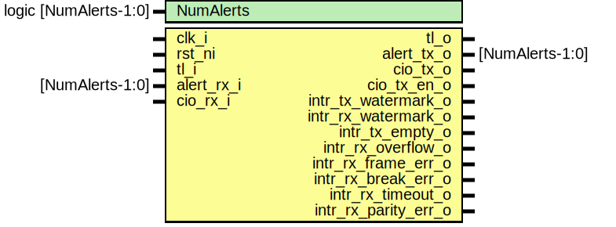

# Entity: uart

- **File**: uart.sv
## Diagram

## Description

Copyright lowRISC contributors.
 Licensed under the Apache License, Version 2.0, see LICENSE for details.
 SPDX-License-Identifier: Apache-2.0
 Description: UART top level wrapper file
 
## Generics

| Generic name | Type                  | Value     | Description |
| ------------ | --------------------- | --------- | ----------- |
| NumAlerts    | logic [NumAlerts-1:0] | undefined |             |
## Ports

| Port name            | Direction | Type            | Description   |
| -------------------- | --------- | --------------- | ------------- |
| clk_i                | input     |                 |               |
| rst_ni               | input     |                 |               |
| tl_i                 | input     |                 | Bus Interface |
| tl_o                 | output    |                 |               |
| alert_rx_i           | input     | [NumAlerts-1:0] | Alerts        |
| alert_tx_o           | output    | [NumAlerts-1:0] |               |
| cio_rx_i             | input     |                 | Generic IO    |
| cio_tx_o             | output    |                 |               |
| cio_tx_en_o          | output    |                 |               |
| intr_tx_watermark_o  | output    |                 | Interrupts    |
| intr_rx_watermark_o  | output    |                 |               |
| intr_tx_empty_o      | output    |                 |               |
| intr_rx_overflow_o   | output    |                 |               |
| intr_rx_frame_err_o  | output    |                 |               |
| intr_rx_break_err_o  | output    |                 |               |
| intr_rx_timeout_o    | output    |                 |               |
| intr_rx_parity_err_o | output    |                 |               |
## Signals

| Name       | Type                  | Description |
| ---------- | --------------------- | ----------- |
| alert_test | logic [NumAlerts-1:0] |             |
| alerts     | logic [NumAlerts-1:0] |             |
| reg2hw     | uart_reg2hw_t         |             |
| hw2reg     | uart_hw2reg_t         |             |
## Instantiations

- u_reg: uart_reg_top
- uart_core: uart_core
