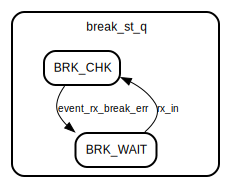

# Entity: uart_core

- **File**: uart_core.sv
## Diagram

## Description

Copyright lowRISC contributors.
 Licensed under the Apache License, Version 2.0, see LICENSE for details.
 SPDX-License-Identifier: Apache-2.0
 Description: UART core module
 
## Ports

| Port name            | Direction | Type | Description |
| -------------------- | --------- | ---- | ----------- |
| clk_i                | input     |      |             |
| rst_ni               | input     |      |             |
| reg2hw               | input     |      |             |
| hw2reg               | output    |      |             |
| rx                   | input     |      |             |
| tx                   | output    |      |             |
| intr_tx_watermark_o  | output    |      |             |
| intr_rx_watermark_o  | output    |      |             |
| intr_tx_empty_o      | output    |      |             |
| intr_rx_overflow_o   | output    |      |             |
| intr_rx_frame_err_o  | output    |      |             |
| intr_rx_break_err_o  | output    |      |             |
| intr_rx_timeout_o    | output    |      |             |
| intr_rx_parity_err_o | output    |      |             |
## Signals

| Name                  | Type                 | Description                                                                                                                 |
| --------------------- | -------------------- | --------------------------------------------------------------------------------------------------------------------------- |
| rx_val_q              | logic   [15:0]       |                                                                                                                             |
| uart_rdata            | logic   [7:0]        |                                                                                                                             |
| tick_baud_x16         | logic                |                                                                                                                             |
| rx_tick_baud          | logic                |                                                                                                                             |
| tx_fifo_depth         | logic   [5:0]        |                                                                                                                             |
| rx_fifo_depth         | logic   [5:0]        |                                                                                                                             |
| rx_fifo_depth_prev_q  | logic   [5:0]        |                                                                                                                             |
| rx_timeout_count_d    | logic   [23:0]       |                                                                                                                             |
| rx_timeout_count_q    | logic   [23:0]       |                                                                                                                             |
| uart_rxto_val         | logic   [23:0]       |                                                                                                                             |
| rx_fifo_depth_changed | logic                |                                                                                                                             |
| uart_rxto_en          | logic                |                                                                                                                             |
| tx_enable             | logic                |                                                                                                                             |
| rx_enable             | logic                |                                                                                                                             |
| sys_loopback          | logic                |                                                                                                                             |
| line_loopback         | logic                |                                                                                                                             |
| rxnf_enable           | logic                |                                                                                                                             |
| uart_fifo_rxrst       | logic                |                                                                                                                             |
| uart_fifo_txrst       | logic                |                                                                                                                             |
| uart_fifo_rxilvl      | logic   [2:0]        |                                                                                                                             |
| uart_fifo_txilvl      | logic   [1:0]        |                                                                                                                             |
| ovrd_tx_en            | logic                |                                                                                                                             |
| ovrd_tx_val           | logic                |                                                                                                                             |
| tx_fifo_data          | logic   [7:0]        |                                                                                                                             |
| tx_fifo_rready        | logic                |                                                                                                                             |
| tx_fifo_rvalid        | logic                |                                                                                                                             |
| tx_fifo_wready        | logic                |                                                                                                                             |
| tx_uart_idle          | logic                |                                                                                                                             |
| tx_out                | logic                |                                                                                                                             |
| tx_out_q              | logic                |                                                                                                                             |
| rx_fifo_data          | logic   [7:0]        |                                                                                                                             |
| rx_valid              | logic                |                                                                                                                             |
| rx_fifo_wvalid        | logic                |                                                                                                                             |
| rx_fifo_rvalid        | logic                |                                                                                                                             |
| rx_fifo_wready        | logic                |                                                                                                                             |
| rx_uart_idle          | logic                |                                                                                                                             |
| rx_sync               | logic                |                                                                                                                             |
| rx_in                 | logic                |                                                                                                                             |
| break_err             | logic                |                                                                                                                             |
| allzero_cnt_d         | logic   [4:0]        |                                                                                                                             |
| allzero_cnt_q         | logic   [4:0]        |                                                                                                                             |
| allzero_err           | logic                |                                                                                                                             |
| not_allzero_char      | logic                |                                                                                                                             |
| event_tx_watermark    | logic                |                                                                                                                             |
| event_rx_watermark    | logic                |                                                                                                                             |
| event_tx_empty        | logic                |                                                                                                                             |
| event_rx_overflow     | logic                |                                                                                                                             |
| event_rx_frame_err    | logic                |                                                                                                                             |
| event_rx_break_err    | logic                |                                                                                                                             |
| event_rx_timeout      | logic                |                                                                                                                             |
| event_rx_parity_err   | logic                |                                                                                                                             |
| tx_watermark_d        | logic                |                                                                                                                             |
| tx_watermark_prev_q   | logic                |                                                                                                                             |
| rx_watermark_d        | logic                |                                                                                                                             |
| rx_watermark_prev_q   | logic                |                                                                                                                             |
| tx_uart_idle_q        | logic                |                                                                                                                             |
| break_st_q            | break_st_e           |                                                                                                                             |
| nco_sum_q             | logic   [NcoWidth:0] | extra bit to get the carry                                                                                                  |
| rx_sync_q1            | logic                | Based on: en.wikipedia.org/wiki/Repetition_code mentions the use of a majority filter in UART to ignore brief noise spikes  |
| rx_sync_q2            | logic                | Based on: en.wikipedia.org/wiki/Repetition_code mentions the use of a majority filter in UART to ignore brief noise spikes  |
| rx_in_mx              | logic                | Based on: en.wikipedia.org/wiki/Repetition_code mentions the use of a majority filter in UART to ignore brief noise spikes  |
| rx_in_maj             | logic                | Based on: en.wikipedia.org/wiki/Repetition_code mentions the use of a majority filter in UART to ignore brief noise spikes  |
| unused_reg            | logic                | unused registers                                                                                                            |
## Constants

| Name     | Type | Value                    | Description |
| -------- | ---- | ------------------------ | ----------- |
| NcoWidth | int  | $bits(reg2hw.ctrl.nco.q) |             |
## Types

| Name       | Type                                                                                                               | Description |
| ---------- | ------------------------------------------------------------------------------------------------------------------ | ----------- |
| break_st_e | enum logic {      BRK_CHK,      BRK_WAIT   } |             |
## Processes
- unnamed: ( @(posedge clk_i or negedge rst_ni) )
- unnamed: (  )
**Description**
break_err edges in same cycle as event_rx_frame_err edges ; that way the
reset-on-read works the same way for break and frame error interrupts.

- unnamed: ( @(posedge clk_i or negedge rst_ni) )
- unnamed: ( @(posedge clk_i or negedge rst_ni) )
- unnamed: ( @(posedge clk_i or negedge rst_ni) )
- unnamed: ( @(posedge clk_i or negedge rst_ni) )
- unnamed: ( @(posedge clk_i or negedge rst_ni) )
- unnamed: (  )
- unnamed: ( @(posedge clk_i or negedge rst_ni) )
- unnamed: (  )
- unnamed: ( @(posedge clk_i or negedge rst_ni) )
## Instantiations

- u_uart_txfifo: prim_fifo_sync
- uart_tx: uart_tx
- sync_rx: prim_flop_2sync
**Description**
sync the incoming data

- uart_rx: uart_rx
- u_uart_rxfifo: prim_fifo_sync
- intr_hw_tx_watermark: prim_intr_hw
**Description**
instantiate interrupt hardware primitives

- intr_hw_rx_watermark: prim_intr_hw
- intr_hw_tx_empty: prim_intr_hw
- intr_hw_rx_overflow: prim_intr_hw
- intr_hw_rx_frame_err: prim_intr_hw
- intr_hw_rx_break_err: prim_intr_hw
- intr_hw_rx_timeout: prim_intr_hw
- intr_hw_rx_parity_err: prim_intr_hw
## State machines

