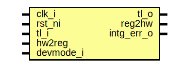

# Entity: uart_reg_top

- **File**: uart_reg_top.sv
## Diagram

## Description

Copyright lowRISC contributors.
 Licensed under the Apache License, Version 2.0, see LICENSE for details.
 SPDX-License-Identifier: Apache-2.0
 Register Top module auto-generated by `reggen`
 
## Ports

| Port name  | Direction | Type | Description                                              |
| ---------- | --------- | ---- | -------------------------------------------------------- |
| clk_i      | input     |      |                                                          |
| rst_ni     | input     |      |                                                          |
| tl_i       | input     |      |                                                          |
| tl_o       | output    |      |                                                          |
| reg2hw     | output    |      | Write                                                    |
| hw2reg     | input     |      | Read                                                     |
| intg_err_o | output    |      | Integrity check errors                                   |
| devmode_i  | input     |      | If 1, explicit error return for unmapped register access |
## Signals

| Name                         | Type               | Description                                                                                                               |
| ---------------------------- | ------------------ | ------------------------------------------------------------------------------------------------------------------------- |
| reg_we                       | logic              | register signals                                                                                                          |
| reg_re                       | logic              |                                                                                                                           |
| reg_addr                     | logic [AW-1:0]     |                                                                                                                           |
| reg_wdata                    | logic [DW-1:0]     |                                                                                                                           |
| reg_be                       | logic [DBW-1:0]    |                                                                                                                           |
| reg_rdata                    | logic [DW-1:0]     |                                                                                                                           |
| reg_error                    | logic              |                                                                                                                           |
| addrmiss                     | logic              |                                                                                                                           |
| wr_err                       | logic              |                                                                                                                           |
| reg_rdata_next               | logic [DW-1:0]     |                                                                                                                           |
| tl_reg_h2d                   | tlul_pkg::tl_h2d_t |                                                                                                                           |
| tl_reg_d2h                   | tlul_pkg::tl_d2h_t |                                                                                                                           |
| intg_err                     | logic              | incoming payload check                                                                                                    |
| intg_err_q                   | logic              |                                                                                                                           |
| tl_o_pre                     | tlul_pkg::tl_d2h_t | outgoing integrity generation                                                                                             |
| intr_state_we                | logic              | Define SW related signals Format: <reg>_<field>_{wd|we|qs} or <reg>_{wd|we|qs} if field == 1 or 0                         |
| intr_state_tx_watermark_qs   | logic              |                                                                                                                           |
| intr_state_tx_watermark_wd   | logic              |                                                                                                                           |
| intr_state_rx_watermark_qs   | logic              |                                                                                                                           |
| intr_state_rx_watermark_wd   | logic              |                                                                                                                           |
| intr_state_tx_empty_qs       | logic              |                                                                                                                           |
| intr_state_tx_empty_wd       | logic              |                                                                                                                           |
| intr_state_rx_overflow_qs    | logic              |                                                                                                                           |
| intr_state_rx_overflow_wd    | logic              |                                                                                                                           |
| intr_state_rx_frame_err_qs   | logic              |                                                                                                                           |
| intr_state_rx_frame_err_wd   | logic              |                                                                                                                           |
| intr_state_rx_break_err_qs   | logic              |                                                                                                                           |
| intr_state_rx_break_err_wd   | logic              |                                                                                                                           |
| intr_state_rx_timeout_qs     | logic              |                                                                                                                           |
| intr_state_rx_timeout_wd     | logic              |                                                                                                                           |
| intr_state_rx_parity_err_qs  | logic              |                                                                                                                           |
| intr_state_rx_parity_err_wd  | logic              |                                                                                                                           |
| intr_enable_we               | logic              |                                                                                                                           |
| intr_enable_tx_watermark_qs  | logic              |                                                                                                                           |
| intr_enable_tx_watermark_wd  | logic              |                                                                                                                           |
| intr_enable_rx_watermark_qs  | logic              |                                                                                                                           |
| intr_enable_rx_watermark_wd  | logic              |                                                                                                                           |
| intr_enable_tx_empty_qs      | logic              |                                                                                                                           |
| intr_enable_tx_empty_wd      | logic              |                                                                                                                           |
| intr_enable_rx_overflow_qs   | logic              |                                                                                                                           |
| intr_enable_rx_overflow_wd   | logic              |                                                                                                                           |
| intr_enable_rx_frame_err_qs  | logic              |                                                                                                                           |
| intr_enable_rx_frame_err_wd  | logic              |                                                                                                                           |
| intr_enable_rx_break_err_qs  | logic              |                                                                                                                           |
| intr_enable_rx_break_err_wd  | logic              |                                                                                                                           |
| intr_enable_rx_timeout_qs    | logic              |                                                                                                                           |
| intr_enable_rx_timeout_wd    | logic              |                                                                                                                           |
| intr_enable_rx_parity_err_qs | logic              |                                                                                                                           |
| intr_enable_rx_parity_err_wd | logic              |                                                                                                                           |
| intr_test_we                 | logic              |                                                                                                                           |
| intr_test_tx_watermark_wd    | logic              |                                                                                                                           |
| intr_test_rx_watermark_wd    | logic              |                                                                                                                           |
| intr_test_tx_empty_wd        | logic              |                                                                                                                           |
| intr_test_rx_overflow_wd     | logic              |                                                                                                                           |
| intr_test_rx_frame_err_wd    | logic              |                                                                                                                           |
| intr_test_rx_break_err_wd    | logic              |                                                                                                                           |
| intr_test_rx_timeout_wd      | logic              |                                                                                                                           |
| intr_test_rx_parity_err_wd   | logic              |                                                                                                                           |
| alert_test_we                | logic              |                                                                                                                           |
| alert_test_wd                | logic              |                                                                                                                           |
| ctrl_we                      | logic              |                                                                                                                           |
| ctrl_tx_qs                   | logic              |                                                                                                                           |
| ctrl_tx_wd                   | logic              |                                                                                                                           |
| ctrl_rx_qs                   | logic              |                                                                                                                           |
| ctrl_rx_wd                   | logic              |                                                                                                                           |
| ctrl_nf_qs                   | logic              |                                                                                                                           |
| ctrl_nf_wd                   | logic              |                                                                                                                           |
| ctrl_slpbk_qs                | logic              |                                                                                                                           |
| ctrl_slpbk_wd                | logic              |                                                                                                                           |
| ctrl_llpbk_qs                | logic              |                                                                                                                           |
| ctrl_llpbk_wd                | logic              |                                                                                                                           |
| ctrl_parity_en_qs            | logic              |                                                                                                                           |
| ctrl_parity_en_wd            | logic              |                                                                                                                           |
| ctrl_parity_odd_qs           | logic              |                                                                                                                           |
| ctrl_parity_odd_wd           | logic              |                                                                                                                           |
| ctrl_rxblvl_qs               | logic [1:0]        |                                                                                                                           |
| ctrl_rxblvl_wd               | logic [1:0]        |                                                                                                                           |
| ctrl_nco_qs                  | logic [15:0]       |                                                                                                                           |
| ctrl_nco_wd                  | logic [15:0]       |                                                                                                                           |
| status_re                    | logic              |                                                                                                                           |
| status_txfull_qs             | logic              |                                                                                                                           |
| status_rxfull_qs             | logic              |                                                                                                                           |
| status_txempty_qs            | logic              |                                                                                                                           |
| status_txidle_qs             | logic              |                                                                                                                           |
| status_rxidle_qs             | logic              |                                                                                                                           |
| status_rxempty_qs            | logic              |                                                                                                                           |
| rdata_re                     | logic              |                                                                                                                           |
| rdata_qs                     | logic [7:0]        |                                                                                                                           |
| wdata_we                     | logic              |                                                                                                                           |
| wdata_wd                     | logic [7:0]        |                                                                                                                           |
| fifo_ctrl_we                 | logic              |                                                                                                                           |
| fifo_ctrl_rxrst_wd           | logic              |                                                                                                                           |
| fifo_ctrl_txrst_wd           | logic              |                                                                                                                           |
| fifo_ctrl_rxilvl_qs          | logic [2:0]        |                                                                                                                           |
| fifo_ctrl_rxilvl_wd          | logic [2:0]        |                                                                                                                           |
| fifo_ctrl_txilvl_qs          | logic [1:0]        |                                                                                                                           |
| fifo_ctrl_txilvl_wd          | logic [1:0]        |                                                                                                                           |
| fifo_status_re               | logic              |                                                                                                                           |
| fifo_status_txlvl_qs         | logic [5:0]        |                                                                                                                           |
| fifo_status_rxlvl_qs         | logic [5:0]        |                                                                                                                           |
| ovrd_we                      | logic              |                                                                                                                           |
| ovrd_txen_qs                 | logic              |                                                                                                                           |
| ovrd_txen_wd                 | logic              |                                                                                                                           |
| ovrd_txval_qs                | logic              |                                                                                                                           |
| ovrd_txval_wd                | logic              |                                                                                                                           |
| val_re                       | logic              |                                                                                                                           |
| val_qs                       | logic [15:0]       |                                                                                                                           |
| timeout_ctrl_we              | logic              |                                                                                                                           |
| timeout_ctrl_val_qs          | logic [23:0]       |                                                                                                                           |
| timeout_ctrl_val_wd          | logic [23:0]       |                                                                                                                           |
| timeout_ctrl_en_qs           | logic              |                                                                                                                           |
| timeout_ctrl_en_wd           | logic              |                                                                                                                           |
| addr_hit                     | logic [12:0]       |                                                                                                                           |
| unused_wdata                 | logic              | Unused signal tieoff wdata / byte enable are not always fully used add a blanket unused statement to handle lint waivers  |
| unused_be                    | logic              |                                                                                                                           |
## Constants

| Name | Type | Value | Description |
| ---- | ---- | ----- | ----------- |
| AW   | int  | 6     |             |
| DW   | int  | 32    |             |
| DBW  | int  | DW/8  | Byte Width  |
## Processes
- unnamed: ( @(posedge clk_i or negedge rst_ni) )
- unnamed: (  )
- unnamed: (  )
**Description**
Check sub-word write is permitted

- unnamed: (  )
**Description**
Read data return

## Instantiations

- u_chk: tlul_cmd_intg_chk
- u_rsp_intg_gen: tlul_rsp_intg_gen
- u_reg_if: tlul_adapter_reg
- u_intr_state_tx_watermark: prim_subreg
**Description**
Register instances
R[intr_state]: V(False)
F[tx_watermark]: 0:0

- u_intr_state_rx_watermark: prim_subreg
**Description**
F[rx_watermark]: 1:1

- u_intr_state_tx_empty: prim_subreg
**Description**
F[tx_empty]: 2:2

- u_intr_state_rx_overflow: prim_subreg
**Description**
F[rx_overflow]: 3:3

- u_intr_state_rx_frame_err: prim_subreg
**Description**
F[rx_frame_err]: 4:4

- u_intr_state_rx_break_err: prim_subreg
**Description**
F[rx_break_err]: 5:5

- u_intr_state_rx_timeout: prim_subreg
**Description**
F[rx_timeout]: 6:6

- u_intr_state_rx_parity_err: prim_subreg
**Description**
F[rx_parity_err]: 7:7

- u_intr_enable_tx_watermark: prim_subreg
**Description**
R[intr_enable]: V(False)
F[tx_watermark]: 0:0

- u_intr_enable_rx_watermark: prim_subreg
**Description**
F[rx_watermark]: 1:1

- u_intr_enable_tx_empty: prim_subreg
**Description**
F[tx_empty]: 2:2

- u_intr_enable_rx_overflow: prim_subreg
**Description**
F[rx_overflow]: 3:3

- u_intr_enable_rx_frame_err: prim_subreg
**Description**
F[rx_frame_err]: 4:4

- u_intr_enable_rx_break_err: prim_subreg
**Description**
F[rx_break_err]: 5:5

- u_intr_enable_rx_timeout: prim_subreg
**Description**
F[rx_timeout]: 6:6

- u_intr_enable_rx_parity_err: prim_subreg
**Description**
F[rx_parity_err]: 7:7

- u_intr_test_tx_watermark: prim_subreg_ext
**Description**
R[intr_test]: V(True)
F[tx_watermark]: 0:0

- u_intr_test_rx_watermark: prim_subreg_ext
**Description**
F[rx_watermark]: 1:1

- u_intr_test_tx_empty: prim_subreg_ext
**Description**
F[tx_empty]: 2:2

- u_intr_test_rx_overflow: prim_subreg_ext
**Description**
F[rx_overflow]: 3:3

- u_intr_test_rx_frame_err: prim_subreg_ext
**Description**
F[rx_frame_err]: 4:4

- u_intr_test_rx_break_err: prim_subreg_ext
**Description**
F[rx_break_err]: 5:5

- u_intr_test_rx_timeout: prim_subreg_ext
**Description**
F[rx_timeout]: 6:6

- u_intr_test_rx_parity_err: prim_subreg_ext
**Description**
F[rx_parity_err]: 7:7

- u_alert_test: prim_subreg_ext
**Description**
R[alert_test]: V(True)

- u_ctrl_tx: prim_subreg
**Description**
R[ctrl]: V(False)
F[tx]: 0:0

- u_ctrl_rx: prim_subreg
**Description**
F[rx]: 1:1

- u_ctrl_nf: prim_subreg
**Description**
F[nf]: 2:2

- u_ctrl_slpbk: prim_subreg
**Description**
F[slpbk]: 4:4

- u_ctrl_llpbk: prim_subreg
**Description**
F[llpbk]: 5:5

- u_ctrl_parity_en: prim_subreg
**Description**
F[parity_en]: 6:6

- u_ctrl_parity_odd: prim_subreg
**Description**
F[parity_odd]: 7:7

- u_ctrl_rxblvl: prim_subreg
**Description**
F[rxblvl]: 9:8

- u_ctrl_nco: prim_subreg
**Description**
F[nco]: 31:16

- u_status_txfull: prim_subreg_ext
**Description**
R[status]: V(True)
F[txfull]: 0:0

- u_status_rxfull: prim_subreg_ext
**Description**
F[rxfull]: 1:1

- u_status_txempty: prim_subreg_ext
**Description**
F[txempty]: 2:2

- u_status_txidle: prim_subreg_ext
**Description**
F[txidle]: 3:3

- u_status_rxidle: prim_subreg_ext
**Description**
F[rxidle]: 4:4

- u_status_rxempty: prim_subreg_ext
**Description**
F[rxempty]: 5:5

- u_rdata: prim_subreg_ext
**Description**
R[rdata]: V(True)

- u_wdata: prim_subreg
**Description**
R[wdata]: V(False)

- u_fifo_ctrl_rxrst: prim_subreg
**Description**
R[fifo_ctrl]: V(False)
F[rxrst]: 0:0

- u_fifo_ctrl_txrst: prim_subreg
**Description**
F[txrst]: 1:1

- u_fifo_ctrl_rxilvl: prim_subreg
**Description**
F[rxilvl]: 4:2

- u_fifo_ctrl_txilvl: prim_subreg
**Description**
F[txilvl]: 6:5

- u_fifo_status_txlvl: prim_subreg_ext
**Description**
R[fifo_status]: V(True)
F[txlvl]: 5:0

- u_fifo_status_rxlvl: prim_subreg_ext
**Description**
F[rxlvl]: 21:16

- u_ovrd_txen: prim_subreg
**Description**
R[ovrd]: V(False)
F[txen]: 0:0

- u_ovrd_txval: prim_subreg
**Description**
F[txval]: 1:1

- u_val: prim_subreg_ext
**Description**
R[val]: V(True)

- u_timeout_ctrl_val: prim_subreg
**Description**
R[timeout_ctrl]: V(False)
F[val]: 23:0

- u_timeout_ctrl_en: prim_subreg
**Description**
F[en]: 31:31

