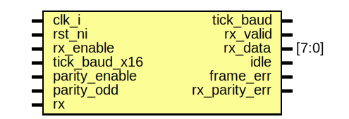

# Entity: uart_rx
## Diagram

## Description
Copyright lowRISC contributors.
 Licensed under the Apache License, Version 2.0, see LICENSE for details.
 SPDX-License-Identifier: Apache-2.0
 Description: UART Receive Module
 
## Ports
| Port name     | Direction | Type  | Description |
| ------------- | --------- | ----- | ----------- |
| clk_i         | input     |       |             |
| rst_ni        | input     |       |             |
| rx_enable     | input     |       |             |
| tick_baud_x16 | input     |       |             |
| parity_enable | input     |       |             |
| parity_odd    | input     |       |             |
| tick_baud     | output    |       |             |
| rx_valid      | output    |       |             |
| rx_data       | output    | [7:0] |             |
| idle          | output    |       |             |
| frame_err     | output    |       |             |
| rx_parity_err | output    |       |             |
| rx            | input     |       |             |
## Signals
| Name        | Type           | Description |
| ----------- | -------------- | ----------- |
| rx_valid_q  | logic          |             |
| sreg_q      | logic   [10:0] |             |
| sreg_d      | logic   [10:0] |             |
| bit_cnt_q   | logic    [3:0] |             |
| bit_cnt_d   | logic    [3:0] |             |
| baud_div_q  | logic    [3:0] |             |
| baud_div_d  | logic    [3:0] |             |
| tick_baud_d | logic          |             |
| tick_baud_q | logic          |             |
| idle_d      | logic          |             |
| idle_q      | logic          |             |
## Processes
- unnamed: _( @(posedge clk_i or negedge rst_ni) )_

- unnamed: _(  )_

- unnamed: _( @(posedge clk_i or negedge rst_ni) )_

