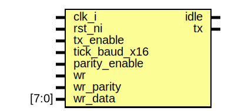

# Entity: uart_tx

## Diagram

## Description

Copyright lowRISC contributors.
 Licensed under the Apache License, Version 2.0, see LICENSE for details.
 SPDX-License-Identifier: Apache-2.0
 Description: UART Transmit Module
 
## Ports

| Port name     | Direction | Type  | Description |
| ------------- | --------- | ----- | ----------- |
| clk_i         | input     |       |             |
| rst_ni        | input     |       |             |
| tx_enable     | input     |       |             |
| tick_baud_x16 | input     |       |             |
| parity_enable | input     |       |             |
| wr            | input     |       |             |
| wr_parity     | input     |       |             |
| wr_data       | input     | [7:0] |             |
| idle          | output    |       |             |
| tx            | output    |       |             |
## Signals

| Name        | Type           | Description |
| ----------- | -------------- | ----------- |
| baud_div_q  | logic    [3:0] |             |
| tick_baud_q | logic          |             |
| bit_cnt_q   | logic    [3:0] |             |
| bit_cnt_d   | logic    [3:0] |             |
| sreg_q      | logic   [10:0] |             |
| sreg_d      | logic   [10:0] |             |
| tx_q        | logic          |             |
| tx_d        | logic          |             |
## Processes
- unnamed: ( @(posedge clk_i or negedge rst_ni) )
- unnamed: ( @(posedge clk_i or negedge rst_ni) )
- unnamed: (  )
