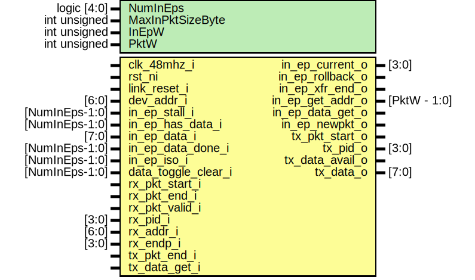

# Entity: usb_fs_nb_in_pe
## Diagram

## Description
Copyright lowRISC contributors.
 Copyright Luke Valenty (TinyFPGA project)
 Licensed under the Apache License, Version 2.0, see LICENSE for details.
 SPDX-License-Identifier: Apache-2.0
 USB Full Speed Non-Buffered Protocol Engine for IN endpoints
 Decode IN requests from host and respond with data if there is any
 Based on usb_fs_in_pe.v from the TinyFPGA-Bootloader project but
 this version contains no packet buffers
 
## Generics
| Generic name     | Type         | Value                    | Description       |
| ---------------- | ------------ | ------------------------ | ----------------- |
| NumInEps         | logic [4:0]  | 12                       |                   |
| MaxInPktSizeByte | int unsigned | 32                       |                   |
| InEpW            | int unsigned | $clog2(NumInEps)         | derived parameter |
| PktW             | int unsigned | $clog2(MaxInPktSizeByte) | derived parameter |
## Ports
| Port name           | Direction | Type           | Description                                      |
| ------------------- | --------- | -------------- | ------------------------------------------------ |
| clk_48mhz_i         | input     |                |                                                  |
| rst_ni              | input     |                |                                                  |
| link_reset_i        | input     |                |                                                  |
| dev_addr_i          | input     | [6:0]          |                                                  |
| in_ep_current_o     | output    | [3:0]          | Other signals addressed to this ep               |
| in_ep_rollback_o    | output    |                | Bad termination, rollback transaction            |
| in_ep_xfr_end_o     | output    |                | good termination, transaction complete           |
| in_ep_get_addr_o    | output    | [PktW - 1:0]   | Offset requested (0..pktlen)                     |
| in_ep_data_get_o    | output    |                | Accept data (get_addr advances too)              |
| in_ep_newpkt_o      | output    |                | New IN packet starting (updates in_ep_current_o) |
| in_ep_stall_i       | input     | [NumInEps-1:0] | Endpoint in a stall state                        |
| in_ep_has_data_i    | input     | [NumInEps-1:0] | Endpoint has data to supply                      |
| in_ep_data_i        | input     | [7:0]          | Data for current get_addr                        |
| in_ep_data_done_i   | input     | [NumInEps-1:0] | Set when out of data                             |
| in_ep_iso_i         | input     | [NumInEps-1:0] | Configure endpoint in isochronous mode           |
| data_toggle_clear_i | input     | [NumInEps-1:0] | Clear the data toggles for an EP                 |
| rx_pkt_start_i      | input     |                | Strobed on reception of packet.                  |
| rx_pkt_end_i        | input     |                |                                                  |
| rx_pkt_valid_i      | input     |                |                                                  |
| rx_pid_i            | input     | [3:0]          | Most recent packet received.                     |
| rx_addr_i           | input     | [6:0]          |                                                  |
| rx_endp_i           | input     | [3:0]          |                                                  |
| tx_pkt_start_o      | output    |                | Strobe to send new packet.                       |
| tx_pkt_end_i        | input     |                |                                                  |
| tx_pid_o            | output    | [3:0]          | Packet type to send                              |
| tx_data_avail_o     | output    |                | Data payload to send if any                      |
| tx_data_get_i       | input     |                |                                                  |
| tx_data_o           | output    | [7:0]          |                                                  |
## Signals
| Name                 | Type                 | Description                                                                                                                                                                                                                                       |
| -------------------- | -------------------- | ------------------------------------------------------------------------------------------------------------------------------------------------------------------------------------------------------------------------------------------------- |
| unused_1             | logic                | suppress warnings                                                                                                                                                                                                                                 |
| unused_2             | logic                | suppress warnings                                                                                                                                                                                                                                 |
| in_xfr_state         | state_in_e           |                                                                                                                                                                                                                                                   |
| in_xfr_state_next    | state_in_e           |                                                                                                                                                                                                                                                   |
| in_xfr_end           | logic                |                                                                                                                                                                                                                                                   |
| data_toggle_q        | logic [NumInEps-1:0] | data toggle state                                                                                                                                                                                                                                 |
| data_toggle_d        | logic [NumInEps-1:0] | data toggle state                                                                                                                                                                                                                                 |
| token_received       | logic                | endpoint data buffer                                                                                                                                                                                                                              |
| setup_token_received | logic                | endpoint data buffer                                                                                                                                                                                                                              |
| in_token_received    | logic                | endpoint data buffer                                                                                                                                                                                                                              |
| ack_received         | logic                | endpoint data buffer                                                                                                                                                                                                                              |
| more_data_to_send    | logic                |                                                                                                                                                                                                                                                   |
| ep_impl_d            | logic                |                                                                                                                                                                                                                                                   |
| ep_impl_q            | logic                |                                                                                                                                                                                                                                                   |
| in_ep_current_d      | logic [3:0]          |                                                                                                                                                                                                                                                   |
| rx_pid_type          | usb_pid_type_e       | More syntax so can compare with enum                                                                                                                                                                                                              |
| rx_pid               | usb_pid_e            |                                                                                                                                                                                                                                                   |
| in_ep_index          | logic [InEpW-1:0]    | Make widths work - in_ep_current_d/in_ep_current_o only hold implemented endpoint IDs. These signals can be used to index signals of NumInEps width. They are only valid if ep_impl_d/q are set, i.e., if the specified endpoint is implemented.  |
| in_ep_index_d        | logic [InEpW-1:0]    |                                                                                                                                                                                                                                                   |
| rollback_in_xfr      | logic                |                                                                                                                                                                                                                                                   |
## Constants
| Name  | Type         | Value                    | Description       |
| ----- | ------------ | ------------------------ | ----------------- |
| InEpW | int unsigned | $clog2(NumInEps)         | derived parameter |
| PktW  | int unsigned | $clog2(MaxInPktSizeByte) | derived parameter |
## Types
| Name       | Type                                                                           | Description |
| ---------- | ------------------------------------------------------------------------------ | ----------- |
| state_in_e | enum logic [1:0] {     StIdle,     StRcvdIn,     StSendData,     StWaitAck   } |             |
## Processes
- unnamed: _(  )_

- unnamed: _( @(posedge clk_48mhz_i or negedge rst_ni) )_

- unnamed: _( @(posedge clk_48mhz_i or negedge rst_ni) )_

- unnamed: _( @(posedge clk_48mhz_i or negedge rst_ni) )_

- unnamed: _( @(posedge clk_48mhz_i or negedge rst_ni) )_

- proc_data_toggle_d: _(  )_

- unnamed: _( @(posedge clk_48mhz_i or negedge rst_ni) )_

- unnamed: _( @(posedge clk_48mhz_i or negedge rst_ni) )_

