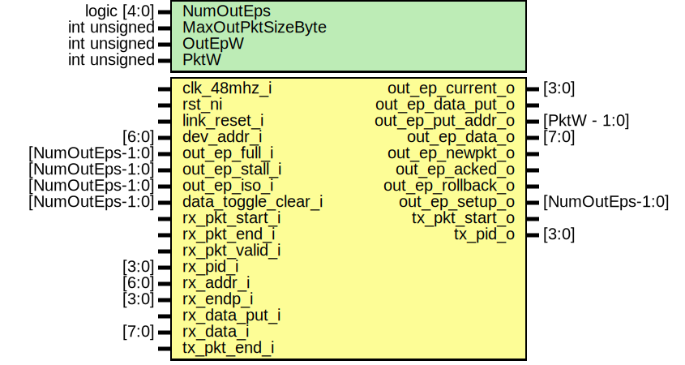

# Entity: usb_fs_nb_out_pe

- **File**: usb_fs_nb_out_pe.sv
## Diagram

## Description

Copyright lowRISC contributors.
 Copyright Luke Valenty (TinyFPGA project)
 Licensed under the Apache License, Version 2.0, see LICENSE for details.
 SPDX-License-Identifier: Apache-2.0
 USB Full Speed Non-Buffered Protocol Engine for OUT/SETUP endpoints
 Decode OUT/SETUP requests from host and accept data unless buffers are full
 (SETUP is a special form of OUT and starts a transaction sequence)
 Based on usb_fs_out_pe.v from the TinyFPGA-Bootloader project but
 this version contains no packet buffers
 
## Generics

| Generic name      | Type         | Value                     | Description       |
| ----------------- | ------------ | ------------------------- | ----------------- |
| NumOutEps         | logic [4:0]  | 2                         |                   |
| MaxOutPktSizeByte | int unsigned | 32                        |                   |
| OutEpW            | int unsigned | $clog2(NumOutEps)         | derived parameter |
| PktW              | int unsigned | $clog2(MaxOutPktSizeByte) | derived parameter |
## Ports

| Port name           | Direction | Type            | Description                                 |
| ------------------- | --------- | --------------- | ------------------------------------------- |
| clk_48mhz_i         | input     |                 |                                             |
| rst_ni              | input     |                 |                                             |
| link_reset_i        | input     |                 |                                             |
| dev_addr_i          | input     | [6:0]           |                                             |
| out_ep_current_o    | output    | [3:0]           | Other signals address to this ep,           |
| out_ep_data_put_o   | output    |                 | put the data (put addr advances after)      |
| out_ep_put_addr_o   | output    | [PktW - 1:0]    | Offset to put data (0..pktlen)              |
| out_ep_data_o       | output    | [7:0]           |                                             |
| out_ep_newpkt_o     | output    |                 | new packed, current was set                 |
| out_ep_acked_o      | output    |                 | good termination, device has acked          |
| out_ep_rollback_o   | output    |                 | bad termination, discard data               |
| out_ep_setup_o      | output    | [NumOutEps-1:0] |                                             |
| out_ep_full_i       | input     | [NumOutEps-1:0] | Cannot accept data                          |
| out_ep_stall_i      | input     | [NumOutEps-1:0] | Stalled                                     |
| out_ep_iso_i        | input     | [NumOutEps-1:0] | Configure endpoint in isochronous mode      |
| data_toggle_clear_i | input     | [NumOutEps-1:0] | Clear the data toggles for an EP            |
| rx_pkt_start_i      | input     |                 | Strobed on reception of packet.             |
| rx_pkt_end_i        | input     |                 |                                             |
| rx_pkt_valid_i      | input     |                 |                                             |
| rx_pid_i            | input     | [3:0]           | Most recent packet received.                |
| rx_addr_i           | input     | [6:0]           |                                             |
| rx_endp_i           | input     | [3:0]           |                                             |
| rx_data_put_i       | input     |                 | rx_data is pushed into endpoint controller. |
| rx_data_i           | input     | [7:0]           |                                             |
| tx_pkt_start_o      | output    |                 | Strobe to send new packet.                  |
| tx_pkt_end_i        | input     |                 |                                             |
| tx_pid_o            | output    | [3:0]           |                                             |
## Signals

| Name                     | Type                    | Description                                                                                                                                                                                                                                          |
| ------------------------ | ----------------------- | ---------------------------------------------------------------------------------------------------------------------------------------------------------------------------------------------------------------------------------------------------- |
| unused_1                 | logic                   | suppress warnings                                                                                                                                                                                                                                    |
| out_xfr_state            | state_out_e             |                                                                                                                                                                                                                                                      |
| out_xfr_state_next       | state_out_e             |                                                                                                                                                                                                                                                      |
| out_xfr_start            | logic                   |                                                                                                                                                                                                                                                      |
| new_pkt_end              | logic                   |                                                                                                                                                                                                                                                      |
| rollback_data            | logic                   |                                                                                                                                                                                                                                                      |
| nak_out_transfer         | logic                   | set when the endpoint buffer is unable to receive the out transfer                                                                                                                                                                                   |
| data_toggle_q            | logic [NumOutEps - 1:0] | data toggle state                                                                                                                                                                                                                                    |
| data_toggle_d            | logic [NumOutEps - 1:0] | data toggle state                                                                                                                                                                                                                                    |
| token_received           | logic                   | Decode the rx token                                                                                                                                                                                                                                  |
| out_token_received       | logic                   | Decode the rx token                                                                                                                                                                                                                                  |
| setup_token_received     | logic                   | Decode the rx token                                                                                                                                                                                                                                  |
| invalid_packet_received  | logic                   |                                                                                                                                                                                                                                                      |
| data_packet_received     | logic                   |                                                                                                                                                                                                                                                      |
| non_data_packet_received | logic                   |                                                                                                                                                                                                                                                      |
| bad_data_toggle          | logic                   |                                                                                                                                                                                                                                                      |
| ep_impl_d                | logic                   |                                                                                                                                                                                                                                                      |
| ep_impl_q                | logic                   |                                                                                                                                                                                                                                                      |
| out_ep_current_d         | logic [3:0]             |                                                                                                                                                                                                                                                      |
| current_xfer_setup_q     | logic                   | 1: If the current transfer is a SETUP, 0: OUT                                                                                                                                                                                                        |
| rx_pid_type              | usb_pid_type_e          | More syntax so can compare with enum                                                                                                                                                                                                                 |
| rx_pid                   | usb_pid_e               |                                                                                                                                                                                                                                                      |
| out_ep_index             | logic [OutEpW-1:0]      | Make widths work - out_ep_current_d/out_ep_current_o only hold implemented endpoint IDs. These signals can be used to index signals of NumOutEps width. They are only valid if ep_impl_d/q are set, i.e., if the specified endpoint is implemented.  |
| out_ep_index_d           | logic [OutEpW-1:0]      |                                                                                                                                                                                                                                                      |
| increment_addr           | logic                   | address increment whenever there is a data put unless -- already going to NAK transaction and replay things -- the address is at max packet size NOTE if more than max packet size received then data is lost                                        |
## Constants

| Name   | Type         | Value                     | Description       |
| ------ | ------------ | ------------------------- | ----------------- |
| OutEpW | int unsigned | $clog2(NumOutEps)         | derived parameter |
| PktW   | int unsigned | $clog2(MaxOutPktSizeByte) | derived parameter |
## Types

| Name        | Type                                                                                                                                                                                                                                                                                               | Description |
| ----------- | -------------------------------------------------------------------------------------------------------------------------------------------------------------------------------------------------------------------------------------------------------------------------------------------------- | ----------- |
| state_out_e | enum logic [2:0] {      StIdle,      StRcvdOut,      StRcvdDataStart,      StRcvdDataEnd,      StRcvdIsoDataEnd   } |             |
## Processes
- unnamed: ( @(posedge clk_48mhz_i or negedge rst_ni) )
- unnamed: ( @(posedge clk_48mhz_i or negedge rst_ni) )
- unnamed: (  )
- unnamed: ( @(posedge clk_48mhz_i or negedge rst_ni) )
- proc_data_toggle_d: (  )
- unnamed: ( @(posedge clk_48mhz_i or negedge rst_ni) )
- unnamed: ( @(posedge clk_48mhz_i or negedge rst_ni) )
- unnamed: ( @(posedge clk_48mhz_i or negedge rst_ni) )
**Description**
put data strobe follows the rx strobe (which will latch the data)

- unnamed: ( @(posedge clk_48mhz_i or negedge rst_ni) )
**Description**
nack an OUT if any data comes in with the endpoint full
Note that if there is a full size packet buffer this will only be all or nothing
but in the case there was a FIFO with less than a max packet size free you
could get lucky and the packet received be small and fit with no need to NAK

- unnamed: ( @(posedge clk_48mhz_i or negedge rst_ni) )
