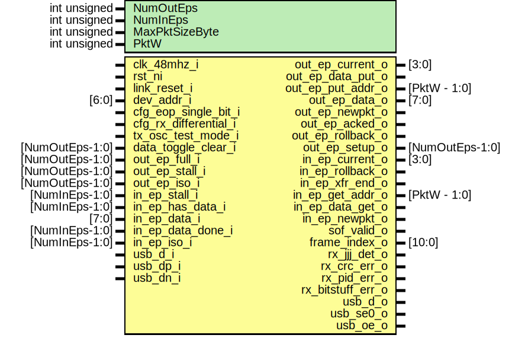

# Entity: usb_fs_nb_pe

## Diagram

## Description

Copyright lowRISC contributors.
 Copyright Luke Valenty (TinyFPGA project)
 Licensed under the Apache License, Version 2.0, see LICENSE for details.
 SPDX-License-Identifier: Apache-2.0
 USB Full Speed Non-Buffered Protocol Engine
 Decodes low level USB link protocol from external usb_fs_tx/rx
 Provides upper level with
 - OUT endpoint interface (host to device) which also covers SETUP
 - IN endpoint interface (device to host)
 - Start of Frame interface
 Based on usb_fs_pe.v from the TinyFPGA-Bootloader project but
 this version contains no packet buffers
 
## Generics

| Generic name   | Type         | Value                  | Description       |
| -------------- | ------------ | ---------------------- | ----------------- |
| NumOutEps      | int unsigned | 2                      |                   |
| NumInEps       | int unsigned | 2                      |                   |
| MaxPktSizeByte | int unsigned | 32                     |                   |
| PktW           | int unsigned | $clog2(MaxPktSizeByte) | derived parameter |
## Ports

| Port name             | Direction | Type            | Description                                     |
| --------------------- | --------- | --------------- | ----------------------------------------------- |
| clk_48mhz_i           | input     |                 |                                                 |
| rst_ni                | input     |                 | Async. reset, active low                        |
| link_reset_i          | input     |                 | USB reset, sync to 48 MHz, active high          |
| dev_addr_i            | input     | [6:0]           |                                                 |
| cfg_eop_single_bit_i  | input     |                 | 1: detect a single SE0 bit as EOP               |
| cfg_rx_differential_i | input     |                 | 1: use differential rx data on usb_d_i          |
| tx_osc_test_mode_i    | input     |                 | Oscillator test mode (constantly output JK)     |
| data_toggle_clear_i   | input     | [NumOutEps-1:0] | Clear the data toggles for an EP                |
| out_ep_current_o      | output    | [3:0]           | Other signals address to this ep                |
| out_ep_data_put_o     | output    |                 | put the data (put addr advances after)          |
| out_ep_put_addr_o     | output    | [PktW - 1:0]    | Offset to put data (0..pktlen)                  |
| out_ep_data_o         | output    | [7:0]           |                                                 |
| out_ep_newpkt_o       | output    |                 | New OUT pkt start (with in_ep_current_o update) |
| out_ep_acked_o        | output    |                 | good termination, device has acked              |
| out_ep_rollback_o     | output    |                 | bad termination, discard data                   |
| out_ep_setup_o        | output    | [NumOutEps-1:0] |                                                 |
| out_ep_full_i         | input     | [NumOutEps-1:0] | Cannot accept data                              |
| out_ep_stall_i        | input     | [NumOutEps-1:0] | Stalled                                         |
| out_ep_iso_i          | input     | [NumOutEps-1:0] | Configure endpoint in isochronous mode          |
| in_ep_current_o       | output    | [3:0]           | Other signals addressed to this ep              |
| in_ep_rollback_o      | output    |                 | Bad termination, rollback transaction           |
| in_ep_xfr_end_o       | output    |                 | good termination, transaction complete          |
| in_ep_get_addr_o      | output    | [PktW - 1:0]    | Offset requested (0..pktlen)                    |
| in_ep_data_get_o      | output    |                 | Accept data (get_addr advances too)             |
| in_ep_newpkt_o        | output    |                 | New IN pkt start (with in_ep_current_o update)  |
| in_ep_stall_i         | input     | [NumInEps-1:0]  | Endpoint in a stall state                       |
| in_ep_has_data_i      | input     | [NumInEps-1:0]  | Endpoint has data to supply                     |
| in_ep_data_i          | input     | [7:0]           | Data for current get_addr                       |
| in_ep_data_done_i     | input     | [NumInEps-1:0]  | Set when out of data                            |
| in_ep_iso_i           | input     | [NumInEps-1:0]  | Configure endpoint in isochronous mode          |
| sof_valid_o           | output    |                 | sof interface                                   |
| frame_index_o         | output    | [10:0]          |                                                 |
| rx_jjj_det_o          | output    |                 | RX line status                                  |
| rx_crc_err_o          | output    |                 | RX errors                                       |
| rx_pid_err_o          | output    |                 |                                                 |
| rx_bitstuff_err_o     | output    |                 |                                                 |
| usb_d_i               | input     |                 |                                                 |
| usb_dp_i              | input     |                 |                                                 |
| usb_dn_i              | input     |                 |                                                 |
| usb_d_o               | output    |                 |                                                 |
| usb_se0_o             | output    |                 |                                                 |
| usb_oe_o              | output    |                 |                                                 |
## Signals

| Name             | Type         | Description   |
| ---------------- | ------------ | ------------- |
| bit_strobe       | logic        | rx interface  |
| rx_pkt_start     | logic        |               |
| rx_pkt_end       | logic        |               |
| rx_pid           | logic [3:0]  |               |
| rx_addr          | logic [6:0]  |               |
| rx_endp          | logic [3:0]  |               |
| rx_frame_num     | logic [10:0] |               |
| rx_data_put      | logic        |               |
| rx_data          | logic [7:0]  |               |
| rx_pkt_valid     | logic        |               |
| in_tx_pkt_start  | logic        | tx mux        |
| in_tx_pid        | logic [3:0]  |               |
| out_tx_pkt_start | logic        |               |
| out_tx_pid       | logic [3:0]  |               |
| tx_pkt_start     | logic        | tx interface  |
| tx_pkt_end       | logic        |               |
| tx_pid           | logic [3:0]  |               |
| tx_data_avail    | logic        |               |
| tx_data_get      | logic        |               |
| tx_data          | logic [7:0]  |               |
| usb_oe           | logic        |               |
## Constants

| Name | Type         | Value                  | Description       |
| ---- | ------------ | ---------------------- | ----------------- |
| PktW | int unsigned | $clog2(MaxPktSizeByte) | derived parameter |
## Instantiations

- u_usb_fs_nb_in_pe: usb_fs_nb_in_pe
- u_usb_fs_nb_out_pe: usb_fs_nb_out_pe
- u_usb_fs_rx: usb_fs_rx
- u_usb_fs_tx_mux: usb_fs_tx_mux
- u_usb_fs_tx: usb_fs_tx
