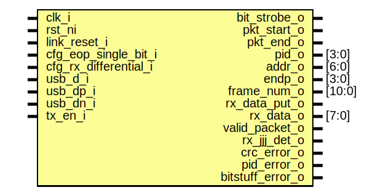

# Entity: usb_fs_rx

- **File**: usb_fs_rx.sv
## Diagram

## Description

 Copyright lowRISC contributors.
 Copyright ETH Zurich.
 Copyright Luke Valenty (TinyFPGA project, https://github.com/tinyfpga/TinyFPGA-Bootloader).
 Licensed under the Apache License, Version 2.0, see LICENSE for details.
 SPDX-License-Identifier: Apache-2.0

## Ports

| Port name             | Direction | Type   | Description                                                                 |
| --------------------- | --------- | ------ | --------------------------------------------------------------------------- |
| clk_i                 | input     |        |  A 48MHz clock is required to recover the clock from the incoming data.     |
| rst_ni                | input     |        |                                                                             |
| link_reset_i          | input     |        |                                                                             |
| cfg_eop_single_bit_i  | input     |        |  configuration                                                              |
| cfg_rx_differential_i | input     |        |                                                                             |
| usb_d_i               | input     |        |  USB data+ and data- lines (synchronous)                                    |
| usb_dp_i              | input     |        |                                                                             |
| usb_dn_i              | input     |        |                                                                             |
| tx_en_i               | input     |        |  Transmit enable disables the receier                                       |
| bit_strobe_o          | output    |        |  pulse on every bit transition.                                             |
| pkt_start_o           | output    |        |  Pulse on beginning of new packet.                                          |
| pkt_end_o             | output    |        |  Pulse on end of current packet.                                            |
| pid_o                 | output    | [3:0]  |  Most recent packet decoded.                                                |
| addr_o                | output    | [6:0]  |                                                                             |
| endp_o                | output    | [3:0]  |                                                                             |
| frame_num_o           | output    | [10:0] |                                                                             |
| rx_data_put_o         | output    |        |  Pulse on valid data on rx_data.                                            |
| rx_data_o             | output    | [7:0]  |                                                                             |
| valid_packet_o        | output    |        |  Most recent packet passes PID and CRC checks                               |
| rx_jjj_det_o          | output    |        |  line status for the status detection (actual rx bits after clock recovery) |
| crc_error_o           | output    |        |  Error detection                                                            |
| pid_error_o           | output    |        |                                                                             |
| bitstuff_error_o      | output    |        |                                                                             |
## Signals

| Name                | Type         | Description                                                                                                                                                                                                                                                                                                                                                                                                                                                                                                                                                                                                                                                                                                                                                                                                                                                                                                                                                                                                                                                                                                                                                                                                                                                                                                                                                                                                                                                                                                                                |
| ------------------- | ------------ | ------------------------------------------------------------------------------------------------------------------------------------------------------------------------------------------------------------------------------------------------------------------------------------------------------------------------------------------------------------------------------------------------------------------------------------------------------------------------------------------------------------------------------------------------------------------------------------------------------------------------------------------------------------------------------------------------------------------------------------------------------------------------------------------------------------------------------------------------------------------------------------------------------------------------------------------------------------------------------------------------------------------------------------------------------------------------------------------------------------------------------------------------------------------------------------------------------------------------------------------------------------------------------------------------------------------------------------------------------------------------------------------------------------------------------------------------------------------------------------------------------------------------------------------ |
| bitstuff_history_q  | logic [6:0]  |                                                                                                                                                                                                                                                                                                                                                                                                                                                                                                                                                                                                                                                                                                                                                                                                                                                                                                                                                                                                                                                                                                                                                                                                                                                                                                                                                                                                                                                                                                                                            |
| bitstuff_history_d  | logic [6:0]  |                                                                                                                                                                                                                                                                                                                                                                                                                                                                                                                                                                                                                                                                                                                                                                                                                                                                                                                                                                                                                                                                                                                                                                                                                                                                                                                                                                                                                                                                                                                                            |
| bitstuff_error      | logic        |                                                                                                                                                                                                                                                                                                                                                                                                                                                                                                                                                                                                                                                                                                                                                                                                                                                                                                                                                                                                                                                                                                                                                                                                                                                                                                                                                                                                                                                                                                                                            |
| bitstuff_error_q    | logic        |                                                                                                                                                                                                                                                                                                                                                                                                                                                                                                                                                                                                                                                                                                                                                                                                                                                                                                                                                                                                                                                                                                                                                                                                                                                                                                                                                                                                                                                                                                                                            |
| bitstuff_error_d    | logic        |                                                                                                                                                                                                                                                                                                                                                                                                                                                                                                                                                                                                                                                                                                                                                                                                                                                                                                                                                                                                                                                                                                                                                                                                                                                                                                                                                                                                                                                                                                                                            |
| line_state_qq       | logic [2:0]  | ////////////////////  usb receive path // //////////////////// /////////////////////////////////////  line state recovery state machine // /////////////////////////////////////  If the receive path is set not to use a differential reciever:  There is a chance that one of the differential pairs will appear to have  changed to the new state while the other is still in the old state.  the  following state machine detects transitions and waits an extra sampling clock  before decoding the state on the differential pair.  this transition period  will only ever last for one clock as long as there is no noise on the line.  if there is enough noise on the line then the data may be corrupted and the  packet will fail the data integrity checks.  If the receive path uses a differential receiver:  The single ended signals must still be recovered to detect SE0  Note that the spec warns in section 7.1.4.1:  Both D+ and D- may temporarily be less than VIH (min) during differential  signal transitions. This period can be up to 14 ns (TFST) for full-speed  transitions and up to 210 ns (TLST) for low-speed transitions. Logic in the  receiver must ensure that that this is not interpreted as an SE0.  Since the 48MHz sample clock is 20.833ns period we will either miss this or  sample it only once, so it will be covered by line_state=DT and the next  sample will not be SE0 unless this was a real SE0 transition  Note: if it is a real SE0 the differential rx could be doing anything  |
| line_state_q        | logic [2:0]  | ////////////////////  usb receive path // //////////////////// /////////////////////////////////////  line state recovery state machine // /////////////////////////////////////  If the receive path is set not to use a differential reciever:  There is a chance that one of the differential pairs will appear to have  changed to the new state while the other is still in the old state.  the  following state machine detects transitions and waits an extra sampling clock  before decoding the state on the differential pair.  this transition period  will only ever last for one clock as long as there is no noise on the line.  if there is enough noise on the line then the data may be corrupted and the  packet will fail the data integrity checks.  If the receive path uses a differential receiver:  The single ended signals must still be recovered to detect SE0  Note that the spec warns in section 7.1.4.1:  Both D+ and D- may temporarily be less than VIH (min) during differential  signal transitions. This period can be up to 14 ns (TFST) for full-speed  transitions and up to 210 ns (TLST) for low-speed transitions. Logic in the  receiver must ensure that that this is not interpreted as an SE0.  Since the 48MHz sample clock is 20.833ns period we will either miss this or  sample it only once, so it will be covered by line_state=DT and the next  sample will not be SE0 unless this was a real SE0 transition  Note: if it is a real SE0 the differential rx could be doing anything  |
| line_state_d        | logic [2:0]  | ////////////////////  usb receive path // //////////////////// /////////////////////////////////////  line state recovery state machine // /////////////////////////////////////  If the receive path is set not to use a differential reciever:  There is a chance that one of the differential pairs will appear to have  changed to the new state while the other is still in the old state.  the  following state machine detects transitions and waits an extra sampling clock  before decoding the state on the differential pair.  this transition period  will only ever last for one clock as long as there is no noise on the line.  if there is enough noise on the line then the data may be corrupted and the  packet will fail the data integrity checks.  If the receive path uses a differential receiver:  The single ended signals must still be recovered to detect SE0  Note that the spec warns in section 7.1.4.1:  Both D+ and D- may temporarily be less than VIH (min) during differential  signal transitions. This period can be up to 14 ns (TFST) for full-speed  transitions and up to 210 ns (TLST) for low-speed transitions. Logic in the  receiver must ensure that that this is not interpreted as an SE0.  Since the 48MHz sample clock is 20.833ns period we will either miss this or  sample it only once, so it will be covered by line_state=DT and the next  sample will not be SE0 unless this was a real SE0 transition  Note: if it is a real SE0 the differential rx could be doing anything  |
| diff_state_q        | logic [2:0]  |                                                                                                                                                                                                                                                                                                                                                                                                                                                                                                                                                                                                                                                                                                                                                                                                                                                                                                                                                                                                                                                                                                                                                                                                                                                                                                                                                                                                                                                                                                                                            |
| diff_state_d        | logic [2:0]  |                                                                                                                                                                                                                                                                                                                                                                                                                                                                                                                                                                                                                                                                                                                                                                                                                                                                                                                                                                                                                                                                                                                                                                                                                                                                                                                                                                                                                                                                                                                                            |
| line_state_rx       | logic [2:0]  |                                                                                                                                                                                                                                                                                                                                                                                                                                                                                                                                                                                                                                                                                                                                                                                                                                                                                                                                                                                                                                                                                                                                                                                                                                                                                                                                                                                                                                                                                                                                            |
| use_se              | logic        |                                                                                                                                                                                                                                                                                                                                                                                                                                                                                                                                                                                                                                                                                                                                                                                                                                                                                                                                                                                                                                                                                                                                                                                                                                                                                                                                                                                                                                                                                                                                            |
| dpair               | logic [1:0]  |  localparam logic [2:0] SE1 = 3'b011; // single-ended 1 - illegal  Mute the input if we're transmitting                                                                                                                                                                                                                                                                                                                                                                                                                                                                                                                                                                                                                                                                                                                                                                                                                                                                                                                                                                                                                                                                                                                                                                                                                                                                                                                                                                                                                                    |
| ddiff               | logic [1:0]  |  localparam logic [2:0] SE1 = 3'b011; // single-ended 1 - illegal  Mute the input if we're transmitting                                                                                                                                                                                                                                                                                                                                                                                                                                                                                                                                                                                                                                                                                                                                                                                                                                                                                                                                                                                                                                                                                                                                                                                                                                                                                                                                                                                                                                    |
| bit_phase_q         | logic [1:0]  | //////////////////  clock recovery // //////////////////  the DT state from the line state recovery state machine is used to align to  transmit clock.  the line state is sampled in the middle of the bit time.  example of signal relationships  -------------------------------  line_state        DT  DJ  DJ  DJ  DT  DK  DK  DK  DK  DK  DK  DT  DJ  DJ  DJ  line_state_valid  ________----____________----____________----________----____  bit_phase         0   0   1   2   3   0   1   2   3   0   1   2   0   1   2                                                                                                                                                                                                                                                                                                                                                                                                                                                                                                                                                                                                                                                                                                                                                                                                                                                                                                                                                                                                              |
| bit_phase_d         | logic [1:0]  | //////////////////  clock recovery // //////////////////  the DT state from the line state recovery state machine is used to align to  transmit clock.  the line state is sampled in the middle of the bit time.  example of signal relationships  -------------------------------  line_state        DT  DJ  DJ  DJ  DT  DK  DK  DK  DK  DK  DK  DT  DJ  DJ  DJ  line_state_valid  ________----____________----____________----________----____  bit_phase         0   0   1   2   3   0   1   2   3   0   1   2   0   1   2                                                                                                                                                                                                                                                                                                                                                                                                                                                                                                                                                                                                                                                                                                                                                                                                                                                                                                                                                                                                              |
| line_state_valid    | logic        |                                                                                                                                                                                                                                                                                                                                                                                                                                                                                                                                                                                                                                                                                                                                                                                                                                                                                                                                                                                                                                                                                                                                                                                                                                                                                                                                                                                                                                                                                                                                            |
| line_history_q      | logic [11:0] | ////////////////////  packet detection // ////////////////////  usb uses a sync to denote the beginning of a packet and two single-ended-0 to  denote the end of a packet.  this state machine recognizes the beginning and  end of packets for subsequent layers to process.                                                                                                                                                                                                                                                                                                                                                                                                                                                                                                                                                                                                                                                                                                                                                                                                                                                                                                                                                                                                                                                                                                                                                                                                                                                              |
| line_history_d      | logic [11:0] | ////////////////////  packet detection // ////////////////////  usb uses a sync to denote the beginning of a packet and two single-ended-0 to  denote the end of a packet.  this state machine recognizes the beginning and  end of packets for subsequent layers to process.                                                                                                                                                                                                                                                                                                                                                                                                                                                                                                                                                                                                                                                                                                                                                                                                                                                                                                                                                                                                                                                                                                                                                                                                                                                              |
| packet_valid_q      | logic        |                                                                                                                                                                                                                                                                                                                                                                                                                                                                                                                                                                                                                                                                                                                                                                                                                                                                                                                                                                                                                                                                                                                                                                                                                                                                                                                                                                                                                                                                                                                                            |
| packet_valid_d      | logic        |                                                                                                                                                                                                                                                                                                                                                                                                                                                                                                                                                                                                                                                                                                                                                                                                                                                                                                                                                                                                                                                                                                                                                                                                                                                                                                                                                                                                                                                                                                                                            |
| see_eop             | logic        |                                                                                                                                                                                                                                                                                                                                                                                                                                                                                                                                                                                                                                                                                                                                                                                                                                                                                                                                                                                                                                                                                                                                                                                                                                                                                                                                                                                                                                                                                                                                            |
| packet_start        | logic        |                                                                                                                                                                                                                                                                                                                                                                                                                                                                                                                                                                                                                                                                                                                                                                                                                                                                                                                                                                                                                                                                                                                                                                                                                                                                                                                                                                                                                                                                                                                                            |
| packet_end          | logic        |                                                                                                                                                                                                                                                                                                                                                                                                                                                                                                                                                                                                                                                                                                                                                                                                                                                                                                                                                                                                                                                                                                                                                                                                                                                                                                                                                                                                                                                                                                                                            |
| dvalid_raw          | logic        |  three Js ///////////////  NRZI decode // ///////////////  in order to ensure there are enough bit transitions for a receiver to recover  the clock usb uses NRZI encoding.  https://en.wikipedia.org/wiki/Non-return-to-zero                                                                                                                                                                                                                                                                                                                                                                                                                                                                                                                                                                                                                                                                                                                                                                                                                                                                                                                                                                                                                                                                                                                                                                                                                                                                                                              |
| din                 | logic        |                                                                                                                                                                                                                                                                                                                                                                                                                                                                                                                                                                                                                                                                                                                                                                                                                                                                                                                                                                                                                                                                                                                                                                                                                                                                                                                                                                                                                                                                                                                                            |
| dvalid              | logic        |                                                                                                                                                                                                                                                                                                                                                                                                                                                                                                                                                                                                                                                                                                                                                                                                                                                                                                                                                                                                                                                                                                                                                                                                                                                                                                                                                                                                                                                                                                                                            |
| full_pid_q          | logic [8:0]  | //////////////////////  save and check pid // //////////////////////  shift in the entire 8-bit pid with an additional 9th bit used as a sentinal.                                                                                                                                                                                                                                                                                                                                                                                                                                                                                                                                                                                                                                                                                                                                                                                                                                                                                                                                                                                                                                                                                                                                                                                                                                                                                                                                                                                         |
| full_pid_d          | logic [8:0]  | //////////////////////  save and check pid // //////////////////////  shift in the entire 8-bit pid with an additional 9th bit used as a sentinal.                                                                                                                                                                                                                                                                                                                                                                                                                                                                                                                                                                                                                                                                                                                                                                                                                                                                                                                                                                                                                                                                                                                                                                                                                                                                                                                                                                                         |
| pid_valid           | logic        |                                                                                                                                                                                                                                                                                                                                                                                                                                                                                                                                                                                                                                                                                                                                                                                                                                                                                                                                                                                                                                                                                                                                                                                                                                                                                                                                                                                                                                                                                                                                            |
| pid_complete        | logic        |                                                                                                                                                                                                                                                                                                                                                                                                                                                                                                                                                                                                                                                                                                                                                                                                                                                                                                                                                                                                                                                                                                                                                                                                                                                                                                                                                                                                                                                                                                                                            |
| crc5_q              | logic [4:0]  | //////////////  check crc5 // //////////////                                                                                                                                                                                                                                                                                                                                                                                                                                                                                                                                                                                                                                                                                                                                                                                                                                                                                                                                                                                                                                                                                                                                                                                                                                                                                                                                                                                                                                                                                               |
| crc5_d              | logic [4:0]  | //////////////  check crc5 // //////////////                                                                                                                                                                                                                                                                                                                                                                                                                                                                                                                                                                                                                                                                                                                                                                                                                                                                                                                                                                                                                                                                                                                                                                                                                                                                                                                                                                                                                                                                                               |
| crc5_valid          | logic        |                                                                                                                                                                                                                                                                                                                                                                                                                                                                                                                                                                                                                                                                                                                                                                                                                                                                                                                                                                                                                                                                                                                                                                                                                                                                                                                                                                                                                                                                                                                                            |
| crc5_invert         | logic        |                                                                                                                                                                                                                                                                                                                                                                                                                                                                                                                                                                                                                                                                                                                                                                                                                                                                                                                                                                                                                                                                                                                                                                                                                                                                                                                                                                                                                                                                                                                                            |
| crc16_q             | logic [15:0] | ///////////////  check crc16 // ///////////////                                                                                                                                                                                                                                                                                                                                                                                                                                                                                                                                                                                                                                                                                                                                                                                                                                                                                                                                                                                                                                                                                                                                                                                                                                                                                                                                                                                                                                                                                            |
| crc16_d             | logic [15:0] | ///////////////  check crc16 // ///////////////                                                                                                                                                                                                                                                                                                                                                                                                                                                                                                                                                                                                                                                                                                                                                                                                                                                                                                                                                                                                                                                                                                                                                                                                                                                                                                                                                                                                                                                                                            |
| crc16_valid         | logic        |                                                                                                                                                                                                                                                                                                                                                                                                                                                                                                                                                                                                                                                                                                                                                                                                                                                                                                                                                                                                                                                                                                                                                                                                                                                                                                                                                                                                                                                                                                                                            |
| crc16_invert        | logic        |                                                                                                                                                                                                                                                                                                                                                                                                                                                                                                                                                                                                                                                                                                                                                                                                                                                                                                                                                                                                                                                                                                                                                                                                                                                                                                                                                                                                                                                                                                                                            |
| pkt_is_token        | logic        | //////////////////////////  output control signals // //////////////////////////                                                                                                                                                                                                                                                                                                                                                                                                                                                                                                                                                                                                                                                                                                                                                                                                                                                                                                                                                                                                                                                                                                                                                                                                                                                                                                                                                                                                                                                           |
| pkt_is_data         | logic        | //////////////////////////  output control signals // //////////////////////////                                                                                                                                                                                                                                                                                                                                                                                                                                                                                                                                                                                                                                                                                                                                                                                                                                                                                                                                                                                                                                                                                                                                                                                                                                                                                                                                                                                                                                                           |
| pkt_is_handshake    | logic        | //////////////////////////  output control signals // //////////////////////////                                                                                                                                                                                                                                                                                                                                                                                                                                                                                                                                                                                                                                                                                                                                                                                                                                                                                                                                                                                                                                                                                                                                                                                                                                                                                                                                                                                                                                                           |
| token_payload_q     | logic [11:0] |                                                                                                                                                                                                                                                                                                                                                                                                                                                                                                                                                                                                                                                                                                                                                                                                                                                                                                                                                                                                                                                                                                                                                                                                                                                                                                                                                                                                                                                                                                                                            |
| token_payload_d     | logic [11:0] |                                                                                                                                                                                                                                                                                                                                                                                                                                                                                                                                                                                                                                                                                                                                                                                                                                                                                                                                                                                                                                                                                                                                                                                                                                                                                                                                                                                                                                                                                                                                            |
| token_payload_done  | logic        |                                                                                                                                                                                                                                                                                                                                                                                                                                                                                                                                                                                                                                                                                                                                                                                                                                                                                                                                                                                                                                                                                                                                                                                                                                                                                                                                                                                                                                                                                                                                            |
| addr_q              | logic [6:0]  |                                                                                                                                                                                                                                                                                                                                                                                                                                                                                                                                                                                                                                                                                                                                                                                                                                                                                                                                                                                                                                                                                                                                                                                                                                                                                                                                                                                                                                                                                                                                            |
| addr_d              | logic [6:0]  |                                                                                                                                                                                                                                                                                                                                                                                                                                                                                                                                                                                                                                                                                                                                                                                                                                                                                                                                                                                                                                                                                                                                                                                                                                                                                                                                                                                                                                                                                                                                            |
| endp_q              | logic [3:0]  |                                                                                                                                                                                                                                                                                                                                                                                                                                                                                                                                                                                                                                                                                                                                                                                                                                                                                                                                                                                                                                                                                                                                                                                                                                                                                                                                                                                                                                                                                                                                            |
| endp_d              | logic [3:0]  |                                                                                                                                                                                                                                                                                                                                                                                                                                                                                                                                                                                                                                                                                                                                                                                                                                                                                                                                                                                                                                                                                                                                                                                                                                                                                                                                                                                                                                                                                                                                            |
| frame_num_q         | logic [10:0] |                                                                                                                                                                                                                                                                                                                                                                                                                                                                                                                                                                                                                                                                                                                                                                                                                                                                                                                                                                                                                                                                                                                                                                                                                                                                                                                                                                                                                                                                                                                                            |
| frame_num_d         | logic [10:0] |                                                                                                                                                                                                                                                                                                                                                                                                                                                                                                                                                                                                                                                                                                                                                                                                                                                                                                                                                                                                                                                                                                                                                                                                                                                                                                                                                                                                                                                                                                                                            |
| rx_data_buffer_q    | logic [8:0]  | ///////////////////////////////  deserialize and output data // /////////////////////////////// assign rx_data_put = dvalid && pid_complete && pkt_is_data;                                                                                                                                                                                                                                                                                                                                                                                                                                                                                                                                                                                                                                                                                                                                                                                                                                                                                                                                                                                                                                                                                                                                                                                                                                                                                                                                                                                |
| rx_data_buffer_d    | logic [8:0]  | ///////////////////////////////  deserialize and output data // /////////////////////////////// assign rx_data_put = dvalid && pid_complete && pkt_is_data;                                                                                                                                                                                                                                                                                                                                                                                                                                                                                                                                                                                                                                                                                                                                                                                                                                                                                                                                                                                                                                                                                                                                                                                                                                                                                                                                                                                |
| rx_data_buffer_full | logic        |                                                                                                                                                                                                                                                                                                                                                                                                                                                                                                                                                                                                                                                                                                                                                                                                                                                                                                                                                                                                                                                                                                                                                                                                                                                                                                                                                                                                                                                                                                                                            |
## Constants

| Name | Type        | Value  | Description                                 |
| ---- | ----------- | ------ | ------------------------------------------- |
| DT   | logic [2:0] | 3'b100 | transition state                            |
| DJ   | logic [2:0] | 3'b010 | J - idle line state                         |
| DK   | logic [2:0] | 3'b001 | K - inverse of J                            |
| SE0  | logic [2:0] | 3'b000 | single-ended 0 - end of packet or detached  |
## Processes
- proc_dpair_mute: (  )
  - **Type:** always_comb
- proc_line_state_q: ( @(posedge clk_i or negedge rst_ni) )
  - **Type:** always_ff
- proc_line_state_d: (  )
  - **Type:** always_comb
- proc_diff_state_d: (  )
  - **Type:** always_comb
- proc_bit_phase_q: ( @(posedge clk_i or negedge rst_ni) )
  - **Type:** always_ff
- proc_packet_valid_d: (  )
  - **Type:** always_comb
- proc_reg_pkt_line: ( @(posedge clk_i or negedge rst_ni) )
  - **Type:** always_ff
- unnamed: (  )
  - **Type:** always_comb
- proc_bitstuff_history_d: (  )
  - **Type:** always_comb
 **Description**
////////////////////////////////////////////////////  Undo bit stuffing and detect bit stuffing errors // //////////////////////////////////////////////////// 
- proc_bitstuff_history_q: ( @(posedge clk_i or negedge rst_ni) )
  - **Type:** always_ff
- proc_bistuff_error_d: (  )
  - **Type:** always_comb
 **Description**
 remember the bitstuff errors 
- proc_bitstuff_error_q: ( @(posedge clk_i or negedge rst_ni) )
  - **Type:** always_ff
- proc_full_pid_d: (  )
  - **Type:** always_comb
- unnamed: (  )
  - **Type:** always_comb
- unnamed: (  )
  - **Type:** always_comb
- unnamed: (  )
  - **Type:** always_comb
- unnamed: (  )
  - **Type:** always_comb
- unnamed: (  )
  - **Type:** always_comb
- proc_gp_regs: ( @(posedge clk_i or negedge rst_ni) )
  - **Type:** always_ff
 **Description**
/////////////  Registers // ///////////// 
