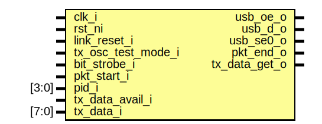

# Entity: usb_fs_tx
## Diagram

## Description
Copyright lowRISC contributors.
 Copyright ETH Zurich.
 Copyright Luke Valenty (TinyFPGA project, https://github.com/tinyfpga/TinyFPGA-Bootloader).
 Licensed under the Apache License, Version 2.0, see LICENSE for details.
 SPDX-License-Identifier: Apache-2.0
 
## Ports
| Port name          | Direction | Type  | Description                                                                                      |
| ------------------ | --------- | ----- | ------------------------------------------------------------------------------------------------ |
| clk_i              | input     |       | A 48MHz clock is required to receive USB data at 12MHzit's simpler to juse use 48MHz everywhere  |
| rst_ni             | input     |       | asyc reset                                                                                       |
| link_reset_i       | input     |       | USB reset, sync to 48 MHz, active high                                                           |
| tx_osc_test_mode_i | input     |       | Oscillator test mode (constantly output JK)                                                      |
| bit_strobe_i       | input     |       | bit strobe from rx to align with senders clock                                                   |
| usb_oe_o           | output    |       | output enable to take ownership of bus and data out                                              |
| usb_d_o            | output    |       |                                                                                                  |
| usb_se0_o          | output    |       |                                                                                                  |
| pkt_start_i        | input     |       | pulse to initiate new packet transmission                                                        |
| pkt_end_o          | output    |       |                                                                                                  |
| pid_i              | input     | [3:0] | pid_i to send                                                                                    |
| tx_data_avail_i    | input     |       | tx logic pulls data until there is nothing available                                             |
| tx_data_get_o      | output    |       |                                                                                                  |
| tx_data_i          | input     | [7:0] |                                                                                                  |
## Signals
| Name             | Type         | Description |
| ---------------- | ------------ | ----------- |
| pid_q            | logic [3:0]  |             |
| pid_d            | logic [3:0]  |             |
| bitstuff         | logic        |             |
| bitstuff_q       | logic        |             |
| bitstuff_q2      | logic        |             |
| bitstuff_q3      | logic        |             |
| bitstuff_q4      | logic        |             |
| bit_history      | logic [5:0]  |             |
| state_d          | state_e      |             |
| state_q          | state_e      |             |
| out_state_d      | out_state_e  |             |
| out_state_q      | out_state_e  |             |
| data_shift_reg_q | logic [7:0]  |             |
| data_shift_reg_d | logic [7:0]  |             |
| oe_shift_reg_q   | logic [7:0]  |             |
| oe_shift_reg_d   | logic [7:0]  |             |
| se0_shift_reg_q  | logic [7:0]  |             |
| se0_shift_reg_d  | logic [7:0]  |             |
| data_payload_q   | logic        |             |
| data_payload_d   | logic        |             |
| tx_data_get_q    | logic        |             |
| tx_data_get_d    | logic        |             |
| byte_strobe_q    | logic        |             |
| byte_strobe_d    | logic        |             |
| bit_history_d    | logic [4:0]  |             |
| bit_history_q    | logic [4:0]  |             |
| bit_count_d      | logic [2:0]  |             |
| bit_count_q      | logic [2:0]  |             |
| crc16_d          | logic [15:0] |             |
| crc16_q          | logic [15:0] |             |
| oe_q             | logic        |             |
| oe_d             | logic        |             |
| usb_d_q          | logic        |             |
| usb_d_d          | logic        |             |
| usb_se0_q        | logic        |             |
| usb_se0_d        | logic        |             |
| dp_eop_q         | logic [2:0]  |             |
| dp_eop_d         | logic [2:0]  |             |
| test_mode_start  | logic        |             |
| serial_tx_data   | logic        |             |
| serial_tx_oe     | logic        |             |
| serial_tx_se0    | logic        |             |
| crc16_invert     | logic        |             |
| pkt_end          | logic        |             |
| out_nrzi_en      | logic        |             |
## Types
| Name        | Type                                                                   | Description |
| ----------- | ---------------------------------------------------------------------- | ----------- |
| state_e     | enum logic [2:0] {Idle, Sync, Pid, DataOrCrc160, Crc161, Eop, OscTest} |             |
| out_state_e | enum logic [1:0] {OsIdle, OsWaitByte, OsTransmit}                      |             |
## Processes
- proc_pid: _( @(posedge clk_i or negedge rst_ni) )_
save packet parameters at pkt_start_i

**Description**
save packet parameters at pkt_start_i

- proc_bitstuff: _( @(posedge clk_i or negedge rst_ni) )_

- proc_fsm: _(  )_

- proc_byte_str: _(  )_

- proc_crc16: _(  )_

- proc_reg: _( @(posedge clk_i or negedge rst_ni) )_

- proc_out_fsm: _(  )_
Output FSM

**Description**
Output FSM

- proc_diff: _(  )_

- proc_diff_reg: _( @(posedge clk_i or negedge rst_ni) )_

