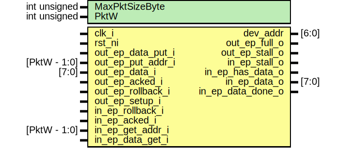

# Entity: usb_serial_ctrl_ep

- **File**: usb_serial_ctrl_ep.sv
## Diagram

## Description

 Copyright lowRISC contributors.
 Copyright Luke Valenty (TinyFPGA project)
 Licensed under the Apache License, Version 2.0, see LICENSE for details.
 SPDX-License-Identifier: Apache-2.0

 Converted from common/usb_serial_ctrl_ep.v
 -- move from CDC to Google simple serial protocol
 -- conform to lowRISC coding style

## Generics

| Generic name   | Type         | Value                  | Description          |
| -------------- | ------------ | ---------------------- | -------------------- |
| MaxPktSizeByte | int unsigned | 32                     |                      |
| PktW           | int unsigned | $clog2(MaxPktSizeByte) |  Derived parameters  |
## Ports

| Port name         | Direction | Type         | Description                                                                      |
| ----------------- | --------- | ------------ | -------------------------------------------------------------------------------- |
| clk_i             | input     |              |                                                                                  |
| rst_ni            | input     |              |                                                                                  |
| dev_addr          | output    | [6:0]        |                                                                                  |
| out_ep_data_put_i | input     |              | ////////////////////////// out endpoint interface // //////////////////////////  |
| out_ep_put_addr_i | input     | [PktW - 1:0] |                                                                                  |
| out_ep_data_i     | input     | [7:0]        |                                                                                  |
| out_ep_acked_i    | input     |              |                                                                                  |
| out_ep_rollback_i | input     |              |                                                                                  |
| out_ep_setup_i    | input     |              |                                                                                  |
| out_ep_full_o     | output    |              |                                                                                  |
| out_ep_stall_o    | output    |              |                                                                                  |
| in_ep_rollback_i  | input     |              | ///////////////////////// in endpoint interface // /////////////////////////     |
| in_ep_acked_i     | input     |              |                                                                                  |
| in_ep_get_addr_i  | input     | [PktW - 1:0] |                                                                                  |
| in_ep_data_get_i  | input     |              |                                                                                  |
| in_ep_stall_o     | output    |              |                                                                                  |
| in_ep_has_data_o  | output    |              |                                                                                  |
| in_ep_data_o      | output    | [7:0]        |                                                                                  |
| in_ep_data_done_o | output    |              |                                                                                  |
## Signals

| Name                      | Type                | Description                                                                                                    |
| ------------------------- | ------------------- | -------------------------------------------------------------------------------------------------------------- |
| unused_1                  | logic               |  suppress errors                                                                                               |
| unused_2                  | logic [PktW-1:0]    |                                                                                                                |
| ctrl_xfr_state            | state_ctrl_xfr_e    |                                                                                                                |
| ctrl_xfr_state_next       | state_ctrl_xfr_e    |                                                                                                                |
| setup_stage_end           | logic               |                                                                                                                |
| status_stage_end          | logic               |                                                                                                                |
| send_zero_length_data_pkt | logic               |                                                                                                                |
| dev_addr_int              | logic [6:0]         |  the default control endpoint gets assigned the device address                                                 |
| new_dev_addr              | logic [6:0]         |                                                                                                                |
| pkt_start                 | logic               |  keep track of new out data start and end                                                                      |
| pkt_end                   | logic               |                                                                                                                |
| bmRequestType             | logic [7:0]         |  need to record the 8 bytes of setup data                                                                      |
| raw_setup_data            | logic [7:0]         |  need to record the 8 bytes of setup data                                                                      |
| bRequest                  | usb_setup_request_e |  Alias for the setup bytes using names from USB spec                                                           |
| wValue                    | logic [15:0]        |                                                                                                                |
| wLength                   | logic [15:0]        |                                                                                                                |
| wIndex                    | logic [15:0]        |                                                                                                                |
| setup_pkt_start           | logic               |                                                                                                                |
| has_data_stage            | logic               |                                                                                                                |
| out_data_stage            | logic               |                                                                                                                |
| in_data_stage             | logic               |                                                                                                                |
| bytes_sent                | logic [7:0]         |                                                                                                                |
| rom_length                | logic [6:0]         |                                                                                                                |
| all_data_sent             | logic               |                                                                                                                |
| more_data_to_send         | logic               |                                                                                                                |
| in_data_transfer_done     | logic               |                                                                                                                |
| rom_addr                  | logic [6:0]         |                                                                                                                |
| save_dev_addr             | logic               |                                                                                                                |
| unused_bmR                | logic [6:0]         |  suppress warning                                                                                              |
| unused_wValue             | logic               |                                                                                                                |
| unused_wIndex             | logic [15:0]        |                                                                                                                |
| dscr_type                 | usb_dscr_type_e     |  Send setup data (which will be empty in case of a SET operation and  come from the ROM in the case of a GET)  |
## Constants

| Name | Type         | Value                  | Description          |
| ---- | ------------ | ---------------------- | -------------------- |
| PktW | int unsigned | $clog2(MaxPktSizeByte) |  Derived parameters  |
## Types

| Name             | Type                                                                                                                                                                                                                                                                                                                                                                                          | Description                           |
| ---------------- | --------------------------------------------------------------------------------------------------------------------------------------------------------------------------------------------------------------------------------------------------------------------------------------------------------------------------------------------------------------------------------------------- | ------------------------------------- |
| state_ctrl_xfr_e | enum logic [2:0] {      StIdle      = 3'h0,      StSetup     = 3'h1,      StDataIn    = 3'h2,      StDataOut   = 3'h3,      StStatusIn  = 3'h4,      StStatusOut = 3'h5   } |  State machine for control transfers  |
## Processes
- unnamed: (  )
  - **Type:** always_comb
**Description**
//////////////////////////////////  control transfer state machine // ////////////////////////////////// 
- unnamed: ( @(posedge clk_i or negedge rst_ni) )
  - **Type:** always_ff
- unnamed: ( @(posedge clk_i) )
  - **Type:** always_ff
**Description**
 Check of upper put_addr bits needed because CRC will be sent (10 bytes total) 
- unnamed: ( @(posedge clk_i or negedge rst_ni) )
  - **Type:** always_ff
- unnamed: (  )
  - **Type:** always_comb
## Instantiations

- detect_in_data_transfer_done: rising_edge_detector
