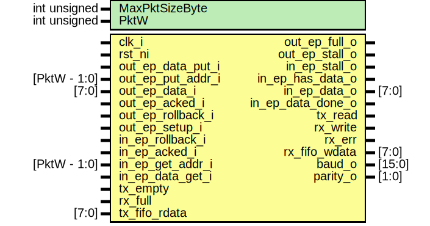

# Entity: usb_serial_fifo_ep

- **File**: usb_serial_fifo_ep.sv
## Diagram

## Description

 Copyright lowRISC contributors.
 Copyright Luke Valenty (TinyFPGA project)
 Licensed under the Apache License, Version 2.0, see LICENSE for details.
 SPDX-License-Identifier: Apache-2.0

## Generics

| Generic name   | Type         | Value                  | Description          |
| -------------- | ------------ | ---------------------- | -------------------- |
| MaxPktSizeByte | int unsigned | 32                     |                      |
| PktW           | int unsigned | $clog2(MaxPktSizeByte) |  Derived parameters  |
## Ports

| Port name         | Direction | Type         | Description             |
| ----------------- | --------- | ------------ | ----------------------- |
| clk_i             | input     |              |                         |
| rst_ni            | input     |              |                         |
| out_ep_data_put_i | input     |              |  out endpoint interface |
| out_ep_put_addr_i | input     | [PktW - 1:0] |                         |
| out_ep_data_i     | input     | [7:0]        |                         |
| out_ep_acked_i    | input     |              |                         |
| out_ep_rollback_i | input     |              |                         |
| out_ep_setup_i    | input     |              |                         |
| out_ep_full_o     | output    |              |                         |
| out_ep_stall_o    | output    |              |                         |
| in_ep_rollback_i  | input     |              |  in endpoint interface  |
| in_ep_acked_i     | input     |              |                         |
| in_ep_get_addr_i  | input     | [PktW - 1:0] |                         |
| in_ep_data_get_i  | input     |              |                         |
| in_ep_stall_o     | output    |              |                         |
| in_ep_has_data_o  | output    |              |                         |
| in_ep_data_o      | output    | [7:0]        |                         |
| in_ep_data_done_o | output    |              |                         |
| tx_empty          | input     |              |  fifo interface         |
| rx_full           | input     |              |                         |
| tx_read           | output    |              |                         |
| rx_write          | output    |              |                         |
| rx_err            | output    |              | Signals fifo overflow   |
| rx_fifo_wdata     | output    | [7:0]        |                         |
| tx_fifo_rdata     | input     | [7:0]        |                         |
| baud_o            | output    | [15:0]       |  information            |
| parity_o          | output    | [1:0]        |                         |
## Signals

| Name                      | Type               | Description                                                                                                                                                                                                                                                                   |
| ------------------------- | ------------------ | ----------------------------------------------------------------------------------------------------------------------------------------------------------------------------------------------------------------------------------------------------------------------------- |
| do_setup                  | logic              |                                                                                                                                                                                                                                                                               |
| in_setup_data             | logic [7:0]        |                                                                                                                                                                                                                                                                               |
| in_setup_has_data         | logic              |                                                                                                                                                                                                                                                                               |
| in_setup_data_done        | logic              |                                                                                                                                                                                                                                                                               |
| unused_1                  | logic              |  suppress errors                                                                                                                                                                                                                                                              |
| out_pkt_buffer            | logic [7:0]        | //////////////////////////////////////  OUT endpoint (from usb to rx_fifo) // //////////////////////////////////////  In future probably better to eliminate this buffer and add rollback to async FIFO  Will receive the 2 bytes of CRC, so may get MAX_PACKET_SIZE+2 bytes  |
| ob_rptr                   | logic [PktW - 1:0] |                                                                                                                                                                                                                                                                               |
| ob_max_used               | logic [PktW:0]     |                                                                                                                                                                                                                                                                               |
| ob_unload                 | logic              |                                                                                                                                                                                                                                                                               |
| in_pkt_buffer             | logic [7:0]        | /////////////////////////////////////  IN endpoint (from tx_fifo to usb) // /////////////////////////////////////  packet buffer to allow rollback in the case of a NAK                                                                                                       |
| pb_wptr                   | logic [PktW:0]     |                                                                                                                                                                                                                                                                               |
| pb_freeze                 | logic              |                                                                                                                                                                                                                                                                               |
| pb_done                   | logic              |                                                                                                                                                                                                                                                                               |
| pb_rdata                  | logic [7:0]        |                                                                                                                                                                                                                                                                               |
| ctrl_xfr_state            | state_ctrl_xfr_e   |                                                                                                                                                                                                                                                                               |
| ctrl_xfr_state_next       | state_ctrl_xfr_e   |                                                                                                                                                                                                                                                                               |
| setup_stage_end           | logic              |                                                                                                                                                                                                                                                                               |
| status_stage_end          | logic              |                                                                                                                                                                                                                                                                               |
| send_zero_length_data_pkt | logic              |                                                                                                                                                                                                                                                                               |
| pkt_start                 | logic              |  keep track of new out data start and end                                                                                                                                                                                                                                     |
| pkt_end                   | logic              |                                                                                                                                                                                                                                                                               |
| bmRequestType             | logic [7:0]        |  Record the 8 bytes of setup data  setup_data_addr[3] protects in case of overlong packet                                                                                                                                                                                     |
| raw_setup_data            | logic [7:0]        |  Record the 8 bytes of setup data  setup_data_addr[3] protects in case of overlong packet                                                                                                                                                                                     |
| bRequest                  | logic [7:0]        |  Alias for the setup bytes using names from USB spec                                                                                                                                                                                                                          |
| wValue                    | logic [15:0]       |                                                                                                                                                                                                                                                                               |
| wLength                   | logic [15:0]       |                                                                                                                                                                                                                                                                               |
| wIndex                    | logic [15:0]       |                                                                                                                                                                                                                                                                               |
| setup_pkt_start           | logic              |                                                                                                                                                                                                                                                                               |
| has_data_stage            | logic              |                                                                                                                                                                                                                                                                               |
| out_data_stage            | logic              |                                                                                                                                                                                                                                                                               |
| in_data_stage             | logic              |                                                                                                                                                                                                                                                                               |
| bytes_sent                | logic [1:0]        |                                                                                                                                                                                                                                                                               |
| send_length               | logic [1:0]        |                                                                                                                                                                                                                                                                               |
| all_data_sent             | logic              |                                                                                                                                                                                                                                                                               |
| more_data_to_send         | logic              |                                                                                                                                                                                                                                                                               |
| in_data_transfer_done     | logic              |                                                                                                                                                                                                                                                                               |
| unused_bmR                | logic [6:0]        |  Suppress warnings                                                                                                                                                                                                                                                            |
| unused_wIndex             | logic [15:0]       |                                                                                                                                                                                                                                                                               |
| return_data               | logic [15:0]       |  Send setup data (which will be empty in case of a SET operation)  Tried to optimize by reusing the raw_setup_data storage but  it seems hard to do that and meet style of only assign in one always_ff  and only use if/else so 16 extra flops                               |
## Constants

| Name | Type         | Value                  | Description          |
| ---- | ------------ | ---------------------- | -------------------- |
| PktW | int unsigned | $clog2(MaxPktSizeByte) |  Derived parameters  |
## Types

| Name             | Type                                                                                                                                                                                                                                                                                                                                                                                          | Description                                                                                                                                                                        |
| ---------------- | --------------------------------------------------------------------------------------------------------------------------------------------------------------------------------------------------------------------------------------------------------------------------------------------------------------------------------------------------------------------------------------------- | ---------------------------------------------------------------------------------------------------------------------------------------------------------------------------------- |
| state_ctrl_xfr_e | enum logic [2:0] {      StIdle      = 3'h0,      StSetup     = 3'h1,      StDataIn    = 3'h2,      StDataOut   = 3'h3,      StStatusIn  = 3'h4,      StStatusOut = 3'h5   } | //////////////////////////////////////////////  SETUP endpoint (configure baud and parity) // //////////////////////////////////////////////  State machine for control transfers  |
## Processes
- unnamed: ( @(posedge clk_i) )
  - **Type:** always_ff
- unnamed: ( @(posedge clk_i or negedge rst_ni) )
  - **Type:** always_ff
- unnamed: ( @(posedge clk_i or negedge rst_ni) )
  - **Type:** always_ff
- unnamed: ( @(posedge clk_i or negedge rst_ni) )
  - **Type:** always_ff
**Description**
always_ff @(posedge clk_i or negedge rst_ni) begin   if (!rst_ni) begin     pb_freeze <= 0;   end else begin     if (pb_done && ~in_ep_acked_i) begin       pb_freeze <= 1;     end else if (~do_setup && in_ep_acked_i) begin       pb_freeze <= 0;     end   end end 
- unnamed: ( @(posedge clk_i or negedge rst_ni) )
  - **Type:** always_ff
- unnamed: (  )
  - **Type:** always_comb
**Description**
//////////////////////////////////  control transfer state machine // ////////////////////////////////// 
- unnamed: ( @(posedge clk_i or negedge rst_ni) )
  - **Type:** always_ff
- unnamed: ( @(posedge clk_i) )
  - **Type:** always_ff
**Description**
 Check of upper put_addr bits needed because CRC will be sent (10 bytes total) 
- unnamed: ( @(posedge clk_i or negedge rst_ni) )
  - **Type:** always_ff
## Instantiations

- detect_in_data_transfer_done: rising_edge_detector
