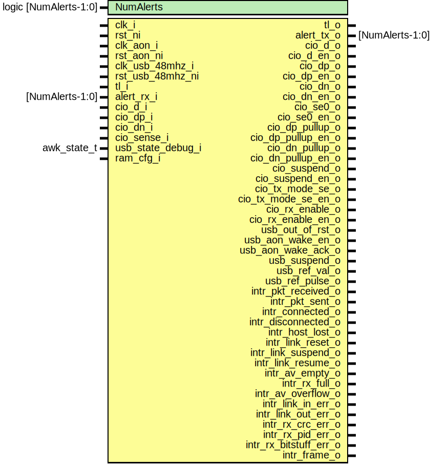

# Entity: usbdev

- **File**: usbdev.sv
## Diagram

## Description

 Copyright lowRISC contributors.
 Licensed under the Apache License, Version 2.0, see LICENSE for details.
 SPDX-License-Identifier: Apache-2.0

 USB Full-Speed Device Interface (usbdev).

## Generics

| Generic name | Type                  | Value     | Description |
| ------------ | --------------------- | --------- | ----------- |
| NumAlerts    | logic [NumAlerts-1:0] | undefined |             |
## Ports

| Port name              | Direction | Type            | Description                                                  |
| ---------------------- | --------- | --------------- | ------------------------------------------------------------ |
| clk_i                  | input     |                 |                                                              |
| rst_ni                 | input     |                 |                                                              |
| clk_aon_i              | input     |                 |                                                              |
| rst_aon_ni             | input     |                 |                                                              |
| clk_usb_48mhz_i        | input     |                 | use usb_ prefix for signals in this clk                      |
| rst_usb_48mhz_ni       | input     |                 | async reset, with relase sync to clk_usb_48_mhz_i            |
| tl_i                   | input     |                 |  Register interface                                          |
| tl_o                   | output    |                 |                                                              |
| alert_rx_i             | input     | [NumAlerts-1:0] |  Alerts                                                      |
| alert_tx_o             | output    | [NumAlerts-1:0] |                                                              |
| cio_d_i                | input     |                 | differential                                                 |
| cio_dp_i               | input     |                 | single-ended, can be used in differential mode to detect SE0 |
| cio_dn_i               | input     |                 | single-ended, can be used in differential mode to detect SE0 |
| cio_d_o                | output    |                 |  Data outputs                                                |
| cio_d_en_o             | output    |                 |                                                              |
| cio_dp_o               | output    |                 |                                                              |
| cio_dp_en_o            | output    |                 |                                                              |
| cio_dn_o               | output    |                 |                                                              |
| cio_dn_en_o            | output    |                 |                                                              |
| cio_sense_i            | input     |                 |  Non-data I/O                                                |
| cio_se0_o              | output    |                 |                                                              |
| cio_se0_en_o           | output    |                 |                                                              |
| cio_dp_pullup_o        | output    |                 |                                                              |
| cio_dp_pullup_en_o     | output    |                 |                                                              |
| cio_dn_pullup_o        | output    |                 |                                                              |
| cio_dn_pullup_en_o     | output    |                 |                                                              |
| cio_suspend_o          | output    |                 |                                                              |
| cio_suspend_en_o       | output    |                 |                                                              |
| cio_tx_mode_se_o       | output    |                 |                                                              |
| cio_tx_mode_se_en_o    | output    |                 |                                                              |
| cio_rx_enable_o        | output    |                 |                                                              |
| cio_rx_enable_en_o     | output    |                 |                                                              |
| usb_out_of_rst_o       | output    |                 |  Direct pinmux aon detect connections                        |
| usb_aon_wake_en_o      | output    |                 |                                                              |
| usb_aon_wake_ack_o     | output    |                 |                                                              |
| usb_suspend_o          | output    |                 |                                                              |
| usb_state_debug_i      | input     | awk_state_t     |  Debug info from wakeup module                               |
| usb_ref_val_o          | output    |                 |  SOF reference for clock calibration                         |
| usb_ref_pulse_o        | output    |                 |                                                              |
| ram_cfg_i              | input     |                 |  memory configuration                                        |
| intr_pkt_received_o    | output    |                 | Packet received                                              |
| intr_pkt_sent_o        | output    |                 | Packet sent                                                  |
| intr_connected_o       | output    |                 |                                                              |
| intr_disconnected_o    | output    |                 |                                                              |
| intr_host_lost_o       | output    |                 |                                                              |
| intr_link_reset_o      | output    |                 |                                                              |
| intr_link_suspend_o    | output    |                 |                                                              |
| intr_link_resume_o     | output    |                 |                                                              |
| intr_av_empty_o        | output    |                 |                                                              |
| intr_rx_full_o         | output    |                 |                                                              |
| intr_av_overflow_o     | output    |                 |                                                              |
| intr_link_in_err_o     | output    |                 |                                                              |
| intr_link_out_err_o    | output    |                 |                                                              |
| intr_rx_crc_err_o      | output    |                 |                                                              |
| intr_rx_pid_err_o      | output    |                 |                                                              |
| intr_rx_bitstuff_err_o | output    |                 |                                                              |
| intr_frame_o           | output    |                 |                                                              |
## Signals

| Name                      | Type                      | Description                                                                                                              |
| ------------------------- | ------------------------- | ------------------------------------------------------------------------------------------------------------------------ |
| reg2hw                    | usbdev_reg2hw_t           |                                                                                                                          |
| hw2reg                    | usbdev_hw2reg_t           |                                                                                                                          |
| tl_sram_h2d               | tlul_pkg::tl_h2d_t        |                                                                                                                          |
| tl_sram_d2h               | tlul_pkg::tl_d2h_t        |                                                                                                                          |
| mem_a_req                 | logic                     |  Dual-port SRAM Interface: Refer prim_ram_2p_async_adv.sv                                                                |
| mem_a_write               | logic                     |                                                                                                                          |
| mem_a_addr                | logic [SramAw-1:0]        |                                                                                                                          |
| mem_a_wdata               | logic [SramDw-1:0]        |                                                                                                                          |
| mem_a_rvalid              | logic                     |                                                                                                                          |
| mem_a_rdata               | logic [SramDw-1:0]        |                                                                                                                          |
| mem_a_rerror              | logic [1:0]               |                                                                                                                          |
| usb_mem_b_req             | logic                     |                                                                                                                          |
| usb_mem_b_write           | logic                     |                                                                                                                          |
| usb_mem_b_addr            | logic [SramAw-1:0]        |                                                                                                                          |
| usb_mem_b_wdata           | logic [SramDw-1:0]        |                                                                                                                          |
| usb_mem_b_rdata           | logic [SramDw-1:0]        |                                                                                                                          |
| usb_clr_devaddr           | logic                     |                                                                                                                          |
| usb_event_av_empty        | logic                     |                                                                                                                          |
| event_av_overflow         | logic                     |                                                                                                                          |
| usb_event_rx_full         | logic                     |                                                                                                                          |
| event_av_empty            | logic                     |                                                                                                                          |
| event_rx_full             | logic                     |                                                                                                                          |
| usb_event_link_reset      | logic                     |                                                                                                                          |
| usb_event_link_suspend    | logic                     |                                                                                                                          |
| usb_event_link_resume     | logic                     |                                                                                                                          |
| usb_event_host_lost       | logic                     |                                                                                                                          |
| usb_event_disconnect      | logic                     |                                                                                                                          |
| usb_event_connect         | logic                     |                                                                                                                          |
| usb_event_rx_crc_err      | logic                     |                                                                                                                          |
| usb_event_rx_pid_err      | logic                     |                                                                                                                          |
| usb_event_rx_bitstuff_err | logic                     |                                                                                                                          |
| usb_event_in_err          | logic                     |                                                                                                                          |
| usb_event_out_err         | logic                     |                                                                                                                          |
| usb_event_frame           | logic                     |                                                                                                                          |
| usb_link_active           | logic                     |                                                                                                                          |
| event_link_reset          | logic                     |                                                                                                                          |
| event_link_suspend        | logic                     |                                                                                                                          |
| event_link_resume         | logic                     |                                                                                                                          |
| event_host_lost           | logic                     |                                                                                                                          |
| event_disconnect          | logic                     |                                                                                                                          |
| event_connect             | logic                     |                                                                                                                          |
| event_rx_crc_err          | logic                     |                                                                                                                          |
| event_rx_pid_err          | logic                     |                                                                                                                          |
| event_rx_bitstuff_err     | logic                     |                                                                                                                          |
| event_in_err              | logic                     |                                                                                                                          |
| event_out_err             | logic                     |                                                                                                                          |
| event_frame               | logic                     |                                                                                                                          |
| usb_frame                 | logic [10:0]              |  CDC signals                                                                                                             |
| usb_link_state            | logic [2:0]               |                                                                                                                          |
| usb_enable                | logic                     |                                                                                                                          |
| usb_device_addr           | logic [6:0]               |                                                                                                                          |
| data_toggle_clear_qe      | logic                     |                                                                                                                          |
| usb_data_toggle_clear_en  | logic                     |                                                                                                                          |
| usb_data_toggle_clear     | logic [NEndpoints-1:0]    |                                                                                                                          |
| usb_rx_d                  | logic                     | ///////////////////////////////  USB RX after CDC & muxing   // ///////////////////////////////                          |
| usb_rx_dp                 | logic                     |                                                                                                                          |
| usb_rx_dn                 | logic                     |                                                                                                                          |
| usb_tx_d                  | logic                     | ///////////////////////////////  USB TX after CDC & muxing   // ///////////////////////////////                          |
| usb_tx_se0                | logic                     |                                                                                                                          |
| usb_tx_oe                 | logic                     |                                                                                                                          |
| usb_pwr_sense             | logic                     | ///////////////////////////////  USB contol pins after CDC   // ///////////////////////////////                          |
| usb_pullup_en             | logic                     |                                                                                                                          |
| av_fifo_wready            | logic                     | ///////////////////////////  Receive interface fifos // ///////////////////////////                                      |
| event_pkt_received        | logic                     |                                                                                                                          |
| usb_av_rvalid             | logic                     |                                                                                                                          |
| usb_av_rready             | logic                     |                                                                                                                          |
| usb_rx_wvalid             | logic                     |                                                                                                                          |
| usb_rx_wready             | logic                     |                                                                                                                          |
| rx_fifo_rvalid            | logic                     |                                                                                                                          |
| rx_fifo_re                | logic                     |                                                                                                                          |
| usb_av_rdata              | logic [AVFifoWidth - 1:0] |                                                                                                                          |
| usb_rx_wdata              | logic [RXFifoWidth - 1:0] |                                                                                                                          |
| rx_rdata_raw              | logic [RXFifoWidth - 1:0] |                                                                                                                          |
| rx_rdata                  | logic [RXFifoWidth - 1:0] |                                                                                                                          |
| unused_rxfifo_q           | logic [16:0]              |  The rxfifo register is hrw, but we just need the read enables.                                                          |
| usb_in_buf                | logic [NBufWidth-1:0]     | //////////////////////////////////  IN (Transmit) interface config // //////////////////////////////////                 |
| usb_in_size               | logic [SizeWidth:0]       |                                                                                                                          |
| usb_in_endpoint           | logic [3:0]               |                                                                                                                          |
| usb_in_endpoint_val       | logic                     |                                                                                                                          |
| usb_in_rdy                | logic [NEndpoints-1:0]    |                                                                                                                          |
| clear_rdybit              | logic [NEndpoints-1:0]    |                                                                                                                          |
| set_sentbit               | logic [NEndpoints-1:0]    |                                                                                                                          |
| update_pend               | logic [NEndpoints-1:0]    |                                                                                                                          |
| usb_setup_received        | logic                     |                                                                                                                          |
| setup_received            | logic                     |                                                                                                                          |
| usb_set_sent              | logic                     |                                                                                                                          |
| set_sent                  | logic                     |                                                                                                                          |
| ep_iso                    | logic [NEndpoints-1:0]    |                                                                                                                          |
| enable_setup              | logic [NEndpoints-1:0]    |                                                                                                                          |
| enable_out                | logic [NEndpoints-1:0]    |                                                                                                                          |
| ep_stall                  | logic [NEndpoints-1:0]    |                                                                                                                          |
| usb_enable_setup          | logic [NEndpoints-1:0]    |                                                                                                                          |
| usb_enable_out            | logic [NEndpoints-1:0]    |                                                                                                                          |
| usb_ep_stall              | logic [NEndpoints-1:0]    |                                                                                                                          |
| in_rdy_async              | logic [NEndpoints-1:0]    |                                                                                                                          |
| usb_out_endpoint          | logic [3:0]               |                                                                                                                          |
| usb_out_endpoint_val      | logic                     |                                                                                                                          |
| event_link_reset_q        | logic                     |                                                                                                                          |
| alert_test                | logic [NumAlerts-1:0]     |                                                                                                                          |
| alerts                    | logic [NumAlerts-1:0]     |                                                                                                                          |
| cio_oe                    | logic                     | ///////////////////////////////  USB IO Muxing               // ///////////////////////////////                          |
| usb_ref_val_d             | logic                     | ///////////////////////////////////////  SOF Reference for Clock Calibration // ///////////////////////////////////////  |
| usb_ref_val_q             | logic                     | ///////////////////////////////////////  SOF Reference for Clock Calibration // ///////////////////////////////////////  |
| usb_ref_disable           | logic                     |                                                                                                                          |
| aon_tgl                   | logic                     | ///////////////////////////////////////  capture async debug info            // ///////////////////////////////////////  |
| tgl_sync                  | logic                     |                                                                                                                          |
| tgl_sync_d1               | logic                     |                                                                                                                          |
| tgl_en                    | logic                     |                                                                                                                          |
## Constants

| Name           | Type | Value                                       | Description                                                                |
| -------------- | ---- | ------------------------------------------- | -------------------------------------------------------------------------- |
| SramDw         | int  | 32                                          | Places packing bytes to SRAM assume this                                   |
| SramDepth      | int  | 512                                         | 2kB, SRAM Width is DW                                                      |
| MaxPktSizeByte | int  | 64                                          |                                                                            |
| SramAw         | int  | $clog2(SramDepth)                           |                                                                            |
| SizeWidth      | int  | $clog2(MaxPktSizeByte)                      |                                                                            |
| NBuf           | int  | undefined                                   |                                                                            |
| NBufWidth      | int  | $clog2(NBuf)                                |                                                                            |
| AVFifoWidth    | int  | NBufWidth                                   |  AV fifo just stores buffer numbers                                        |
| AVFifoDepth    | int  | 4                                           |                                                                            |
| RXFifoWidth    | int  | NBufWidth + (1+SizeWidth)         +  4  + 1 |  RX fifo stores              buf# +  size(0-MaxPktSizeByte)  + EP# + Type  |
| RXFifoDepth    | int  | 4                                           |                                                                            |
## Processes
- proc_map_rxenable: (  )
  - **Type:** always_comb
**Description**
 RX enables 
- proc_map_stall: (  )
  - **Type:** always_comb
**Description**
 STALL for both directions 
- proc_map_iso: (  )
  - **Type:** always_comb
**Description**
 CDC: ok, quasi-static 
- proc_map_buf_size: (  )
  - **Type:** always_comb
**Description**
 CDC: flop_2sync for ready bit covers others so assigns are ok 
- proc_map_rdy_reg2hw: (  )
  - **Type:** always_comb
- proc_data_toggle_clear_qe: (  )
  - **Type:** always_comb
**Description**
 CDC: We synchronize the qe (write pulse) and assume that the  rest of the register remains stable 
- proc_usb_data_toggle_clear: (  )
  - **Type:** always_comb
- unnamed: (  )
  - **Type:** always_comb
- proc_map_sent: (  )
  - **Type:** always_comb
- unnamed: ( @(posedge clk_usb_48mhz_i or negedge rst_usb_48mhz_ni) )
  - **Type:** always_ff
- unnamed: (  )
  - **Type:** always_comb
- proc_map_rdy_hw2reg: (  )
  - **Type:** always_comb
- proc_map_pend: (  )
  - **Type:** always_comb
**Description**
 Update the pending bit by copying the ready bit that is about to clear 
- proc_stall_tieoff: (  )
  - **Type:** always_comb
**Description**
 Clear the stall flag when a SETUP is received  CDC: usb_out_endpoint is synchronized implicitly by  setup_received, as it is stable 
- unnamed: ( @(posedge clk_usb_48mhz_i or negedge rst_usb_48mhz_ni) )
  - **Type:** always_ff
- unnamed: ( @(posedge clk_i or negedge rst_ni) )
  - **Type:** always_ff
**Description**
///////////////////////////////////////  USB aon detector signaling          // /////////////////////////////////////// 
- unnamed: ( @(posedge clk_aon_i or negedge rst_aon_ni) )
  - **Type:** always_ff
- unnamed: ( @(posedge clk_i or negedge rst_ni) )
  - **Type:** always_ff
## Instantiations

- usbdev_avfifo: prim_fifo_async
- usbdev_rxfifo: prim_fifo_async
- usbdev_sync_ep_cfg: prim_flop_2sync
- usbdev_rdysync: prim_flop_2sync
- usbdev_data_toggle_clear: prim_pulse_sync
- usbdev_setsent: prim_pulse_sync
**Description**
 Clear of ready and set of sent is a pulse in USB clock domain
 but needs to ensure register bit is cleared/set in TLUL domain
 usbdev_pulsesync takes pulse in clk_src to pulse in clk_dst

- usbdev_sync_in_err: prim_pulse_sync
**Description**
 Event (pulse) synchronization

- usbdev_sync_out_err: prim_pulse_sync
- usbdev_outrdyclr: prim_pulse_sync
- sync_usb_event_rx_crc_err: prim_pulse_sync
- sync_usb_event_rx_pid_err: prim_pulse_sync
- sync_usb_event_rx_bitstuff_err: prim_pulse_sync
- sync_usb_event_frame: prim_pulse_sync
- usbdev_impl: usbdev_usbif
**Description**
//////////////////////////////////////////////////////
 USB interface -- everything is in USB clock domain //
//////////////////////////////////////////////////////

- cdc_usb_to_sys: prim_flop_2sync
**Description**
///////////////////////////////
 Control signal / status CDC //
///////////////////////////////
 USB clk -> sys clk

- cdc_sys_to_usb: prim_flop_2sync
**Description**
 sys clk -> USB clk

- syncevent: usbdev_flop_2syncpulse
**Description**
 CDC for event signals (arguably they are there for a long time so would be ok)
 Just want a pulse to ensure only one interrupt for an event

- usbdev_resume: prim_pulse_sync
**Description**
 Resume is a single pulse so needs pulsesync

- usbdev_devclr: prim_pulse_sync
**Description**
 resets etc cause the device address to clear

- sync_usb_event_av_empty: prim_pulse_sync
**Description**
 AV empty is a single pulse so needs pulsesync

- sync_usb_event_rx_full: prim_pulse_sync
**Description**
 RX full is a single pulse so needs pulsesync

- u_tlul2sram: tlul_adapter_sram
**Description**
 TL-UL to SRAM adapter

- u_memory_2p: prim_ram_2p_async_adv
**Description**
 SRAM Wrapper

- u_reg: usbdev_reg_top
**Description**
 Register module

- intr_hw_pkt_received: prim_intr_hw
**Description**
 Interrupts

- intr_hw_pkt_sent: prim_intr_hw
- intr_disconnected: prim_intr_hw
- intr_connected: prim_intr_hw
- intr_host_lost: prim_intr_hw
- intr_link_reset: prim_intr_hw
- intr_link_suspend: prim_intr_hw
- intr_link_resume: prim_intr_hw
- intr_av_empty: prim_intr_hw
- intr_rx_full: prim_intr_hw
- intr_av_overflow: prim_intr_hw
- intr_link_in_err: prim_intr_hw
- intr_link_out_err: prim_intr_hw
- intr_rx_crc_err: prim_intr_hw
- intr_rx_pid_err: prim_intr_hw
- intr_rx_bitstuff_err: prim_intr_hw
- intr_frame: prim_intr_hw
- i_usbdev_iomux: usbdev_iomux
- usbdev_sync_phy_config: prim_flop_2sync
**Description**
 sys clk -> USB clk

- u_tgl_sync: prim_flop_2sync
