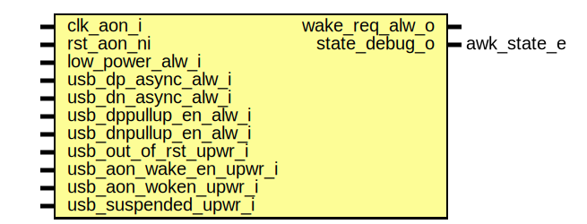

# Entity: usbdev_aon_wake

- **File**: usbdev_aon_wake.sv
## Diagram

## Description

 Copyright lowRISC contributors.
 Licensed under the Apache License, Version 2.0, see LICENSE for details.
 SPDX-License-Identifier: Apache-2.0

 Always On USB wake detect

## Ports

| Port name              | Direction | Type        | Description                                                                   |
| ---------------------- | --------- | ----------- | ----------------------------------------------------------------------------- |
| clk_aon_i              | input     |             |                                                                               |
| rst_aon_ni             | input     |             |                                                                               |
| low_power_alw_i        | input     |             |  the system to which usb belongs has entered low power                        |
| usb_dp_async_alw_i     | input     |             |  These come from the chip pin                                                 |
| usb_dn_async_alw_i     | input     |             |                                                                               |
| usb_dppullup_en_alw_i  | input     |             |  These come from post pinmux sleep handling logic                             |
| usb_dnpullup_en_alw_i  | input     |             |                                                                               |
| usb_out_of_rst_upwr_i  | input     |             |  Register signals from IP                                                     |
| usb_aon_wake_en_upwr_i | input     |             |                                                                               |
| usb_aon_woken_upwr_i   | input     |             |                                                                               |
| usb_suspended_upwr_i   | input     |             |  Status from IP, must be valid for long enough for aon clock to catch (>15us) |
| wake_req_alw_o         | output    |             |  wake/powerup request                                                         |
| state_debug_o          | output    | awk_state_e |  state debug information                                                      |
## Signals

| Name              | Type        | Description                                                                                                                                                                                                                              |
| ----------------- | ----------- | ---------------------------------------------------------------------------------------------------------------------------------------------------------------------------------------------------------------------------------------- |
| astate_d          | awk_state_e |                                                                                                                                                                                                                                          |
| astate_q          | awk_state_e |                                                                                                                                                                                                                                          |
| suspend_req_async | logic       |                                                                                                                                                                                                                                          |
| suspend_req       | logic       |                                                                                                                                                                                                                                          |
| wake_ack_async    | logic       |                                                                                                                                                                                                                                          |
| wake_ack          | logic       |                                                                                                                                                                                                                                          |
| low_power_async   | logic       |                                                                                                                                                                                                                                          |
| low_power         | logic       |                                                                                                                                                                                                                                          |
| filter_cdc_in     | logic [2:0] |  The suspend_req / wake ack / low power construction come from multiple clock domains.  As a result the 2 flop sync could glitch for up to 1 cycle.  Place a filter after  the two flop sync to passthrough the value only when stable.  |
| filter_cdc_out    | logic [2:0] |  The suspend_req / wake ack / low power construction come from multiple clock domains.  As a result the 2 flop sync could glitch for up to 1 cycle.  Place a filter after  the two flop sync to passthrough the value only when stable.  |
| notidle_async     | logic       |                                                                                                                                                                                                                                          |
| wake_req          | logic       |                                                                                                                                                                                                                                          |
## Processes
- proc_awk_fsm: (  )
  - **Type:** always_comb
- proc_reg_awk: ( @(posedge clk_aon_i or negedge rst_aon_ni) )
  - **Type:** always_ff
## Instantiations

- u_cdc_suspend_req: prim_flop_2sync
- filter_activity: prim_filter
**Description**
 aon clock is ~200kHz so 4 cycle filter is about 20us
 as well as noise debounce this gives the main IP time to detect resume if it didn't turn off

