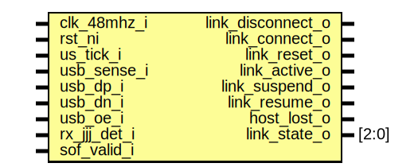

# Entity: usbdev_linkstate

- **File**: usbdev_linkstate.sv
## Diagram

## Description

Copyright lowRISC contributors.
 Licensed under the Apache License, Version 2.0, see LICENSE for details.
 SPDX-License-Identifier: Apache-2.0
 Link state detection
 
## Ports

| Port name         | Direction | Type  | Description |
| ----------------- | --------- | ----- | ----------- |
| clk_48mhz_i       | input     |       |             |
| rst_ni            | input     |       |             |
| us_tick_i         | input     |       |             |
| usb_sense_i       | input     |       |             |
| usb_dp_i          | input     |       |             |
| usb_dn_i          | input     |       |             |
| usb_oe_i          | input     |       |             |
| rx_jjj_det_i      | input     |       |             |
| sof_valid_i       | input     |       |             |
| link_disconnect_o | output    |       | level       |
| link_connect_o    | output    |       | level       |
| link_reset_o      | output    |       | level       |
| link_active_o     | output    |       | level       |
| link_suspend_o    | output    |       | level       |
| link_resume_o     | output    |       | pulse       |
| host_lost_o       | output    |       | level       |
| link_state_o      | output    | [2:0] |             |
## Signals

| Name                | Type              | Description                                                                                                                                                                                               |
| ------------------- | ----------------- | --------------------------------------------------------------------------------------------------------------------------------------------------------------------------------------------------------- |
| link_state_d        | link_state_e      |                                                                                                                                                                                                           |
| link_state_q        | link_state_e      |                                                                                                                                                                                                           |
| see_pwr_sense       | logic             |                                                                                                                                                                                                           |
| link_rst_timer_d    | logic [2:0]       | Reset FSM                                                                                                                                                                                                 |
| link_rst_timer_q    | logic [2:0]       | Reset FSM                                                                                                                                                                                                 |
| link_rst_state_d    | link_rst_state_e  |                                                                                                                                                                                                           |
| link_rst_state_q    | link_rst_state_e  |                                                                                                                                                                                                           |
| link_reset          | logic             | reset detected (level)                                                                                                                                                                                    |
| monitor_inac        | logic             | monitor link inactivity                                                                                                                                                                                   |
| link_inac_timer_d   | logic [11:0]      |                                                                                                                                                                                                           |
| link_inac_timer_q   | logic [11:0]      |                                                                                                                                                                                                           |
| link_inac_state_d   | link_inac_state_e |                                                                                                                                                                                                           |
| link_inac_state_q   | link_inac_state_e |                                                                                                                                                                                                           |
| ev_bus_active       | logic             | Events that are not triggered by a timeout                                                                                                                                                                |
| ev_bus_inactive     | logic             | Events that are triggered by timeout                                                                                                                                                                      |
| ev_reset            | logic             | Events that are triggered by timeout                                                                                                                                                                      |
| see_se0             | logic             | If the PHY reflects the line state on rx pins when the device is driving then the usb_oe_i check isn't needed here. But it seems best to do the check to be robust in the face of different PHY designs.  |
| line_se0_raw        | logic             | If the PHY reflects the line state on rx pins when the device is driving then the usb_oe_i check isn't needed here. But it seems best to do the check to be robust in the face of different PHY designs.  |
| host_presence_timer | logic [12:0]      | host_lost if no sof in 4.096ms (supposed to be every 1ms) and the link is active                                                                                                                          |
## Constants

| Name            | Type         | Value    | Description                      |
| --------------- | ------------ | -------- | -------------------------------- |
| SUSPEND_TIMEOUT | logic [11:0] | 12'd3000 | 3ms by spec                      |
| RESET_TIMEOUT   | logic [2:0]  | 3'd3     | 3us. Can be 2.5us - 10ms by spec |
## Types

| Name              | Type                                                                                                                                                                                                                                                                                                                                                                                                    | Description |
| ----------------- | ------------------------------------------------------------------------------------------------------------------------------------------------------------------------------------------------------------------------------------------------------------------------------------------------------------------------------------------------------------------------------------------------------- | ----------- |
| link_state_e      | enum logic [2:0] {           LinkDisconnect = 0,           LinkPowered = 1,      LinkPoweredSuspend = 2,           LinkActive = 3,      LinkActiveNoSOF = 5,      LinkSuspend = 4   } |             |
| link_rst_state_e  | enum logic [1:0] {      NoRst,      RstCnt,      RstPend   }                                                                                                                                                                                                                                   |             |
| link_inac_state_e | enum logic [1:0] {      Active,      InactCnt,      InactPend   }                                                                                                                                                                                                                              |             |
## Processes
- unnamed: (  )
- unnamed: ( @(posedge clk_48mhz_i or negedge rst_ni) )
- proc_rst_fsm: (  )
**Description**
Here we clean up the SE0 signal and generate a signle ev_reset at
the end of a valid reset

- proc_reg_rst: ( @(posedge clk_48mhz_i or negedge rst_ni) )
- proc_idle_det: (  )
**Description**
Here we clean up the idle signal and generate a signle ev_bus_inactive
after the timer expires

- proc_reg_idle_det: ( @(posedge clk_48mhz_i or negedge rst_ni) )
- unnamed: ( @(posedge clk_48mhz_i or negedge rst_ni) )
## Instantiations

- filter_se0: prim_filter
**Description**
four ticks is a bit time
Could completely filter out 2-cycle EOP SE0 here but
does not seem needed

- filter_pwr_sense: prim_filter
