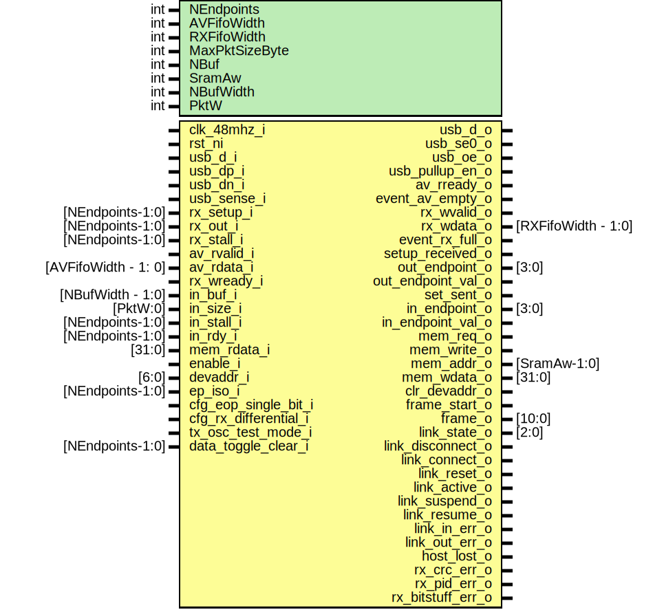

# Entity: usbdev_usbif
## Diagram

## Description
Copyright lowRISC contributors.
 Licensed under the Apache License, Version 2.0, see LICENSE for details.
 SPDX-License-Identifier: Apache-2.0
 USB Full-Speed Device Interface core internals
 This module runs on the 48MHz USB clock
 
## Generics
| Generic name   | Type | Value                  | Description       |
| -------------- | ---- | ---------------------- | ----------------- |
| NEndpoints     | int  | 12                     |                   |
| AVFifoWidth    | int  | 4                      |                   |
| RXFifoWidth    | int  | 4                      |                   |
| MaxPktSizeByte | int  | 64                     |                   |
| NBuf           | int  | 4                      |                   |
| SramAw         | int  | 4                      |                   |
| NBufWidth      | int  | $clog2(NBuf)           | derived parameter |
| PktW           | int  | $clog2(MaxPktSizeByte) | derived parameter |
## Ports
| Port name             | Direction | Type                 | Description                              |
| --------------------- | --------- | -------------------- | ---------------------------------------- |
| clk_48mhz_i           | input     |                      | 48MHz USB clock                          |
| rst_ni                | input     |                      |                                          |
| usb_d_i               | input     |                      | Pins (synchronous)                       |
| usb_dp_i              | input     |                      |                                          |
| usb_dn_i              | input     |                      |                                          |
| usb_d_o               | output    |                      |                                          |
| usb_se0_o             | output    |                      |                                          |
| usb_oe_o              | output    |                      |                                          |
| usb_pullup_en_o       | output    |                      |                                          |
| usb_sense_i           | input     |                      |                                          |
| rx_setup_i            | input     | [NEndpoints-1:0]     | receive (OUT or SETUP) side              |
| rx_out_i              | input     | [NEndpoints-1:0]     |                                          |
| rx_stall_i            | input     | [NEndpoints-1:0]     |                                          |
| av_rvalid_i           | input     |                      |                                          |
| av_rready_o           | output    |                      |                                          |
| av_rdata_i            | input     | [AVFifoWidth - 1: 0] |                                          |
| event_av_empty_o      | output    |                      |                                          |
| rx_wvalid_o           | output    |                      |                                          |
| rx_wready_i           | input     |                      |                                          |
| rx_wdata_o            | output    | [RXFifoWidth - 1:0]  |                                          |
| event_rx_full_o       | output    |                      |                                          |
| setup_received_o      | output    |                      |                                          |
| out_endpoint_o        | output    | [3:0]                |                                          |
| out_endpoint_val_o    | output    |                      |                                          |
| in_buf_i              | input     | [NBufWidth - 1:0]    | transmit (IN) side                       |
| in_size_i             | input     | [PktW:0]             |                                          |
| in_stall_i            | input     | [NEndpoints-1:0]     |                                          |
| in_rdy_i              | input     | [NEndpoints-1:0]     |                                          |
| set_sent_o            | output    |                      |                                          |
| in_endpoint_o         | output    | [3:0]                |                                          |
| in_endpoint_val_o     | output    |                      |                                          |
| mem_req_o             | output    |                      | memory interface                         |
| mem_write_o           | output    |                      |                                          |
| mem_addr_o            | output    | [SramAw-1:0]         |                                          |
| mem_wdata_o           | output    | [31:0]               |                                          |
| mem_rdata_i           | input     | [31:0]               |                                          |
| enable_i              | input     |                      | control                                  |
| devaddr_i             | input     | [6:0]                |                                          |
| clr_devaddr_o         | output    |                      |                                          |
| ep_iso_i              | input     | [NEndpoints-1:0]     |                                          |
| cfg_eop_single_bit_i  | input     |                      | 1: detect a single SE0 bit as EOP        |
| cfg_rx_differential_i | input     |                      | 1: use differential rx data on usb_d_i   |
| tx_osc_test_mode_i    | input     |                      | Oscillator test mode: constant JK output |
| data_toggle_clear_i   | input     | [NEndpoints-1:0]     | Clear the data toggles for an EP         |
| frame_start_o         | output    |                      | status                                   |
| frame_o               | output    | [10:0]               |                                          |
| link_state_o          | output    | [2:0]                |                                          |
| link_disconnect_o     | output    |                      |                                          |
| link_connect_o        | output    |                      |                                          |
| link_reset_o          | output    |                      |                                          |
| link_active_o         | output    |                      |                                          |
| link_suspend_o        | output    |                      |                                          |
| link_resume_o         | output    |                      |                                          |
| link_in_err_o         | output    |                      |                                          |
| link_out_err_o        | output    |                      |                                          |
| host_lost_o           | output    |                      |                                          |
| rx_crc_err_o          | output    |                      |                                          |
| rx_pid_err_o          | output    |                      |                                          |
| rx_bitstuff_err_o     | output    |                      |                                          |
## Signals
| Name            | Type                   | Description                                                                                    |
| --------------- | ---------------------- | ---------------------------------------------------------------------------------------------- |
| out_max_used_d  | logic [PktW:0]         | OUT or SETUP direction                                                                         |
| out_max_used_q  | logic [PktW:0]         | OUT or SETUP direction                                                                         |
| out_ep_put_addr | logic [PktW-1:0]       |                                                                                                |
| out_ep_data     | logic [7:0]            |                                                                                                |
| out_ep_current  | logic [3:0]            |                                                                                                |
| out_ep_data_put | logic                  |                                                                                                |
| out_ep_acked    | logic                  |                                                                                                |
| out_ep_rollback | logic                  |                                                                                                |
| current_setup   | logic                  |                                                                                                |
| all_out_blocked | logic                  |                                                                                                |
| out_ep_newpkt   | logic                  |                                                                                                |
| out_ep_setup    | logic [NEndpoints-1:0] |                                                                                                |
| out_ep_full     | logic [NEndpoints-1:0] |                                                                                                |
| out_ep_stall    | logic [NEndpoints-1:0] |                                                                                                |
| setup_blocked   | logic [NEndpoints-1:0] |                                                                                                |
| out_blocked     | logic [NEndpoints-1:0] |                                                                                                |
| wdata           | logic [31:0]           |                                                                                                |
| mem_read        | logic                  |                                                                                                |
| mem_waddr       | logic [SramAw-1:0]     |                                                                                                |
| mem_raddr       | logic [SramAw-1:0]     |                                                                                                |
| link_reset      | logic                  |                                                                                                |
| sof_valid       | logic                  |                                                                                                |
| std_write_d     | logic                  | always_comb don't write if the address has wrapped (happens for two CRC bytes after max data)  |
| std_write_q     | logic                  | always_comb don't write if the address has wrapped (happens for two CRC bytes after max data)  |
| out_max_minus1  | logic [PktW:0]         |                                                                                                |
| in_ep_xfr_end   | logic                  | IN (device to host) transfers                                                                  |
| in_ep_data_get  | logic                  | IN (device to host) transfers                                                                  |
| in_data_done    | logic                  | IN (device to host) transfers                                                                  |
| in_ep_newpkt    | logic                  | IN (device to host) transfers                                                                  |
| pkt_start_rd    | logic                  | IN (device to host) transfers                                                                  |
| in_ep_data_done | logic [NEndpoints-1:0] |                                                                                                |
| in_ep_get_addr  | logic [PktW-1:0]       |                                                                                                |
| in_ep_data      | logic [7:0]            |                                                                                                |
| in_ep_current   | logic [3:0]            |                                                                                                |
| frame_index_raw | logic [10:0]           |                                                                                                |
| rx_jjj_det      | logic                  |                                                                                                |
| ns_cnt          | logic [5:0]            | us_tick ticks for one cycle every us                                                           |
| us_tick         | logic                  |                                                                                                |
## Constants
| Name      | Type | Value                  | Description       |
| --------- | ---- | ---------------------- | ----------------- |
| NBufWidth | int  | $clog2(NBuf)           | derived parameter |
| PktW      | int  | $clog2(MaxPktSizeByte) | derived parameter |
## Processes
- unnamed: _(  )_

- unnamed: _( @(posedge clk_48mhz_i or negedge rst_ni) )_

- unnamed: _( @(posedge clk_48mhz_i or negedge rst_ni) )_
Pop the available fifo after the write that used the previous value

**Description**
Pop the available fifo after the write that used the previous value

- unnamed: _(  )_

- unnamed: _( @(posedge clk_48mhz_i or negedge rst_ni) )_
Need extra read at start of packet to get the first word of data
Delay by one cycle from the in_endpoint update

**Description**
Need extra read at start of packet to get the first word of data
Delay by one cycle from the in_endpoint update

- unnamed: _( @(posedge clk_48mhz_i or negedge rst_ni) )_

- unnamed: _( @(posedge clk_48mhz_i or negedge rst_ni) )_
Capture frame number (host sends evert 1ms)

**Description**
Capture frame number (host sends evert 1ms)

## Instantiations
- u_usb_fs_nb_pe: usb_fs_nb_pe
- u_usbdev_linkstate: usbdev_linkstate
