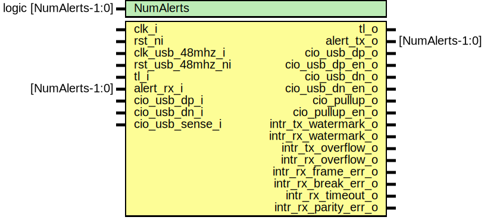

# Entity: usbuart
## Diagram

## Description
Copyright lowRISC contributors.
 Licensed under the Apache License, Version 2.0, see LICENSE for details.
 SPDX-License-Identifier: Apache-2.0
 Description: USB UART top level wrapper file
 
## Ports
| Port name            | Direction | Type | Description                           |
| -------------------- | --------- | ---- | ------------------------------------- |
| clk_i                | input     |      |                                       |
| rst_ni               | input     |      | Reset synchronized to clk_i           |
| clk_usb_48mhz_i      | input     |      |                                       |
| rst_usb_48mhz_ni     | input     |      | Reset synchronized to clk_usb_48mhz_i |
| tl_i                 | input     |      | Bus Interface                         |
| tl_o                 | output    |      |                                       |
| cio_usb_dp_i         | input     |      | Generic IO                            |
| cio_usb_dp_o         | output    |      |                                       |
| cio_usb_dp_en_o      | output    |      |                                       |
| cio_usb_dn_i         | input     |      |                                       |
| cio_usb_dn_o         | output    |      |                                       |
| cio_usb_dn_en_o      | output    |      |                                       |
| cio_usb_sense_i      | input     |      |                                       |
| cio_pullup_o         | output    |      |                                       |
| cio_pullup_en_o      | output    |      |                                       |
| intr_tx_watermark_o  | output    |      | Interrupts                            |
| intr_rx_watermark_o  | output    |      |                                       |
| intr_tx_overflow_o   | output    |      |                                       |
| intr_rx_overflow_o   | output    |      |                                       |
| intr_rx_frame_err_o  | output    |      |                                       |
| intr_rx_break_err_o  | output    |      |                                       |
| intr_rx_timeout_o    | output    |      |                                       |
| intr_rx_parity_err_o | output    |      |                                       |
## Signals
| Name   | Type             | Description |
| ------ | ---------------- | ----------- |
| reg2hw | usbuart_reg2hw_t |             |
| hw2reg | usbuart_hw2reg_t |             |
## Instantiations
- u_reg: usbuart_reg_top
- usbuart_core: usbuart_core
