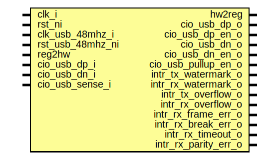

# Entity: usbuart_core
## Diagram

## Description
Copyright lowRISC contributors.
 Licensed under the Apache License, Version 2.0, see LICENSE for details.
 SPDX-License-Identifier: Apache-2.0
 Description: USB UART core module
 
## Ports
| Port name            | Direction | Type | Description |
| -------------------- | --------- | ---- | ----------- |
| clk_i                | input     |      |             |
| rst_ni               | input     |      |             |
| clk_usb_48mhz_i      | input     |      |             |
| rst_usb_48mhz_ni     | input     |      |             |
| reg2hw               | input     |      |             |
| hw2reg               | output    |      |             |
| cio_usb_dp_i         | input     |      |             |
| cio_usb_dp_o         | output    |      |             |
| cio_usb_dp_en_o      | output    |      |             |
| cio_usb_dn_i         | input     |      |             |
| cio_usb_dn_o         | output    |      |             |
| cio_usb_dn_en_o      | output    |      |             |
| cio_usb_sense_i      | input     |      |             |
| cio_usb_pullup_en_o  | output    |      |             |
| intr_tx_watermark_o  | output    |      |             |
| intr_rx_watermark_o  | output    |      |             |
| intr_tx_overflow_o   | output    |      |             |
| intr_rx_overflow_o   | output    |      |             |
| intr_rx_frame_err_o  | output    |      |             |
| intr_rx_break_err_o  | output    |      |             |
| intr_rx_timeout_o    | output    |      |             |
| intr_rx_parity_err_o | output    |      |             |
## Signals
| Name                  | Type                                           | Description                |
| --------------------- | ---------------------------------------------- | -------------------------- |
| uart_rdata            | logic [7:0]                                    |                            |
| tx_fifo_rst_n         | logic                                          |                            |
| rx_fifo_rst_n         | logic                                          |                            |
| tx_fifo_depth         | logic [5:0]                                    |                            |
| rx_fifo_depth         | logic [5:0]                                    |                            |
| rx_fifo_depth_prev    | logic [5:0]                                    |                            |
| rx_timeout_count      | logic [23:0]                                   | rx timeout interrupt       |
| rx_timeout_count_next | logic [23:0]                                   | rx timeout interrupt       |
| uart_rxto_val         | logic [23:0]                                   | rx timeout interrupt       |
| rx_fifo_depth_changed | logic                                          |                            |
| uart_rxto_en          | logic                                          |                            |
| tx_enable             | logic                                          |                            |
| rx_enable             | logic                                          |                            |
| sys_loopback          | logic                                          |                            |
| uart_fifo_rxrst       | logic                                          |                            |
| uart_fifo_txrst       | logic                                          |                            |
| uart_fifo_rxilvl      | logic [2:0]                                    |                            |
| uart_fifo_txilvl      | logic [1:0]                                    |                            |
| usb_tx_fifo_rdata     | logic [7:0]                                    |                            |
| usb_tx_rready         | logic                                          |                            |
| usb_if_tx_read        | logic                                          |                            |
| usb_tx_rvalid         | logic                                          |                            |
| tx_fifo_wready        | logic                                          |                            |
| lb_data_move          | logic                                          |                            |
| usb_rx_fifo_wdata     | logic [7:0]                                    |                            |
| usb_if_rx_fifo_wdata  | logic [7:0]                                    |                            |
| usb_rx_wvalid         | logic                                          |                            |
| usb_if_rx_write       | logic                                          |                            |
| rx_fifo_rvalid        | logic                                          |                            |
| usb_rx_wready         | logic                                          |                            |
| event_tx_watermark    | logic                                          |                            |
| event_rx_watermark    | logic                                          |                            |
| event_tx_overflow     | logic                                          |                            |
| event_rx_overflow     | logic                                          |                            |
| event_rx_frame_err    | logic                                          |                            |
| event_rx_break_err    | logic                                          |                            |
| event_rx_timeout      | logic                                          |                            |
| event_rx_parity_err   | logic                                          |                            |
| host_lost             | logic                                          |                            |
| host_timeout          | logic                                          |                            |
| usb_pullup_en         | logic                                          |                            |
| unused_ctrl_q         | logic [3:0]                                    |                            |
| rxres_cnt             | logic [2:0]                                    | 4 cycle reset pulse        |
| txres_cnt             | logic [2:0]                                    |                            |
| uart_start_rxrst      | logic                                          |                            |
| uart_start_txrst      | logic                                          |                            |
| unused_fifo_ctrl_qe   | logic [1:0]                                    |                            |
| unused_ovrd_tx_en     | logic                                          |                            |
| unused_ovrd_tx_val    | logic                                          |                            |
| unused_rdata_q        | logic [7:0]                                    |                            |
| nco_sum               | logic   [16:0]                                 | extra bit to get the carry |
| tick_baud_x16         | logic                                          |                            |
| usb_rx_oflw           | logic                                          |                            |
| usb_rx_d              | logic                                          |                            |
| usb_rx_se0            | logic                                          |                            |
| usb_tx_d              | logic                                          |                            |
| usb_tx_se0            | logic                                          |                            |
| usb_tx_oe             | logic                                          |                            |
| sys_usb_sense         | logic                                          | USB sense synced to clk_i  |
| cio_oe                | logic                                          |                            |
| usb_phy_config        | usbdev_reg_pkg::usbdev_reg2hw_phy_config_reg_t | Static configuration       |
## Processes
- unnamed: _( @(posedge clk_i or negedge rst_ni) )_

- unnamed: _( @(posedge clk_i or negedge rst_ni) )_

- unnamed: _( @(posedge clk_usb_48mhz_i) )_
Sys loopback is done at the bottom of the fifos
TODO could do line loopback in a similar way at top of fifos?

**Description**
Sys loopback is done at the bottom of the fifos
TODO could do line loopback in a similar way at top of fifos?

- unnamed: _(  )_

- unnamed: _(  )_

- unnamed: _( @(posedge clk_i or negedge rst_ni) )_

## Instantiations
- usbuart_txfifo: prim_fifo_async
- usbuart_rxfifo: prim_fifo_async
- usbuart_usbif: usbuart_usbif
- intr_hw_tx_watermark: prim_intr_hw
**Description**
TODO is there a related USB error?
instantiate interrupt hardware primitives

- intr_hw_rx_watermark: prim_intr_hw
- intr_hw_tx_overflow: prim_intr_hw
- intr_hw_rx_overflow: prim_intr_hw
- intr_hw_rx_frame_err: prim_intr_hw
- intr_hw_rx_break_err: prim_intr_hw
- intr_hw_rx_timeout: prim_intr_hw
- intr_hw_rx_parity_err: prim_intr_hw
- i_usbdev_iomux: usbdev_iomux
