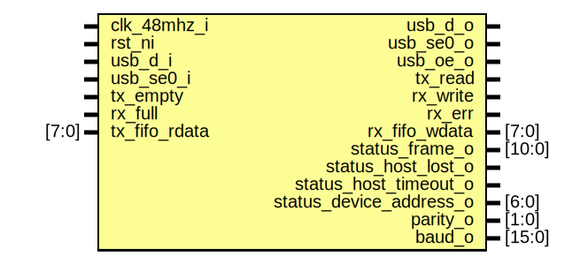

# Entity: usbuart_usbif

- **File**: usbuart_usbif.sv
## Diagram

## Description

Copyright lowRISC contributors.
 Licensed under the Apache License, Version 2.0, see LICENSE for details.
 SPDX-License-Identifier: Apache-2.0
 Description: USB uart interface in USB clock domain
 
## Ports

| Port name               | Direction | Type   | Description                                                                                                                    |
| ----------------------- | --------- | ------ | ------------------------------------------------------------------------------------------------------------------------------ |
| clk_48mhz_i             | input     |        |                                                                                                                                |
| rst_ni                  | input     |        |                                                                                                                                |
| usb_d_i                 | input     |        | USB lines.  Split into input vs. output and oe control signal to maintainhighest level of compatibility with synthesis tools.  |
| usb_se0_i               | input     |        |                                                                                                                                |
| usb_d_o                 | output    |        |                                                                                                                                |
| usb_se0_o               | output    |        |                                                                                                                                |
| usb_oe_o                | output    |        |                                                                                                                                |
| tx_empty                | input     |        | Fifo used to communicate with system                                                                                           |
| rx_full                 | input     |        |                                                                                                                                |
| tx_read                 | output    |        |                                                                                                                                |
| rx_write                | output    |        |                                                                                                                                |
| rx_err                  | output    |        | Also becomes bit 8 to the fifo                                                                                                 |
| rx_fifo_wdata           | output    | [7:0]  |                                                                                                                                |
| tx_fifo_rdata           | input     | [7:0]  |                                                                                                                                |
| status_frame_o          | output    | [10:0] | Status                                                                                                                         |
| status_host_lost_o      | output    |        |                                                                                                                                |
| status_host_timeout_o   | output    |        |                                                                                                                                |
| status_device_address_o | output    | [6:0]  |                                                                                                                                |
| parity_o                | output    | [1:0]  |                                                                                                                                |
| baud_o                  | output    | [15:0] |                                                                                                                                |
## Signals

| Name                   | Type               | Description                           |
| ---------------------- | ------------------ | ------------------------------------- |
| ns_cnt                 | logic [5:0]        | us_tick ticks for one cycle every us  |
| us_tick                | logic              |                                       |
| dev_addr               | logic [6:0]        |                                       |
| out_ep_data            | logic [7:0]        |                                       |
| in_ep_current          | logic [3:0]        |                                       |
| in_ep_rollback         | logic              |                                       |
| in_ep_acked            | logic              |                                       |
| in_ep_get_addr         | logic [PktW - 1:0] |                                       |
| in_ep_data_get         | logic              |                                       |
| out_ep_current         | logic [3:0]        |                                       |
| out_ep_rollback        | logic              |                                       |
| out_ep_acked           | logic              |                                       |
| out_ep_put_addr        | logic [PktW - 1:0] |                                       |
| out_ep_data_put        | logic              |                                       |
| ctrl_out_ep_setup      | logic              |                                       |
| ctrl_out_ep_stall      | logic              |                                       |
| ctrl_out_ep_full       | logic              |                                       |
| ctrl_in_ep_data        | logic [7:0]        |                                       |
| ctrl_in_ep_data_done   | logic              |                                       |
| ctrl_in_ep_stall       | logic              |                                       |
| ctrl_in_ep_has_data    | logic              |                                       |
| serial_out_ep_setup    | logic              |                                       |
| serial_out_ep_stall    | logic              |                                       |
| serial_out_ep_full     | logic              |                                       |
| serial_in_ep_data      | logic [7:0]        |                                       |
| serial_in_ep_data_done | logic              |                                       |
| serial_in_ep_stall     | logic              |                                       |
| serial_in_ep_has_data  | logic              |                                       |
| sof_valid              | logic              |                                       |
| frame_index_raw        | logic [10:0]       |                                       |
| host_presence_timer    | logic [19:0]       |                                       |
| out_ctrl_put           | logic              |                                       |
| out_ctrl_acked         | logic              |                                       |
| out_ctrl_rollback      | logic              |                                       |
| in_ctrl_get            | logic              |                                       |
| in_ctrl_acked          | logic              |                                       |
| in_ctrl_rollback       | logic              |                                       |
| out_fifo_put           | logic              |                                       |
| out_fifo_acked         | logic              |                                       |
| out_fifo_rollback      | logic              |                                       |
| in_fifo_get            | logic              |                                       |
| in_fifo_acked          | logic              |                                       |
| in_fifo_rollback       | logic              |                                       |
## Constants

| Name           | Type         | Value                  | Description |
| -------------- | ------------ | ---------------------- | ----------- |
| MaxPktSizeByte | int unsigned | 32                     |             |
| PktW           | int unsigned | $clog2(MaxPktSizeByte) |             |
| CtrlEp         | int unsigned | 0                      |             |
| FifoEp         | int unsigned | 1                      |             |
## Processes
- unnamed: ( @(posedge clk_48mhz_i or negedge rst_ni) )
- unnamed: ( @(posedge clk_48mhz_i or negedge rst_ni) )
## Instantiations

- u_usb_serial_ctrl_ep: usb_serial_ctrl_ep
- u_usb_serial_fifo_ep: usb_serial_fifo_ep
- u_usb_fs_nb_pe: usb_fs_nb_pe
