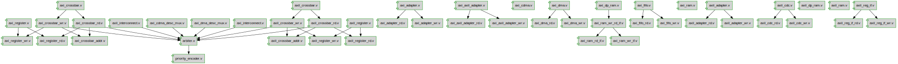

# Documentation for: 

Generated by **TerosHDL** © 2020-2021 License GPLv3 Carlos Alberto Ruiz Naranjo (carlosruiznaranjo@gmail.com) Ismael Perez Rojo (ismaelprojo@gmail.com)  Project revision 2021-07-14 20:44:32

## Designs

- Module: [arbiter ](./doc_internal/arbiter.md)
- Module: [axi_adapter ](./doc_internal/axi_adapter.md)
- Module: [axi_axil_adapter ](./doc_internal/axi_axil_adapter.md)
- Module: [axi_axil_adapter_rd ](./doc_internal/axi_axil_adapter_rd.md)
- Module: [axi_axil_adapter_wr ](./doc_internal/axi_axil_adapter_wr.md)
- Module: [axi_cdma ](./doc_internal/axi_cdma.md)
- Module: [axi_cdma_desc_mux ](./doc_internal/axi_cdma_desc_mux.md)
- Module: [axi_crossbar ](./doc_internal/axi_crossbar.md)
- Module: [axi_crossbar_addr ](./doc_internal/axi_crossbar_addr.md)
- Module: [axi_crossbar_rd ](./doc_internal/axi_crossbar_rd.md)
- Module: [axi_crossbar_wr ](./doc_internal/axi_crossbar_wr.md)
- Module: [axi_dma ](./doc_internal/axi_dma.md)
- Module: [axi_dma_desc_mux ](./doc_internal/axi_dma_desc_mux.md)
- Module: [axi_dma_rd ](./doc_internal/axi_dma_rd.md)
- Module: [axi_dma_wr ](./doc_internal/axi_dma_wr.md)
- Module: [axi_dp_ram ](./doc_internal/axi_dp_ram.md)
- Module: [axi_fifo ](./doc_internal/axi_fifo.md)
- Module: [axi_fifo_rd ](./doc_internal/axi_fifo_rd.md)
- Module: [axi_fifo_wr ](./doc_internal/axi_fifo_wr.md)
- Module: [axi_interconnect ](./doc_internal/axi_interconnect.md)
- Module: [axi_ram ](./doc_internal/axi_ram.md)
- Module: [axi_ram_rd_if ](./doc_internal/axi_ram_rd_if.md)
- Module: [axi_ram_wr_if ](./doc_internal/axi_ram_wr_if.md)
- Module: [axi_ram_wr_rd_if ](./doc_internal/axi_ram_wr_rd_if.md)
- Module: [axi_register ](./doc_internal/axi_register.md)
- Module: [axi_register_rd ](./doc_internal/axi_register_rd.md)
- Module: [axi_register_wr ](./doc_internal/axi_register_wr.md)
- Module: [axil_adapter ](./doc_internal/axil_adapter.md)
- Module: [axil_adapter_rd ](./doc_internal/axil_adapter_rd.md)
- Module: [axil_adapter_wr ](./doc_internal/axil_adapter_wr.md)
- Module: [axil_cdc ](./doc_internal/axil_cdc.md)
- Module: [axil_cdc_rd ](./doc_internal/axil_cdc_rd.md)
- Module: [axil_cdc_wr ](./doc_internal/axil_cdc_wr.md)
- Module: [axil_dp_ram ](./doc_internal/axil_dp_ram.md)
- Module: [axil_interconnect ](./doc_internal/axil_interconnect.md)
- Module: [axil_ram ](./doc_internal/axil_ram.md)
- Module: [axil_register ](./doc_internal/axil_register.md)
- Module: [axil_register_rd ](./doc_internal/axil_register_rd.md)
- Module: [axil_register_wr ](./doc_internal/axil_register_wr.md)
- Module: [priority_encoder ](./doc_internal/priority_encoder.md)

