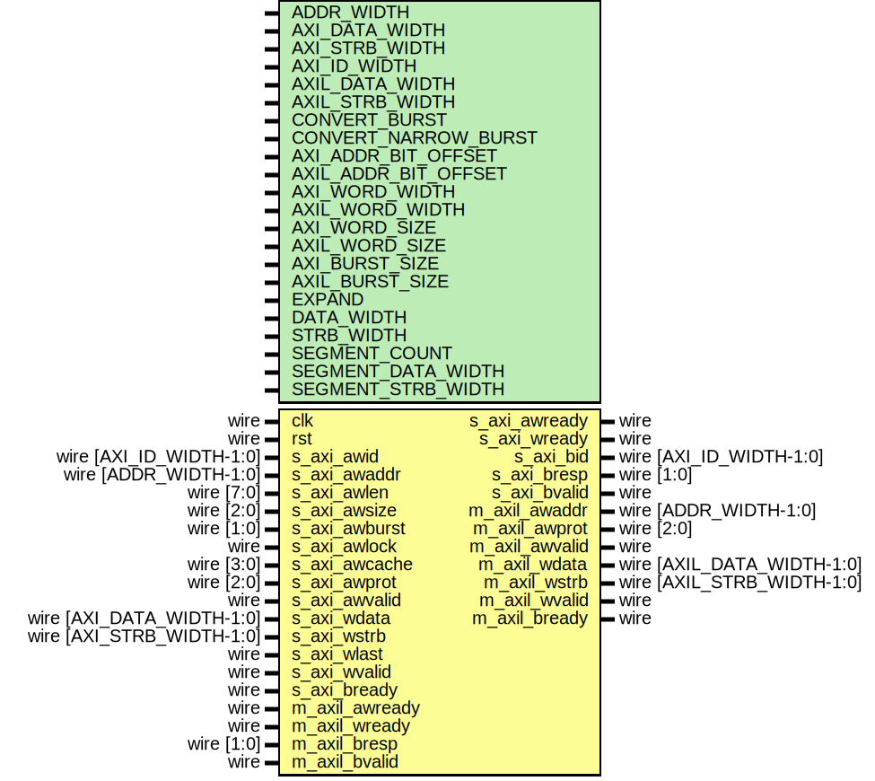

# Entity: axi_axil_adapter_wr

## Diagram

## Description

Language: Verilog 2001
 
## Generics

| Generic name         | Type | Value                                     | Description                                                                                                 |
| -------------------- | ---- | ----------------------------------------- | ----------------------------------------------------------------------------------------------------------- |
| ADDR_WIDTH           |      | 32                                        | Width of address bus in bits                                                                                |
| AXI_DATA_WIDTH       |      | 32                                        | Width of input (slave) AXI interface data bus in bits                                                       |
| AXI_STRB_WIDTH       |      | undefined                                 | Width of input (slave) AXI interface wstrb (width of data bus in words)                                     |
| AXI_ID_WIDTH         |      | 8                                         | Width of AXI ID signal                                                                                      |
| AXIL_DATA_WIDTH      |      | 32                                        | Width of output (master) AXI lite interface data bus in bits                                                |
| AXIL_STRB_WIDTH      |      | undefined                                 | Width of output (master) AXI lite interface wstrb (width of data bus in words)                              |
| CONVERT_BURST        |      | 1                                         | When adapting to a wider bus, re-pack full-width burst instead of passing through narrow burst if possible  |
| CONVERT_NARROW_BURST |      | 0                                         | When adapting to a wider bus, re-pack all bursts instead of passing through narrow burst if possible        |
| AXI_ADDR_BIT_OFFSET  |      | $clog2(AXI_STRB_WIDTH)                    |                                                                                                             |
| AXIL_ADDR_BIT_OFFSET |      | $clog2(AXIL_STRB_WIDTH)                   |                                                                                                             |
| AXI_WORD_WIDTH       |      | AXI_STRB_WIDTH                            |                                                                                                             |
| AXIL_WORD_WIDTH      |      | AXIL_STRB_WIDTH                           |                                                                                                             |
| AXI_WORD_SIZE        |      | AXI_DATA_WIDTH/AXI_WORD_WIDTH             |                                                                                                             |
| AXIL_WORD_SIZE       |      | AXIL_DATA_WIDTH/AXIL_WORD_WIDTH           |                                                                                                             |
| AXI_BURST_SIZE       |      | $clog2(AXI_STRB_WIDTH)                    |                                                                                                             |
| AXIL_BURST_SIZE      |      | $clog2(AXIL_STRB_WIDTH)                   |                                                                                                             |
| EXPAND               |      | AXIL_STRB_WIDTH > AXI_STRB_WIDTH          | output bus is wider                                                                                         |
| DATA_WIDTH           |      | EXPAND ? AXIL_DATA_WIDTH : AXI_DATA_WIDTH |                                                                                                             |
| STRB_WIDTH           |      | EXPAND ? AXIL_STRB_WIDTH : AXI_STRB_WIDTH |                                                                                                             |
| SEGMENT_COUNT        |      | undefined                                 | required number of segments in wider bus                                                                    |
| SEGMENT_DATA_WIDTH   |      | DATA_WIDTH / SEGMENT_COUNT                | data width and keep width per segment                                                                       |
| SEGMENT_STRB_WIDTH   |      | STRB_WIDTH / SEGMENT_COUNT                |                                                                                                             |
## Ports

| Port name      | Direction | Type                       | Description |
| -------------- | --------- | -------------------------- | ----------- |
| clk            | input     | wire                       |             |
| rst            | input     | wire                       |             |
| s_axi_awid     | input     | wire [AXI_ID_WIDTH-1:0]    |             |
| s_axi_awaddr   | input     | wire [ADDR_WIDTH-1:0]      |             |
| s_axi_awlen    | input     | wire [7:0]                 |             |
| s_axi_awsize   | input     | wire [2:0]                 |             |
| s_axi_awburst  | input     | wire [1:0]                 |             |
| s_axi_awlock   | input     | wire                       |             |
| s_axi_awcache  | input     | wire [3:0]                 |             |
| s_axi_awprot   | input     | wire [2:0]                 |             |
| s_axi_awvalid  | input     | wire                       |             |
| s_axi_awready  | output    | wire                       |             |
| s_axi_wdata    | input     | wire [AXI_DATA_WIDTH-1:0]  |             |
| s_axi_wstrb    | input     | wire [AXI_STRB_WIDTH-1:0]  |             |
| s_axi_wlast    | input     | wire                       |             |
| s_axi_wvalid   | input     | wire                       |             |
| s_axi_wready   | output    | wire                       |             |
| s_axi_bid      | output    | wire [AXI_ID_WIDTH-1:0]    |             |
| s_axi_bresp    | output    | wire [1:0]                 |             |
| s_axi_bvalid   | output    | wire                       |             |
| s_axi_bready   | input     | wire                       |             |
| m_axil_awaddr  | output    | wire [ADDR_WIDTH-1:0]      |             |
| m_axil_awprot  | output    | wire [2:0]                 |             |
| m_axil_awvalid | output    | wire                       |             |
| m_axil_awready | input     | wire                       |             |
| m_axil_wdata   | output    | wire [AXIL_DATA_WIDTH-1:0] |             |
| m_axil_wstrb   | output    | wire [AXIL_STRB_WIDTH-1:0] |             |
| m_axil_wvalid  | output    | wire                       |             |
| m_axil_wready  | input     | wire                       |             |
| m_axil_bresp   | input     | wire [1:0]                 |             |
| m_axil_bvalid  | input     | wire                       |             |
| m_axil_bready  | output    | wire                       |             |
## Signals

| Name                   | Type                      | Description |
| ---------------------- | ------------------------- | ----------- |
| state_reg              | reg [1:0]                 |             |
| state_next             | reg [1:0]                 |             |
| id_reg                 | reg [AXI_ID_WIDTH-1:0]    |             |
| id_next                | reg [AXI_ID_WIDTH-1:0]    |             |
| addr_reg               | reg [ADDR_WIDTH-1:0]      |             |
| addr_next              | reg [ADDR_WIDTH-1:0]      |             |
| data_reg               | reg [DATA_WIDTH-1:0]      |             |
| data_next              | reg [DATA_WIDTH-1:0]      |             |
| strb_reg               | reg [STRB_WIDTH-1:0]      |             |
| strb_next              | reg [STRB_WIDTH-1:0]      |             |
| burst_reg              | reg [7:0]                 |             |
| burst_next             | reg [7:0]                 |             |
| burst_size_reg         | reg [2:0]                 |             |
| burst_size_next        | reg [2:0]                 |             |
| master_burst_size_reg  | reg [2:0]                 |             |
| master_burst_size_next | reg [2:0]                 |             |
| burst_active_reg       | reg                       |             |
| burst_active_next      | reg                       |             |
| convert_burst_reg      | reg                       |             |
| convert_burst_next     | reg                       |             |
| first_transfer_reg     | reg                       |             |
| first_transfer_next    | reg                       |             |
| last_segment_reg       | reg                       |             |
| last_segment_next      | reg                       |             |
| s_axi_awready_reg      | reg                       |             |
| s_axi_awready_next     | reg                       |             |
| s_axi_wready_reg       | reg                       |             |
| s_axi_wready_next      | reg                       |             |
| s_axi_bid_reg          | reg [AXI_ID_WIDTH-1:0]    |             |
| s_axi_bid_next         | reg [AXI_ID_WIDTH-1:0]    |             |
| s_axi_bresp_reg        | reg [1:0]                 |             |
| s_axi_bresp_next       | reg [1:0]                 |             |
| s_axi_bvalid_reg       | reg                       |             |
| s_axi_bvalid_next      | reg                       |             |
| m_axil_awaddr_reg      | reg [ADDR_WIDTH-1:0]      |             |
| m_axil_awaddr_next     | reg [ADDR_WIDTH-1:0]      |             |
| m_axil_awprot_reg      | reg [2:0]                 |             |
| m_axil_awprot_next     | reg [2:0]                 |             |
| m_axil_awvalid_reg     | reg                       |             |
| m_axil_awvalid_next    | reg                       |             |
| m_axil_wdata_reg       | reg [AXIL_DATA_WIDTH-1:0] |             |
| m_axil_wdata_next      | reg [AXIL_DATA_WIDTH-1:0] |             |
| m_axil_wstrb_reg       | reg [AXIL_STRB_WIDTH-1:0] |             |
| m_axil_wstrb_next      | reg [AXIL_STRB_WIDTH-1:0] |             |
| m_axil_wvalid_reg      | reg                       |             |
| m_axil_wvalid_next     | reg                       |             |
| m_axil_bready_reg      | reg                       |             |
| m_axil_bready_next     | reg                       |             |
| i                      | integer                   |             |
## Constants

| Name         | Type  | Value | Description |
| ------------ | ----- | ----- | ----------- |
| STATE_IDLE   | [1:0] | 2'd0  |             |
| STATE_DATA   | [1:0] | 2'd1  |             |
| STATE_DATA_2 | [1:0] | 2'd2  |             |
| STATE_RESP   | [1:0] | 2'd3  |             |
## Processes
- unnamed: ( @* )
- unnamed: ( @(posedge clk) )
