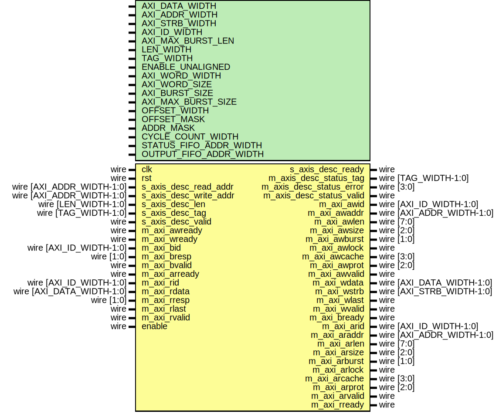

# Entity: axi_cdma

- **File**: axi_cdma.v
## Diagram

## Description

Language: Verilog 2001
 
## Generics

| Generic name           | Type | Value                               | Description                                  |
| ---------------------- | ---- | ----------------------------------- | -------------------------------------------- |
| AXI_DATA_WIDTH         |      | 32                                  | Width of data bus in bits                    |
| AXI_ADDR_WIDTH         |      | 16                                  | Width of address bus in bits                 |
| AXI_STRB_WIDTH         |      | undefined                           | Width of wstrb (width of data bus in words)  |
| AXI_ID_WIDTH           |      | 8                                   | Width of AXI ID signal                       |
| AXI_MAX_BURST_LEN      |      | 16                                  | Maximum AXI burst length to generate         |
| LEN_WIDTH              |      | 20                                  | Width of length field                        |
| TAG_WIDTH              |      | 8                                   | Width of tag field                           |
| ENABLE_UNALIGNED       |      | 0                                   | Enable support for unaligned transfers       |
| AXI_WORD_WIDTH         |      | AXI_STRB_WIDTH                      |                                              |
| AXI_WORD_SIZE          |      | AXI_DATA_WIDTH/AXI_WORD_WIDTH       |                                              |
| AXI_BURST_SIZE         |      | $clog2(AXI_STRB_WIDTH)              |                                              |
| AXI_MAX_BURST_SIZE     |      | AXI_MAX_BURST_LEN << AXI_BURST_SIZE |                                              |
| OFFSET_WIDTH           |      | $clog2(AXI_STRB_WIDTH)              |                                              |
| OFFSET_MASK            |      | undefined                           |                                              |
| ADDR_MASK              |      | $clog2(AXI_STRB_WIDTH)              |                                              |
| CYCLE_COUNT_WIDTH      |      | LEN_WIDTH - AXI_BURST_SIZE + 1      |                                              |
| STATUS_FIFO_ADDR_WIDTH |      | 5                                   |                                              |
## Ports

| Port name                | Direction | Type                      | Description |
| ------------------------ | --------- | ------------------------- | ----------- |
| clk                      | input     | wire                      |             |
| rst                      | input     | wire                      |             |
| s_axis_desc_read_addr    | input     | wire [AXI_ADDR_WIDTH-1:0] |             |
| s_axis_desc_write_addr   | input     | wire [AXI_ADDR_WIDTH-1:0] |             |
| s_axis_desc_len          | input     | wire [LEN_WIDTH-1:0]      |             |
| s_axis_desc_tag          | input     | wire [TAG_WIDTH-1:0]      |             |
| s_axis_desc_valid        | input     | wire                      |             |
| s_axis_desc_ready        | output    | wire                      |             |
| m_axis_desc_status_tag   | output    | wire [TAG_WIDTH-1:0]      |             |
| m_axis_desc_status_valid | output    | wire                      |             |
| m_axi_awid               | output    | wire [AXI_ID_WIDTH-1:0]   |             |
| m_axi_awaddr             | output    | wire [AXI_ADDR_WIDTH-1:0] |             |
| m_axi_awlen              | output    | wire [7:0]                |             |
| m_axi_awsize             | output    | wire [2:0]                |             |
| m_axi_awburst            | output    | wire [1:0]                |             |
| m_axi_awlock             | output    | wire                      |             |
| m_axi_awcache            | output    | wire [3:0]                |             |
| m_axi_awprot             | output    | wire [2:0]                |             |
| m_axi_awvalid            | output    | wire                      |             |
| m_axi_awready            | input     | wire                      |             |
| m_axi_wdata              | output    | wire [AXI_DATA_WIDTH-1:0] |             |
| m_axi_wstrb              | output    | wire [AXI_STRB_WIDTH-1:0] |             |
| m_axi_wlast              | output    | wire                      |             |
| m_axi_wvalid             | output    | wire                      |             |
| m_axi_wready             | input     | wire                      |             |
| m_axi_bid                | input     | wire [AXI_ID_WIDTH-1:0]   |             |
| m_axi_bresp              | input     | wire [1:0]                |             |
| m_axi_bvalid             | input     | wire                      |             |
| m_axi_bready             | output    | wire                      |             |
| m_axi_arid               | output    | wire [AXI_ID_WIDTH-1:0]   |             |
| m_axi_araddr             | output    | wire [AXI_ADDR_WIDTH-1:0] |             |
| m_axi_arlen              | output    | wire [7:0]                |             |
| m_axi_arsize             | output    | wire [2:0]                |             |
| m_axi_arburst            | output    | wire [1:0]                |             |
| m_axi_arlock             | output    | wire                      |             |
| m_axi_arcache            | output    | wire [3:0]                |             |
| m_axi_arprot             | output    | wire [2:0]                |             |
| m_axi_arvalid            | output    | wire                      |             |
| m_axi_arready            | input     | wire                      |             |
| m_axi_rid                | input     | wire [AXI_ID_WIDTH-1:0]   |             |
| m_axi_rdata              | input     | wire [AXI_DATA_WIDTH-1:0] |             |
| m_axi_rresp              | input     | wire [1:0]                |             |
| m_axi_rlast              | input     | wire                      |             |
| m_axi_rvalid             | input     | wire                      |             |
| m_axi_rready             | output    | wire                      |             |
| enable                   | input     | wire                      |             |
## Signals

| Name                            | Type                               | Description               |
| ------------------------------- | ---------------------------------- | ------------------------- |
| read_state_reg                  | reg [1:0]                          |                           |
| read_state_next                 | reg [1:0]                          |                           |
| axi_state_reg                   | reg [0:0]                          |                           |
| axi_state_next                  | reg [0:0]                          |                           |
| transfer_in_save                | reg                                | datapath control signals  |
| axi_cmd_ready                   | reg                                |                           |
| status_fifo_we                  | reg                                |                           |
| read_addr_reg                   | reg [AXI_ADDR_WIDTH-1:0]           |                           |
| read_addr_next                  | reg [AXI_ADDR_WIDTH-1:0]           |                           |
| write_addr_reg                  | reg [AXI_ADDR_WIDTH-1:0]           |                           |
| write_addr_next                 | reg [AXI_ADDR_WIDTH-1:0]           |                           |
| op_word_count_reg               | reg [LEN_WIDTH-1:0]                |                           |
| op_word_count_next              | reg [LEN_WIDTH-1:0]                |                           |
| tr_word_count_reg               | reg [LEN_WIDTH-1:0]                |                           |
| tr_word_count_next              | reg [LEN_WIDTH-1:0]                |                           |
| axi_word_count_reg              | reg [LEN_WIDTH-1:0]                |                           |
| axi_word_count_next             | reg [LEN_WIDTH-1:0]                |                           |
| axi_cmd_addr_reg                | reg [AXI_ADDR_WIDTH-1:0]           |                           |
| axi_cmd_addr_next               | reg [AXI_ADDR_WIDTH-1:0]           |                           |
| axi_cmd_offset_reg              | reg [OFFSET_WIDTH-1:0]             |                           |
| axi_cmd_offset_next             | reg [OFFSET_WIDTH-1:0]             |                           |
| axi_cmd_first_cycle_offset_reg  | reg [OFFSET_WIDTH-1:0]             |                           |
| axi_cmd_first_cycle_offset_next | reg [OFFSET_WIDTH-1:0]             |                           |
| axi_cmd_last_cycle_offset_reg   | reg [OFFSET_WIDTH-1:0]             |                           |
| axi_cmd_last_cycle_offset_next  | reg [OFFSET_WIDTH-1:0]             |                           |
| axi_cmd_input_cycle_count_reg   | reg [CYCLE_COUNT_WIDTH-1:0]        |                           |
| axi_cmd_input_cycle_count_next  | reg [CYCLE_COUNT_WIDTH-1:0]        |                           |
| axi_cmd_output_cycle_count_reg  | reg [CYCLE_COUNT_WIDTH-1:0]        |                           |
| axi_cmd_output_cycle_count_next | reg [CYCLE_COUNT_WIDTH-1:0]        |                           |
| axi_cmd_bubble_cycle_reg        | reg                                |                           |
| axi_cmd_bubble_cycle_next       | reg                                |                           |
| axi_cmd_last_transfer_reg       | reg                                |                           |
| axi_cmd_last_transfer_next      | reg                                |                           |
| axi_cmd_tag_reg                 | reg [TAG_WIDTH-1:0]                |                           |
| axi_cmd_tag_next                | reg [TAG_WIDTH-1:0]                |                           |
| axi_cmd_valid_reg               | reg                                |                           |
| axi_cmd_valid_next              | reg                                |                           |
| offset_reg                      | reg [OFFSET_WIDTH-1:0]             |                           |
| offset_next                     | reg [OFFSET_WIDTH-1:0]             |                           |
| first_cycle_offset_reg          | reg [OFFSET_WIDTH-1:0]             |                           |
| first_cycle_offset_next         | reg [OFFSET_WIDTH-1:0]             |                           |
| last_cycle_offset_reg           | reg [OFFSET_WIDTH-1:0]             |                           |
| last_cycle_offset_next          | reg [OFFSET_WIDTH-1:0]             |                           |
| input_cycle_count_reg           | reg [CYCLE_COUNT_WIDTH-1:0]        |                           |
| input_cycle_count_next          | reg [CYCLE_COUNT_WIDTH-1:0]        |                           |
| output_cycle_count_reg          | reg [CYCLE_COUNT_WIDTH-1:0]        |                           |
| output_cycle_count_next         | reg [CYCLE_COUNT_WIDTH-1:0]        |                           |
| input_active_reg                | reg                                |                           |
| input_active_next               | reg                                |                           |
| output_active_reg               | reg                                |                           |
| output_active_next              | reg                                |                           |
| bubble_cycle_reg                | reg                                |                           |
| bubble_cycle_next               | reg                                |                           |
| first_input_cycle_reg           | reg                                |                           |
| first_input_cycle_next          | reg                                |                           |
| first_output_cycle_reg          | reg                                |                           |
| first_output_cycle_next         | reg                                |                           |
| output_last_cycle_reg           | reg                                |                           |
| output_last_cycle_next          | reg                                |                           |
| last_transfer_reg               | reg                                |                           |
| last_transfer_next              | reg                                |                           |
| tag_reg                         | reg [TAG_WIDTH-1:0]                |                           |
| tag_next                        | reg [TAG_WIDTH-1:0]                |                           |
| status_fifo_wr_ptr_reg          | reg [STATUS_FIFO_ADDR_WIDTH+1-1:0] |                           |
| status_fifo_rd_ptr_reg          | reg [STATUS_FIFO_ADDR_WIDTH+1-1:0] |                           |
| status_fifo_rd_ptr_next         | reg [STATUS_FIFO_ADDR_WIDTH+1-1:0] |                           |
| status_fifo_tag                 | reg [TAG_WIDTH-1:0]                |                           |
| status_fifo_last                | reg                                |                           |
| status_fifo_wr_tag              | reg [TAG_WIDTH-1:0]                |                           |
| status_fifo_wr_last             | reg                                |                           |
| active_count_reg                | reg [STATUS_FIFO_ADDR_WIDTH+1-1:0] |                           |
| active_count_av_reg             | reg                                |                           |
| inc_active                      | reg                                |                           |
| dec_active                      | reg                                |                           |
| s_axis_desc_ready_reg           | reg                                |                           |
| s_axis_desc_ready_next          | reg                                |                           |
| m_axis_desc_status_tag_reg      | reg [TAG_WIDTH-1:0]                |                           |
| m_axis_desc_status_tag_next     | reg [TAG_WIDTH-1:0]                |                           |
| m_axis_desc_status_valid_reg    | reg                                |                           |
| m_axis_desc_status_valid_next   | reg                                |                           |
| m_axi_araddr_reg                | reg [AXI_ADDR_WIDTH-1:0]           |                           |
| m_axi_araddr_next               | reg [AXI_ADDR_WIDTH-1:0]           |                           |
| m_axi_arlen_reg                 | reg [7:0]                          |                           |
| m_axi_arlen_next                | reg [7:0]                          |                           |
| m_axi_arvalid_reg               | reg                                |                           |
| m_axi_arvalid_next              | reg                                |                           |
| m_axi_rready_reg                | reg                                |                           |
| m_axi_rready_next               | reg                                |                           |
| m_axi_awaddr_reg                | reg [AXI_ADDR_WIDTH-1:0]           |                           |
| m_axi_awaddr_next               | reg [AXI_ADDR_WIDTH-1:0]           |                           |
| m_axi_awlen_reg                 | reg [7:0]                          |                           |
| m_axi_awlen_next                | reg [7:0]                          |                           |
| m_axi_awvalid_reg               | reg                                |                           |
| m_axi_awvalid_next              | reg                                |                           |
| m_axi_bready_reg                | reg                                |                           |
| m_axi_bready_next               | reg                                |                           |
| save_axi_rdata_reg              | reg [AXI_DATA_WIDTH-1:0]           |                           |
| shift_axi_rdata                 | wire [AXI_DATA_WIDTH-1:0]          |                           |
| m_axi_wdata_int                 | reg  [AXI_DATA_WIDTH-1:0]          | internal datapath         |
| m_axi_wstrb_int                 | reg  [AXI_STRB_WIDTH-1:0]          |                           |
| m_axi_wlast_int                 | reg                                |                           |
| m_axi_wvalid_int                | reg                                |                           |
| m_axi_wready_int_reg            | reg                                |                           |
| m_axi_wready_int_early          | wire                               |                           |
| m_axi_wdata_reg                 | reg [AXI_DATA_WIDTH-1:0]           | output datapath logic     |
| m_axi_wstrb_reg                 | reg [AXI_STRB_WIDTH-1:0]           |                           |
| m_axi_wlast_reg                 | reg                                |                           |
| m_axi_wvalid_reg                | reg                                |                           |
| m_axi_wvalid_next               | reg                                |                           |
| temp_m_axi_wdata_reg            | reg [AXI_DATA_WIDTH-1:0]           |                           |
| temp_m_axi_wstrb_reg            | reg [AXI_STRB_WIDTH-1:0]           |                           |
| temp_m_axi_wlast_reg            | reg                                |                           |
| temp_m_axi_wvalid_reg           | reg                                |                           |
| temp_m_axi_wvalid_next          | reg                                |                           |
| store_axi_w_int_to_output       | reg                                | datapath control          |
| store_axi_w_int_to_temp         | reg                                |                           |
| store_axi_w_temp_to_output      | reg                                |                           |
## Constants

| Name             | Type  | Value | Description |
| ---------------- | ----- | ----- | ----------- |
| READ_STATE_IDLE  | [1:0] | 2'd0  |             |
| READ_STATE_START | [1:0] | 2'd1  |             |
| READ_STATE_REQ   | [1:0] | 2'd2  |             |
| AXI_STATE_IDLE   | [0:0] | 1'd0  |             |
| AXI_STATE_WRITE  | [0:0] | 1'd1  |             |
## Processes
- unnamed: ( @* )
- unnamed: ( @* )
- unnamed: ( @(posedge clk) )
- unnamed: ( @* )
- unnamed: ( @(posedge clk) )
