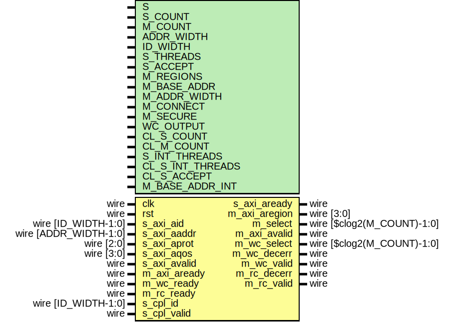

# Entity: axi_crossbar_addr

- **File**: axi_crossbar_addr.v
## Diagram

## Description

 Language: Verilog 2001

## Generics

| Generic name     | Type | Value                                        | Description                                                                                                                                                                  |
| ---------------- | ---- | -------------------------------------------- | ---------------------------------------------------------------------------------------------------------------------------------------------------------------------------- |
| S                |      | 0                                            |  Slave interface index                                                                                                                                                       |
| S_COUNT          |      | 4                                            |  Number of AXI inputs (slave interfaces)                                                                                                                                     |
| M_COUNT          |      | 4                                            |  Number of AXI outputs (master interfaces)                                                                                                                                   |
| ADDR_WIDTH       |      | 32                                           |  Width of address bus in bits                                                                                                                                                |
| ID_WIDTH         |      | 8                                            |  ID field width                                                                                                                                                              |
| S_THREADS        |      | 32'd2                                        |  Number of concurrent unique IDs                                                                                                                                             |
| S_ACCEPT         |      | 32'd16                                       |  Number of concurrent operations                                                                                                                                             |
| M_REGIONS        |      | 1                                            |  Number of regions per master interface                                                                                                                                      |
| M_BASE_ADDR      |      | 0                                            |  Master interface base addresses  M_COUNT concatenated fields of M_REGIONS concatenated fields of ADDR_WIDTH bits  set to zero for default addressing based on M_ADDR_WIDTH  |
| M_ADDR_WIDTH     |      | undefined                                    |  Master interface address widths  M_COUNT concatenated fields of M_REGIONS concatenated fields of 32 bits                                                                    |
| M_CONNECT        |      | undefined                                    |  Connections between interfaces  M_COUNT concatenated fields of S_COUNT bits                                                                                                 |
| M_SECURE         |      | undefined                                    |  Secure master (fail operations based on awprot/arprot)  M_COUNT bits                                                                                                        |
| WC_OUTPUT        |      | 0                                            |  Enable write command output                                                                                                                                                 |
| CL_S_COUNT       |      | $clog2(S_COUNT)                              |                                                                                                                                                                              |
| CL_M_COUNT       |      | $clog2(M_COUNT)                              |                                                                                                                                                                              |
| S_INT_THREADS    |      | S_THREADS > S_ACCEPT ? S_ACCEPT : S_THREADS  |                                                                                                                                                                              |
| CL_S_INT_THREADS |      | $clog2(S_INT_THREADS)                        |                                                                                                                                                                              |
| CL_S_ACCEPT      |      | $clog2(S_ACCEPT)                             |                                                                                                                                                                              |
| M_BASE_ADDR_INT  |      | M_BASE_ADDR ? M_BASE_ADDR : calcBaseAddrs(0) |                                                                                                                                                                              |
## Ports

| Port name     | Direction | Type                       | Description                          |
| ------------- | --------- | -------------------------- | ------------------------------------ |
| clk           | input     | wire                       |                                      |
| rst           | input     | wire                       |                                      |
| s_axi_aid     | input     | wire [ID_WIDTH-1:0]        |      * Address input      */         |
| s_axi_aaddr   | input     | wire [ADDR_WIDTH-1:0]      |                                      |
| s_axi_aprot   | input     | wire [2:0]                 |                                      |
| s_axi_aqos    | input     | wire [3:0]                 |                                      |
| s_axi_avalid  | input     | wire                       |                                      |
| s_axi_aready  | output    | wire                       |                                      |
| m_axi_aregion | output    | wire [3:0]                 |      * Address output      */        |
| m_select      | output    | wire [$clog2(M_COUNT)-1:0] |                                      |
| m_axi_avalid  | output    | wire                       |                                      |
| m_axi_aready  | input     | wire                       |                                      |
| m_wc_select   | output    | wire [$clog2(M_COUNT)-1:0] |      * Write command output      */  |
| m_wc_decerr   | output    | wire                       |                                      |
| m_wc_valid    | output    | wire                       |                                      |
| m_wc_ready    | input     | wire                       |                                      |
| m_rc_decerr   | output    | wire                       |      * Reply command output      */  |
| m_rc_valid    | output    | wire                       |                                      |
| m_rc_ready    | input     | wire                       |                                      |
| s_cpl_id      | input     | wire [ID_WIDTH-1:0]        |      * Completion input      */      |
| s_cpl_valid   | input     | wire                       |                                      |
## Signals

| Name                  | Type                         | Description                   |
| --------------------- | ---------------------------- | ----------------------------- |
| i                     | integer                      |                               |
| j                     | integer                      |                               |
| state_reg             | reg [2:0]                    |                               |
| state_next            | reg [2:0]                    |                               |
| s_axi_aready_reg      | reg                          |                               |
| s_axi_aready_next     | reg                          |                               |
| m_axi_aregion_reg     | reg [3:0]                    |                               |
| m_axi_aregion_next    | reg [3:0]                    |                               |
| m_select_reg          | reg [CL_M_COUNT-1:0]         |                               |
| m_select_next         | reg [CL_M_COUNT-1:0]         |                               |
| m_axi_avalid_reg      | reg                          |                               |
| m_axi_avalid_next     | reg                          |                               |
| m_decerr_reg          | reg                          |                               |
| m_decerr_next         | reg                          |                               |
| m_wc_valid_reg        | reg                          |                               |
| m_wc_valid_next       | reg                          |                               |
| m_rc_valid_reg        | reg                          |                               |
| m_rc_valid_next       | reg                          |                               |
| match                 | reg                          |                               |
| trans_start           | reg                          |                               |
| trans_complete        | reg                          |                               |
| trans_count_reg       | reg [$clog2(S_ACCEPT+1)-1:0] |                               |
| trans_limit           | wire                         |                               |
| thread_id_reg         | reg [ID_WIDTH-1:0]           |  transfer ID thread tracking  |
| thread_m_reg          | reg [CL_M_COUNT-1:0]         |                               |
| thread_region_reg     | reg [3:0]                    |                               |
| thread_count_reg      | reg [$clog2(S_ACCEPT+1)-1:0] |                               |
| thread_active         | wire [S_INT_THREADS-1:0]     |                               |
| thread_match          | wire [S_INT_THREADS-1:0]     |                               |
| thread_match_dest     | wire [S_INT_THREADS-1:0]     |                               |
| thread_cpl_match      | wire [S_INT_THREADS-1:0]     |                               |
| thread_trans_start    | wire [S_INT_THREADS-1:0]     |                               |
| thread_trans_complete | wire [S_INT_THREADS-1:0]     |                               |
## Constants

| Name         | Type  | Value | Description |
| ------------ | ----- | ----- | ----------- |
| STATE_IDLE   | [2:0] | 3'd0  |             |
| STATE_DECODE | [2:0] | 3'd1  |             |
## Functions
- calcBaseAddrs (input [31:0]) return ([M_COUNT*M_REGIONS*ADDR_WIDTH-1:0])
 **Description**
 default address computation

## Processes
- unnamed: ( @* )
  - **Type:** always
- unnamed: ( @(posedge clk) )
  - **Type:** always
