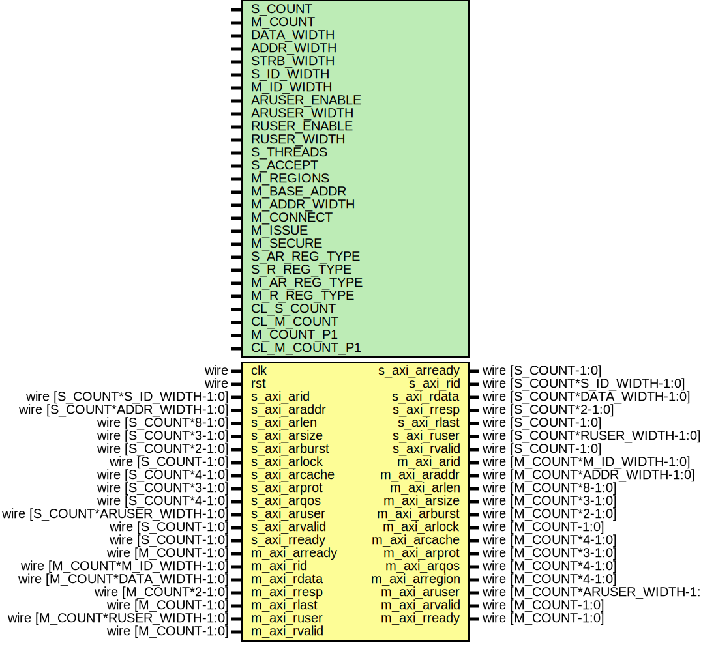

# Entity: axi_crossbar_rd

- **File**: axi_crossbar_rd.v
## Diagram

## Description

 Language: Verilog 2001

## Generics

| Generic name  | Type | Value                      | Description                                                                                                                                                                  |
| ------------- | ---- | -------------------------- | ---------------------------------------------------------------------------------------------------------------------------------------------------------------------------- |
| S_COUNT       |      | 4                          |  Number of AXI inputs (slave interfaces)                                                                                                                                     |
| M_COUNT       |      | 4                          |  Number of AXI outputs (master interfaces)                                                                                                                                   |
| DATA_WIDTH    |      | 32                         |  Width of data bus in bits                                                                                                                                                   |
| ADDR_WIDTH    |      | 32                         |  Width of address bus in bits                                                                                                                                                |
| STRB_WIDTH    |      | undefined                  |  Width of wstrb (width of data bus in words)                                                                                                                                 |
| S_ID_WIDTH    |      | 8                          |  Input ID field width (from AXI masters)                                                                                                                                     |
| M_ID_WIDTH    |      | S_ID_WIDTH+$clog2(S_COUNT) |  Output ID field width (towards AXI slaves)  Additional bits required for response routing                                                                                   |
| ARUSER_ENABLE |      | 0                          |  Propagate aruser signal                                                                                                                                                     |
| ARUSER_WIDTH  |      | 1                          |  Width of aruser signal                                                                                                                                                      |
| RUSER_ENABLE  |      | 0                          |  Propagate ruser signal                                                                                                                                                      |
| RUSER_WIDTH   |      | 1                          |  Width of ruser signal                                                                                                                                                       |
| S_THREADS     |      | undefined                  |  Number of concurrent unique IDs for each slave interface  S_COUNT concatenated fields of 32 bits                                                                            |
| S_ACCEPT      |      | undefined                  |  Number of concurrent operations for each slave interface  S_COUNT concatenated fields of 32 bits                                                                            |
| M_REGIONS     |      | 1                          |  Number of regions per master interface                                                                                                                                      |
| M_BASE_ADDR   |      | 0                          |  Master interface base addresses  M_COUNT concatenated fields of M_REGIONS concatenated fields of ADDR_WIDTH bits  set to zero for default addressing based on M_ADDR_WIDTH  |
| M_ADDR_WIDTH  |      | undefined                  |  Master interface address widths  M_COUNT concatenated fields of M_REGIONS concatenated fields of 32 bits                                                                    |
| M_CONNECT     |      | undefined                  |  Read connections between interfaces  M_COUNT concatenated fields of S_COUNT bits                                                                                            |
| M_ISSUE       |      | undefined                  |  Number of concurrent operations for each master interface  M_COUNT concatenated fields of 32 bits                                                                           |
| M_SECURE      |      | undefined                  |  Secure master (fail operations based on awprot/arprot)  M_COUNT bits                                                                                                        |
| S_AR_REG_TYPE |      | undefined                  |  Slave interface AR channel register type (input)  0 to bypass, 1 for simple buffer, 2 for skid buffer                                                                       |
| S_R_REG_TYPE  |      | undefined                  |  Slave interface R channel register type (output)  0 to bypass, 1 for simple buffer, 2 for skid buffer                                                                       |
| M_AR_REG_TYPE |      | undefined                  |  Master interface AR channel register type (output)  0 to bypass, 1 for simple buffer, 2 for skid buffer                                                                     |
| M_R_REG_TYPE  |      | undefined                  |  Master interface R channel register type (input)  0 to bypass, 1 for simple buffer, 2 for skid buffer                                                                       |
| CL_S_COUNT    |      | $clog2(S_COUNT)            |                                                                                                                                                                              |
| CL_M_COUNT    |      | $clog2(M_COUNT)            |                                                                                                                                                                              |
| M_COUNT_P1    |      | M_COUNT+1                  |                                                                                                                                                                              |
| CL_M_COUNT_P1 |      | $clog2(M_COUNT_P1)         |                                                                                                                                                                              |
## Ports

| Port name      | Direction | Type                            | Description                           |
| -------------- | --------- | ------------------------------- | ------------------------------------- |
| clk            | input     | wire                            |                                       |
| rst            | input     | wire                            |                                       |
| s_axi_arid     | input     | wire [S_COUNT*S_ID_WIDTH-1:0]   |      * AXI slave interfaces      */   |
| s_axi_araddr   | input     | wire [S_COUNT*ADDR_WIDTH-1:0]   |                                       |
| s_axi_arlen    | input     | wire [S_COUNT*8-1:0]            |                                       |
| s_axi_arsize   | input     | wire [S_COUNT*3-1:0]            |                                       |
| s_axi_arburst  | input     | wire [S_COUNT*2-1:0]            |                                       |
| s_axi_arlock   | input     | wire [S_COUNT-1:0]              |                                       |
| s_axi_arcache  | input     | wire [S_COUNT*4-1:0]            |                                       |
| s_axi_arprot   | input     | wire [S_COUNT*3-1:0]            |                                       |
| s_axi_arqos    | input     | wire [S_COUNT*4-1:0]            |                                       |
| s_axi_aruser   | input     | wire [S_COUNT*ARUSER_WIDTH-1:0] |                                       |
| s_axi_arvalid  | input     | wire [S_COUNT-1:0]              |                                       |
| s_axi_arready  | output    | wire [S_COUNT-1:0]              |                                       |
| s_axi_rid      | output    | wire [S_COUNT*S_ID_WIDTH-1:0]   |                                       |
| s_axi_rdata    | output    | wire [S_COUNT*DATA_WIDTH-1:0]   |                                       |
| s_axi_rresp    | output    | wire [S_COUNT*2-1:0]            |                                       |
| s_axi_rlast    | output    | wire [S_COUNT-1:0]              |                                       |
| s_axi_ruser    | output    | wire [S_COUNT*RUSER_WIDTH-1:0]  |                                       |
| s_axi_rvalid   | output    | wire [S_COUNT-1:0]              |                                       |
| s_axi_rready   | input     | wire [S_COUNT-1:0]              |                                       |
| m_axi_arid     | output    | wire [M_COUNT*M_ID_WIDTH-1:0]   |      * AXI master interfaces      */  |
| m_axi_araddr   | output    | wire [M_COUNT*ADDR_WIDTH-1:0]   |                                       |
| m_axi_arlen    | output    | wire [M_COUNT*8-1:0]            |                                       |
| m_axi_arsize   | output    | wire [M_COUNT*3-1:0]            |                                       |
| m_axi_arburst  | output    | wire [M_COUNT*2-1:0]            |                                       |
| m_axi_arlock   | output    | wire [M_COUNT-1:0]              |                                       |
| m_axi_arcache  | output    | wire [M_COUNT*4-1:0]            |                                       |
| m_axi_arprot   | output    | wire [M_COUNT*3-1:0]            |                                       |
| m_axi_arqos    | output    | wire [M_COUNT*4-1:0]            |                                       |
| m_axi_arregion | output    | wire [M_COUNT*4-1:0]            |                                       |
| m_axi_aruser   | output    | wire [M_COUNT*ARUSER_WIDTH-1:0] |                                       |
| m_axi_arvalid  | output    | wire [M_COUNT-1:0]              |                                       |
| m_axi_arready  | input     | wire [M_COUNT-1:0]              |                                       |
| m_axi_rid      | input     | wire [M_COUNT*M_ID_WIDTH-1:0]   |                                       |
| m_axi_rdata    | input     | wire [M_COUNT*DATA_WIDTH-1:0]   |                                       |
| m_axi_rresp    | input     | wire [M_COUNT*2-1:0]            |                                       |
| m_axi_rlast    | input     | wire [M_COUNT-1:0]              |                                       |
| m_axi_ruser    | input     | wire [M_COUNT*RUSER_WIDTH-1:0]  |                                       |
| m_axi_rvalid   | input     | wire [M_COUNT-1:0]              |                                       |
| m_axi_rready   | output    | wire [M_COUNT-1:0]              |                                       |
## Signals

| Name               | Type                            | Description |
| ------------------ | ------------------------------- | ----------- |
| i                  | integer                         |             |
| int_s_axi_arid     | wire [S_COUNT*S_ID_WIDTH-1:0]   |             |
| int_s_axi_araddr   | wire [S_COUNT*ADDR_WIDTH-1:0]   |             |
| int_s_axi_arlen    | wire [S_COUNT*8-1:0]            |             |
| int_s_axi_arsize   | wire [S_COUNT*3-1:0]            |             |
| int_s_axi_arburst  | wire [S_COUNT*2-1:0]            |             |
| int_s_axi_arlock   | wire [S_COUNT-1:0]              |             |
| int_s_axi_arcache  | wire [S_COUNT*4-1:0]            |             |
| int_s_axi_arprot   | wire [S_COUNT*3-1:0]            |             |
| int_s_axi_arqos    | wire [S_COUNT*4-1:0]            |             |
| int_s_axi_arregion | wire [S_COUNT*4-1:0]            |             |
| int_s_axi_aruser   | wire [S_COUNT*ARUSER_WIDTH-1:0] |             |
| int_s_axi_arvalid  | wire [S_COUNT-1:0]              |             |
| int_s_axi_arready  | wire [S_COUNT-1:0]              |             |
| int_axi_arvalid    | wire [S_COUNT*M_COUNT-1:0]      |             |
| int_axi_arready    | wire [M_COUNT*S_COUNT-1:0]      |             |
| int_m_axi_rid      | wire [M_COUNT*M_ID_WIDTH-1:0]   |             |
| int_m_axi_rdata    | wire [M_COUNT*DATA_WIDTH-1:0]   |             |
| int_m_axi_rresp    | wire [M_COUNT*2-1:0]            |             |
| int_m_axi_rlast    | wire [M_COUNT-1:0]              |             |
| int_m_axi_ruser    | wire [M_COUNT*RUSER_WIDTH-1:0]  |             |
| int_m_axi_rvalid   | wire [M_COUNT-1:0]              |             |
| int_m_axi_rready   | wire [M_COUNT-1:0]              |             |
| int_axi_rvalid     | wire [M_COUNT*S_COUNT-1:0]      |             |
| int_axi_rready     | wire [S_COUNT*M_COUNT-1:0]      |             |
