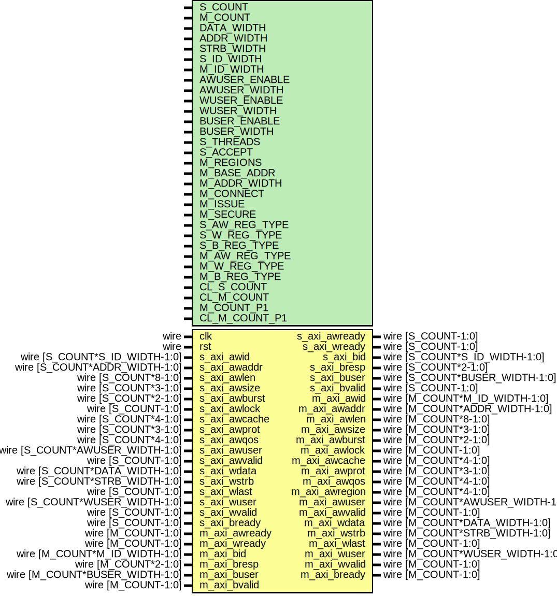

# Entity: axi_crossbar_wr

- **File**: axi_crossbar_wr.v
## Diagram

## Description

Language: Verilog 2001
 
## Generics

| Generic name  | Type | Value                      | Description                                                                                                                                                               |
| ------------- | ---- | -------------------------- | ------------------------------------------------------------------------------------------------------------------------------------------------------------------------- |
| S_COUNT       |      | 4                          | Number of AXI inputs (slave interfaces)                                                                                                                                   |
| M_COUNT       |      | 4                          | Number of AXI outputs (master interfaces)                                                                                                                                 |
| DATA_WIDTH    |      | 32                         | Width of data bus in bits                                                                                                                                                 |
| ADDR_WIDTH    |      | 32                         | Width of address bus in bits                                                                                                                                              |
| STRB_WIDTH    |      | undefined                  | Width of wstrb (width of data bus in words)                                                                                                                               |
| S_ID_WIDTH    |      | 8                          | Input ID field width (from AXI masters)                                                                                                                                   |
| M_ID_WIDTH    |      | S_ID_WIDTH+$clog2(S_COUNT) | Output ID field width (towards AXI slaves) Additional bits required for response routing                                                                                  |
| AWUSER_ENABLE |      | 0                          | Propagate awuser signal                                                                                                                                                   |
| AWUSER_WIDTH  |      | 1                          | Width of awuser signal                                                                                                                                                    |
| WUSER_ENABLE  |      | 0                          | Propagate wuser signal                                                                                                                                                    |
| WUSER_WIDTH   |      | 1                          | Width of wuser signal                                                                                                                                                     |
| BUSER_ENABLE  |      | 0                          | Propagate buser signal                                                                                                                                                    |
| BUSER_WIDTH   |      | 1                          | Width of buser signal                                                                                                                                                     |
| S_THREADS     |      | undefined                  | Number of concurrent unique IDs for each slave interface S_COUNT concatenated fields of 32 bits                                                                           |
| S_ACCEPT      |      | undefined                  | Number of concurrent operations for each slave interface S_COUNT concatenated fields of 32 bits                                                                           |
| M_REGIONS     |      | 1                          | Number of regions per master interface                                                                                                                                    |
| M_BASE_ADDR   |      | 0                          | Master interface base addresses M_COUNT concatenated fields of M_REGIONS concatenated fields of ADDR_WIDTH bits set to zero for default addressing based on M_ADDR_WIDTH  |
| M_ADDR_WIDTH  |      | undefined                  | Master interface address widths M_COUNT concatenated fields of M_REGIONS concatenated fields of 32 bits                                                                   |
| M_CONNECT     |      | undefined                  | Write connections between interfaces M_COUNT concatenated fields of S_COUNT bits                                                                                          |
| M_ISSUE       |      | undefined                  | Number of concurrent operations for each master interface M_COUNT concatenated fields of 32 bits                                                                          |
| M_SECURE      |      | undefined                  | Secure master (fail operations based on awprot/arprot) M_COUNT bits                                                                                                       |
| S_AW_REG_TYPE |      | undefined                  | Slave interface AW channel register type (input) 0 to bypass, 1 for simple buffer, 2 for skid buffer                                                                      |
| S_W_REG_TYPE  |      | undefined                  | Slave interface W channel register type (input) 0 to bypass, 1 for simple buffer, 2 for skid buffer                                                                       |
| S_B_REG_TYPE  |      | undefined                  | Slave interface B channel register type (output) 0 to bypass, 1 for simple buffer, 2 for skid buffer                                                                      |
| M_AW_REG_TYPE |      | undefined                  | Master interface AW channel register type (output) 0 to bypass, 1 for simple buffer, 2 for skid buffer                                                                    |
| M_W_REG_TYPE  |      | undefined                  | Master interface W channel register type (output) 0 to bypass, 1 for simple buffer, 2 for skid buffer                                                                     |
| M_B_REG_TYPE  |      | undefined                  | Master interface B channel register type (input) 0 to bypass, 1 for simple buffer, 2 for skid buffer                                                                      |
| CL_S_COUNT    |      | $clog2(S_COUNT)            |                                                                                                                                                                           |
| CL_M_COUNT    |      | $clog2(M_COUNT)            |                                                                                                                                                                           |
| M_COUNT_P1    |      | M_COUNT+1                  |                                                                                                                                                                           |
| CL_M_COUNT_P1 |      | $clog2(M_COUNT_P1)         |                                                                                                                                                                           |
## Ports

| Port name      | Direction | Type                            | Description |
| -------------- | --------- | ------------------------------- | ----------- |
| clk            | input     | wire                            |             |
| rst            | input     | wire                            |             |
| s_axi_awid     | input     | wire [S_COUNT*S_ID_WIDTH-1:0]   |             |
| s_axi_awaddr   | input     | wire [S_COUNT*ADDR_WIDTH-1:0]   |             |
| s_axi_awlen    | input     | wire [S_COUNT*8-1:0]            |             |
| s_axi_awsize   | input     | wire [S_COUNT*3-1:0]            |             |
| s_axi_awburst  | input     | wire [S_COUNT*2-1:0]            |             |
| s_axi_awlock   | input     | wire [S_COUNT-1:0]              |             |
| s_axi_awcache  | input     | wire [S_COUNT*4-1:0]            |             |
| s_axi_awprot   | input     | wire [S_COUNT*3-1:0]            |             |
| s_axi_awqos    | input     | wire [S_COUNT*4-1:0]            |             |
| s_axi_awuser   | input     | wire [S_COUNT*AWUSER_WIDTH-1:0] |             |
| s_axi_awvalid  | input     | wire [S_COUNT-1:0]              |             |
| s_axi_awready  | output    | wire [S_COUNT-1:0]              |             |
| s_axi_wdata    | input     | wire [S_COUNT*DATA_WIDTH-1:0]   |             |
| s_axi_wstrb    | input     | wire [S_COUNT*STRB_WIDTH-1:0]   |             |
| s_axi_wlast    | input     | wire [S_COUNT-1:0]              |             |
| s_axi_wuser    | input     | wire [S_COUNT*WUSER_WIDTH-1:0]  |             |
| s_axi_wvalid   | input     | wire [S_COUNT-1:0]              |             |
| s_axi_wready   | output    | wire [S_COUNT-1:0]              |             |
| s_axi_bid      | output    | wire [S_COUNT*S_ID_WIDTH-1:0]   |             |
| s_axi_bresp    | output    | wire [S_COUNT*2-1:0]            |             |
| s_axi_buser    | output    | wire [S_COUNT*BUSER_WIDTH-1:0]  |             |
| s_axi_bvalid   | output    | wire [S_COUNT-1:0]              |             |
| s_axi_bready   | input     | wire [S_COUNT-1:0]              |             |
| m_axi_awid     | output    | wire [M_COUNT*M_ID_WIDTH-1:0]   |             |
| m_axi_awaddr   | output    | wire [M_COUNT*ADDR_WIDTH-1:0]   |             |
| m_axi_awlen    | output    | wire [M_COUNT*8-1:0]            |             |
| m_axi_awsize   | output    | wire [M_COUNT*3-1:0]            |             |
| m_axi_awburst  | output    | wire [M_COUNT*2-1:0]            |             |
| m_axi_awlock   | output    | wire [M_COUNT-1:0]              |             |
| m_axi_awcache  | output    | wire [M_COUNT*4-1:0]            |             |
| m_axi_awprot   | output    | wire [M_COUNT*3-1:0]            |             |
| m_axi_awqos    | output    | wire [M_COUNT*4-1:0]            |             |
| m_axi_awregion | output    | wire [M_COUNT*4-1:0]            |             |
| m_axi_awuser   | output    | wire [M_COUNT*AWUSER_WIDTH-1:0] |             |
| m_axi_awvalid  | output    | wire [M_COUNT-1:0]              |             |
| m_axi_awready  | input     | wire [M_COUNT-1:0]              |             |
| m_axi_wdata    | output    | wire [M_COUNT*DATA_WIDTH-1:0]   |             |
| m_axi_wstrb    | output    | wire [M_COUNT*STRB_WIDTH-1:0]   |             |
| m_axi_wlast    | output    | wire [M_COUNT-1:0]              |             |
| m_axi_wuser    | output    | wire [M_COUNT*WUSER_WIDTH-1:0]  |             |
| m_axi_wvalid   | output    | wire [M_COUNT-1:0]              |             |
| m_axi_wready   | input     | wire [M_COUNT-1:0]              |             |
| m_axi_bid      | input     | wire [M_COUNT*M_ID_WIDTH-1:0]   |             |
| m_axi_bresp    | input     | wire [M_COUNT*2-1:0]            |             |
| m_axi_buser    | input     | wire [M_COUNT*BUSER_WIDTH-1:0]  |             |
| m_axi_bvalid   | input     | wire [M_COUNT-1:0]              |             |
| m_axi_bready   | output    | wire [M_COUNT-1:0]              |             |
## Signals

| Name               | Type                            | Description |
| ------------------ | ------------------------------- | ----------- |
| i                  | integer                         |             |
| int_s_axi_awid     | wire [S_COUNT*S_ID_WIDTH-1:0]   |             |
| int_s_axi_awaddr   | wire [S_COUNT*ADDR_WIDTH-1:0]   |             |
| int_s_axi_awlen    | wire [S_COUNT*8-1:0]            |             |
| int_s_axi_awsize   | wire [S_COUNT*3-1:0]            |             |
| int_s_axi_awburst  | wire [S_COUNT*2-1:0]            |             |
| int_s_axi_awlock   | wire [S_COUNT-1:0]              |             |
| int_s_axi_awcache  | wire [S_COUNT*4-1:0]            |             |
| int_s_axi_awprot   | wire [S_COUNT*3-1:0]            |             |
| int_s_axi_awqos    | wire [S_COUNT*4-1:0]            |             |
| int_s_axi_awregion | wire [S_COUNT*4-1:0]            |             |
| int_s_axi_awuser   | wire [S_COUNT*AWUSER_WIDTH-1:0] |             |
| int_s_axi_awvalid  | wire [S_COUNT-1:0]              |             |
| int_s_axi_awready  | wire [S_COUNT-1:0]              |             |
| int_axi_awvalid    | wire [S_COUNT*M_COUNT-1:0]      |             |
| int_axi_awready    | wire [M_COUNT*S_COUNT-1:0]      |             |
| int_s_axi_wdata    | wire [S_COUNT*DATA_WIDTH-1:0]   |             |
| int_s_axi_wstrb    | wire [S_COUNT*STRB_WIDTH-1:0]   |             |
| int_s_axi_wlast    | wire [S_COUNT-1:0]              |             |
| int_s_axi_wuser    | wire [S_COUNT*WUSER_WIDTH-1:0]  |             |
| int_s_axi_wvalid   | wire [S_COUNT-1:0]              |             |
| int_s_axi_wready   | wire [S_COUNT-1:0]              |             |
| int_axi_wvalid     | wire [S_COUNT*M_COUNT-1:0]      |             |
| int_axi_wready     | wire [M_COUNT*S_COUNT-1:0]      |             |
| int_m_axi_bid      | wire [M_COUNT*M_ID_WIDTH-1:0]   |             |
| int_m_axi_bresp    | wire [M_COUNT*2-1:0]            |             |
| int_m_axi_buser    | wire [M_COUNT*BUSER_WIDTH-1:0]  |             |
| int_m_axi_bvalid   | wire [M_COUNT-1:0]              |             |
| int_m_axi_bready   | wire [M_COUNT-1:0]              |             |
| int_axi_bvalid     | wire [M_COUNT*S_COUNT-1:0]      |             |
| int_axi_bready     | wire [S_COUNT*M_COUNT-1:0]      |             |
