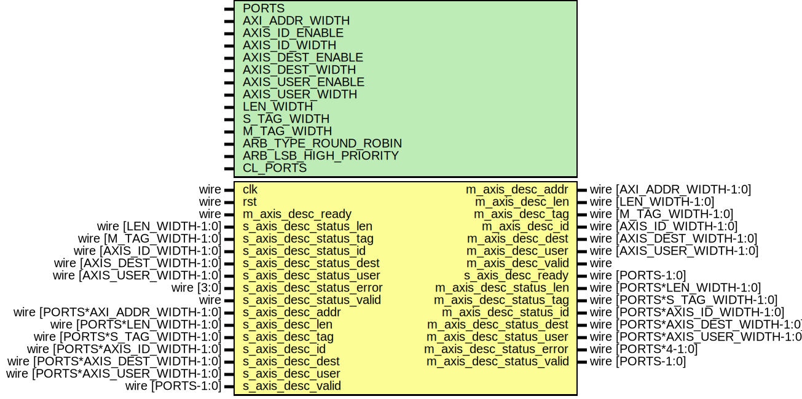

# Entity: axi_dma_desc_mux

- **File**: axi_dma_desc_mux.v
## Diagram

## Description

 Language: Verilog 2001

## Generics

| Generic name          | Type | Value                     | Description                                                                                   |
| --------------------- | ---- | ------------------------- | --------------------------------------------------------------------------------------------- |
| PORTS                 |      | 2                         |  Number of ports                                                                              |
| AXI_ADDR_WIDTH        |      | 16                        |  AXI address width                                                                            |
| AXIS_ID_ENABLE        |      | 0                         |  Propagate AXI stream tid signal                                                              |
| AXIS_ID_WIDTH         |      | 8                         |  AXI stream tid signal width                                                                  |
| AXIS_DEST_ENABLE      |      | 0                         |  Propagate AXI stream tdest signal                                                            |
| AXIS_DEST_WIDTH       |      | 8                         |  AXI stream tdest signal width                                                                |
| AXIS_USER_ENABLE      |      | 1                         |  Propagate AXI stream tuser signal                                                            |
| AXIS_USER_WIDTH       |      | 1                         |  AXI stream tuser signal width                                                                |
| LEN_WIDTH             |      | 20                        |  Length field width                                                                           |
| S_TAG_WIDTH           |      | 8                         |  Input tag field width                                                                        |
| M_TAG_WIDTH           |      | S_TAG_WIDTH+$clog2(PORTS) |  Output tag field width (towards CDMA module)  Additional bits required for response routing  |
| ARB_TYPE_ROUND_ROBIN  |      | 1                         |  select round robin arbitration                                                               |
| ARB_LSB_HIGH_PRIORITY |      | 1                         |  LSB priority selection                                                                       |
| CL_PORTS              |      | $clog2(PORTS)             |                                                                                               |
## Ports

| Port name                | Direction | Type                             | Description                                                 |
| ------------------------ | --------- | -------------------------------- | ----------------------------------------------------------- |
| clk                      | input     | wire                             |                                                             |
| rst                      | input     | wire                             |                                                             |
| m_axis_desc_addr         | output    | wire [AXI_ADDR_WIDTH-1:0]        |      * Descriptor output (to AXI DMA core)      */          |
| m_axis_desc_len          | output    | wire [LEN_WIDTH-1:0]             |                                                             |
| m_axis_desc_tag          | output    | wire [M_TAG_WIDTH-1:0]           |                                                             |
| m_axis_desc_id           | output    | wire [AXIS_ID_WIDTH-1:0]         |                                                             |
| m_axis_desc_dest         | output    | wire [AXIS_DEST_WIDTH-1:0]       |                                                             |
| m_axis_desc_user         | output    | wire [AXIS_USER_WIDTH-1:0]       |                                                             |
| m_axis_desc_valid        | output    | wire                             |                                                             |
| m_axis_desc_ready        | input     | wire                             |                                                             |
| s_axis_desc_status_len   | input     | wire [LEN_WIDTH-1:0]             |      * Descriptor status input (from AXI DMA core)      */  |
| s_axis_desc_status_tag   | input     | wire [M_TAG_WIDTH-1:0]           |                                                             |
| s_axis_desc_status_id    | input     | wire [AXIS_ID_WIDTH-1:0]         |                                                             |
| s_axis_desc_status_dest  | input     | wire [AXIS_DEST_WIDTH-1:0]       |                                                             |
| s_axis_desc_status_user  | input     | wire [AXIS_USER_WIDTH-1:0]       |                                                             |
| s_axis_desc_status_error | input     | wire [3:0]                       |                                                             |
| s_axis_desc_status_valid | input     | wire                             |                                                             |
| s_axis_desc_addr         | input     | wire [PORTS*AXI_ADDR_WIDTH-1:0]  |      * Descriptor input      */                             |
| s_axis_desc_len          | input     | wire [PORTS*LEN_WIDTH-1:0]       |                                                             |
| s_axis_desc_tag          | input     | wire [PORTS*S_TAG_WIDTH-1:0]     |                                                             |
| s_axis_desc_id           | input     | wire [PORTS*AXIS_ID_WIDTH-1:0]   |                                                             |
| s_axis_desc_dest         | input     | wire [PORTS*AXIS_DEST_WIDTH-1:0] |                                                             |
| s_axis_desc_user         | input     | wire [PORTS*AXIS_USER_WIDTH-1:0] |                                                             |
| s_axis_desc_valid        | input     | wire [PORTS-1:0]                 |                                                             |
| s_axis_desc_ready        | output    | wire [PORTS-1:0]                 |                                                             |
| m_axis_desc_status_len   | output    | wire [PORTS*LEN_WIDTH-1:0]       |      * Descriptor status output      */                     |
| m_axis_desc_status_tag   | output    | wire [PORTS*S_TAG_WIDTH-1:0]     |                                                             |
| m_axis_desc_status_id    | output    | wire [PORTS*AXIS_ID_WIDTH-1:0]   |                                                             |
| m_axis_desc_status_dest  | output    | wire [PORTS*AXIS_DEST_WIDTH-1:0] |                                                             |
| m_axis_desc_status_user  | output    | wire [PORTS*AXIS_USER_WIDTH-1:0] |                                                             |
| m_axis_desc_status_error | output    | wire [PORTS*4-1:0]               |                                                             |
| m_axis_desc_status_valid | output    | wire [PORTS-1:0]                 |                                                             |
## Signals

| Name                         | Type                       | Description               |
| ---------------------------- | -------------------------- | ------------------------- |
| request                      | wire [PORTS-1:0]           |  descriptor mux           |
| acknowledge                  | wire [PORTS-1:0]           |                           |
| grant                        | wire [PORTS-1:0]           |                           |
| grant_valid                  | wire                       |                           |
| grant_encoded                | wire [CL_PORTS-1:0]        |                           |
| m_axis_desc_addr_int         | reg  [AXI_ADDR_WIDTH-1:0]  |  internal datapath        |
| m_axis_desc_len_int          | reg  [LEN_WIDTH-1:0]       |                           |
| m_axis_desc_tag_int          | reg  [M_TAG_WIDTH-1:0]     |                           |
| m_axis_desc_id_int           | reg  [AXIS_ID_WIDTH-1:0]   |                           |
| m_axis_desc_dest_int         | reg  [AXIS_DEST_WIDTH-1:0] |                           |
| m_axis_desc_user_int         | reg  [AXIS_USER_WIDTH-1:0] |                           |
| m_axis_desc_valid_int        | reg                        |                           |
| m_axis_desc_ready_int_reg    | reg                        |                           |
| m_axis_desc_ready_int_early  | wire                       |                           |
| current_s_desc_addr          | wire [AXI_ADDR_WIDTH-1:0]  |  mux for incoming packet  |
| current_s_desc_len           | wire [LEN_WIDTH-1:0]       |                           |
| current_s_desc_tag           | wire [S_TAG_WIDTH-1:0]     |                           |
| current_s_desc_id            | wire [AXIS_ID_WIDTH-1:0]   |                           |
| current_s_desc_dest          | wire [AXIS_DEST_WIDTH-1:0] |                           |
| current_s_desc_user          | wire [AXIS_USER_WIDTH-1:0] |                           |
| current_s_desc_valid         | wire                       |                           |
| current_s_desc_ready         | wire                       |                           |
| m_axis_desc_addr_reg         | reg [AXI_ADDR_WIDTH-1:0]   |  output datapath logic    |
| m_axis_desc_len_reg          | reg [LEN_WIDTH-1:0]        |                           |
| m_axis_desc_tag_reg          | reg [M_TAG_WIDTH-1:0]      |                           |
| m_axis_desc_id_reg           | reg [AXIS_ID_WIDTH-1:0]    |                           |
| m_axis_desc_dest_reg         | reg [AXIS_DEST_WIDTH-1:0]  |                           |
| m_axis_desc_user_reg         | reg [AXIS_USER_WIDTH-1:0]  |                           |
| m_axis_desc_valid_reg        | reg                        |                           |
| m_axis_desc_valid_next       | reg                        |                           |
| temp_m_axis_desc_addr_reg    | reg [AXI_ADDR_WIDTH-1:0]   |                           |
| temp_m_axis_desc_len_reg     | reg [LEN_WIDTH-1:0]        |                           |
| temp_m_axis_desc_tag_reg     | reg [M_TAG_WIDTH-1:0]      |                           |
| temp_m_axis_desc_id_reg      | reg [AXIS_ID_WIDTH-1:0]    |                           |
| temp_m_axis_desc_dest_reg    | reg [AXIS_DEST_WIDTH-1:0]  |                           |
| temp_m_axis_desc_user_reg    | reg [AXIS_USER_WIDTH-1:0]  |                           |
| temp_m_axis_desc_valid_reg   | reg                        |                           |
| temp_m_axis_desc_valid_next  | reg                        |                           |
| store_axis_int_to_output     | reg                        |  datapath control         |
| store_axis_int_to_temp       | reg                        |                           |
| store_axis_temp_to_output    | reg                        |                           |
| m_axis_desc_status_len_reg   | reg [LEN_WIDTH-1:0]        |  descriptor status demux  |
| m_axis_desc_status_tag_reg   | reg [S_TAG_WIDTH-1:0]      |                           |
| m_axis_desc_status_id_reg    | reg [AXIS_ID_WIDTH-1:0]    |                           |
| m_axis_desc_status_dest_reg  | reg [AXIS_DEST_WIDTH-1:0]  |                           |
| m_axis_desc_status_user_reg  | reg [AXIS_USER_WIDTH-1:0]  |                           |
| m_axis_desc_status_error_reg | reg [3:0]                  |                           |
| m_axis_desc_status_valid_reg | reg [PORTS-1:0]            |                           |
## Processes
- unnamed: ( @* )
  - **Type:** always
- unnamed: ( @* )
  - **Type:** always
- unnamed: ( @(posedge clk) )
  - **Type:** always
- unnamed: ( @(posedge clk) )
  - **Type:** always
## Instantiations

- arb_inst: arbiter
**Description**
 arbiter instance

