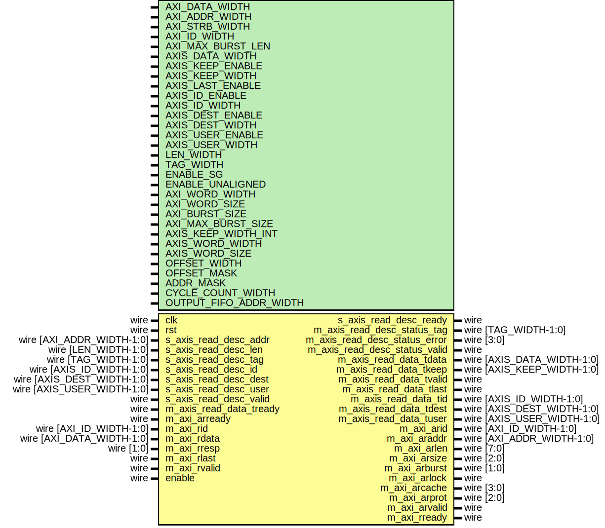

# Entity: axi_dma_rd

- **File**: axi_dma_rd.v
## Diagram

## Description

Language: Verilog 2001
 
## Generics

| Generic name        | Type | Value                                  | Description                                                                        |
| ------------------- | ---- | -------------------------------------- | ---------------------------------------------------------------------------------- |
| AXI_DATA_WIDTH      |      | 32                                     | Width of AXI data bus in bits                                                      |
| AXI_ADDR_WIDTH      |      | 16                                     | Width of AXI address bus in bits                                                   |
| AXI_STRB_WIDTH      |      | undefined                              | Width of AXI wstrb (width of data bus in words)                                    |
| AXI_ID_WIDTH        |      | 8                                      | Width of AXI ID signal                                                             |
| AXI_MAX_BURST_LEN   |      | 16                                     | Maximum AXI burst length to generate                                               |
| AXIS_DATA_WIDTH     |      | AXI_DATA_WIDTH                         | Width of AXI stream interfaces in bits                                             |
| AXIS_KEEP_ENABLE    |      | undefined                              | Use AXI stream tkeep signal                                                        |
| AXIS_KEEP_WIDTH     |      | undefined                              | AXI stream tkeep signal width (words per cycle)                                    |
| AXIS_LAST_ENABLE    |      | 1                                      | Use AXI stream tlast signal                                                        |
| AXIS_ID_ENABLE      |      | 0                                      | Propagate AXI stream tid signal                                                    |
| AXIS_ID_WIDTH       |      | 8                                      | AXI stream tid signal width                                                        |
| AXIS_DEST_ENABLE    |      | 0                                      | Propagate AXI stream tdest signal                                                  |
| AXIS_DEST_WIDTH     |      | 8                                      | AXI stream tdest signal width                                                      |
| AXIS_USER_ENABLE    |      | 1                                      | Propagate AXI stream tuser signal                                                  |
| AXIS_USER_WIDTH     |      | 1                                      | AXI stream tuser signal width                                                      |
| LEN_WIDTH           |      | 20                                     | Width of length field                                                              |
| TAG_WIDTH           |      | 8                                      | Width of tag field                                                                 |
| ENABLE_SG           |      | 0                                      | Enable support for scatter/gather DMA (multiple descriptors per AXI stream frame)  |
| ENABLE_UNALIGNED    |      | 0                                      | Enable support for unaligned transfers                                             |
| AXI_WORD_WIDTH      |      | AXI_STRB_WIDTH                         |                                                                                    |
| AXI_WORD_SIZE       |      | AXI_DATA_WIDTH/AXI_WORD_WIDTH          |                                                                                    |
| AXI_BURST_SIZE      |      | $clog2(AXI_STRB_WIDTH)                 |                                                                                    |
| AXI_MAX_BURST_SIZE  |      | AXI_MAX_BURST_LEN << AXI_BURST_SIZE    |                                                                                    |
| AXIS_KEEP_WIDTH_INT |      | AXIS_KEEP_ENABLE ? AXIS_KEEP_WIDTH : 1 |                                                                                    |
| AXIS_WORD_WIDTH     |      | AXIS_KEEP_WIDTH_INT                    |                                                                                    |
| AXIS_WORD_SIZE      |      | AXIS_DATA_WIDTH/AXIS_WORD_WIDTH        |                                                                                    |
| OFFSET_WIDTH        |      | $clog2(AXI_STRB_WIDTH)                 |                                                                                    |
| OFFSET_MASK         |      | undefined                              |                                                                                    |
| ADDR_MASK           |      | $clog2(AXI_STRB_WIDTH)                 |                                                                                    |
| CYCLE_COUNT_WIDTH   |      | LEN_WIDTH - AXI_BURST_SIZE + 1         |                                                                                    |
## Ports

| Port name                     | Direction | Type                       | Description |
| ----------------------------- | --------- | -------------------------- | ----------- |
| clk                           | input     | wire                       |             |
| rst                           | input     | wire                       |             |
| s_axis_read_desc_addr         | input     | wire [AXI_ADDR_WIDTH-1:0]  |             |
| s_axis_read_desc_len          | input     | wire [LEN_WIDTH-1:0]       |             |
| s_axis_read_desc_tag          | input     | wire [TAG_WIDTH-1:0]       |             |
| s_axis_read_desc_id           | input     | wire [AXIS_ID_WIDTH-1:0]   |             |
| s_axis_read_desc_dest         | input     | wire [AXIS_DEST_WIDTH-1:0] |             |
| s_axis_read_desc_user         | input     | wire [AXIS_USER_WIDTH-1:0] |             |
| s_axis_read_desc_valid        | input     | wire                       |             |
| s_axis_read_desc_ready        | output    | wire                       |             |
| m_axis_read_desc_status_tag   | output    | wire [TAG_WIDTH-1:0]       |             |
| m_axis_read_desc_status_valid | output    | wire                       |             |
| m_axis_read_data_tdata        | output    | wire [AXIS_DATA_WIDTH-1:0] |             |
| m_axis_read_data_tkeep        | output    | wire [AXIS_KEEP_WIDTH-1:0] |             |
| m_axis_read_data_tvalid       | output    | wire                       |             |
| m_axis_read_data_tready       | input     | wire                       |             |
| m_axis_read_data_tlast        | output    | wire                       |             |
| m_axis_read_data_tid          | output    | wire [AXIS_ID_WIDTH-1:0]   |             |
| m_axis_read_data_tdest        | output    | wire [AXIS_DEST_WIDTH-1:0] |             |
| m_axis_read_data_tuser        | output    | wire [AXIS_USER_WIDTH-1:0] |             |
| m_axi_arid                    | output    | wire [AXI_ID_WIDTH-1:0]    |             |
| m_axi_araddr                  | output    | wire [AXI_ADDR_WIDTH-1:0]  |             |
| m_axi_arlen                   | output    | wire [7:0]                 |             |
| m_axi_arsize                  | output    | wire [2:0]                 |             |
| m_axi_arburst                 | output    | wire [1:0]                 |             |
| m_axi_arlock                  | output    | wire                       |             |
| m_axi_arcache                 | output    | wire [3:0]                 |             |
| m_axi_arprot                  | output    | wire [2:0]                 |             |
| m_axi_arvalid                 | output    | wire                       |             |
| m_axi_arready                 | input     | wire                       |             |
| m_axi_rid                     | input     | wire [AXI_ID_WIDTH-1:0]    |             |
| m_axi_rdata                   | input     | wire [AXI_DATA_WIDTH-1:0]  |             |
| m_axi_rresp                   | input     | wire [1:0]                 |             |
| m_axi_rlast                   | input     | wire                       |             |
| m_axi_rvalid                  | input     | wire                       |             |
| m_axi_rready                  | output    | wire                       |             |
| enable                        | input     | wire                       |             |
## Signals

| Name                               | Type                        | Description               |
| ---------------------------------- | --------------------------- | ------------------------- |
| axi_state_reg                      | reg [0:0]                   |                           |
| axi_state_next                     | reg [0:0]                   |                           |
| axis_state_reg                     | reg [0:0]                   |                           |
| axis_state_next                    | reg [0:0]                   |                           |
| transfer_in_save                   | reg                         | datapath control signals  |
| axis_cmd_ready                     | reg                         |                           |
| addr_reg                           | reg [AXI_ADDR_WIDTH-1:0]    |                           |
| addr_next                          | reg [AXI_ADDR_WIDTH-1:0]    |                           |
| op_word_count_reg                  | reg [LEN_WIDTH-1:0]         |                           |
| op_word_count_next                 | reg [LEN_WIDTH-1:0]         |                           |
| tr_word_count_reg                  | reg [LEN_WIDTH-1:0]         |                           |
| tr_word_count_next                 | reg [LEN_WIDTH-1:0]         |                           |
| axis_cmd_offset_reg                | reg [OFFSET_WIDTH-1:0]      |                           |
| axis_cmd_offset_next               | reg [OFFSET_WIDTH-1:0]      |                           |
| axis_cmd_last_cycle_offset_reg     | reg [OFFSET_WIDTH-1:0]      |                           |
| axis_cmd_last_cycle_offset_next    | reg [OFFSET_WIDTH-1:0]      |                           |
| axis_cmd_input_cycle_count_reg     | reg [CYCLE_COUNT_WIDTH-1:0] |                           |
| axis_cmd_input_cycle_count_next    | reg [CYCLE_COUNT_WIDTH-1:0] |                           |
| axis_cmd_output_cycle_count_reg    | reg [CYCLE_COUNT_WIDTH-1:0] |                           |
| axis_cmd_output_cycle_count_next   | reg [CYCLE_COUNT_WIDTH-1:0] |                           |
| axis_cmd_bubble_cycle_reg          | reg                         |                           |
| axis_cmd_bubble_cycle_next         | reg                         |                           |
| axis_cmd_tag_reg                   | reg [TAG_WIDTH-1:0]         |                           |
| axis_cmd_tag_next                  | reg [TAG_WIDTH-1:0]         |                           |
| axis_cmd_axis_id_reg               | reg [AXIS_ID_WIDTH-1:0]     |                           |
| axis_cmd_axis_id_next              | reg [AXIS_ID_WIDTH-1:0]     |                           |
| axis_cmd_axis_dest_reg             | reg [AXIS_DEST_WIDTH-1:0]   |                           |
| axis_cmd_axis_dest_next            | reg [AXIS_DEST_WIDTH-1:0]   |                           |
| axis_cmd_axis_user_reg             | reg [AXIS_USER_WIDTH-1:0]   |                           |
| axis_cmd_axis_user_next            | reg [AXIS_USER_WIDTH-1:0]   |                           |
| axis_cmd_valid_reg                 | reg                         |                           |
| axis_cmd_valid_next                | reg                         |                           |
| offset_reg                         | reg [OFFSET_WIDTH-1:0]      |                           |
| offset_next                        | reg [OFFSET_WIDTH-1:0]      |                           |
| last_cycle_offset_reg              | reg [OFFSET_WIDTH-1:0]      |                           |
| last_cycle_offset_next             | reg [OFFSET_WIDTH-1:0]      |                           |
| input_cycle_count_reg              | reg [CYCLE_COUNT_WIDTH-1:0] |                           |
| input_cycle_count_next             | reg [CYCLE_COUNT_WIDTH-1:0] |                           |
| output_cycle_count_reg             | reg [CYCLE_COUNT_WIDTH-1:0] |                           |
| output_cycle_count_next            | reg [CYCLE_COUNT_WIDTH-1:0] |                           |
| input_active_reg                   | reg                         |                           |
| input_active_next                  | reg                         |                           |
| output_active_reg                  | reg                         |                           |
| output_active_next                 | reg                         |                           |
| bubble_cycle_reg                   | reg                         |                           |
| bubble_cycle_next                  | reg                         |                           |
| first_cycle_reg                    | reg                         |                           |
| first_cycle_next                   | reg                         |                           |
| output_last_cycle_reg              | reg                         |                           |
| output_last_cycle_next             | reg                         |                           |
| tag_reg                            | reg [TAG_WIDTH-1:0]         |                           |
| tag_next                           | reg [TAG_WIDTH-1:0]         |                           |
| axis_id_reg                        | reg [AXIS_ID_WIDTH-1:0]     |                           |
| axis_id_next                       | reg [AXIS_ID_WIDTH-1:0]     |                           |
| axis_dest_reg                      | reg [AXIS_DEST_WIDTH-1:0]   |                           |
| axis_dest_next                     | reg [AXIS_DEST_WIDTH-1:0]   |                           |
| axis_user_reg                      | reg [AXIS_USER_WIDTH-1:0]   |                           |
| axis_user_next                     | reg [AXIS_USER_WIDTH-1:0]   |                           |
| s_axis_read_desc_ready_reg         | reg                         |                           |
| s_axis_read_desc_ready_next        | reg                         |                           |
| m_axis_read_desc_status_tag_reg    | reg [TAG_WIDTH-1:0]         |                           |
| m_axis_read_desc_status_tag_next   | reg [TAG_WIDTH-1:0]         |                           |
| m_axis_read_desc_status_valid_reg  | reg                         |                           |
| m_axis_read_desc_status_valid_next | reg                         |                           |
| m_axi_araddr_reg                   | reg [AXI_ADDR_WIDTH-1:0]    |                           |
| m_axi_araddr_next                  | reg [AXI_ADDR_WIDTH-1:0]    |                           |
| m_axi_arlen_reg                    | reg [7:0]                   |                           |
| m_axi_arlen_next                   | reg [7:0]                   |                           |
| m_axi_arvalid_reg                  | reg                         |                           |
| m_axi_arvalid_next                 | reg                         |                           |
| m_axi_rready_reg                   | reg                         |                           |
| m_axi_rready_next                  | reg                         |                           |
| save_axi_rdata_reg                 | reg [AXI_DATA_WIDTH-1:0]    |                           |
| shift_axi_rdata                    | wire [AXI_DATA_WIDTH-1:0]   |                           |
| m_axis_read_data_tdata_int         | reg  [AXIS_DATA_WIDTH-1:0]  | internal datapath         |
| m_axis_read_data_tkeep_int         | reg  [AXIS_KEEP_WIDTH-1:0]  |                           |
| m_axis_read_data_tvalid_int        | reg                         |                           |
| m_axis_read_data_tready_int_reg    | reg                         |                           |
| m_axis_read_data_tlast_int         | reg                         |                           |
| m_axis_read_data_tid_int           | reg  [AXIS_ID_WIDTH-1:0]    |                           |
| m_axis_read_data_tdest_int         | reg  [AXIS_DEST_WIDTH-1:0]  |                           |
| m_axis_read_data_tuser_int         | reg  [AXIS_USER_WIDTH-1:0]  |                           |
| m_axis_read_data_tready_int_early  | wire                        |                           |
| m_axis_read_data_tdata_reg         | reg [AXIS_DATA_WIDTH-1:0]   | output datapath logic     |
| m_axis_read_data_tkeep_reg         | reg [AXIS_KEEP_WIDTH-1:0]   |                           |
| m_axis_read_data_tvalid_reg        | reg                         |                           |
| m_axis_read_data_tvalid_next       | reg                         |                           |
| m_axis_read_data_tlast_reg         | reg                         |                           |
| m_axis_read_data_tid_reg           | reg [AXIS_ID_WIDTH-1:0]     |                           |
| m_axis_read_data_tdest_reg         | reg [AXIS_DEST_WIDTH-1:0]   |                           |
| m_axis_read_data_tuser_reg         | reg [AXIS_USER_WIDTH-1:0]   |                           |
| temp_m_axis_read_data_tdata_reg    | reg [AXIS_DATA_WIDTH-1:0]   |                           |
| temp_m_axis_read_data_tkeep_reg    | reg [AXIS_KEEP_WIDTH-1:0]   |                           |
| temp_m_axis_read_data_tvalid_reg   | reg                         |                           |
| temp_m_axis_read_data_tvalid_next  | reg                         |                           |
| temp_m_axis_read_data_tlast_reg    | reg                         |                           |
| temp_m_axis_read_data_tid_reg      | reg [AXIS_ID_WIDTH-1:0]     |                           |
| temp_m_axis_read_data_tdest_reg    | reg [AXIS_DEST_WIDTH-1:0]   |                           |
| temp_m_axis_read_data_tuser_reg    | reg [AXIS_USER_WIDTH-1:0]   |                           |
| store_axis_int_to_output           | reg                         | datapath control          |
| store_axis_int_to_temp             | reg                         |                           |
| store_axis_temp_to_output          | reg                         |                           |
## Constants

| Name            | Type  | Value | Description |
| --------------- | ----- | ----- | ----------- |
| AXI_STATE_IDLE  | [0:0] | 1'd0  |             |
| AXI_STATE_START | [0:0] | 1'd1  |             |
| AXIS_STATE_IDLE | [0:0] | 1'd0  |             |
| AXIS_STATE_READ | [0:0] | 1'd1  |             |
## Processes
- unnamed: ( @* )
- unnamed: ( @* )
- unnamed: ( @(posedge clk) )
- unnamed: ( @* )
- unnamed: ( @(posedge clk) )
