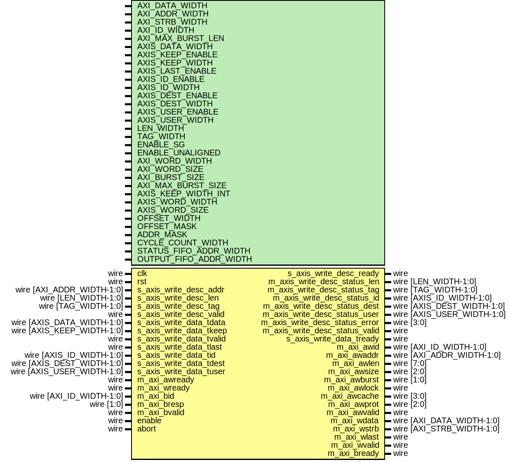

# Entity: axi_dma_wr

- **File**: axi_dma_wr.v
## Diagram

## Description

Language: Verilog 2001
 
## Generics

| Generic name           | Type | Value                                  | Description                                                                        |
| ---------------------- | ---- | -------------------------------------- | ---------------------------------------------------------------------------------- |
| AXI_DATA_WIDTH         |      | 32                                     | Width of AXI data bus in bits                                                      |
| AXI_ADDR_WIDTH         |      | 16                                     | Width of AXI address bus in bits                                                   |
| AXI_STRB_WIDTH         |      | undefined                              | Width of AXI wstrb (width of data bus in words)                                    |
| AXI_ID_WIDTH           |      | 8                                      | Width of AXI ID signal                                                             |
| AXI_MAX_BURST_LEN      |      | 16                                     | Maximum AXI burst length to generate                                               |
| AXIS_DATA_WIDTH        |      | AXI_DATA_WIDTH                         | Width of AXI stream interfaces in bits                                             |
| AXIS_KEEP_ENABLE       |      | undefined                              | Use AXI stream tkeep signal                                                        |
| AXIS_KEEP_WIDTH        |      | undefined                              | AXI stream tkeep signal width (words per cycle)                                    |
| AXIS_LAST_ENABLE       |      | 1                                      | Use AXI stream tlast signal                                                        |
| AXIS_ID_ENABLE         |      | 0                                      | Propagate AXI stream tid signal                                                    |
| AXIS_ID_WIDTH          |      | 8                                      | AXI stream tid signal width                                                        |
| AXIS_DEST_ENABLE       |      | 0                                      | Propagate AXI stream tdest signal                                                  |
| AXIS_DEST_WIDTH        |      | 8                                      | AXI stream tdest signal width                                                      |
| AXIS_USER_ENABLE       |      | 1                                      | Propagate AXI stream tuser signal                                                  |
| AXIS_USER_WIDTH        |      | 1                                      | AXI stream tuser signal width                                                      |
| LEN_WIDTH              |      | 20                                     | Width of length field                                                              |
| TAG_WIDTH              |      | 8                                      | Width of tag field                                                                 |
| ENABLE_SG              |      | 0                                      | Enable support for scatter/gather DMA (multiple descriptors per AXI stream frame)  |
| ENABLE_UNALIGNED       |      | 0                                      | Enable support for unaligned transfers                                             |
| AXI_WORD_WIDTH         |      | AXI_STRB_WIDTH                         |                                                                                    |
| AXI_WORD_SIZE          |      | AXI_DATA_WIDTH/AXI_WORD_WIDTH          |                                                                                    |
| AXI_BURST_SIZE         |      | $clog2(AXI_STRB_WIDTH)                 |                                                                                    |
| AXI_MAX_BURST_SIZE     |      | AXI_MAX_BURST_LEN << AXI_BURST_SIZE    |                                                                                    |
| AXIS_KEEP_WIDTH_INT    |      | AXIS_KEEP_ENABLE ? AXIS_KEEP_WIDTH : 1 |                                                                                    |
| AXIS_WORD_WIDTH        |      | AXIS_KEEP_WIDTH_INT                    |                                                                                    |
| AXIS_WORD_SIZE         |      | AXIS_DATA_WIDTH/AXIS_WORD_WIDTH        |                                                                                    |
| OFFSET_WIDTH           |      | $clog2(AXI_STRB_WIDTH)                 |                                                                                    |
| OFFSET_MASK            |      | undefined                              |                                                                                    |
| ADDR_MASK              |      | $clog2(AXI_STRB_WIDTH)                 |                                                                                    |
| CYCLE_COUNT_WIDTH      |      | LEN_WIDTH - AXI_BURST_SIZE + 1         |                                                                                    |
| STATUS_FIFO_ADDR_WIDTH |      | 5                                      |                                                                                    |
## Ports

| Port name                      | Direction | Type                       | Description |
| ------------------------------ | --------- | -------------------------- | ----------- |
| clk                            | input     | wire                       |             |
| rst                            | input     | wire                       |             |
| s_axis_write_desc_addr         | input     | wire [AXI_ADDR_WIDTH-1:0]  |             |
| s_axis_write_desc_len          | input     | wire [LEN_WIDTH-1:0]       |             |
| s_axis_write_desc_tag          | input     | wire [TAG_WIDTH-1:0]       |             |
| s_axis_write_desc_valid        | input     | wire                       |             |
| s_axis_write_desc_ready        | output    | wire                       |             |
| m_axis_write_desc_status_len   | output    | wire [LEN_WIDTH-1:0]       |             |
| m_axis_write_desc_status_tag   | output    | wire [TAG_WIDTH-1:0]       |             |
| m_axis_write_desc_status_id    | output    | wire [AXIS_ID_WIDTH-1:0]   |             |
| m_axis_write_desc_status_dest  | output    | wire [AXIS_DEST_WIDTH-1:0] |             |
| m_axis_write_desc_status_user  | output    | wire [AXIS_USER_WIDTH-1:0] |             |
| m_axis_write_desc_status_valid | output    | wire                       |             |
| s_axis_write_data_tdata        | input     | wire [AXIS_DATA_WIDTH-1:0] |             |
| s_axis_write_data_tkeep        | input     | wire [AXIS_KEEP_WIDTH-1:0] |             |
| s_axis_write_data_tvalid       | input     | wire                       |             |
| s_axis_write_data_tready       | output    | wire                       |             |
| s_axis_write_data_tlast        | input     | wire                       |             |
| s_axis_write_data_tid          | input     | wire [AXIS_ID_WIDTH-1:0]   |             |
| s_axis_write_data_tdest        | input     | wire [AXIS_DEST_WIDTH-1:0] |             |
| s_axis_write_data_tuser        | input     | wire [AXIS_USER_WIDTH-1:0] |             |
| m_axi_awid                     | output    | wire [AXI_ID_WIDTH-1:0]    |             |
| m_axi_awaddr                   | output    | wire [AXI_ADDR_WIDTH-1:0]  |             |
| m_axi_awlen                    | output    | wire [7:0]                 |             |
| m_axi_awsize                   | output    | wire [2:0]                 |             |
| m_axi_awburst                  | output    | wire [1:0]                 |             |
| m_axi_awlock                   | output    | wire                       |             |
| m_axi_awcache                  | output    | wire [3:0]                 |             |
| m_axi_awprot                   | output    | wire [2:0]                 |             |
| m_axi_awvalid                  | output    | wire                       |             |
| m_axi_awready                  | input     | wire                       |             |
| m_axi_wdata                    | output    | wire [AXI_DATA_WIDTH-1:0]  |             |
| m_axi_wstrb                    | output    | wire [AXI_STRB_WIDTH-1:0]  |             |
| m_axi_wlast                    | output    | wire                       |             |
| m_axi_wvalid                   | output    | wire                       |             |
| m_axi_wready                   | input     | wire                       |             |
| m_axi_bid                      | input     | wire [AXI_ID_WIDTH-1:0]    |             |
| m_axi_bresp                    | input     | wire [1:0]                 |             |
| m_axi_bvalid                   | input     | wire                       |             |
| m_axi_bready                   | output    | wire                       |             |
| enable                         | input     | wire                       |             |
| abort                          | input     | wire                       |             |
## Signals

| Name                                | Type                               | Description               |
| ----------------------------------- | ---------------------------------- | ------------------------- |
| state_reg                           | reg [2:0]                          |                           |
| state_next                          | reg [2:0]                          |                           |
| transfer_in_save                    | reg                                | datapath control signals  |
| flush_save                          | reg                                |                           |
| status_fifo_we                      | reg                                |                           |
| i                                   | integer                            |                           |
| cycle_size                          | reg [OFFSET_WIDTH:0]               |                           |
| addr_reg                            | reg [AXI_ADDR_WIDTH-1:0]           |                           |
| addr_next                           | reg [AXI_ADDR_WIDTH-1:0]           |                           |
| op_word_count_reg                   | reg [LEN_WIDTH-1:0]                |                           |
| op_word_count_next                  | reg [LEN_WIDTH-1:0]                |                           |
| tr_word_count_reg                   | reg [LEN_WIDTH-1:0]                |                           |
| tr_word_count_next                  | reg [LEN_WIDTH-1:0]                |                           |
| offset_reg                          | reg [OFFSET_WIDTH-1:0]             |                           |
| offset_next                         | reg [OFFSET_WIDTH-1:0]             |                           |
| strb_offset_mask_reg                | reg [AXI_STRB_WIDTH-1:0]           |                           |
| strb_offset_mask_next               | reg [AXI_STRB_WIDTH-1:0]           |                           |
| zero_offset_reg                     | reg                                |                           |
| zero_offset_next                    | reg                                |                           |
| last_cycle_offset_reg               | reg [OFFSET_WIDTH-1:0]             |                           |
| last_cycle_offset_next              | reg [OFFSET_WIDTH-1:0]             |                           |
| length_reg                          | reg [LEN_WIDTH-1:0]                |                           |
| length_next                         | reg [LEN_WIDTH-1:0]                |                           |
| input_cycle_count_reg               | reg [CYCLE_COUNT_WIDTH-1:0]        |                           |
| input_cycle_count_next              | reg [CYCLE_COUNT_WIDTH-1:0]        |                           |
| output_cycle_count_reg              | reg [CYCLE_COUNT_WIDTH-1:0]        |                           |
| output_cycle_count_next             | reg [CYCLE_COUNT_WIDTH-1:0]        |                           |
| input_active_reg                    | reg                                |                           |
| input_active_next                   | reg                                |                           |
| first_cycle_reg                     | reg                                |                           |
| first_cycle_next                    | reg                                |                           |
| input_last_cycle_reg                | reg                                |                           |
| input_last_cycle_next               | reg                                |                           |
| output_last_cycle_reg               | reg                                |                           |
| output_last_cycle_next              | reg                                |                           |
| last_transfer_reg                   | reg                                |                           |
| last_transfer_next                  | reg                                |                           |
| tag_reg                             | reg [TAG_WIDTH-1:0]                |                           |
| tag_next                            | reg [TAG_WIDTH-1:0]                |                           |
| axis_id_reg                         | reg [AXIS_ID_WIDTH-1:0]            |                           |
| axis_id_next                        | reg [AXIS_ID_WIDTH-1:0]            |                           |
| axis_dest_reg                       | reg [AXIS_DEST_WIDTH-1:0]          |                           |
| axis_dest_next                      | reg [AXIS_DEST_WIDTH-1:0]          |                           |
| axis_user_reg                       | reg [AXIS_USER_WIDTH-1:0]          |                           |
| axis_user_next                      | reg [AXIS_USER_WIDTH-1:0]          |                           |
| status_fifo_wr_ptr_reg              | reg [STATUS_FIFO_ADDR_WIDTH+1-1:0] |                           |
| status_fifo_rd_ptr_reg              | reg [STATUS_FIFO_ADDR_WIDTH+1-1:0] |                           |
| status_fifo_rd_ptr_next             | reg [STATUS_FIFO_ADDR_WIDTH+1-1:0] |                           |
| status_fifo_len                     | reg [LEN_WIDTH-1:0]                |                           |
| status_fifo_tag                     | reg [TAG_WIDTH-1:0]                |                           |
| status_fifo_id                      | reg [AXIS_ID_WIDTH-1:0]            |                           |
| status_fifo_dest                    | reg [AXIS_DEST_WIDTH-1:0]          |                           |
| status_fifo_user                    | reg [AXIS_USER_WIDTH-1:0]          |                           |
| status_fifo_last                    | reg                                |                           |
| status_fifo_wr_len                  | reg [LEN_WIDTH-1:0]                |                           |
| status_fifo_wr_tag                  | reg [TAG_WIDTH-1:0]                |                           |
| status_fifo_wr_id                   | reg [AXIS_ID_WIDTH-1:0]            |                           |
| status_fifo_wr_dest                 | reg [AXIS_DEST_WIDTH-1:0]          |                           |
| status_fifo_wr_user                 | reg [AXIS_USER_WIDTH-1:0]          |                           |
| status_fifo_wr_last                 | reg                                |                           |
| active_count_reg                    | reg [STATUS_FIFO_ADDR_WIDTH+1-1:0] |                           |
| active_count_av_reg                 | reg                                |                           |
| inc_active                          | reg                                |                           |
| dec_active                          | reg                                |                           |
| s_axis_write_desc_ready_reg         | reg                                |                           |
| s_axis_write_desc_ready_next        | reg                                |                           |
| m_axis_write_desc_status_len_reg    | reg [LEN_WIDTH-1:0]                |                           |
| m_axis_write_desc_status_len_next   | reg [LEN_WIDTH-1:0]                |                           |
| m_axis_write_desc_status_tag_reg    | reg [TAG_WIDTH-1:0]                |                           |
| m_axis_write_desc_status_tag_next   | reg [TAG_WIDTH-1:0]                |                           |
| m_axis_write_desc_status_id_reg     | reg [AXIS_ID_WIDTH-1:0]            |                           |
| m_axis_write_desc_status_id_next    | reg [AXIS_ID_WIDTH-1:0]            |                           |
| m_axis_write_desc_status_dest_reg   | reg [AXIS_DEST_WIDTH-1:0]          |                           |
| m_axis_write_desc_status_dest_next  | reg [AXIS_DEST_WIDTH-1:0]          |                           |
| m_axis_write_desc_status_user_reg   | reg [AXIS_USER_WIDTH-1:0]          |                           |
| m_axis_write_desc_status_user_next  | reg [AXIS_USER_WIDTH-1:0]          |                           |
| m_axis_write_desc_status_valid_reg  | reg                                |                           |
| m_axis_write_desc_status_valid_next | reg                                |                           |
| m_axi_awaddr_reg                    | reg [AXI_ADDR_WIDTH-1:0]           |                           |
| m_axi_awaddr_next                   | reg [AXI_ADDR_WIDTH-1:0]           |                           |
| m_axi_awlen_reg                     | reg [7:0]                          |                           |
| m_axi_awlen_next                    | reg [7:0]                          |                           |
| m_axi_awvalid_reg                   | reg                                |                           |
| m_axi_awvalid_next                  | reg                                |                           |
| m_axi_bready_reg                    | reg                                |                           |
| m_axi_bready_next                   | reg                                |                           |
| s_axis_write_data_tready_reg        | reg                                |                           |
| s_axis_write_data_tready_next       | reg                                |                           |
| save_axis_tdata_reg                 | reg [AXIS_DATA_WIDTH-1:0]          |                           |
| save_axis_tkeep_reg                 | reg [AXIS_KEEP_WIDTH_INT-1:0]      |                           |
| save_axis_tlast_reg                 | reg                                |                           |
| shift_axis_tdata                    | reg [AXIS_DATA_WIDTH-1:0]          |                           |
| shift_axis_tkeep                    | reg [AXIS_KEEP_WIDTH_INT-1:0]      |                           |
| shift_axis_tvalid                   | reg                                |                           |
| shift_axis_tlast                    | reg                                |                           |
| shift_axis_input_tready             | reg                                |                           |
| shift_axis_extra_cycle_reg          | reg                                |                           |
| m_axi_wdata_int                     | reg  [AXI_DATA_WIDTH-1:0]          | internal datapath         |
| m_axi_wstrb_int                     | reg  [AXI_STRB_WIDTH-1:0]          |                           |
| m_axi_wlast_int                     | reg                                |                           |
| m_axi_wvalid_int                    | reg                                |                           |
| m_axi_wready_int_reg                | reg                                |                           |
| m_axi_wready_int_early              | wire                               |                           |
| m_axi_wdata_reg                     | reg [AXI_DATA_WIDTH-1:0]           | output datapath logic     |
| m_axi_wstrb_reg                     | reg [AXI_STRB_WIDTH-1:0]           |                           |
| m_axi_wlast_reg                     | reg                                |                           |
| m_axi_wvalid_reg                    | reg                                |                           |
| m_axi_wvalid_next                   | reg                                |                           |
| temp_m_axi_wdata_reg                | reg [AXI_DATA_WIDTH-1:0]           |                           |
| temp_m_axi_wstrb_reg                | reg [AXI_STRB_WIDTH-1:0]           |                           |
| temp_m_axi_wlast_reg                | reg                                |                           |
| temp_m_axi_wvalid_reg               | reg                                |                           |
| temp_m_axi_wvalid_next              | reg                                |                           |
| store_axi_w_int_to_output           | reg                                | datapath control          |
| store_axi_w_int_to_temp             | reg                                |                           |
| store_axi_w_temp_to_output          | reg                                |                           |
## Constants

| Name               | Type  | Value | Description |
| ------------------ | ----- | ----- | ----------- |
| STATE_IDLE         | [2:0] | 3'd0  |             |
| STATE_START        | [2:0] | 3'd1  |             |
| STATE_WRITE        | [2:0] | 3'd2  |             |
| STATE_FINISH_BURST | [2:0] | 3'd3  |             |
| STATE_DROP_DATA    | [2:0] | 3'd4  |             |
## Processes
- unnamed: ( @* )
- unnamed: ( @* )
- unnamed: ( @(posedge clk) )
- unnamed: ( @* )
- unnamed: ( @(posedge clk) )
