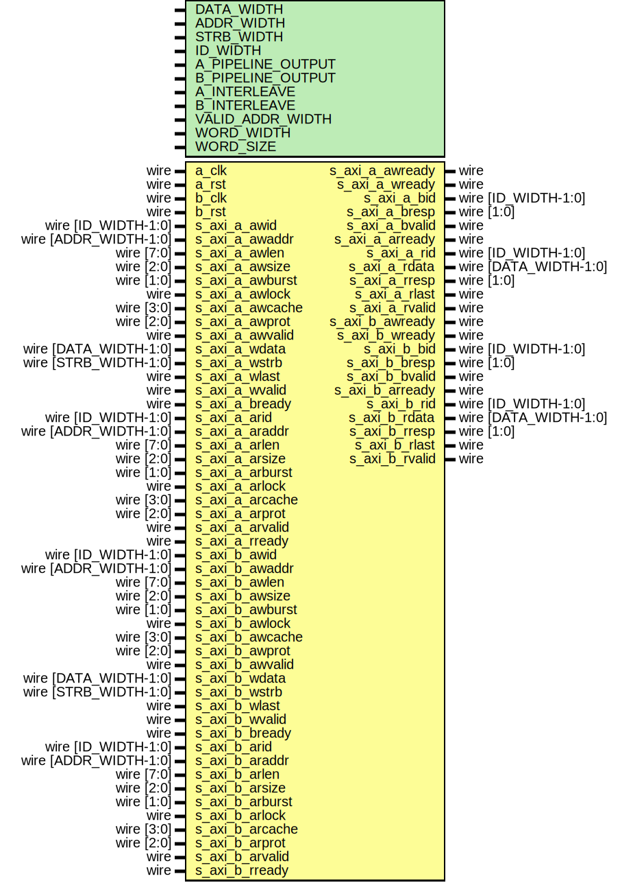

# Entity: axi_dp_ram

- **File**: axi_dp_ram.v
## Diagram

## Description

Language: Verilog 2001
 
## Generics

| Generic name      | Type | Value                           | Description                                       |
| ----------------- | ---- | ------------------------------- | ------------------------------------------------- |
| DATA_WIDTH        |      | 32                              | Width of data bus in bits                         |
| ADDR_WIDTH        |      | 16                              | Width of address bus in bits                      |
| STRB_WIDTH        |      | undefined                       | Width of wstrb (width of data bus in words)       |
| ID_WIDTH          |      | 8                               | Width of ID signal                                |
| A_PIPELINE_OUTPUT |      | 0                               | Extra pipeline register on output port A          |
| B_PIPELINE_OUTPUT |      | 0                               | Extra pipeline register on output port B          |
| A_INTERLEAVE      |      | 0                               | Interleave read and write burst cycles on port A  |
| B_INTERLEAVE      |      | 0                               | Interleave read and write burst cycles on port B  |
| VALID_ADDR_WIDTH  |      | ADDR_WIDTH - $clog2(STRB_WIDTH) |                                                   |
| WORD_WIDTH        |      | STRB_WIDTH                      |                                                   |
| WORD_SIZE         |      | DATA_WIDTH/WORD_WIDTH           |                                                   |
## Ports

| Port name       | Direction | Type                  | Description |
| --------------- | --------- | --------------------- | ----------- |
| a_clk           | input     | wire                  |             |
| a_rst           | input     | wire                  |             |
| b_clk           | input     | wire                  |             |
| b_rst           | input     | wire                  |             |
| s_axi_a_awid    | input     | wire [ID_WIDTH-1:0]   |             |
| s_axi_a_awaddr  | input     | wire [ADDR_WIDTH-1:0] |             |
| s_axi_a_awlen   | input     | wire [7:0]            |             |
| s_axi_a_awsize  | input     | wire [2:0]            |             |
| s_axi_a_awburst | input     | wire [1:0]            |             |
| s_axi_a_awlock  | input     | wire                  |             |
| s_axi_a_awcache | input     | wire [3:0]            |             |
| s_axi_a_awprot  | input     | wire [2:0]            |             |
| s_axi_a_awvalid | input     | wire                  |             |
| s_axi_a_awready | output    | wire                  |             |
| s_axi_a_wdata   | input     | wire [DATA_WIDTH-1:0] |             |
| s_axi_a_wstrb   | input     | wire [STRB_WIDTH-1:0] |             |
| s_axi_a_wlast   | input     | wire                  |             |
| s_axi_a_wvalid  | input     | wire                  |             |
| s_axi_a_wready  | output    | wire                  |             |
| s_axi_a_bid     | output    | wire [ID_WIDTH-1:0]   |             |
| s_axi_a_bresp   | output    | wire [1:0]            |             |
| s_axi_a_bvalid  | output    | wire                  |             |
| s_axi_a_bready  | input     | wire                  |             |
| s_axi_a_arid    | input     | wire [ID_WIDTH-1:0]   |             |
| s_axi_a_araddr  | input     | wire [ADDR_WIDTH-1:0] |             |
| s_axi_a_arlen   | input     | wire [7:0]            |             |
| s_axi_a_arsize  | input     | wire [2:0]            |             |
| s_axi_a_arburst | input     | wire [1:0]            |             |
| s_axi_a_arlock  | input     | wire                  |             |
| s_axi_a_arcache | input     | wire [3:0]            |             |
| s_axi_a_arprot  | input     | wire [2:0]            |             |
| s_axi_a_arvalid | input     | wire                  |             |
| s_axi_a_arready | output    | wire                  |             |
| s_axi_a_rid     | output    | wire [ID_WIDTH-1:0]   |             |
| s_axi_a_rdata   | output    | wire [DATA_WIDTH-1:0] |             |
| s_axi_a_rresp   | output    | wire [1:0]            |             |
| s_axi_a_rlast   | output    | wire                  |             |
| s_axi_a_rvalid  | output    | wire                  |             |
| s_axi_a_rready  | input     | wire                  |             |
| s_axi_b_awid    | input     | wire [ID_WIDTH-1:0]   |             |
| s_axi_b_awaddr  | input     | wire [ADDR_WIDTH-1:0] |             |
| s_axi_b_awlen   | input     | wire [7:0]            |             |
| s_axi_b_awsize  | input     | wire [2:0]            |             |
| s_axi_b_awburst | input     | wire [1:0]            |             |
| s_axi_b_awlock  | input     | wire                  |             |
| s_axi_b_awcache | input     | wire [3:0]            |             |
| s_axi_b_awprot  | input     | wire [2:0]            |             |
| s_axi_b_awvalid | input     | wire                  |             |
| s_axi_b_awready | output    | wire                  |             |
| s_axi_b_wdata   | input     | wire [DATA_WIDTH-1:0] |             |
| s_axi_b_wstrb   | input     | wire [STRB_WIDTH-1:0] |             |
| s_axi_b_wlast   | input     | wire                  |             |
| s_axi_b_wvalid  | input     | wire                  |             |
| s_axi_b_wready  | output    | wire                  |             |
| s_axi_b_bid     | output    | wire [ID_WIDTH-1:0]   |             |
| s_axi_b_bresp   | output    | wire [1:0]            |             |
| s_axi_b_bvalid  | output    | wire                  |             |
| s_axi_b_bready  | input     | wire                  |             |
| s_axi_b_arid    | input     | wire [ID_WIDTH-1:0]   |             |
| s_axi_b_araddr  | input     | wire [ADDR_WIDTH-1:0] |             |
| s_axi_b_arlen   | input     | wire [7:0]            |             |
| s_axi_b_arsize  | input     | wire [2:0]            |             |
| s_axi_b_arburst | input     | wire [1:0]            |             |
| s_axi_b_arlock  | input     | wire                  |             |
| s_axi_b_arcache | input     | wire [3:0]            |             |
| s_axi_b_arprot  | input     | wire [2:0]            |             |
| s_axi_b_arvalid | input     | wire                  |             |
| s_axi_b_arready | output    | wire                  |             |
| s_axi_b_rid     | output    | wire [ID_WIDTH-1:0]   |             |
| s_axi_b_rdata   | output    | wire [DATA_WIDTH-1:0] |             |
| s_axi_b_rresp   | output    | wire [1:0]            |             |
| s_axi_b_rlast   | output    | wire                  |             |
| s_axi_b_rvalid  | output    | wire                  |             |
| s_axi_b_rready  | input     | wire                  |             |
## Signals

| Name                    | Type                        | Description              |
| ----------------------- | --------------------------- | ------------------------ |
| ram_a_cmd_id            | wire [ID_WIDTH-1:0]         |                          |
| ram_a_cmd_addr          | wire [ADDR_WIDTH-1:0]       |                          |
| ram_a_cmd_wr_data       | wire [DATA_WIDTH-1:0]       |                          |
| ram_a_cmd_wr_strb       | wire [STRB_WIDTH-1:0]       |                          |
| ram_a_cmd_wr_en         | wire                        |                          |
| ram_a_cmd_rd_en         | wire                        |                          |
| ram_a_cmd_last          | wire                        |                          |
| ram_a_cmd_ready         | wire                        |                          |
| ram_a_rd_resp_id_reg    | reg  [ID_WIDTH-1:0]         |                          |
| ram_a_rd_resp_data_reg  | reg  [DATA_WIDTH-1:0]       |                          |
| ram_a_rd_resp_last_reg  | reg                         |                          |
| ram_a_rd_resp_valid_reg | reg                         |                          |
| ram_a_rd_resp_ready     | wire                        |                          |
| ram_b_cmd_id            | wire [ID_WIDTH-1:0]         |                          |
| ram_b_cmd_addr          | wire [ADDR_WIDTH-1:0]       |                          |
| ram_b_cmd_wr_data       | wire [DATA_WIDTH-1:0]       |                          |
| ram_b_cmd_wr_strb       | wire [STRB_WIDTH-1:0]       |                          |
| ram_b_cmd_wr_en         | wire                        |                          |
| ram_b_cmd_rd_en         | wire                        |                          |
| ram_b_cmd_last          | wire                        |                          |
| ram_b_cmd_ready         | wire                        |                          |
| ram_b_rd_resp_id_reg    | reg  [ID_WIDTH-1:0]         |                          |
| ram_b_rd_resp_data_reg  | reg  [DATA_WIDTH-1:0]       |                          |
| ram_b_rd_resp_last_reg  | reg                         |                          |
| ram_b_rd_resp_valid_reg | reg                         |                          |
| ram_b_rd_resp_ready     | wire                        |                          |
| mem                     | reg [DATA_WIDTH-1:0]        | (* RAM_STYLE="BLOCK" *)  |
| addr_a_valid            | wire [VALID_ADDR_WIDTH-1:0] |                          |
| addr_b_valid            | wire [VALID_ADDR_WIDTH-1:0] |                          |
| i                       | integer                     |                          |
| j                       | integer                     |                          |
## Processes
- unnamed: ( @(posedge a_clk) )
- unnamed: ( @(posedge b_clk) )
## Instantiations

- a_if: axi_ram_wr_rd_if
- b_if: axi_ram_wr_rd_if
