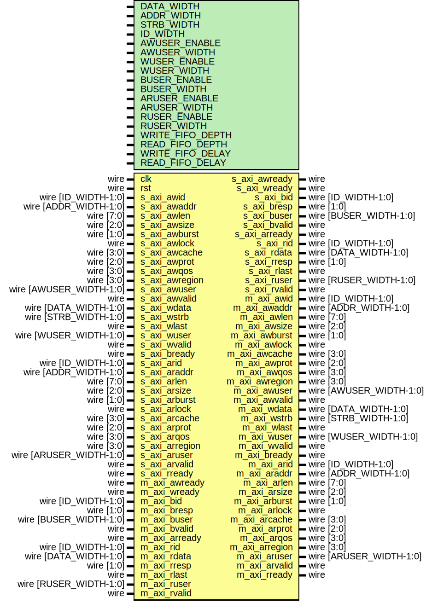

# Entity: axi_fifo

- **File**: axi_fifo.v
## Diagram

## Description

Language: Verilog 2001
 
## Generics

| Generic name     | Type | Value     | Description                                                            |
| ---------------- | ---- | --------- | ---------------------------------------------------------------------- |
| DATA_WIDTH       |      | 32        | Width of data bus in bits                                              |
| ADDR_WIDTH       |      | 32        | Width of address bus in bits                                           |
| STRB_WIDTH       |      | undefined | Width of wstrb (width of data bus in words)                            |
| ID_WIDTH         |      | 8         | Width of ID signal                                                     |
| AWUSER_ENABLE    |      | 0         | Propagate awuser signal                                                |
| AWUSER_WIDTH     |      | 1         | Width of awuser signal                                                 |
| WUSER_ENABLE     |      | 0         | Propagate wuser signal                                                 |
| WUSER_WIDTH      |      | 1         | Width of wuser signal                                                  |
| BUSER_ENABLE     |      | 0         | Propagate buser signal                                                 |
| BUSER_WIDTH      |      | 1         | Width of buser signal                                                  |
| ARUSER_ENABLE    |      | 0         | Propagate aruser signal                                                |
| ARUSER_WIDTH     |      | 1         | Width of aruser signal                                                 |
| RUSER_ENABLE     |      | 0         | Propagate ruser signal                                                 |
| RUSER_WIDTH      |      | 1         | Width of ruser signal                                                  |
| WRITE_FIFO_DEPTH |      | 32        | Write data FIFO depth (cycles)                                         |
| READ_FIFO_DEPTH  |      | 32        | Read data FIFO depth (cycles)                                          |
| WRITE_FIFO_DELAY |      | 0         | Hold write address until write data in FIFO, if possible               |
| READ_FIFO_DELAY  |      | 0         | Hold read address until space available in FIFO for data, if possible  |
## Ports

| Port name      | Direction | Type                    | Description |
| -------------- | --------- | ----------------------- | ----------- |
| clk            | input     | wire                    |             |
| rst            | input     | wire                    |             |
| s_axi_awid     | input     | wire [ID_WIDTH-1:0]     |             |
| s_axi_awaddr   | input     | wire [ADDR_WIDTH-1:0]   |             |
| s_axi_awlen    | input     | wire [7:0]              |             |
| s_axi_awsize   | input     | wire [2:0]              |             |
| s_axi_awburst  | input     | wire [1:0]              |             |
| s_axi_awlock   | input     | wire                    |             |
| s_axi_awcache  | input     | wire [3:0]              |             |
| s_axi_awprot   | input     | wire [2:0]              |             |
| s_axi_awqos    | input     | wire [3:0]              |             |
| s_axi_awregion | input     | wire [3:0]              |             |
| s_axi_awuser   | input     | wire [AWUSER_WIDTH-1:0] |             |
| s_axi_awvalid  | input     | wire                    |             |
| s_axi_awready  | output    | wire                    |             |
| s_axi_wdata    | input     | wire [DATA_WIDTH-1:0]   |             |
| s_axi_wstrb    | input     | wire [STRB_WIDTH-1:0]   |             |
| s_axi_wlast    | input     | wire                    |             |
| s_axi_wuser    | input     | wire [WUSER_WIDTH-1:0]  |             |
| s_axi_wvalid   | input     | wire                    |             |
| s_axi_wready   | output    | wire                    |             |
| s_axi_bid      | output    | wire [ID_WIDTH-1:0]     |             |
| s_axi_bresp    | output    | wire [1:0]              |             |
| s_axi_buser    | output    | wire [BUSER_WIDTH-1:0]  |             |
| s_axi_bvalid   | output    | wire                    |             |
| s_axi_bready   | input     | wire                    |             |
| s_axi_arid     | input     | wire [ID_WIDTH-1:0]     |             |
| s_axi_araddr   | input     | wire [ADDR_WIDTH-1:0]   |             |
| s_axi_arlen    | input     | wire [7:0]              |             |
| s_axi_arsize   | input     | wire [2:0]              |             |
| s_axi_arburst  | input     | wire [1:0]              |             |
| s_axi_arlock   | input     | wire                    |             |
| s_axi_arcache  | input     | wire [3:0]              |             |
| s_axi_arprot   | input     | wire [2:0]              |             |
| s_axi_arqos    | input     | wire [3:0]              |             |
| s_axi_arregion | input     | wire [3:0]              |             |
| s_axi_aruser   | input     | wire [ARUSER_WIDTH-1:0] |             |
| s_axi_arvalid  | input     | wire                    |             |
| s_axi_arready  | output    | wire                    |             |
| s_axi_rid      | output    | wire [ID_WIDTH-1:0]     |             |
| s_axi_rdata    | output    | wire [DATA_WIDTH-1:0]   |             |
| s_axi_rresp    | output    | wire [1:0]              |             |
| s_axi_rlast    | output    | wire                    |             |
| s_axi_ruser    | output    | wire [RUSER_WIDTH-1:0]  |             |
| s_axi_rvalid   | output    | wire                    |             |
| s_axi_rready   | input     | wire                    |             |
| m_axi_awid     | output    | wire [ID_WIDTH-1:0]     |             |
| m_axi_awaddr   | output    | wire [ADDR_WIDTH-1:0]   |             |
| m_axi_awlen    | output    | wire [7:0]              |             |
| m_axi_awsize   | output    | wire [2:0]              |             |
| m_axi_awburst  | output    | wire [1:0]              |             |
| m_axi_awlock   | output    | wire                    |             |
| m_axi_awcache  | output    | wire [3:0]              |             |
| m_axi_awprot   | output    | wire [2:0]              |             |
| m_axi_awqos    | output    | wire [3:0]              |             |
| m_axi_awregion | output    | wire [3:0]              |             |
| m_axi_awuser   | output    | wire [AWUSER_WIDTH-1:0] |             |
| m_axi_awvalid  | output    | wire                    |             |
| m_axi_awready  | input     | wire                    |             |
| m_axi_wdata    | output    | wire [DATA_WIDTH-1:0]   |             |
| m_axi_wstrb    | output    | wire [STRB_WIDTH-1:0]   |             |
| m_axi_wlast    | output    | wire                    |             |
| m_axi_wuser    | output    | wire [WUSER_WIDTH-1:0]  |             |
| m_axi_wvalid   | output    | wire                    |             |
| m_axi_wready   | input     | wire                    |             |
| m_axi_bid      | input     | wire [ID_WIDTH-1:0]     |             |
| m_axi_bresp    | input     | wire [1:0]              |             |
| m_axi_buser    | input     | wire [BUSER_WIDTH-1:0]  |             |
| m_axi_bvalid   | input     | wire                    |             |
| m_axi_bready   | output    | wire                    |             |
| m_axi_arid     | output    | wire [ID_WIDTH-1:0]     |             |
| m_axi_araddr   | output    | wire [ADDR_WIDTH-1:0]   |             |
| m_axi_arlen    | output    | wire [7:0]              |             |
| m_axi_arsize   | output    | wire [2:0]              |             |
| m_axi_arburst  | output    | wire [1:0]              |             |
| m_axi_arlock   | output    | wire                    |             |
| m_axi_arcache  | output    | wire [3:0]              |             |
| m_axi_arprot   | output    | wire [2:0]              |             |
| m_axi_arqos    | output    | wire [3:0]              |             |
| m_axi_arregion | output    | wire [3:0]              |             |
| m_axi_aruser   | output    | wire [ARUSER_WIDTH-1:0] |             |
| m_axi_arvalid  | output    | wire                    |             |
| m_axi_arready  | input     | wire                    |             |
| m_axi_rid      | input     | wire [ID_WIDTH-1:0]     |             |
| m_axi_rdata    | input     | wire [DATA_WIDTH-1:0]   |             |
| m_axi_rresp    | input     | wire [1:0]              |             |
| m_axi_rlast    | input     | wire                    |             |
| m_axi_ruser    | input     | wire [RUSER_WIDTH-1:0]  |             |
| m_axi_rvalid   | input     | wire                    |             |
| m_axi_rready   | output    | wire                    |             |
## Instantiations

- axi_fifo_wr_inst: axi_fifo_wr
- axi_fifo_rd_inst: axi_fifo_rd
