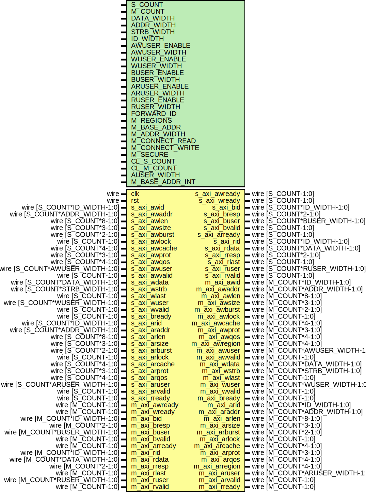

# Entity: axi_interconnect

- **File**: axi_interconnect.v
## Diagram

## Description

Language: Verilog 2001
 
## Generics

| Generic name    | Type | Value                                                     | Description                                                                                                                                                               |
| --------------- | ---- | --------------------------------------------------------- | ------------------------------------------------------------------------------------------------------------------------------------------------------------------------- |
| S_COUNT         |      | 4                                                         | Number of AXI inputs (slave interfaces)                                                                                                                                   |
| M_COUNT         |      | 4                                                         | Number of AXI outputs (master interfaces)                                                                                                                                 |
| DATA_WIDTH      |      | 32                                                        | Width of data bus in bits                                                                                                                                                 |
| ADDR_WIDTH      |      | 32                                                        | Width of address bus in bits                                                                                                                                              |
| STRB_WIDTH      |      | undefined                                                 | Width of wstrb (width of data bus in words)                                                                                                                               |
| ID_WIDTH        |      | 8                                                         | Width of ID signal                                                                                                                                                        |
| AWUSER_ENABLE   |      | 0                                                         | Propagate awuser signal                                                                                                                                                   |
| AWUSER_WIDTH    |      | 1                                                         | Width of awuser signal                                                                                                                                                    |
| WUSER_ENABLE    |      | 0                                                         | Propagate wuser signal                                                                                                                                                    |
| WUSER_WIDTH     |      | 1                                                         | Width of wuser signal                                                                                                                                                     |
| BUSER_ENABLE    |      | 0                                                         | Propagate buser signal                                                                                                                                                    |
| BUSER_WIDTH     |      | 1                                                         | Width of buser signal                                                                                                                                                     |
| ARUSER_ENABLE   |      | 0                                                         | Propagate aruser signal                                                                                                                                                   |
| ARUSER_WIDTH    |      | 1                                                         | Width of aruser signal                                                                                                                                                    |
| RUSER_ENABLE    |      | 0                                                         | Propagate ruser signal                                                                                                                                                    |
| RUSER_WIDTH     |      | 1                                                         | Width of ruser signal                                                                                                                                                     |
| FORWARD_ID      |      | 0                                                         | Propagate ID field                                                                                                                                                        |
| M_REGIONS       |      | 1                                                         | Number of regions per master interface                                                                                                                                    |
| M_BASE_ADDR     |      | 0                                                         | Master interface base addresses M_COUNT concatenated fields of M_REGIONS concatenated fields of ADDR_WIDTH bits set to zero for default addressing based on M_ADDR_WIDTH  |
| M_ADDR_WIDTH    |      | undefined                                                 | Master interface address widths M_COUNT concatenated fields of M_REGIONS concatenated fields of 32 bits                                                                   |
| M_CONNECT_READ  |      | undefined                                                 | Read connections between interfaces M_COUNT concatenated fields of S_COUNT bits                                                                                           |
| M_CONNECT_WRITE |      | undefined                                                 | Write connections between interfaces M_COUNT concatenated fields of S_COUNT bits                                                                                          |
| M_SECURE        |      | undefined                                                 | Secure master (fail operations based on awprot/arprot) M_COUNT bits                                                                                                       |
| CL_S_COUNT      |      | $clog2(S_COUNT)                                           |                                                                                                                                                                           |
| CL_M_COUNT      |      | $clog2(M_COUNT)                                           |                                                                                                                                                                           |
| AUSER_WIDTH     |      | AWUSER_WIDTH > ARUSER_WIDTH ? AWUSER_WIDTH : ARUSER_WIDTH |                                                                                                                                                                           |
| M_BASE_ADDR_INT |      | M_BASE_ADDR ? M_BASE_ADDR : calcBaseAddrs(0)              |                                                                                                                                                                           |
## Ports

| Port name      | Direction | Type                            | Description |
| -------------- | --------- | ------------------------------- | ----------- |
| clk            | input     | wire                            |             |
| rst            | input     | wire                            |             |
| s_axi_awid     | input     | wire [S_COUNT*ID_WIDTH-1:0]     |             |
| s_axi_awaddr   | input     | wire [S_COUNT*ADDR_WIDTH-1:0]   |             |
| s_axi_awlen    | input     | wire [S_COUNT*8-1:0]            |             |
| s_axi_awsize   | input     | wire [S_COUNT*3-1:0]            |             |
| s_axi_awburst  | input     | wire [S_COUNT*2-1:0]            |             |
| s_axi_awlock   | input     | wire [S_COUNT-1:0]              |             |
| s_axi_awcache  | input     | wire [S_COUNT*4-1:0]            |             |
| s_axi_awprot   | input     | wire [S_COUNT*3-1:0]            |             |
| s_axi_awqos    | input     | wire [S_COUNT*4-1:0]            |             |
| s_axi_awuser   | input     | wire [S_COUNT*AWUSER_WIDTH-1:0] |             |
| s_axi_awvalid  | input     | wire [S_COUNT-1:0]              |             |
| s_axi_awready  | output    | wire [S_COUNT-1:0]              |             |
| s_axi_wdata    | input     | wire [S_COUNT*DATA_WIDTH-1:0]   |             |
| s_axi_wstrb    | input     | wire [S_COUNT*STRB_WIDTH-1:0]   |             |
| s_axi_wlast    | input     | wire [S_COUNT-1:0]              |             |
| s_axi_wuser    | input     | wire [S_COUNT*WUSER_WIDTH-1:0]  |             |
| s_axi_wvalid   | input     | wire [S_COUNT-1:0]              |             |
| s_axi_wready   | output    | wire [S_COUNT-1:0]              |             |
| s_axi_bid      | output    | wire [S_COUNT*ID_WIDTH-1:0]     |             |
| s_axi_bresp    | output    | wire [S_COUNT*2-1:0]            |             |
| s_axi_buser    | output    | wire [S_COUNT*BUSER_WIDTH-1:0]  |             |
| s_axi_bvalid   | output    | wire [S_COUNT-1:0]              |             |
| s_axi_bready   | input     | wire [S_COUNT-1:0]              |             |
| s_axi_arid     | input     | wire [S_COUNT*ID_WIDTH-1:0]     |             |
| s_axi_araddr   | input     | wire [S_COUNT*ADDR_WIDTH-1:0]   |             |
| s_axi_arlen    | input     | wire [S_COUNT*8-1:0]            |             |
| s_axi_arsize   | input     | wire [S_COUNT*3-1:0]            |             |
| s_axi_arburst  | input     | wire [S_COUNT*2-1:0]            |             |
| s_axi_arlock   | input     | wire [S_COUNT-1:0]              |             |
| s_axi_arcache  | input     | wire [S_COUNT*4-1:0]            |             |
| s_axi_arprot   | input     | wire [S_COUNT*3-1:0]            |             |
| s_axi_arqos    | input     | wire [S_COUNT*4-1:0]            |             |
| s_axi_aruser   | input     | wire [S_COUNT*ARUSER_WIDTH-1:0] |             |
| s_axi_arvalid  | input     | wire [S_COUNT-1:0]              |             |
| s_axi_arready  | output    | wire [S_COUNT-1:0]              |             |
| s_axi_rid      | output    | wire [S_COUNT*ID_WIDTH-1:0]     |             |
| s_axi_rdata    | output    | wire [S_COUNT*DATA_WIDTH-1:0]   |             |
| s_axi_rresp    | output    | wire [S_COUNT*2-1:0]            |             |
| s_axi_rlast    | output    | wire [S_COUNT-1:0]              |             |
| s_axi_ruser    | output    | wire [S_COUNT*RUSER_WIDTH-1:0]  |             |
| s_axi_rvalid   | output    | wire [S_COUNT-1:0]              |             |
| s_axi_rready   | input     | wire [S_COUNT-1:0]              |             |
| m_axi_awid     | output    | wire [M_COUNT*ID_WIDTH-1:0]     |             |
| m_axi_awaddr   | output    | wire [M_COUNT*ADDR_WIDTH-1:0]   |             |
| m_axi_awlen    | output    | wire [M_COUNT*8-1:0]            |             |
| m_axi_awsize   | output    | wire [M_COUNT*3-1:0]            |             |
| m_axi_awburst  | output    | wire [M_COUNT*2-1:0]            |             |
| m_axi_awlock   | output    | wire [M_COUNT-1:0]              |             |
| m_axi_awcache  | output    | wire [M_COUNT*4-1:0]            |             |
| m_axi_awprot   | output    | wire [M_COUNT*3-1:0]            |             |
| m_axi_awqos    | output    | wire [M_COUNT*4-1:0]            |             |
| m_axi_awregion | output    | wire [M_COUNT*4-1:0]            |             |
| m_axi_awuser   | output    | wire [M_COUNT*AWUSER_WIDTH-1:0] |             |
| m_axi_awvalid  | output    | wire [M_COUNT-1:0]              |             |
| m_axi_awready  | input     | wire [M_COUNT-1:0]              |             |
| m_axi_wdata    | output    | wire [M_COUNT*DATA_WIDTH-1:0]   |             |
| m_axi_wstrb    | output    | wire [M_COUNT*STRB_WIDTH-1:0]   |             |
| m_axi_wlast    | output    | wire [M_COUNT-1:0]              |             |
| m_axi_wuser    | output    | wire [M_COUNT*WUSER_WIDTH-1:0]  |             |
| m_axi_wvalid   | output    | wire [M_COUNT-1:0]              |             |
| m_axi_wready   | input     | wire [M_COUNT-1:0]              |             |
| m_axi_bid      | input     | wire [M_COUNT*ID_WIDTH-1:0]     |             |
| m_axi_bresp    | input     | wire [M_COUNT*2-1:0]            |             |
| m_axi_buser    | input     | wire [M_COUNT*BUSER_WIDTH-1:0]  |             |
| m_axi_bvalid   | input     | wire [M_COUNT-1:0]              |             |
| m_axi_bready   | output    | wire [M_COUNT-1:0]              |             |
| m_axi_arid     | output    | wire [M_COUNT*ID_WIDTH-1:0]     |             |
| m_axi_araddr   | output    | wire [M_COUNT*ADDR_WIDTH-1:0]   |             |
| m_axi_arlen    | output    | wire [M_COUNT*8-1:0]            |             |
| m_axi_arsize   | output    | wire [M_COUNT*3-1:0]            |             |
| m_axi_arburst  | output    | wire [M_COUNT*2-1:0]            |             |
| m_axi_arlock   | output    | wire [M_COUNT-1:0]              |             |
| m_axi_arcache  | output    | wire [M_COUNT*4-1:0]            |             |
| m_axi_arprot   | output    | wire [M_COUNT*3-1:0]            |             |
| m_axi_arqos    | output    | wire [M_COUNT*4-1:0]            |             |
| m_axi_arregion | output    | wire [M_COUNT*4-1:0]            |             |
| m_axi_aruser   | output    | wire [M_COUNT*ARUSER_WIDTH-1:0] |             |
| m_axi_arvalid  | output    | wire [M_COUNT-1:0]              |             |
| m_axi_arready  | input     | wire [M_COUNT-1:0]              |             |
| m_axi_rid      | input     | wire [M_COUNT*ID_WIDTH-1:0]     |             |
| m_axi_rdata    | input     | wire [M_COUNT*DATA_WIDTH-1:0]   |             |
| m_axi_rresp    | input     | wire [M_COUNT*2-1:0]            |             |
| m_axi_rlast    | input     | wire [M_COUNT-1:0]              |             |
| m_axi_ruser    | input     | wire [M_COUNT*RUSER_WIDTH-1:0]  |             |
| m_axi_rvalid   | input     | wire [M_COUNT-1:0]              |             |
| m_axi_rready   | output    | wire [M_COUNT-1:0]              |             |
## Signals

| Name                       | Type                                         | Description                        |
| -------------------------- | -------------------------------------------- | ---------------------------------- |
| i                          | integer                                      |                                    |
| j                          | integer                                      |                                    |
| state_reg                  | reg [2:0]                                    |                                    |
| state_next                 | reg [2:0]                                    |                                    |
| match                      | reg                                          |                                    |
| m_select_reg               | reg [CL_M_COUNT-1:0]                         |                                    |
| m_select_next              | reg [CL_M_COUNT-1:0]                         |                                    |
| axi_id_reg                 | reg [ID_WIDTH-1:0]                           |                                    |
| axi_id_next                | reg [ID_WIDTH-1:0]                           |                                    |
| axi_addr_reg               | reg [ADDR_WIDTH-1:0]                         |                                    |
| axi_addr_next              | reg [ADDR_WIDTH-1:0]                         |                                    |
| axi_addr_valid_reg         | reg                                          |                                    |
| axi_addr_valid_next        | reg                                          |                                    |
| axi_len_reg                | reg [7:0]                                    |                                    |
| axi_len_next               | reg [7:0]                                    |                                    |
| axi_size_reg               | reg [2:0]                                    |                                    |
| axi_size_next              | reg [2:0]                                    |                                    |
| axi_burst_reg              | reg [1:0]                                    |                                    |
| axi_burst_next             | reg [1:0]                                    |                                    |
| axi_lock_reg               | reg                                          |                                    |
| axi_lock_next              | reg                                          |                                    |
| axi_cache_reg              | reg [3:0]                                    |                                    |
| axi_cache_next             | reg [3:0]                                    |                                    |
| axi_prot_reg               | reg [2:0]                                    |                                    |
| axi_prot_next              | reg [2:0]                                    |                                    |
| axi_qos_reg                | reg [3:0]                                    |                                    |
| axi_qos_next               | reg [3:0]                                    |                                    |
| axi_region_reg             | reg [3:0]                                    |                                    |
| axi_region_next            | reg [3:0]                                    |                                    |
| axi_auser_reg              | reg [AUSER_WIDTH-1:0]                        |                                    |
| axi_auser_next             | reg [AUSER_WIDTH-1:0]                        |                                    |
| axi_bresp_reg              | reg [1:0]                                    |                                    |
| axi_bresp_next             | reg [1:0]                                    |                                    |
| axi_buser_reg              | reg [BUSER_WIDTH-1:0]                        |                                    |
| axi_buser_next             | reg [BUSER_WIDTH-1:0]                        |                                    |
| s_axi_awready_reg          | reg [S_COUNT-1:0]                            |                                    |
| s_axi_awready_next         | reg [S_COUNT-1:0]                            |                                    |
| s_axi_wready_reg           | reg [S_COUNT-1:0]                            |                                    |
| s_axi_wready_next          | reg [S_COUNT-1:0]                            |                                    |
| s_axi_bvalid_reg           | reg [S_COUNT-1:0]                            |                                    |
| s_axi_bvalid_next          | reg [S_COUNT-1:0]                            |                                    |
| s_axi_arready_reg          | reg [S_COUNT-1:0]                            |                                    |
| s_axi_arready_next         | reg [S_COUNT-1:0]                            |                                    |
| m_axi_awvalid_reg          | reg [M_COUNT-1:0]                            |                                    |
| m_axi_awvalid_next         | reg [M_COUNT-1:0]                            |                                    |
| m_axi_bready_reg           | reg [M_COUNT-1:0]                            |                                    |
| m_axi_bready_next          | reg [M_COUNT-1:0]                            |                                    |
| m_axi_arvalid_reg          | reg [M_COUNT-1:0]                            |                                    |
| m_axi_arvalid_next         | reg [M_COUNT-1:0]                            |                                    |
| m_axi_rready_reg           | reg [M_COUNT-1:0]                            |                                    |
| m_axi_rready_next          | reg [M_COUNT-1:0]                            |                                    |
| s_axi_rid_int              | reg  [ID_WIDTH-1:0]                          | internal datapath                  |
| s_axi_rdata_int            | reg  [DATA_WIDTH-1:0]                        |                                    |
| s_axi_rresp_int            | reg  [1:0]                                   |                                    |
| s_axi_rlast_int            | reg                                          |                                    |
| s_axi_ruser_int            | reg  [RUSER_WIDTH-1:0]                       |                                    |
| s_axi_rvalid_int           | reg                                          |                                    |
| s_axi_rready_int_reg       | reg                                          |                                    |
| s_axi_rready_int_early     | wire                                         |                                    |
| m_axi_wdata_int            | reg  [DATA_WIDTH-1:0]                        |                                    |
| m_axi_wstrb_int            | reg  [STRB_WIDTH-1:0]                        |                                    |
| m_axi_wlast_int            | reg                                          |                                    |
| m_axi_wuser_int            | reg  [WUSER_WIDTH-1:0]                       |                                    |
| m_axi_wvalid_int           | reg                                          |                                    |
| m_axi_wready_int_reg       | reg                                          |                                    |
| m_axi_wready_int_early     | wire                                         |                                    |
| s_select                   | wire [(CL_S_COUNT > 0 ? CL_S_COUNT-1 : 0):0] | slave side mux                     |
| current_s_axi_awid         | wire [ID_WIDTH-1:0]                          |                                    |
| current_s_axi_awaddr       | wire [ADDR_WIDTH-1:0]                        |                                    |
| current_s_axi_awlen        | wire [7:0]                                   |                                    |
| current_s_axi_awsize       | wire [2:0]                                   |                                    |
| current_s_axi_awburst      | wire [1:0]                                   |                                    |
| current_s_axi_awlock       | wire                                         |                                    |
| current_s_axi_awcache      | wire [3:0]                                   |                                    |
| current_s_axi_awprot       | wire [2:0]                                   |                                    |
| current_s_axi_awqos        | wire [3:0]                                   |                                    |
| current_s_axi_awuser       | wire [AWUSER_WIDTH-1:0]                      |                                    |
| current_s_axi_awvalid      | wire                                         |                                    |
| current_s_axi_awready      | wire                                         |                                    |
| current_s_axi_wdata        | wire [DATA_WIDTH-1:0]                        |                                    |
| current_s_axi_wstrb        | wire [STRB_WIDTH-1:0]                        |                                    |
| current_s_axi_wlast        | wire                                         |                                    |
| current_s_axi_wuser        | wire [WUSER_WIDTH-1:0]                       |                                    |
| current_s_axi_wvalid       | wire                                         |                                    |
| current_s_axi_wready       | wire                                         |                                    |
| current_s_axi_bid          | wire [ID_WIDTH-1:0]                          |                                    |
| current_s_axi_bresp        | wire [1:0]                                   |                                    |
| current_s_axi_buser        | wire [BUSER_WIDTH-1:0]                       |                                    |
| current_s_axi_bvalid       | wire                                         |                                    |
| current_s_axi_bready       | wire                                         |                                    |
| current_s_axi_arid         | wire [ID_WIDTH-1:0]                          |                                    |
| current_s_axi_araddr       | wire [ADDR_WIDTH-1:0]                        |                                    |
| current_s_axi_arlen        | wire [7:0]                                   |                                    |
| current_s_axi_arsize       | wire [2:0]                                   |                                    |
| current_s_axi_arburst      | wire [1:0]                                   |                                    |
| current_s_axi_arlock       | wire                                         |                                    |
| current_s_axi_arcache      | wire [3:0]                                   |                                    |
| current_s_axi_arprot       | wire [2:0]                                   |                                    |
| current_s_axi_arqos        | wire [3:0]                                   |                                    |
| current_s_axi_aruser       | wire [ARUSER_WIDTH-1:0]                      |                                    |
| current_s_axi_arvalid      | wire                                         |                                    |
| current_s_axi_arready      | wire                                         |                                    |
| current_s_axi_rid          | wire [ID_WIDTH-1:0]                          |                                    |
| current_s_axi_rdata        | wire [DATA_WIDTH-1:0]                        |                                    |
| current_s_axi_rresp        | wire [1:0]                                   |                                    |
| current_s_axi_rlast        | wire                                         |                                    |
| current_s_axi_ruser        | wire [RUSER_WIDTH-1:0]                       |                                    |
| current_s_axi_rvalid       | wire                                         |                                    |
| current_s_axi_rready       | wire                                         |                                    |
| current_m_axi_awid         | wire [ID_WIDTH-1:0]                          | master side mux                    |
| current_m_axi_awaddr       | wire [ADDR_WIDTH-1:0]                        |                                    |
| current_m_axi_awlen        | wire [7:0]                                   |                                    |
| current_m_axi_awsize       | wire [2:0]                                   |                                    |
| current_m_axi_awburst      | wire [1:0]                                   |                                    |
| current_m_axi_awlock       | wire                                         |                                    |
| current_m_axi_awcache      | wire [3:0]                                   |                                    |
| current_m_axi_awprot       | wire [2:0]                                   |                                    |
| current_m_axi_awqos        | wire [3:0]                                   |                                    |
| current_m_axi_awregion     | wire [3:0]                                   |                                    |
| current_m_axi_awuser       | wire [AWUSER_WIDTH-1:0]                      |                                    |
| current_m_axi_awvalid      | wire                                         |                                    |
| current_m_axi_awready      | wire                                         |                                    |
| current_m_axi_wdata        | wire [DATA_WIDTH-1:0]                        |                                    |
| current_m_axi_wstrb        | wire [STRB_WIDTH-1:0]                        |                                    |
| current_m_axi_wlast        | wire                                         |                                    |
| current_m_axi_wuser        | wire [WUSER_WIDTH-1:0]                       |                                    |
| current_m_axi_wvalid       | wire                                         |                                    |
| current_m_axi_wready       | wire                                         |                                    |
| current_m_axi_bid          | wire [ID_WIDTH-1:0]                          |                                    |
| current_m_axi_bresp        | wire [1:0]                                   |                                    |
| current_m_axi_buser        | wire [BUSER_WIDTH-1:0]                       |                                    |
| current_m_axi_bvalid       | wire                                         |                                    |
| current_m_axi_bready       | wire                                         |                                    |
| current_m_axi_arid         | wire [ID_WIDTH-1:0]                          |                                    |
| current_m_axi_araddr       | wire [ADDR_WIDTH-1:0]                        |                                    |
| current_m_axi_arlen        | wire [7:0]                                   |                                    |
| current_m_axi_arsize       | wire [2:0]                                   |                                    |
| current_m_axi_arburst      | wire [1:0]                                   |                                    |
| current_m_axi_arlock       | wire                                         |                                    |
| current_m_axi_arcache      | wire [3:0]                                   |                                    |
| current_m_axi_arprot       | wire [2:0]                                   |                                    |
| current_m_axi_arqos        | wire [3:0]                                   |                                    |
| current_m_axi_arregion     | wire [3:0]                                   |                                    |
| current_m_axi_aruser       | wire [ARUSER_WIDTH-1:0]                      |                                    |
| current_m_axi_arvalid      | wire                                         |                                    |
| current_m_axi_arready      | wire                                         |                                    |
| current_m_axi_rid          | wire [ID_WIDTH-1:0]                          |                                    |
| current_m_axi_rdata        | wire [DATA_WIDTH-1:0]                        |                                    |
| current_m_axi_rresp        | wire [1:0]                                   |                                    |
| current_m_axi_rlast        | wire                                         |                                    |
| current_m_axi_ruser        | wire [RUSER_WIDTH-1:0]                       |                                    |
| current_m_axi_rvalid       | wire                                         |                                    |
| current_m_axi_rready       | wire                                         |                                    |
| request                    | wire [S_COUNT*2-1:0]                         | arbiter instance                   |
| acknowledge                | wire [S_COUNT*2-1:0]                         |                                    |
| grant                      | wire [S_COUNT*2-1:0]                         |                                    |
| grant_valid                | wire                                         |                                    |
| grant_encoded              | wire [CL_S_COUNT:0]                          |                                    |
| read                       | wire                                         |                                    |
| s_axi_rid_reg              | reg [ID_WIDTH-1:0]                           | output datapath logic (R channel)  |
| s_axi_rdata_reg            | reg [DATA_WIDTH-1:0]                         |                                    |
| s_axi_rresp_reg            | reg [1:0]                                    |                                    |
| s_axi_rlast_reg            | reg                                          |                                    |
| s_axi_ruser_reg            | reg [RUSER_WIDTH-1:0]                        |                                    |
| s_axi_rvalid_reg           | reg [S_COUNT-1:0]                            |                                    |
| s_axi_rvalid_next          | reg [S_COUNT-1:0]                            |                                    |
| temp_s_axi_rid_reg         | reg [ID_WIDTH-1:0]                           |                                    |
| temp_s_axi_rdata_reg       | reg [DATA_WIDTH-1:0]                         |                                    |
| temp_s_axi_rresp_reg       | reg [1:0]                                    |                                    |
| temp_s_axi_rlast_reg       | reg                                          |                                    |
| temp_s_axi_ruser_reg       | reg [RUSER_WIDTH-1:0]                        |                                    |
| temp_s_axi_rvalid_reg      | reg                                          |                                    |
| temp_s_axi_rvalid_next     | reg                                          |                                    |
| store_axi_r_int_to_output  | reg                                          | datapath control                   |
| store_axi_r_int_to_temp    | reg                                          |                                    |
| store_axi_r_temp_to_output | reg                                          |                                    |
| m_axi_wdata_reg            | reg [DATA_WIDTH-1:0]                         | output datapath logic (W channel)  |
| m_axi_wstrb_reg            | reg [STRB_WIDTH-1:0]                         |                                    |
| m_axi_wlast_reg            | reg                                          |                                    |
| m_axi_wuser_reg            | reg [WUSER_WIDTH-1:0]                        |                                    |
| m_axi_wvalid_reg           | reg [M_COUNT-1:0]                            |                                    |
| m_axi_wvalid_next          | reg [M_COUNT-1:0]                            |                                    |
| temp_m_axi_wdata_reg       | reg [DATA_WIDTH-1:0]                         |                                    |
| temp_m_axi_wstrb_reg       | reg [STRB_WIDTH-1:0]                         |                                    |
| temp_m_axi_wlast_reg       | reg                                          |                                    |
| temp_m_axi_wuser_reg       | reg [WUSER_WIDTH-1:0]                        |                                    |
| temp_m_axi_wvalid_reg      | reg                                          |                                    |
| temp_m_axi_wvalid_next     | reg                                          |                                    |
| store_axi_w_int_to_output  | reg                                          | datapath control                   |
| store_axi_w_int_to_temp    | reg                                          |                                    |
| store_axi_w_temp_to_output | reg                                          |                                    |
## Constants

| Name             | Type  | Value | Description |
| ---------------- | ----- | ----- | ----------- |
| STATE_IDLE       | [2:0] | 3'd0  |             |
| STATE_DECODE     | [2:0] | 3'd1  |             |
| STATE_WRITE      | [2:0] | 3'd2  |             |
| STATE_WRITE_RESP | [2:0] | 3'd3  |             |
| STATE_WRITE_DROP | [2:0] | 3'd4  |             |
| STATE_READ       | [2:0] | 3'd5  |             |
| STATE_READ_DROP  | [2:0] | 3'd6  |             |
| STATE_WAIT_IDLE  | [2:0] | 3'd7  |             |
## Functions
- calcBaseAddrs (input [31:0]) return ([M_COUNT*M_REGIONS*ADDR_WIDTH-1:0])
**Description**
default address computation

## Processes
- unnamed: ( @* )
- unnamed: ( @(posedge clk) )
- unnamed: ( @* )
- unnamed: ( @(posedge clk) )
- unnamed: ( @* )
- unnamed: ( @(posedge clk) )
## Instantiations

- arb_inst: arbiter
