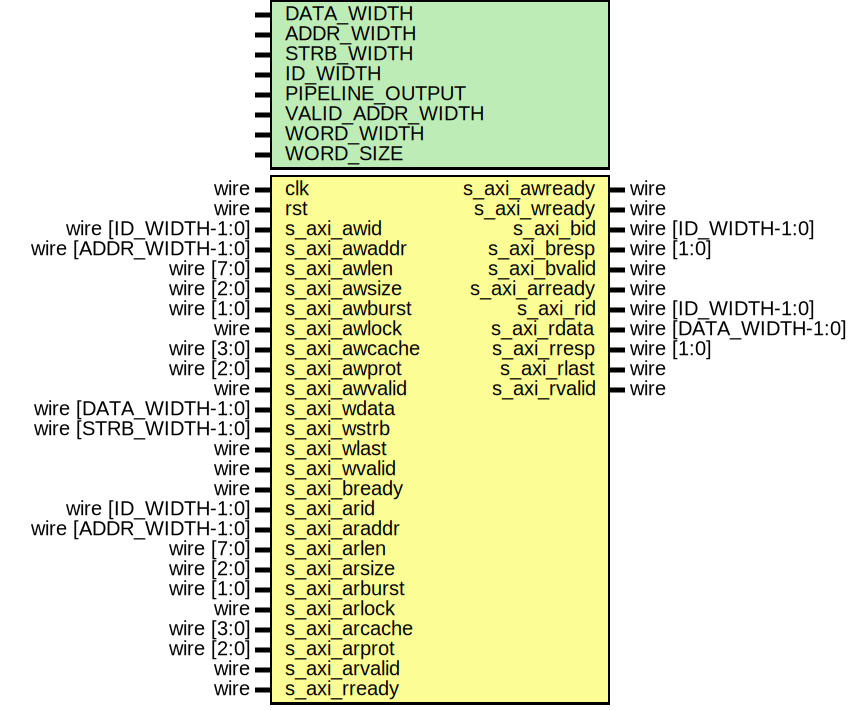

# Entity: axi_ram

- **File**: axi_ram.v
## Diagram

## Description

Language: Verilog 2001
 
## Generics

| Generic name     | Type | Value                           | Description                                  |
| ---------------- | ---- | ------------------------------- | -------------------------------------------- |
| DATA_WIDTH       |      | 32                              | Width of data bus in bits                    |
| ADDR_WIDTH       |      | 16                              | Width of address bus in bits                 |
| STRB_WIDTH       |      | undefined                       | Width of wstrb (width of data bus in words)  |
| ID_WIDTH         |      | 8                               | Width of ID signal                           |
| PIPELINE_OUTPUT  |      | 0                               | Extra pipeline register on output            |
| VALID_ADDR_WIDTH |      | ADDR_WIDTH - $clog2(STRB_WIDTH) |                                              |
| WORD_WIDTH       |      | STRB_WIDTH                      |                                              |
| WORD_SIZE        |      | DATA_WIDTH/WORD_WIDTH           |                                              |
## Ports

| Port name     | Direction | Type                  | Description |
| ------------- | --------- | --------------------- | ----------- |
| clk           | input     | wire                  |             |
| rst           | input     | wire                  |             |
| s_axi_awid    | input     | wire [ID_WIDTH-1:0]   |             |
| s_axi_awaddr  | input     | wire [ADDR_WIDTH-1:0] |             |
| s_axi_awlen   | input     | wire [7:0]            |             |
| s_axi_awsize  | input     | wire [2:0]            |             |
| s_axi_awburst | input     | wire [1:0]            |             |
| s_axi_awlock  | input     | wire                  |             |
| s_axi_awcache | input     | wire [3:0]            |             |
| s_axi_awprot  | input     | wire [2:0]            |             |
| s_axi_awvalid | input     | wire                  |             |
| s_axi_awready | output    | wire                  |             |
| s_axi_wdata   | input     | wire [DATA_WIDTH-1:0] |             |
| s_axi_wstrb   | input     | wire [STRB_WIDTH-1:0] |             |
| s_axi_wlast   | input     | wire                  |             |
| s_axi_wvalid  | input     | wire                  |             |
| s_axi_wready  | output    | wire                  |             |
| s_axi_bid     | output    | wire [ID_WIDTH-1:0]   |             |
| s_axi_bresp   | output    | wire [1:0]            |             |
| s_axi_bvalid  | output    | wire                  |             |
| s_axi_bready  | input     | wire                  |             |
| s_axi_arid    | input     | wire [ID_WIDTH-1:0]   |             |
| s_axi_araddr  | input     | wire [ADDR_WIDTH-1:0] |             |
| s_axi_arlen   | input     | wire [7:0]            |             |
| s_axi_arsize  | input     | wire [2:0]            |             |
| s_axi_arburst | input     | wire [1:0]            |             |
| s_axi_arlock  | input     | wire                  |             |
| s_axi_arcache | input     | wire [3:0]            |             |
| s_axi_arprot  | input     | wire [2:0]            |             |
| s_axi_arvalid | input     | wire                  |             |
| s_axi_arready | output    | wire                  |             |
| s_axi_rid     | output    | wire [ID_WIDTH-1:0]   |             |
| s_axi_rdata   | output    | wire [DATA_WIDTH-1:0] |             |
| s_axi_rresp   | output    | wire [1:0]            |             |
| s_axi_rlast   | output    | wire                  |             |
| s_axi_rvalid  | output    | wire                  |             |
| s_axi_rready  | input     | wire                  |             |
## Signals

| Name                  | Type                        | Description              |
| --------------------- | --------------------------- | ------------------------ |
| read_state_reg        | reg [0:0]                   |                          |
| read_state_next       | reg [0:0]                   |                          |
| write_state_reg       | reg [1:0]                   |                          |
| write_state_next      | reg [1:0]                   |                          |
| mem_wr_en             | reg                         |                          |
| mem_rd_en             | reg                         |                          |
| read_id_reg           | reg [ID_WIDTH-1:0]          |                          |
| read_id_next          | reg [ID_WIDTH-1:0]          |                          |
| read_addr_reg         | reg [ADDR_WIDTH-1:0]        |                          |
| read_addr_next        | reg [ADDR_WIDTH-1:0]        |                          |
| read_count_reg        | reg [7:0]                   |                          |
| read_count_next       | reg [7:0]                   |                          |
| read_size_reg         | reg [2:0]                   |                          |
| read_size_next        | reg [2:0]                   |                          |
| read_burst_reg        | reg [1:0]                   |                          |
| read_burst_next       | reg [1:0]                   |                          |
| write_id_reg          | reg [ID_WIDTH-1:0]          |                          |
| write_id_next         | reg [ID_WIDTH-1:0]          |                          |
| write_addr_reg        | reg [ADDR_WIDTH-1:0]        |                          |
| write_addr_next       | reg [ADDR_WIDTH-1:0]        |                          |
| write_count_reg       | reg [7:0]                   |                          |
| write_count_next      | reg [7:0]                   |                          |
| write_size_reg        | reg [2:0]                   |                          |
| write_size_next       | reg [2:0]                   |                          |
| write_burst_reg       | reg [1:0]                   |                          |
| write_burst_next      | reg [1:0]                   |                          |
| s_axi_awready_reg     | reg                         |                          |
| s_axi_awready_next    | reg                         |                          |
| s_axi_wready_reg      | reg                         |                          |
| s_axi_wready_next     | reg                         |                          |
| s_axi_bid_reg         | reg [ID_WIDTH-1:0]          |                          |
| s_axi_bid_next        | reg [ID_WIDTH-1:0]          |                          |
| s_axi_bvalid_reg      | reg                         |                          |
| s_axi_bvalid_next     | reg                         |                          |
| s_axi_arready_reg     | reg                         |                          |
| s_axi_arready_next    | reg                         |                          |
| s_axi_rid_reg         | reg [ID_WIDTH-1:0]          |                          |
| s_axi_rid_next        | reg [ID_WIDTH-1:0]          |                          |
| s_axi_rdata_reg       | reg [DATA_WIDTH-1:0]        |                          |
| s_axi_rdata_next      | reg [DATA_WIDTH-1:0]        |                          |
| s_axi_rlast_reg       | reg                         |                          |
| s_axi_rlast_next      | reg                         |                          |
| s_axi_rvalid_reg      | reg                         |                          |
| s_axi_rvalid_next     | reg                         |                          |
| s_axi_rid_pipe_reg    | reg [ID_WIDTH-1:0]          |                          |
| s_axi_rdata_pipe_reg  | reg [DATA_WIDTH-1:0]        |                          |
| s_axi_rlast_pipe_reg  | reg                         |                          |
| s_axi_rvalid_pipe_reg | reg                         |                          |
| mem                   | reg [DATA_WIDTH-1:0]        | (* RAM_STYLE="BLOCK" *)  |
| s_axi_awaddr_valid    | wire [VALID_ADDR_WIDTH-1:0] |                          |
| s_axi_araddr_valid    | wire [VALID_ADDR_WIDTH-1:0] |                          |
| read_addr_valid       | wire [VALID_ADDR_WIDTH-1:0] |                          |
| write_addr_valid      | wire [VALID_ADDR_WIDTH-1:0] |                          |
| i                     | integer                     |                          |
| j                     | integer                     |                          |
## Constants

| Name              | Type  | Value | Description |
| ----------------- | ----- | ----- | ----------- |
| READ_STATE_IDLE   | [0:0] | 1'd0  |             |
| READ_STATE_BURST  | [0:0] | 1'd1  |             |
| WRITE_STATE_IDLE  | [1:0] | 2'd0  |             |
| WRITE_STATE_BURST | [1:0] | 2'd1  |             |
| WRITE_STATE_RESP  | [1:0] | 2'd2  |             |
## Processes
- unnamed: ( @* )
- unnamed: ( @(posedge clk) )
- unnamed: ( @* )
- unnamed: ( @(posedge clk) )
