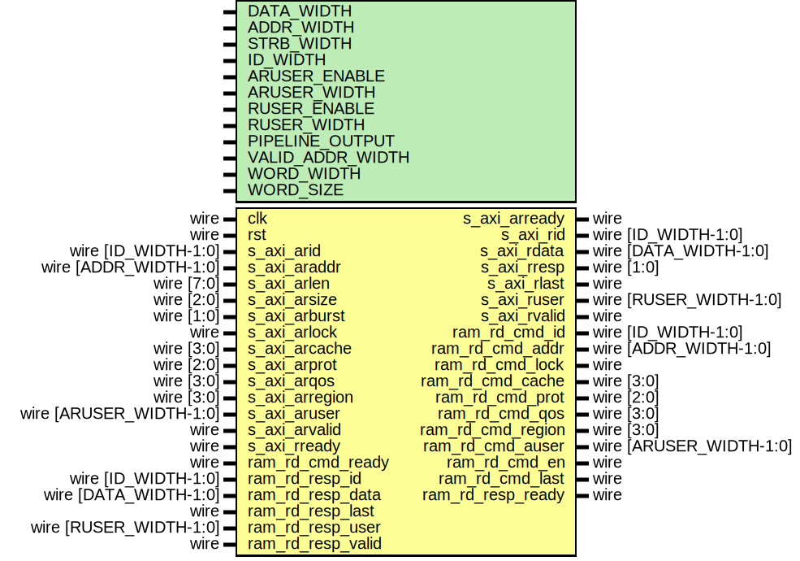

# Entity: axi_ram_rd_if

## Diagram

## Description

Language: Verilog 2001
 
## Generics

| Generic name     | Type | Value                           | Description                                  |
| ---------------- | ---- | ------------------------------- | -------------------------------------------- |
| DATA_WIDTH       |      | 32                              | Width of data bus in bits                    |
| ADDR_WIDTH       |      | 16                              | Width of address bus in bits                 |
| STRB_WIDTH       |      | undefined                       | Width of wstrb (width of data bus in words)  |
| ID_WIDTH         |      | 8                               | Width of ID signal                           |
| ARUSER_ENABLE    |      | 0                               | Propagate aruser signal                      |
| ARUSER_WIDTH     |      | 1                               | Width of aruser signal                       |
| RUSER_ENABLE     |      | 0                               | Propagate ruser signal                       |
| RUSER_WIDTH      |      | 1                               | Width of ruser signal                        |
| PIPELINE_OUTPUT  |      | 0                               | Extra pipeline register on output            |
| VALID_ADDR_WIDTH |      | ADDR_WIDTH - $clog2(STRB_WIDTH) |                                              |
| WORD_WIDTH       |      | STRB_WIDTH                      |                                              |
| WORD_SIZE        |      | DATA_WIDTH/WORD_WIDTH           |                                              |
## Ports

| Port name         | Direction | Type                    | Description |
| ----------------- | --------- | ----------------------- | ----------- |
| clk               | input     | wire                    |             |
| rst               | input     | wire                    |             |
| s_axi_arid        | input     | wire [ID_WIDTH-1:0]     |             |
| s_axi_araddr      | input     | wire [ADDR_WIDTH-1:0]   |             |
| s_axi_arlen       | input     | wire [7:0]              |             |
| s_axi_arsize      | input     | wire [2:0]              |             |
| s_axi_arburst     | input     | wire [1:0]              |             |
| s_axi_arlock      | input     | wire                    |             |
| s_axi_arcache     | input     | wire [3:0]              |             |
| s_axi_arprot      | input     | wire [2:0]              |             |
| s_axi_arqos       | input     | wire [3:0]              |             |
| s_axi_arregion    | input     | wire [3:0]              |             |
| s_axi_aruser      | input     | wire [ARUSER_WIDTH-1:0] |             |
| s_axi_arvalid     | input     | wire                    |             |
| s_axi_arready     | output    | wire                    |             |
| s_axi_rid         | output    | wire [ID_WIDTH-1:0]     |             |
| s_axi_rdata       | output    | wire [DATA_WIDTH-1:0]   |             |
| s_axi_rresp       | output    | wire [1:0]              |             |
| s_axi_rlast       | output    | wire                    |             |
| s_axi_ruser       | output    | wire [RUSER_WIDTH-1:0]  |             |
| s_axi_rvalid      | output    | wire                    |             |
| s_axi_rready      | input     | wire                    |             |
| ram_rd_cmd_id     | output    | wire [ID_WIDTH-1:0]     |             |
| ram_rd_cmd_addr   | output    | wire [ADDR_WIDTH-1:0]   |             |
| ram_rd_cmd_lock   | output    | wire                    |             |
| ram_rd_cmd_cache  | output    | wire [3:0]              |             |
| ram_rd_cmd_prot   | output    | wire [2:0]              |             |
| ram_rd_cmd_qos    | output    | wire [3:0]              |             |
| ram_rd_cmd_region | output    | wire [3:0]              |             |
| ram_rd_cmd_auser  | output    | wire [ARUSER_WIDTH-1:0] |             |
| ram_rd_cmd_en     | output    | wire                    |             |
| ram_rd_cmd_last   | output    | wire                    |             |
| ram_rd_cmd_ready  | input     | wire                    |             |
| ram_rd_resp_id    | input     | wire [ID_WIDTH-1:0]     |             |
| ram_rd_resp_data  | input     | wire [DATA_WIDTH-1:0]   |             |
| ram_rd_resp_last  | input     | wire                    |             |
| ram_rd_resp_user  | input     | wire [RUSER_WIDTH-1:0]  |             |
| ram_rd_resp_valid | input     | wire                    |             |
| ram_rd_resp_ready | output    | wire                    |             |
## Signals

| Name                  | Type                   | Description |
| --------------------- | ---------------------- | ----------- |
| state_reg             | reg [0:0]              |             |
| state_next            | reg [0:0]              |             |
| read_id_reg           | reg [ID_WIDTH-1:0]     |             |
| read_id_next          | reg [ID_WIDTH-1:0]     |             |
| read_addr_reg         | reg [ADDR_WIDTH-1:0]   |             |
| read_addr_next        | reg [ADDR_WIDTH-1:0]   |             |
| read_lock_reg         | reg                    |             |
| read_lock_next        | reg                    |             |
| read_cache_reg        | reg [3:0]              |             |
| read_cache_next       | reg [3:0]              |             |
| read_prot_reg         | reg [2:0]              |             |
| read_prot_next        | reg [2:0]              |             |
| read_qos_reg          | reg [3:0]              |             |
| read_qos_next         | reg [3:0]              |             |
| read_region_reg       | reg [3:0]              |             |
| read_region_next      | reg [3:0]              |             |
| read_aruser_reg       | reg [ARUSER_WIDTH-1:0] |             |
| read_aruser_next      | reg [ARUSER_WIDTH-1:0] |             |
| read_addr_valid_reg   | reg                    |             |
| read_addr_valid_next  | reg                    |             |
| read_last_reg         | reg                    |             |
| read_last_next        | reg                    |             |
| read_count_reg        | reg [7:0]              |             |
| read_count_next       | reg [7:0]              |             |
| read_size_reg         | reg [2:0]              |             |
| read_size_next        | reg [2:0]              |             |
| read_burst_reg        | reg [1:0]              |             |
| read_burst_next       | reg [1:0]              |             |
| s_axi_arready_reg     | reg                    |             |
| s_axi_arready_next    | reg                    |             |
| s_axi_rid_pipe_reg    | reg [ID_WIDTH-1:0]     |             |
| s_axi_rdata_pipe_reg  | reg [DATA_WIDTH-1:0]   |             |
| s_axi_rlast_pipe_reg  | reg                    |             |
| s_axi_ruser_pipe_reg  | reg [RUSER_WIDTH-1:0]  |             |
| s_axi_rvalid_pipe_reg | reg                    |             |
## Constants

| Name        | Type  | Value | Description |
| ----------- | ----- | ----- | ----------- |
| STATE_IDLE  | [0:0] | 1'd0  |             |
| STATE_BURST | [0:0] | 1'd1  |             |
## Processes
- unnamed: ( @* )
- unnamed: ( @(posedge clk) )
